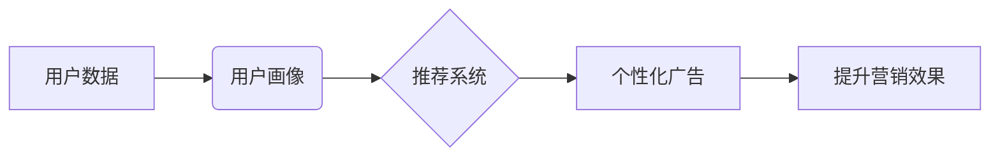

                 

## AI在个性化广告中的应用：提高营销效果

> 关键词：人工智能、个性化广告、机器学习、深度学习、推荐系统、用户画像、目标营销

## 1. 背景介绍

在当今数据爆炸的时代，广告营销面临着前所未有的挑战。传统广告的“一刀切”模式难以精准触达目标用户，导致广告投放效率低下，资源浪费严重。而人工智能（AI）技术的兴起为广告营销带来了新的机遇。AI能够通过对海量用户数据进行分析和学习，构建精准的用户画像，并根据用户的兴趣、行为、偏好等信息，推荐个性化的广告内容，从而提高广告的点击率、转化率和营销效果。

个性化广告是指根据用户的个人特征和行为，定制化的广告内容和投放方式。它与传统的广告模式相比，具有以下优势：

* **精准投放:**  AI算法能够精准识别目标用户，避免浪费广告资源在不感兴趣的用户群体上。
* **提升用户体验:**  用户更容易接受与自身需求相符的广告，从而提升用户体验。
* **提高营销效果:**  个性化广告能够更有效地触达目标用户，提升广告的点击率、转化率和最终销售额。

## 2. 核心概念与联系

### 2.1 用户画像

用户画像是指通过对用户的各种数据进行分析和挖掘，构建出用户的特征描述，包括用户的基本信息（如年龄、性别、职业、地域等）、兴趣爱好、行为习惯、消费偏好等。

### 2.2 推荐系统

推荐系统是根据用户的历史行为、偏好和上下文信息，预测用户可能感兴趣的内容或商品，并将其推荐给用户的技术系统。

### 2.3 深度学习

深度学习是一种机器学习的子领域，它利用多层神经网络来模拟人类大脑的学习过程，能够从海量数据中自动提取特征，并进行复杂的模式识别和预测。

**核心概念与联系流程图:**



## 3. 核心算法原理 & 具体操作步骤

### 3.1 算法原理概述

个性化广告的推荐系统通常采用基于用户的协同过滤算法、基于内容的过滤算法或基于混合的过滤算法。

* **基于用户的协同过滤算法:**  根据用户的历史行为数据，找到与当前用户兴趣相似的用户，并推荐他们喜欢的广告内容。
* **基于内容的过滤算法:**  根据广告内容的特征和用户的兴趣偏好，匹配推荐合适的广告。
* **基于混合的过滤算法:**  结合协同过滤和内容过滤算法的优势，实现更精准的广告推荐。

### 3.2 算法步骤详解

以基于用户的协同过滤算法为例，其具体操作步骤如下：

1. **数据收集:** 收集用户的历史行为数据，例如用户点击过的广告、浏览过的网页、购买过的商品等。
2. **用户相似度计算:**  利用余弦相似度、皮尔逊相关系数等算法，计算不同用户之间的相似度。
3. **推荐广告:**  根据当前用户的兴趣和与之相似用户的行为数据，推荐他们可能感兴趣的广告。

### 3.3 算法优缺点

**优点:**

* 能够推荐用户可能感兴趣但从未接触过的广告内容。
* 能够根据用户的兴趣变化动态调整推荐结果。

**缺点:**

* 数据稀疏性问题: 当用户行为数据较少时，难以准确计算用户相似度。
* 冷启动问题:  对于新用户或新广告，由于缺乏历史数据，难以进行精准推荐。

### 3.4 算法应用领域

基于用户的协同过滤算法广泛应用于以下领域:

* **电商推荐:**  推荐用户可能感兴趣的商品。
* **视频网站推荐:**  推荐用户可能喜欢的视频内容。
* **音乐平台推荐:**  推荐用户可能喜欢的音乐作品。

## 4. 数学模型和公式 & 详细讲解 & 举例说明

### 4.1 数学模型构建

基于用户的协同过滤算法通常采用矩阵分解模型，将用户-物品交互矩阵分解成两个低维矩阵，分别表示用户特征和物品特征。

假设用户集合为U，物品集合为I，用户-物品交互矩阵为R，其中R(u,i)表示用户u对物品i的评分或交互行为。

则矩阵分解模型可以表示为:

$$R(u,i) \approx u^T v_i$$

其中，u为用户u的特征向量，v_i为物品i的特征向量。

### 4.2 公式推导过程

目标是找到最优的u和v，使得预测的交互行为与实际交互行为的误差最小。

常用的损失函数为均方误差 (MSE):

$$Loss = \frac{1}{2} \sum_{u \in U, i \in I} (R(u,i) - u^T v_i)^2$$

通过梯度下降算法，迭代更新u和v，最小化损失函数。

### 4.3 案例分析与讲解

例如，假设有一个用户-电影交互矩阵，其中R(u,i)表示用户u对电影i的评分。

通过矩阵分解模型，可以将用户和电影分别表示为低维特征向量。

然后，根据用户的特征向量和电影的特征向量，预测用户对电影的评分。

## 5. 项目实践：代码实例和详细解释说明

### 5.1 开发环境搭建

* Python 3.x
* TensorFlow 或 PyTorch 等深度学习框架
* Scikit-learn 等机器学习库

### 5.2 源代码详细实现

```python
import tensorflow as tf

# 定义用户-物品交互矩阵
R = tf.constant([[5, 3, 4],
                 [4, 5, 2],
                 [3, 2, 5]])

# 定义用户和物品的特征维度
latent_dim = 2

# 定义用户和物品的特征矩阵
user_embeddings = tf.Variable(tf.random.normal([3, latent_dim]))
item_embeddings = tf.Variable(tf.random.normal([3, latent_dim]))

# 计算预测评分
predictions = tf.matmul(user_embeddings, tf.transpose(item_embeddings))

# 定义损失函数
loss = tf.reduce_mean(tf.square(predictions - R))

# 定义优化器
optimizer = tf.keras.optimizers.Adam()

# 训练模型
for epoch in range(100):
    with tf.GradientTape() as tape:
        loss_value = loss
    gradients = tape.gradient(loss_value, [user_embeddings, item_embeddings])
    optimizer.apply_gradients(zip(gradients, [user_embeddings, item_embeddings]))

# 打印训练结果
print(loss_value)
```

### 5.3 代码解读与分析

* 代码首先定义了用户-物品交互矩阵R。
* 然后定义了用户和物品的特征维度latent_dim。
* 使用随机初始化的用户和物品特征矩阵user_embeddings和item_embeddings。
* 计算预测评分predictions。
* 定义损失函数loss，并使用Adam优化器进行训练。
* 训练完成后，打印训练结果。

### 5.4 运行结果展示

训练完成后，可以观察到loss值逐渐减小，说明模型正在学习到用户和物品的特征关系。

## 6. 实际应用场景

个性化广告在电商、社交媒体、视频网站、游戏平台等多个领域都有广泛的应用。

### 6.1 电商平台

电商平台可以根据用户的浏览历史、购买记录、购物车内容等数据，推荐他们可能感兴趣的商品，提高转化率。

### 6.2 社交媒体平台

社交媒体平台可以根据用户的兴趣爱好、好友关系、点赞记录等数据，推荐他们可能感兴趣的内容，提高用户粘性。

### 6.3 视频网站

视频网站可以根据用户的观看历史、点赞记录、评论内容等数据，推荐他们可能喜欢的视频内容，提高用户观看时长。

### 6.4 未来应用展望

随着人工智能技术的不断发展，个性化广告的应用场景将更加广泛。

* **更精准的广告投放:**  AI算法能够更加精准地识别目标用户，避免广告浪费。
* **更个性化的广告内容:**  AI算法能够根据用户的兴趣和需求，生成更个性化的广告内容。
* **更丰富的广告形式:**  AI算法能够支持更丰富的广告形式，例如视频广告、互动广告等。

## 7. 工具和资源推荐

### 7.1 学习资源推荐

* **书籍:**

    * 《深度学习》
    * 《机器学习实战》

* **在线课程:**

    * Coursera
    * edX

### 7.2 开发工具推荐

* **TensorFlow:**  开源深度学习框架
* **PyTorch:**  开源深度学习框架
* **Scikit-learn:**  机器学习库

### 7.3 相关论文推荐

* **Collaborative Filtering for Implicit Feedback Datasets**
* **Deep Learning for Recommender Systems**

## 8. 总结：未来发展趋势与挑战

### 8.1 研究成果总结

AI在个性化广告中的应用取得了显著的成果，能够提高广告的精准度、个性化程度和营销效果。

### 8.2 未来发展趋势

未来，个性化广告将朝着更加精准、个性化、智能化的方向发展。

* **更精准的用户画像:**  利用更丰富的用户数据，构建更加精准的用户画像。
* **更个性化的广告内容:**  利用AI生成算法，生成更加个性化的广告内容。
* **更智能的广告投放:**  利用AI算法，实现更加智能的广告投放策略。

### 8.3 面临的挑战

个性化广告的发展也面临着一些挑战。

* **数据隐私保护:**  个性化广告需要收集和使用用户的个人数据，因此需要加强数据隐私保护。
* **算法公平性:**  个性化广告算法可能会存在偏见，导致某些用户受到不公平的对待。
* **用户体验:**  过度个性化的广告可能会影响用户的体验，需要找到合适的平衡点。

### 8.4 研究展望

未来，需要进一步研究个性化广告的算法模型、数据安全机制和用户体验设计，以实现更加精准、个性化、智能化的广告营销。

## 9. 附录：常见问题与解答

* **Q: 个性化广告会侵犯用户的隐私吗?**

* **A:**  个性化广告需要收集和使用用户的个人数据，因此需要加强数据隐私保护。

* **Q: 个性化广告的算法是否会存在偏见?**

* **A:**  个性化广告算法可能会存在偏见，需要进行算法公平性评估和改进。

* **Q: 如何平衡个性化广告和用户体验?**

* **A:**  需要根据用户的反馈和偏好，调整广告的个性化程度，避免过度个性化影响用户体验。


作者：禅与计算机程序设计艺术 / Zen and the Art of Computer Programming 
<end_of_turn>

