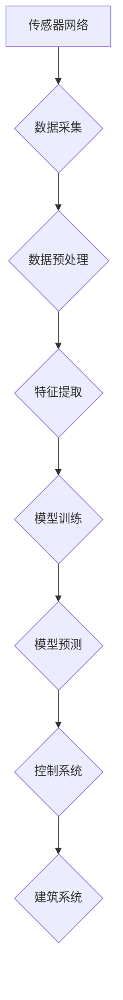

                 

## AI在智能建筑管理中的应用：节能减排

> 关键词：人工智能、智能建筑、节能减排、机器学习、预测建模、优化算法、传感器网络、数据分析

## 1. 背景介绍

随着全球气候变化的加剧和能源资源的日益紧张，节能减排已成为全球共同关注的议题。建筑业作为能源消耗大户，其节能减排潜力巨大。传统建筑管理模式存在着诸多弊端，例如能源消耗过高、运行效率低、维护成本高，难以实现智能化、高效化管理。

人工智能（AI）技术的快速发展为智能建筑管理提供了新的解决方案。AI算法能够分析海量建筑数据，识别能源消耗模式，并根据实时环境变化智能调节建筑系统，实现节能减排的目标。

## 2. 核心概念与联系

**2.1 智能建筑的概念**

智能建筑是指利用先进的传感器、网络、控制系统和人工智能技术，实现建筑自动化、智能化、高效化管理的建筑。智能建筑能够根据用户需求和环境变化，智能调节照明、空调、通风、安全等系统，提高建筑的舒适度、安全性、能源效率和环境友好性。

**2.2 AI在智能建筑管理中的应用**

AI技术在智能建筑管理中的应用主要包括以下几个方面：

* **能源管理:** 利用AI算法分析建筑能源消耗数据，预测未来能源需求，并智能调节建筑系统，实现节能减排。
* **舒适度控制:** 根据用户需求和环境变化，智能调节室内温度、湿度、照明等参数，提高建筑的舒适度。
* **安全管理:** 利用AI算法分析建筑安全数据，识别潜在的安全风险，并及时采取措施，保障建筑安全。
* **维护管理:** 利用AI算法分析建筑设备运行数据，预测设备故障，并及时进行维护，降低维护成本。

**2.3 AI技术架构**

AI技术在智能建筑管理中的应用，通常采用以下架构：



**2.3.1 传感器网络:**

智能建筑中部署了大量的传感器，用于采集建筑环境数据，例如温度、湿度、光照、空气质量、设备运行状态等。

**2.3.2 数据采集:**

传感器采集到的数据通过网络传输到数据中心，进行存储和处理。

**2.3.3 数据预处理:**

采集到的原始数据通常存在噪声、缺失值等问题，需要进行预处理，例如数据清洗、缺失值填充、数据标准化等。

**2.3.4 特征提取:**

对预处理后的数据进行特征提取，提取出能够反映建筑运行状态和能源消耗模式的特征。

**2.3.5 模型训练:**

利用机器学习算法对提取的特征进行训练，建立预测模型，例如预测未来能源需求、预测设备故障等。

**2.3.6 模型预测:**

将实时采集到的数据输入到训练好的模型中，进行预测，例如预测未来能源需求、预测设备故障时间等。

**2.3.7 控制系统:**

根据模型预测结果，控制建筑系统，例如调节空调温度、照明强度、通风量等，实现节能减排的目标。

**2.3.8 建筑系统:**

建筑系统包括各种设备和设施，例如空调、照明、通风、安全系统等。

## 3. 核心算法原理 & 具体操作步骤

**3.1 算法原理概述**

在智能建筑管理中，常用的AI算法包括：

* **机器学习算法:** 

例如线性回归、逻辑回归、决策树、支持向量机、神经网络等，用于预测未来能源需求、设备故障等。

* **深度学习算法:** 

例如卷积神经网络、循环神经网络等，用于图像识别、语音识别、自然语言处理等任务，可以应用于智能建筑的安全管理、舒适度控制等方面。

* **强化学习算法:** 

例如Q学习、SARSA等，用于训练智能代理，使其能够在环境中学习最优策略，可以应用于智能建筑的能源管理、设备维护等方面。

**3.2 算法步骤详解**

以机器学习算法为例，其具体操作步骤如下：

1. **数据收集:** 收集建筑环境数据、设备运行数据、用户行为数据等。
2. **数据预处理:** 对采集到的数据进行清洗、缺失值填充、数据标准化等处理。
3. **特征提取:** 从预处理后的数据中提取出能够反映建筑运行状态和能源消耗模式的特征。
4. **模型选择:** 根据具体应用场景选择合适的机器学习算法。
5. **模型训练:** 利用训练数据对选定的模型进行训练，调整模型参数，使其能够准确预测目标变量。
6. **模型评估:** 利用测试数据对训练好的模型进行评估，评估模型的预测精度、鲁棒性等。
7. **模型部署:** 将训练好的模型部署到智能建筑系统中，用于实时预测和控制。

**3.3 算法优缺点**

**优点:**

* **高精度:** 机器学习算法能够学习复杂的非线性关系，实现高精度的预测。
* **自适应性强:** 机器学习算法能够根据数据变化自动调整模型参数，适应环境变化。
* **自动化程度高:** 机器学习算法能够自动完成数据分析、模型训练、预测等任务，提高工作效率。

**缺点:**

* **数据依赖性强:** 机器学习算法需要大量的训练数据才能达到较高的预测精度。
* **解释性差:** 一些机器学习算法的内部工作机制难以解释，难以理解模型的预测结果。
* **模型更新成本高:** 当数据分布发生变化时，需要重新训练模型，更新模型成本较高。

**3.4 算法应用领域**

机器学习算法在智能建筑管理中的应用领域广泛，例如：

* **能源预测:** 预测建筑未来能源需求，优化能源分配，实现节能减排。
* **设备故障预测:** 预测设备故障时间，提前进行维护，降低设备故障率。
* **舒适度控制:** 根据用户需求和环境变化，智能调节室内温度、湿度、照明等参数，提高建筑舒适度。
* **安全管理:** 识别潜在的安全风险，及时采取措施，保障建筑安全。

## 4. 数学模型和公式 & 详细讲解 & 举例说明

**4.1 数学模型构建**

在智能建筑管理中，常用的数学模型包括：

* **线性回归模型:** 用于预测连续变量，例如建筑能源消耗。
* **逻辑回归模型:** 用于预测分类变量，例如设备故障类型。
* **时间序列模型:** 用于预测时间序列数据，例如建筑能源消耗趋势。

**4.2 公式推导过程**

以线性回归模型为例，其目标是找到一条直线，使得预测值与实际值之间的误差最小。

线性回归模型的公式如下：

$$y = wx + b$$

其中：

* $y$ 是预测值
* $x$ 是输入特征
* $w$ 是权重系数
* $b$ 是偏置项

模型参数 $w$ 和 $b$ 通过最小化均方误差函数来求解：

$$MSE = \frac{1}{n} \sum_{i=1}^{n} (y_i - \hat{y}_i)^2$$

其中：

* $n$ 是样本数量
* $y_i$ 是实际值
* $\hat{y}_i$ 是预测值

**4.3 案例分析与讲解**

假设我们要预测建筑的每日能源消耗量，可以使用线性回归模型。

输入特征可以是：

* 当日平均温度
* 当日日照时间
* 当日建筑使用人数

通过训练模型，可以得到 $w$ 和 $b$ 的值，然后将新的输入特征代入公式，即可预测建筑的每日能源消耗量。

## 5. 项目实践：代码实例和详细解释说明

**5.1 开发环境搭建**

* 操作系统：Windows/Linux/macOS
* Python版本：3.6+
* 必要的库：pandas, numpy, scikit-learn, matplotlib

**5.2 源代码详细实现**

```python
import pandas as pd
from sklearn.linear_model import LinearRegression
from sklearn.model_selection import train_test_split
from sklearn.metrics import mean_squared_error

# 1. 数据加载
data = pd.read_csv('building_energy_data.csv')

# 2. 特征选择和数据预处理
features = ['temperature', 'sunshine_hours', 'occupancy']
target = 'energy_consumption'
X = data[features]
y = data[target]

# 3. 数据分割
X_train, X_test, y_train, y_test = train_test_split(X, y, test_size=0.2, random_state=42)

# 4. 模型训练
model = LinearRegression()
model.fit(X_train, y_train)

# 5. 模型评估
y_pred = model.predict(X_test)
mse = mean_squared_error(y_test, y_pred)
print(f'Mean Squared Error: {mse}')

# 6. 模型保存
import joblib
joblib.dump(model, 'energy_consumption_model.pkl')
```

**5.3 代码解读与分析**

* 代码首先加载建筑能源数据，并选择相关的特征和目标变量。
* 然后将数据分割为训练集和测试集，用于模型训练和评估。
* 使用线性回归模型训练模型，并评估模型的预测精度。
* 最后将训练好的模型保存为文件，以便后续使用。

**5.4 运行结果展示**

运行代码后，会输出模型的均方误差值，该值越小，模型的预测精度越高。

## 6. 实际应用场景

**6.1 节能减排案例**

* **智能照明控制:** 利用传感器监测室内光照情况，根据实际需求智能调节照明强度，减少不必要的照明能耗。
* **智能空调控制:** 根据室内温度、湿度、人员分布等信息，智能调节空调温度和风量，提高空调效率，减少能耗。
* **智能风窗控制:** 根据室内外气温差和空气质量，智能调节风窗开启和关闭时间，提高通风效率，减少空调能耗。

**6.2 舒适度提升案例**

* **个性化温度控制:** 根据用户喜好和身体状况，智能调节室内温度，提高用户舒适度。
* **智能空气质量控制:** 利用传感器监测室内空气质量，根据需要开启净化系统，提高室内空气质量，保障用户健康。
* **智能噪音控制:** 利用传感器监测室内噪音水平，根据需要调节设备运行状态，降低噪音，提高用户舒适度。

**6.3 安全管理案例**

* **入侵检测:** 利用传感器监测建筑环境变化，识别潜在的入侵行为，及时报警。
* **火灾预警:** 利用传感器监测室内温度、烟雾浓度等信息，识别火灾风险，及时报警。
* **人员定位:** 利用传感器定位人员位置，在紧急情况下快速定位人员，提高救援效率。

**6.4 未来应用展望**

随着人工智能技术的不断发展，AI在智能建筑管理中的应用将更加广泛和深入。

* **更精准的预测:** 利用更先进的机器学习算法，实现更精准的能源消耗预测、设备故障预测等。
* **更智能的控制:** 利用强化学习算法，训练智能代理，实现更智能的建筑系统控制，例如自动调节照明、空调、通风等。
* **更个性化的服务:** 利用自然语言处理技术，实现与用户的语音交互，提供更个性化的建筑服务。

## 7. 工具和资源推荐

**7.1 学习资源推荐**

* **书籍:**

* 《深度学习》
* 《机器学习实战》
* 《Python机器学习》

* **在线课程:**

* Coursera: 深度学习
* edX: 机器学习
* Udacity: AI工程师

**7.2 开发工具推荐**

* **Python:** 

Python 是人工智能开发最常用的编程语言，拥有丰富的机器学习库和工具。
* **TensorFlow:** 

TensorFlow 是 Google 开发的开源机器学习框架，支持深度学习、强化学习等多种算法。
* **PyTorch:** 

PyTorch 是 Facebook 开发的开源机器学习框架，以其灵活性和易用性而闻名。

**7.3 相关论文推荐**

* **《人工智能在智能建筑中的应用》**
* **《基于机器学习的智能建筑能源管理》**
* **《深度学习在智能建筑安全管理中的应用》**

## 8. 总结：未来发展趋势与挑战

**8.1 研究成果总结**

AI技术在智能建筑管理领域的应用取得了显著成果，例如：

* **提高能源效率:** AI算法能够分析建筑能源消耗模式，优化能源分配，实现节能减排。
* **提升建筑舒适度:** AI算法能够根据用户需求和环境变化，智能调节室内温度、湿度、照明等参数，提高建筑舒适度。
* **增强建筑安全:** AI算法能够识别潜在的安全风险，及时采取措施，保障建筑安全。

**8.2 未来发展趋势**

* **更精准的预测:** 利用更先进的机器学习算法，实现更精准的能源消耗预测、设备故障预测等。
* **更智能的控制:** 利用强化学习算法，训练智能代理，实现更智能的建筑系统控制，例如自动调节照明、空调、通风等。
* **更个性化的服务:** 利用自然语言处理技术，实现与用户的语音交互，提供更个性化的建筑服务。

**8.3 面临的挑战**

* **数据获取和隐私保护:** AI算法需要大量的训练数据，如何获取高质量的建筑数据，并保障数据隐私安全是一个挑战。
* **模型解释性和可信度:** 一些AI算法的内部工作机制难以解释，难以理解模型的预测结果，如何提高模型的解释性和可信度是一个挑战。
* **系统集成和部署:** 将AI算法集成到现有建筑系统中，并进行部署，需要克服技术和成本方面的挑战。

**8.4 研究展望**

未来，AI技术在智能建筑管理领域的应用将更加广泛和深入，为实现节能减排、提升建筑舒适度、增强建筑安全做出更大的贡献。


## 9. 附录：常见问题与解答

**9.1 如何选择合适的AI算法？**

选择合适的AI算法取决于具体的应用场景和数据特点。例如，如果要预测连续变量，可以使用线性回归模型；如果要预测分类变量，可以使用逻辑回归模型；如果要预测时间序列数据，可以使用时间序列模型。

**9.2 如何保障数据隐私安全？**

在使用AI算法进行建筑数据分析时，需要采取措施保障数据隐私安全，例如：

* 数据匿名化：去除数据中能够识别个人身份的信息。
* 数据加密：对敏感数据进行加密，防止未经授权的访问。
* 数据访问控制：设置严格的数据访问权限，防止数据泄露。

**9.3 如何评估AI模型的性能？**

常用的AI模型性能评估指标包括：

* 均方误差 (MSE)
* 平均绝对误差 (MAE)
* R-squared

选择合适的评估指标取决于具体的应用场景。

**9.4 如何将AI算法集成到现有建筑系统中？**

将AI算法集成到现有建筑系统中需要考虑以下因素：

* 系统兼容性
* 数据接口
* 安全性和可靠性


作者：禅与计算机程序设计艺术 / Zen and the Art of Computer Programming<end_of_turn>

