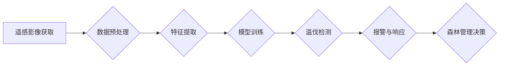

                 

## AI在智能森林管理中的应用：防止滥伐

> 关键词：人工智能、森林管理、滥伐、遥感影像、机器学习、深度学习、计算机视觉、森林监测

## 1. 背景介绍

全球森林资源面临着前所未有的压力，滥伐、非法砍伐和森林火灾等问题日益严重，对生态环境、生物多样性和人类社会造成巨大威胁。传统森林管理方法依靠人工巡查和数据收集，效率低下，难以有效应对森林资源的快速变化和复杂的威胁。

人工智能（AI）技术近年来取得了飞速发展，为智能森林管理提供了新的解决方案。AI算法能够从遥感影像、传感器数据等海量数据中提取关键信息，实现森林资源的实时监测、威胁识别和精准管理。

## 2. 核心概念与联系

**2.1 核心概念**

* **智能森林管理 (Smart Forest Management):** 利用人工智能、物联网、遥感等先进技术，实现森林资源的智能监测、分析、管理和保护。
* **滥伐 (Illegal Logging):** 非法砍伐森林，违反法律法规的砍伐行为。
* **遥感影像 (Remote Sensing Imagery):** 利用卫星、无人机等平台获取的森林图像数据。
* **机器学习 (Machine Learning):** 算法能够从数据中学习，并根据学习到的知识进行预测和决策。
* **深度学习 (Deep Learning):** 一种机器学习的子集，利用多层神经网络模拟人类大脑的学习过程。
* **计算机视觉 (Computer Vision):** 使计算机能够“看”图像，并从中提取信息。

**2.2 架构图**



## 3. 核心算法原理 & 具体操作步骤

**3.1 算法原理概述**

智能森林管理中常用的算法包括：

* **支持向量机 (SVM):** 用于分类和回归问题，能够有效识别森林中的异常区域。
* **随机森林 (Random Forest):** 结合多个决策树，提高分类和预测的准确性。
* **卷积神经网络 (CNN):** 用于图像识别和分析，能够从遥感影像中提取森林特征。

**3.2 算法步骤详解**

1. **数据收集:** 收集遥感影像、地面实测数据、森林管理记录等数据。
2. **数据预处理:** 对数据进行清洗、格式转换、增强等处理，提高数据质量。
3. **特征提取:** 从遥感影像中提取森林特征，如树冠密度、树高、植被指数等。
4. **模型训练:** 利用机器学习算法对训练数据进行训练，建立滥伐检测模型。
5. **模型评估:** 使用测试数据评估模型的性能，调整模型参数以提高准确性。
6. **部署与应用:** 将训练好的模型部署到生产环境中，实时监测森林资源，识别滥伐行为。

**3.3 算法优缺点**

| 算法 | 优点 | 缺点 |
|---|---|---|
| SVM | 能够处理高维数据，具有良好的泛化能力 | 训练时间较长，参数选择较复杂 |
| Random Forest | 鲁棒性强，对噪声数据具有较好抵抗能力 | 训练时间较长，解释性较差 |
| CNN | 能够自动提取图像特征，识别精度高 | 训练数据量大，计算资源需求高 |

**3.4 算法应用领域**

* **森林资源监测:** 监测森林覆盖率、植被变化、森林火灾等。
* **滥伐检测:** 识别非法砍伐行为，保护森林资源。
* **森林病虫害监测:** 识别森林病虫害，及时采取防治措施。
* **森林生态系统服务评估:** 评估森林碳汇、水土保持等生态服务价值。

## 4. 数学模型和公式 & 详细讲解 & 举例说明

**4.1 数学模型构建**

森林覆盖率的计算可以使用以下数学模型：

$$
Forest Cover = \frac{Area of Forest}{Total Area} \times 100\%
$$

其中：

*  $Area of Forest$：森林面积
*  $Total Area$：总面积

**4.2 公式推导过程**

森林覆盖率的计算公式是基于面积比的定义。森林面积占总面积的比例，即为森林覆盖率。

**4.3 案例分析与讲解**

假设某地区总面积为 1000 平方公里，其中森林面积为 500 平方公里，则该地区的森林覆盖率为：

$$
Forest Cover = \frac{500}{1000} \times 100\% = 50\%
$$

## 5. 项目实践：代码实例和详细解释说明

**5.1 开发环境搭建**

* 操作系统：Ubuntu 20.04
* Python 版本：3.8
* 必要的库：TensorFlow, Keras, OpenCV

**5.2 源代码详细实现**

```python
import tensorflow as tf
from tensorflow.keras.models import Sequential
from tensorflow.keras.layers import Conv2D, MaxPooling2D, Flatten, Dense

# 定义 CNN 模型
model = Sequential()
model.add(Conv2D(32, (3, 3), activation='relu', input_shape=(image_height, image_width, 3)))
model.add(MaxPooling2D((2, 2)))
model.add(Conv2D(64, (3, 3), activation='relu'))
model.add(MaxPooling2D((2, 2)))
model.add(Flatten())
model.add(Dense(10, activation='softmax'))

# 编译模型
model.compile(optimizer='adam',
              loss='categorical_crossentropy',
              metrics=['accuracy'])

# 训练模型
model.fit(train_data, train_labels, epochs=10, batch_size=32)

# 评估模型
loss, accuracy = model.evaluate(test_data, test_labels)
print('Loss:', loss)
print('Accuracy:', accuracy)
```

**5.3 代码解读与分析**

* 该代码定义了一个简单的 CNN 模型，用于识别森林中的滥伐区域。
* 模型包含卷积层、池化层、全连接层等。
* 卷积层用于提取图像特征，池化层用于降低特征维度，全连接层用于分类。
* 模型使用 Adam 优化器，交叉熵损失函数，并使用准确率作为评估指标。

**5.4 运行结果展示**

训练完成后，模型可以用于预测新的遥感影像，识别滥伐区域。

## 6. 实际应用场景

**6.1 滥伐监测与预警**

利用 AI 算法分析遥感影像，识别非法砍伐区域，并及时发出预警，帮助执法部门打击滥伐行为。

**6.2 森林资源管理**

AI 算法可以帮助森林管理者监测森林覆盖率、植被变化、森林火灾等，制定科学的森林管理方案。

**6.3 森林生态系统服务评估**

AI 算法可以评估森林碳汇、水土保持等生态服务价值，为森林保护和可持续发展提供科学依据。

**6.4 未来应用展望**

* **无人机森林巡查:** 利用无人机搭载传感器和 AI 算法，实现森林资源的实时监测和精准管理。
* **智能森林防火:** 利用 AI 算法预测森林火灾风险，并及时采取防火措施。
* **森林生态恢复:** 利用 AI 算法辅助森林生态恢复，提高恢复效率。

## 7. 工具和资源推荐

**7.1 学习资源推荐**

* **Coursera:** 提供人工智能、机器学习、深度学习等课程。
* **Udacity:** 提供人工智能、数据科学等领域的在线课程和项目。
* **Kaggle:** 提供数据科学竞赛和学习资源。

**7.2 开发工具推荐**

* **TensorFlow:** 开源深度学习框架。
* **PyTorch:** 开源深度学习框架。
* **OpenCV:** 图像处理库。

**7.3 相关论文推荐**

* **Deep Learning for Forest Monitoring:** https://arxiv.org/abs/1909.03977
* **Forest Cover Change Detection Using Deep Learning:** https://ieeexplore.ieee.org/document/8891137

## 8. 总结：未来发展趋势与挑战

**8.1 研究成果总结**

AI 技术在智能森林管理领域取得了显著成果，能够有效监测森林资源、识别滥伐行为、评估森林生态系统服务价值。

**8.2 未来发展趋势**

* **模型精度提升:** 研究更先进的 AI 算法，提高森林资源监测和滥伐检测的精度。
* **数据融合:** 将遥感影像、地面实测数据、传感器数据等多种数据融合，构建更全面的森林管理模型。
* **边缘计算:** 将 AI 模型部署到边缘设备，实现森林资源的实时监测和快速响应。

**8.3 面临的挑战**

* **数据获取和标注:** 高质量的森林数据获取和标注成本高昂。
* **模型解释性:** 许多 AI 算法的决策过程难以解释，难以获得公众信任。
* **技术可持续性:** AI 技术的快速发展需要持续投入研究和开发，才能保证其长期可持续性。

**8.4 研究展望**

未来，AI 技术将在智能森林管理领域发挥越来越重要的作用，为保护森林资源、促进可持续发展做出更大的贡献。


## 9. 附录：常见问题与解答

**9.1 如何获取高质量的森林数据？**

* 政府机构和科研机构通常会发布公开的森林数据。
* 可以利用卫星遥感数据，但需要进行数据预处理和标注。
* 可以利用无人机搭载传感器获取高分辨率的森林数据。

**9.2 如何评估 AI 模型的性能？**

* 可以使用准确率、召回率、F1-score等指标评估模型的分类性能。
* 可以使用均方误差、平均绝对误差等指标评估模型的回归性能。

**9.3 如何部署 AI 模型到生产环境？**

* 可以使用云平台部署 AI 模型，实现远程访问和管理。
* 可以将 AI 模型部署到边缘设备，实现实时监测和快速响应。


作者：禅与计算机程序设计艺术 / Zen and the Art of Computer Programming 
<end_of_turn>

