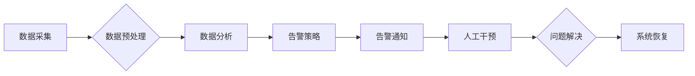

                 

## AI基础设施的监控与告警：Lepton AI的运维体系

> 关键词：AI基础设施、监控、告警、Lepton AI、运维体系、机器学习、数据分析、自动化

## 1. 背景介绍

随着人工智能（AI）技术的蓬勃发展，AI基础设施的规模和复杂度也在不断增加。从训练庞大的深度学习模型到部署和管理复杂的AI应用，AI基础设施的可靠性、效率和安全性至关重要。然而，传统的IT运维方法难以满足AI基础设施的独特需求。

Lepton AI作为一家专注于AI基础设施的科技公司，深刻认识到AI基础设施监控与告警的重要性。我们构建了Lepton AI的运维体系，旨在为用户提供全面的监控和告警解决方案，帮助他们更好地管理和优化AI基础设施。

## 2. 核心概念与联系

Lepton AI的运维体系基于以下核心概念：

* **数据驱动**:  运维体系的核心是收集和分析海量运行数据，通过数据挖掘和机器学习算法，识别潜在问题和异常情况。
* **自动化**:  自动化告警策略和响应机制，减少人工干预，提高效率和准确性。
* **可视化**:  提供直观易懂的监控仪表盘和告警报表，帮助用户快速了解系统状态和潜在风险。
* **弹性**:  能够根据AI基础设施的规模和复杂度进行灵活配置和扩展。

**Lepton AI运维体系架构**



## 3. 核心算法原理 & 具体操作步骤

### 3.1  算法原理概述

Lepton AI运维体系的核心算法包括：

* **异常检测**:  利用机器学习算法，例如K-Means聚类、Isolation Forest等，识别运行数据中的异常值和模式，预警潜在问题。
* **关联规则挖掘**:  通过关联规则挖掘算法，例如Apriori算法，发现运行数据中的关联关系，例如特定资源的过度使用可能导致性能下降。
* **预测分析**:  利用时间序列分析和机器学习算法，预测未来资源需求和潜在风险，帮助用户提前进行资源规划和风险控制。

### 3.2  算法步骤详解

**异常检测算法步骤**:

1. **数据收集**:  从AI基础设施收集运行数据，例如CPU使用率、内存使用率、网络流量等。
2. **数据预处理**:  对收集到的数据进行清洗、转换和特征工程，例如归一化、降维等，以便于算法训练和预测。
3. **模型训练**:  利用机器学习算法，例如K-Means聚类、Isolation Forest等，对预处理后的数据进行训练，建立异常检测模型。
4. **异常检测**:  将实时运行数据输入到训练好的模型中，识别异常值和模式，生成告警。

**关联规则挖掘算法步骤**:

1. **数据收集**:  从AI基础设施收集运行数据，例如资源使用情况、错误日志等。
2. **数据预处理**:  对收集到的数据进行清洗、转换和格式化，例如将时间戳转换为整数等。
3. **关联规则挖掘**:  利用关联规则挖掘算法，例如Apriori算法，从预处理后的数据中挖掘出关联规则。
4. **规则分析**:  对挖掘出的关联规则进行分析，识别出潜在的问题和风险。

### 3.3  算法优缺点

**异常检测算法**:

* **优点**:  能够识别出非正常运行模式，及时预警潜在问题。
* **缺点**:  需要大量的训练数据，算法参数的调优较为复杂。

**关联规则挖掘算法**:

* **优点**:  能够发现数据中的隐性关联关系，帮助用户理解系统运行机制。
* **缺点**:  挖掘出的关联规则可能存在一定的噪音，需要进行人工筛选和验证。

### 3.4  算法应用领域

Lepton AI的运维体系中的核心算法可以应用于以下领域:

* **AI模型训练**:  监控模型训练过程中的资源使用情况、训练速度和模型性能，及时发现和解决训练问题。
* **AI模型部署**:  监控模型部署后的运行状态，例如模型预测准确率、延迟时间等，确保模型正常运行。
* **AI应用监控**:  监控AI应用的整体性能和用户体验，及时发现和解决应用问题。

## 4. 数学模型和公式 & 详细讲解 & 举例说明

### 4.1  数学模型构建

Lepton AI运维体系中，异常检测算法通常采用概率模型，例如高斯分布或正态分布。假设系统运行数据服从某个已知的概率分布，则可以通过计算数据与该分布的偏差来判断数据是否异常。

### 4.2  公式推导过程

**高斯分布异常检测**:

假设系统运行数据服从均值为μ，标准差为σ的高斯分布。则数据点x的概率密度函数为：

$$
p(x) = \frac{1}{\sigma\sqrt{2\pi}}e^{-\frac{(x-\mu)^2}{2\sigma^2}}
$$

其中，μ和σ分别为数据分布的均值和标准差。

如果数据点x与均值μ的偏差超过一定阈值，则认为该数据点为异常值。

### 4.3  案例分析与讲解

假设系统CPU使用率数据服从均值为80%，标准差为5%的高斯分布。如果某个时间点的CPU使用率超过95%，则认为该数据点为异常值，需要进行进一步的调查和处理。

## 5. 项目实践：代码实例和详细解释说明

### 5.1  开发环境搭建

Lepton AI运维体系的开发环境包括：

* **操作系统**:  Linux
* **编程语言**:  Python
* **数据存储**:  MongoDB
* **监控工具**:  Prometheus
* **告警工具**:  Grafana

### 5.2  源代码详细实现

以下代码示例展示了Lepton AI运维体系中异常检测算法的简单实现：

```python
import numpy as np
from sklearn.ensemble import IsolationForest

# 加载数据
data = np.loadtxt('cpu_usage.csv', delimiter=',')

# 训练异常检测模型
model = IsolationForest(contamination=0.05)
model.fit(data)

# 预测异常值
predictions = model.predict(data)

# 打印异常值
print(predictions)
```

### 5.3  代码解读与分析

* **数据加载**:  使用`np.loadtxt()`函数加载CPU使用率数据。
* **模型训练**:  使用`IsolationForest()`算法训练异常检测模型，`contamination`参数设置异常值比例为5%。
* **预测异常值**:  使用训练好的模型预测数据是否为异常值，结果存储在`predictions`数组中。
* **打印异常值**:  打印预测结果，识别出异常值。

### 5.4  运行结果展示

运行上述代码后，将输出一个包含预测结果的数组。其中，值为1的数据点为正常数据，值为-1的数据点为异常值。

## 6. 实际应用场景

Lepton AI的运维体系已成功应用于以下场景:

* **AI模型训练**:  监控大型语言模型的训练过程，及时发现资源不足、模型过拟合等问题，提高训练效率和模型性能。
* **AI模型部署**:  监控AI模型部署后的运行状态，例如模型预测准确率、延迟时间等，确保模型稳定运行。
* **AI应用监控**:  监控AI应用的整体性能和用户体验，例如响应时间、错误率等，及时发现和解决应用问题。

### 6.4  未来应用展望

Lepton AI将继续完善和扩展运维体系，支持更多AI基础设施的监控和告警需求，例如：

* **更精准的异常检测**:  利用更先进的机器学习算法，提高异常检测的准确性和效率。
* **更丰富的告警策略**:  支持自定义告警策略，满足不同用户的需求。
* **更智能的自动化响应**:  利用自动化工具和流程，实现对异常情况的智能响应，减少人工干预。

## 7. 工具和资源推荐

### 7.1  学习资源推荐

* **机器学习**:  Andrew Ng的机器学习课程
* **数据分析**:  Python数据分析教程
* **监控工具**:  Prometheus官方文档
* **告警工具**:  Grafana官方文档

### 7.2  开发工具推荐

* **Python**:  Python官方网站
* **Jupyter Notebook**:  Jupyter Notebook官方网站
* **MongoDB**:  MongoDB官方网站

### 7.3  相关论文推荐

* **异常检测**:  Isolation Forest: An Efficient Algorithm for Anomaly Detection
* **关联规则挖掘**:  Apriori: Bringing Down the Cost of Discovering Frequent Patterns in Large Databases

## 8. 总结：未来发展趋势与挑战

### 8.1  研究成果总结

Lepton AI的运维体系为AI基础设施的监控与告警提供了有效的解决方案，通过数据驱动、自动化、可视化等核心概念，帮助用户更好地管理和优化AI基础设施。

### 8.2  未来发展趋势

未来，AI基础设施的监控与告警将朝着以下趋势发展:

* **更智能化**:  利用人工智能技术，实现更智能的异常检测、告警策略和自动化响应。
* **更个性化**:  根据用户的不同需求，提供更个性化的监控和告警解决方案。
* **更集成化**:  与其他AI平台和工具进行深度集成，实现更全面的监控和管理。

### 8.3  面临的挑战

Lepton AI的运维体系也面临一些挑战:

* **数据质量**:  监控和告警的准确性依赖于数据质量，需要不断完善数据采集和预处理流程。
* **算法复杂度**:  一些先进的机器学习算法的训练和部署需要较高的技术门槛。
* **安全性和隐私**:  AI基础设施的监控数据涉及到敏感信息，需要采取相应的安全措施保护用户隐私。

### 8.4  研究展望

Lepton AI将继续致力于AI基础设施的监控与告警领域，不断提升运维体系的智能化、个性化和集成化水平，帮助用户更好地管理和优化AI基础设施。

## 9. 附录：常见问题与解答

**Q1: Lepton AI的运维体系支持哪些类型的AI基础设施?**

A1: Lepton AI的运维体系支持各种类型的AI基础设施，包括：

* **云平台**:  AWS、Azure、GCP等
* **本地部署**:  自建的AI基础设施
* **混合云**:  混合部署的AI基础设施

**Q2: Lepton AI的运维体系的收费标准是什么?**

A2: Lepton AI的运维体系采用按需付费的模式，具体收费标准根据用户的实际需求和使用量进行计算。

**Q3: 如何联系Lepton AI获取更多信息?**

A3:  您可以访问Lepton AI的官方网站或发送邮件至info@lepton.ai获取更多信息。


作者：禅与计算机程序设计艺术 / Zen and the Art of Computer Programming 
<end_of_turn>

