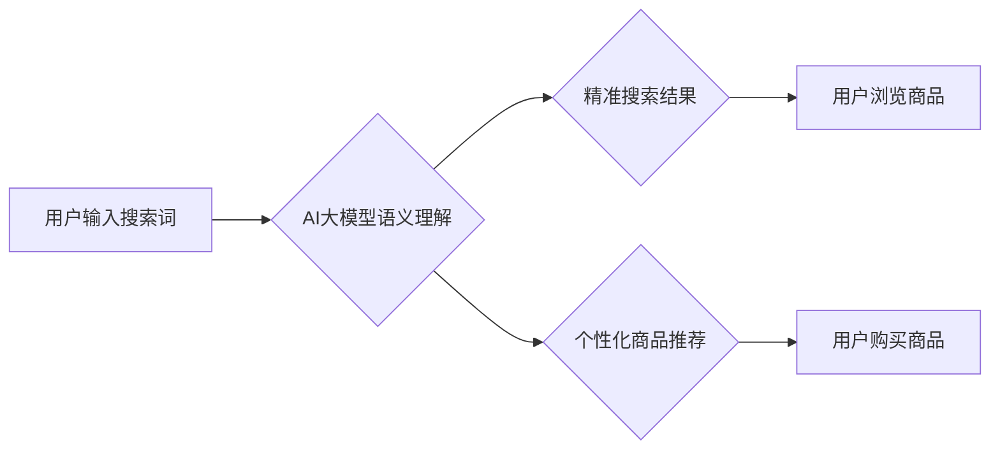

                 

## AI大模型赋能电商搜索推荐的业务创新流程优化实践

> 关键词：AI大模型、电商搜索、推荐系统、业务流程优化、自然语言处理、深度学习

## 1. 背景介绍

随着电商行业的蓬勃发展，用户对商品搜索和推荐的需求日益增长。传统的基于关键词匹配和协同过滤的搜索推荐算法已难以满足用户个性化、精准化的需求。而近年来，大规模预训练语言模型（如BERT、GPT、LaMDA等）的出现，为电商搜索推荐带来了新的机遇。

AI大模型凭借其强大的语义理解、文本生成和知识表示能力，能够有效提升电商搜索推荐的精准度、个性化程度和用户体验。本文将深入探讨AI大模型在电商搜索推荐领域的应用，并结合实际案例，阐述其在业务流程优化方面的实践经验。

## 2. 核心概念与联系

### 2.1  电商搜索推荐系统

电商搜索推荐系统是电商平台的核心功能之一，旨在帮助用户快速找到所需商品，并提供个性化的商品推荐。传统的电商搜索推荐系统主要基于以下两种算法：

* **关键词匹配:** 根据用户输入的关键词，从商品数据库中匹配出相关的商品。
* **协同过滤:** 基于用户历史购买行为和商品相似度，推荐用户可能感兴趣的商品。

然而，这些算法存在一些局限性，例如：

* **关键词匹配:** 难以理解用户搜索意图的深层含义，容易出现漏检和误检问题。
* **协同过滤:** 需要大量的用户数据才能训练出准确的推荐模型，且容易受到数据稀疏性的影响。

### 2.2  AI大模型

AI大模型是指在海量数据上进行预训练的深度学习模型，具有强大的语义理解、文本生成和知识表示能力。常见的AI大模型包括：

* **BERT:** 基于Transformer架构的预训练语言模型，擅长理解上下文关系和语义相似度。
* **GPT:** 基于Transformer架构的文本生成模型，能够生成流畅自然的文本。
* **LaMDA:** 基于Transformer架构的对话式AI模型，能够进行自然流畅的对话。

### 2.3  AI大模型赋能电商搜索推荐

AI大模型能够有效解决传统电商搜索推荐算法的局限性，提升搜索推荐的精准度、个性化程度和用户体验。具体而言，AI大模型可以用于以下方面：

* **理解用户搜索意图:** 通过对用户搜索词语进行语义分析，理解用户的真实需求，并提供更精准的搜索结果。
* **个性化商品推荐:** 基于用户的历史购买行为、浏览记录和兴趣偏好，为用户提供个性化的商品推荐。
* **生成商品描述和标题:** 利用AI大模型的文本生成能力，自动生成商品描述和标题，提升商品的吸引力。
* **智能客服:** 利用AI大模型的对话能力，构建智能客服系统，为用户提供快速、高效的售前和售后服务。

**Mermaid 流程图**



## 3. 核心算法原理 & 具体操作步骤

### 3.1  算法原理概述

AI大模型赋能电商搜索推荐的核心算法原理是基于深度学习和自然语言处理技术。

* **深度学习:** 利用多层神经网络结构，从海量数据中学习特征和模式，实现对用户搜索意图和商品信息的理解。
* **自然语言处理:** 利用词嵌入、句法分析、语义分析等技术，对用户搜索词语和商品信息进行语义理解和表示。

### 3.2  算法步骤详解

1. **数据预处理:** 收集用户搜索历史、商品信息、用户画像等数据，并进行清洗、格式化和特征提取。
2. **模型训练:** 利用深度学习框架（如TensorFlow、PyTorch）训练AI大模型，例如BERT模型，使其能够理解用户搜索意图和商品信息。
3. **模型部署:** 将训练好的AI大模型部署到电商平台的搜索推荐系统中。
4. **搜索结果生成:** 当用户输入搜索词语时，AI大模型会对搜索词语进行语义分析，并从商品数据库中检索出相关的商品。
5. **推荐结果生成:** AI大模型会根据用户的历史购买行为、浏览记录和兴趣偏好，为用户推荐个性化的商品。
6. **结果展示:** 将搜索结果和推荐结果展示给用户。

### 3.3  算法优缺点

**优点:**

* **精准度提升:** AI大模型能够理解用户搜索意图的深层含义，提升搜索结果的精准度。
* **个性化程度增强:** AI大模型能够根据用户的历史数据和兴趣偏好，提供个性化的商品推荐。
* **用户体验优化:** AI大模型能够提供更智能、更便捷的搜索和推荐体验。

**缺点:**

* **数据依赖性强:** AI大模型需要大量的用户数据进行训练，数据质量和数量直接影响模型的性能。
* **计算资源消耗大:** 训练和部署AI大模型需要大量的计算资源，成本较高。
* **解释性较弱:** AI大模型的决策过程较为复杂，难以解释其推荐结果背后的逻辑。

### 3.4  算法应用领域

AI大模型在电商搜索推荐领域具有广泛的应用前景，例如：

* **商品搜索:** 提升商品搜索的精准度和相关性。
* **商品推荐:** 提供个性化、精准的商品推荐。
* **用户画像:** 建立用户画像，了解用户的兴趣偏好和消费习惯。
* **内容推荐:** 推荐用户可能感兴趣的商品资讯和内容。
* **智能客服:** 提供智能化的售前和售后服务。

## 4. 数学模型和公式 & 详细讲解 & 举例说明

### 4.1  数学模型构建

在电商搜索推荐系统中，AI大模型通常采用基于Transformer架构的深度学习模型，例如BERT模型。BERT模型的核心思想是通过对输入文本进行自编码，学习文本的语义表示。

BERT模型的输入是一个句子，句子会被分割成一个个单词，每个单词会被映射成一个词向量。然后，这些词向量会被输入到Transformer网络中，Transformer网络会通过多层注意力机制和前馈神经网络，学习句子中每个单词之间的关系和上下文信息。最终，BERT模型会输出一个句子表示，这个句子表示包含了句子的语义信息。

### 4.2  公式推导过程

BERT模型的训练目标是最大化句子表示的预测概率。具体来说，BERT模型会使用以下公式进行训练：

$$
\mathcal{L} = -\sum_{i=1}^{N} \log p(w_i | context_i)
$$

其中：

* $\mathcal{L}$ 是损失函数。
* $N$ 是句子中单词的数量。
* $w_i$ 是第 $i$ 个单词。
* $context_i$ 是第 $i$ 个单词的上下文信息。
* $p(w_i | context_i)$ 是给定上下文信息 $context_i$ 下，预测第 $i$ 个单词 $w_i$ 的概率。

### 4.3  案例分析与讲解

假设用户搜索了关键词“智能手机”，BERT模型会将这个关键词进行语义分析，并将其与商品数据库中的商品信息进行匹配。

BERT模型会根据商品的标题、描述、参数等信息，学习商品的语义表示。然后，BERT模型会比较用户搜索词语“智能手机”和商品语义表示之间的相似度，并根据相似度排序商品，最终展示给用户最相关的商品。

## 5. 项目实践：代码实例和详细解释说明

### 5.1  开发环境搭建

为了实现AI大模型赋能电商搜索推荐，需要搭建相应的开发环境。

* **硬件环境:** 需要配置高性能的CPU和GPU，以满足AI大模型的训练和部署需求。
* **软件环境:** 需要安装深度学习框架（如TensorFlow、PyTorch）、自然语言处理库（如NLTK、spaCy）以及其他必要的软件工具。

### 5.2  源代码详细实现

以下是一个使用BERT模型进行电商商品搜索的代码示例：

```python
from transformers import AutoTokenizer, AutoModel

# 加载BERT模型和词典
tokenizer = AutoTokenizer.from_pretrained("bert-base-uncased")
model = AutoModel.from_pretrained("bert-base-uncased")

# 用户输入的搜索词语
query = "智能手机"

# 对搜索词语进行token化
input_ids = tokenizer.encode(query, add_special_tokens=True)

# 将token化后的输入数据输入到BERT模型中
outputs = model(input_ids)

# 从BERT模型的输出中提取句子表示
sentence_embedding = outputs.last_hidden_state[:, 0, :]

# 将句子表示与商品数据库中的商品信息进行比较
# ...

# 根据相似度排序商品，并展示给用户
```

### 5.3  代码解读与分析

* **加载BERT模型和词典:** 使用`transformers`库加载预训练的BERT模型和词典。
* **对搜索词语进行token化:** 将用户输入的搜索词语转换为BERT模型可以理解的token序列。
* **将token化后的输入数据输入到BERT模型中:** 将token序列输入到BERT模型中，进行语义分析。
* **从BERT模型的输出中提取句子表示:** 从BERT模型的输出中提取句子表示，该表示包含了搜索词语的语义信息。
* **将句子表示与商品数据库中的商品信息进行比较:** 使用余弦相似度等方法，比较句子表示与商品语义表示之间的相似度。
* **根据相似度排序商品，并展示给用户:** 根据相似度排序商品，并展示给用户最相关的商品。

### 5.4  运行结果展示

运行上述代码后，会根据用户输入的搜索词语，从商品数据库中检索出相关的商品，并根据相似度进行排序，最终展示给用户。

## 6. 实际应用场景

### 6.1  电商平台搜索推荐

AI大模型可以应用于电商平台的搜索推荐系统，提升搜索结果的精准度和个性化程度。例如，当用户搜索“运动鞋”时，AI大模型可以根据用户的历史购买行为、浏览记录和兴趣偏好，推荐用户可能感兴趣的运动鞋品牌、款式和尺码。

### 6.2  个性化商品推荐

AI大模型可以根据用户的兴趣偏好和消费习惯，为用户提供个性化的商品推荐。例如，电商平台可以利用AI大模型，为用户推荐他们可能感兴趣的新品、促销商品和搭配商品。

### 6.3  智能客服

AI大模型可以用于构建智能客服系统，为用户提供快速、高效的售前和售后服务。例如，用户可以通过聊天机器人向电商平台咨询商品信息、订单状态和退换货政策等问题。

### 6.4  未来应用展望

AI大模型在电商搜索推荐领域的应用前景广阔，未来可能在以下方面得到进一步发展：

* **多模态搜索推荐:** 将文本、图像、视频等多模态信息融合到搜索推荐系统中，提供更全面的商品信息和搜索体验。
* **实时个性化推荐:** 基于用户的实时行为和上下文信息，提供更精准、更个性化的商品推荐。
* **场景化推荐:** 根据用户的场景需求，例如购物、旅行、娱乐等，提供更精准的商品推荐。

## 7. 工具和资源推荐

### 7.1  学习资源推荐

* **书籍:**
    * 《深度学习》
    * 《自然语言处理》
    * 《transformers》官方文档
* **在线课程:**
    * Coursera上的深度学习课程
    * fast.ai上的自然语言处理课程
* **博客和论坛:**
    * Hugging Face社区
    * TensorFlow博客
    * PyTorch博客

### 7.2  开发工具推荐

* **深度学习框架:** TensorFlow、PyTorch
* **自然语言处理库:** NLTK、spaCy、Gensim
* **云平台:** AWS、Azure、Google Cloud

### 7.3  相关论文推荐

* BERT: Pre-training of Deep Bidirectional Transformers for Language Understanding
* GPT: Attention Is All You Need
* LaMDA: Language Models for Dialogue Applications

## 8. 总结：未来发展趋势与挑战

### 8.1  研究成果总结

AI大模型在电商搜索推荐领域取得了显著的成果，能够有效提升搜索结果的精准度、个性化程度和用户体验。

### 8.2  未来发展趋势

未来，AI大模型在电商搜索推荐领域将朝着以下方向发展：

* **模型规模和能力提升:** 训练更大规模、更强大的AI大模型，提升其语义理解和文本生成能力。
* **多模态融合:** 将文本、图像、视频等多模态信息融合到搜索推荐系统中，提供更全面的商品信息和搜索体验。
* **场景化推荐:** 根据用户的场景需求，例如购物、旅行、娱乐等，提供更精准的商品推荐。
* **解释性增强:** 研究如何提高AI大模型的解释性，让用户能够理解其推荐结果背后的逻辑。

### 8.3  面临的挑战

AI大模型在电商搜索推荐领域也面临一些挑战：

* **数据质量和数量:** AI大模型需要大量的用户数据进行训练，数据质量和数量直接影响模型的性能。
* **计算资源消耗:** 训练和部署AI大模型需要大量的计算资源，成本较高。
* **模型解释性:** AI大模型的决策过程较为复杂，难以解释其推荐结果背后的逻辑。
* **伦理问题:** AI大模型可能存在偏见和歧视问题，需要进行伦理审查和监管。

### 8.4  研究展望

未来，需要进一步研究如何解决AI大模型在电商搜索推荐领域面临的挑战，使其能够更安全、更可靠、更公平地服务于用户。


## 9. 附录：常见问题与解答

**Q1: AI大模型训练需要多少数据？**

A1: AI大模型的训练数据量取决于模型的规模和复杂度。一般来说，训练大型语言模型需要数十亿甚至数千亿个数据样本。

**Q2: 如何评估AI大模型的性能？**

A2: AI大模型的性能可以评估指标包括准确率、召回率、F1-score、BLEU等。

**Q3: 如何解决AI大模型的偏见和歧视问题？**

A3: 可以通过以下方法来解决AI大模型的偏见和歧视问题：

* 使用更加多样化的训练数据。
* 在训练过程中加入公平性约束。
* 对模型的输出进行审查和修正。

**作者：禅与计算机程序设计艺术 / Zen and the Art of Computer Programming**<end_of_turn>

