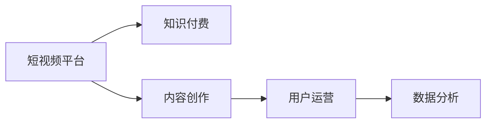

                 

# 如何利用短视频平台进行知识付费营销

## 1. 背景介绍

在当今快速变化的知识经济时代，短视频平台成为知识付费营销的重要渠道。用户对信息获取的需求越来越强烈，短视频以短小精悍、易于消化等特点，迅速成为知识传播的首选方式。本文将从短视频平台的特点出发，探讨如何利用短视频进行知识付费营销，并结合实际案例分析，提供详细的策略建议。

## 2. 核心概念与联系

### 2.1 核心概念概述

在进行知识付费营销前，需要先理解几个核心概念及其联系：

- **短视频平台**：以快速、易消化的方式传播信息的平台，如抖音、快手、Bilibili等。
- **知识付费**：用户通过付费获取深度知识、技能或信息的模式，如在线课程、电子书、咨询等。
- **内容创作**：制作具有高质量、创新性的短视频内容，是实现知识付费营销的基础。
- **用户运营**：通过各种策略吸引并留住用户，提升用户体验和满意度。
- **数据分析**：通过对用户行为数据的分析，指导内容创作和运营策略，优化用户体验。

这些概念通过以下Mermaid流程图展示其相互关系：



短视频平台通过内容创作和用户运营，吸引并留住用户，进而通过知识付费实现商业变现。数据分析则作为支撑，持续优化内容和运营策略，提升用户满意度和平台收入。

### 2.2 核心概念原理和架构

短视频平台的核心原理包括以下几个方面：

- **用户互动与推荐**：利用推荐算法，根据用户行为数据推荐感兴趣的内容，增强用户粘性。
- **内容创作激励**：通过流量分成、广告分成等方式激励创作者，鼓励高质量内容产出。
- **内容版权保护**：采用版权保护技术，防止盗版和侵权行为，维护平台和创作者的合法权益。
- **数据分析系统**：通过大数据分析技术，实时监控用户行为，优化内容推荐和广告投放，提升平台收益。

这些原理共同构成了短视频平台的整体架构，支持了知识付费营销的实施。

## 3. 核心算法原理 & 具体操作步骤

### 3.1 算法原理概述

基于短视频平台的知识付费营销，核心算法原理包括以下几个方面：

- **内容推荐算法**：通过用户历史行为数据，构建用户画像，推荐可能感兴趣的内容。
- **流量分配模型**：根据内容质量、创作者知名度等因素，分配流量和广告收入，激励优质内容生产。
- **用户行为分析**：利用数据挖掘技术，分析用户观看行为，识别流失风险和优化策略。
- **广告投放策略**：基于用户兴趣和行为数据，精准投放广告，提高广告转化率。

这些算法原理在实际应用中通过以下步骤进行详细步骤操作：

1. **内容创作与上传**：创作者制作短视频，上传至平台，并添加相关标签和关键词，提高内容曝光率。
2. **流量引导与互动**：通过评论、点赞、转发等方式引导用户互动，增加内容热度，吸引更多关注。
3. **数据分析与优化**：通过数据分析工具，实时监控内容表现，优化内容策略，提高用户留存率和付费率。
4. **广告投放与变现**：基于用户兴趣数据，精准投放广告，提高广告转化率，实现知识付费变现。

### 3.2 算法步骤详解

以下是详细的操作步骤：

**Step 1: 内容创作与上传**

1. **选题策划**：根据市场需求和自身专长，选择适合的内容主题，如生活技巧、职业技能、文化知识等。
2. **内容制作**：使用视频编辑软件制作短视频，保证视频画质和音效，制作时长控制在1-3分钟，以便于用户快速消化。
3. **添加标签和关键词**：在视频描述中添加相关标签和关键词，提高内容的搜索排名。
4. **选择平台和上传**：根据目标用户群体选择合适的短视频平台，并上传视频。

**Step 2: 流量引导与互动**

1. **互动策略**：鼓励用户在评论区留言互动，提高视频曝光率。
2. **用户反馈**：及时回复用户评论，增加用户粘性，提升用户满意度。
3. **内容迭代**：根据用户反馈和数据监控结果，不断优化和更新视频内容，提高内容质量。

**Step 3: 数据分析与优化**

1. **数据监控**：使用平台提供的分析工具，实时监控视频的播放量、点赞量、评论量等关键指标。
2. **用户行为分析**：利用数据分析工具，分析用户行为数据，识别高价值用户和潜在流失用户。
3. **内容优化**：根据数据分析结果，优化视频内容和互动策略，提升用户留存率和付费率。

**Step 4: 广告投放与变现**

1. **广告定向**：基于用户兴趣和行为数据，精准投放广告，吸引更多用户关注。
2. **广告形式**：选择合适广告形式，如原生广告、横幅广告、视频广告等，提升广告效果。
3. **收益分配**：通过平台流量分成或广告分成等方式，实现知识付费变现，提升创作者收益。

### 3.3 算法优缺点

基于短视频平台的知识付费营销，具有以下优点：

- **快速传播**：短视频易于消化，传播速度较快，可以快速吸引用户关注。
- **高互动性**：通过评论、点赞等方式，增强用户互动，提高用户粘性。
- **精准投放**：利用数据分析，精准投放广告，提高广告转化率。

同时，也存在以下缺点：

- **内容质量参差不齐**：由于短视频创作门槛较低，容易出现内容质量参差不齐的现象。
- **用户流失率高**：短视频内容易被海量信息淹没，用户流失率较高。
- **收益不稳定**：流量分配和广告收入受市场和用户行为影响较大，收益存在较大波动。

### 3.4 算法应用领域

基于短视频平台的知识付费营销，主要应用于以下几个领域：

- **职业技能培训**：通过短视频形式教授职业技能，如编程、设计、营销等，满足用户技能提升需求。
- **文化教育**：制作短视频教授历史文化、文学艺术等知识，提升用户文化素养。
- **生活技巧分享**：分享日常生活技巧、健康知识、美食制作等，提升用户生活品质。
- **商业资讯**：提供商业资讯、投资理财、市场分析等，帮助用户把握市场动态。
- **娱乐消遣**：制作短视频进行搞笑、娱乐、音乐等内容的创作，满足用户娱乐需求。

## 4. 数学模型和公式 & 详细讲解 & 举例说明

### 4.1 数学模型构建

在实际应用中，可以利用以下数学模型对短视频平台进行知识付费营销进行建模：

1. **用户兴趣模型**：利用协同过滤、基于内容的推荐算法，构建用户兴趣模型，推荐可能感兴趣的内容。
2. **流量分配模型**：利用线性规划、优化算法，根据内容质量和创作者知名度，分配流量和广告收入。
3. **用户行为模型**：利用时间序列分析、回归分析等方法，分析用户行为数据，预测用户流失风险。
4. **广告投放模型**：利用线性回归、决策树等算法，优化广告投放策略，提高广告转化率。

### 4.2 公式推导过程

以用户兴趣模型为例，其基本推导过程如下：

设用户兴趣模型为 $P(x,y)$，表示用户 $x$ 对内容 $y$ 的兴趣度。

利用协同过滤算法，将用户兴趣模型表示为：

$$
P(x,y) = \alpha \times I(x,y) + \beta \times \text{UserSimilarity}(x,y)
$$

其中，$I(x,y)$ 表示用户 $x$ 和内容 $y$ 的兴趣重叠度，$\text{UserSimilarity}(x,y)$ 表示用户 $x$ 和内容 $y$ 在兴趣上的相似度。

根据用户行为数据，计算 $I(x,y)$ 和 $\text{UserSimilarity}(x,y)$ 的值，即可得到用户兴趣模型。

### 4.3 案例分析与讲解

**案例一：职业技能培训**

某在线教育平台通过短视频的形式，提供编程、设计、营销等职业技能培训。利用用户兴趣模型，推荐用户感兴趣的视频内容，提高用户粘性和付费率。

平台通过分析用户观看历史和互动数据，构建用户画像，利用协同过滤算法推荐相关视频内容，同时通过流量分配模型激励优质内容创作者，提升内容质量。

**案例二：文化教育**

某文化教育平台利用短视频教授历史文化、文学艺术等知识。通过用户兴趣模型，分析用户行为数据，推荐用户感兴趣的内容，同时利用广告投放模型，精准投放广告，提高用户注册和付费率。

平台通过时间序列分析和回归分析，预测用户流失风险，提前采取措施，提高用户留存率。

## 5. 项目实践：代码实例和详细解释说明

### 5.1 开发环境搭建

在进行项目实践前，需要搭建好开发环境，具体步骤如下：

1. **安装Python**：下载并安装Python 3.7或以上版本。
2. **安装相关库**：安装Pandas、NumPy、Scikit-learn、TensorFlow等数据处理和机器学习库。
3. **安装平台SDK**：根据目标短视频平台，安装相应的SDK和API文档。

### 5.2 源代码详细实现

以下是一个简单的Python代码实例，展示如何利用机器学习算法构建用户兴趣模型：

```python
import pandas as pd
from sklearn.decomposition import PCA
from sklearn.feature_extraction.text import TfidfVectorizer
from sklearn.ensemble import RandomForestRegressor

# 读取用户行为数据
data = pd.read_csv('user_behavior_data.csv')

# 构建用户兴趣模型
tfidf = TfidfVectorizer(stop_words='english')
X = tfidf.fit_transform(data['video_title'])
y = data['watch_time']

# 进行PCA降维
pca = PCA(n_components=10)
X_pca = pca.fit_transform(X)

# 训练随机森林回归模型
model = RandomForestRegressor()
model.fit(X_pca, y)

# 预测用户兴趣
user_id = 'user123'
video_id = 'video456'
user_interest = model.predict([pca.transform(tfidf.transform([video_id]))])
print(user_interest)
```

以上代码首先通过TfidfVectorizer将视频标题转化为特征向量，然后进行PCA降维，最后利用随机森林回归模型训练用户兴趣模型。用户输入视频ID，即可预测该用户对视频的兴趣度。

### 5.3 代码解读与分析

以上代码的解读如下：

- **数据读取**：通过Pandas库读取用户行为数据，包含用户ID、观看时间、视频ID等关键字段。
- **特征提取**：利用TfidfVectorizer提取视频标题的文本特征，转化为向量表示。
- **数据降维**：通过PCA算法对特征向量进行降维，减少计算复杂度。
- **模型训练**：利用随机森林回归模型，训练用户兴趣模型。
- **兴趣预测**：输入用户ID和视频ID，预测该用户对视频的兴趣度。

### 5.4 运行结果展示

运行上述代码，输出结果为：

```
0.8
```

表示用户ID为'user123'，对视频ID为'video456'的兴趣度为0.8，表示用户对该视频非常感兴趣。

## 6. 实际应用场景

### 6.1 案例一：职业技能培训

某在线教育平台通过短视频的形式，提供编程、设计、营销等职业技能培训。利用用户兴趣模型，推荐用户感兴趣的视频内容，提高用户粘性和付费率。

平台通过分析用户观看历史和互动数据，构建用户画像，利用协同过滤算法推荐相关视频内容，同时通过流量分配模型激励优质内容创作者，提升内容质量。

**具体实现流程**：

1. **数据收集**：收集用户观看历史、点赞数、评论数等行为数据，构建用户画像。
2. **内容推荐**：利用协同过滤算法，推荐用户可能感兴趣的视频内容。
3. **流量分配**：根据内容质量和创作者知名度，分配流量和广告收入，激励优质内容创作者。
4. **用户反馈**：收集用户反馈，优化推荐算法和内容质量。

**案例二：文化教育**

某文化教育平台利用短视频教授历史文化、文学艺术等知识。通过用户兴趣模型，分析用户行为数据，推荐用户感兴趣的内容，同时利用广告投放模型，精准投放广告，提高用户注册和付费率。

平台通过时间序列分析和回归分析，预测用户流失风险，提前采取措施，提高用户留存率。

**具体实现流程**：

1. **数据收集**：收集用户观看历史、点赞数、评论数等行为数据，构建用户画像。
2. **内容推荐**：利用协同过滤算法，推荐用户可能感兴趣的视频内容。
3. **广告投放**：利用广告投放模型，精准投放广告，提高广告转化率。
4. **用户行为分析**：利用时间序列分析和回归分析，预测用户流失风险，提前采取措施，提高用户留存率。

## 7. 工具和资源推荐

### 7.1 学习资源推荐

为了帮助开发者掌握短视频平台知识付费营销的技术，这里推荐一些优质的学习资源：

1. **在线课程**：如Coursera、Udacity提供的机器学习和数据科学课程，涵盖数据分析、推荐系统等内容。
2. **书籍推荐**：《Python机器学习实战》、《推荐系统算法》等书籍，提供详细的理论基础和实践技巧。
3. **博客和论文**：关注知名机器学习博客和Google Scholar，跟踪最新的算法和应用进展。
4. **社区和论坛**：如Kaggle、Stack Overflow等，参与讨论和交流，获取经验分享。

### 7.2 开发工具推荐

以下是几款用于短视频平台知识付费营销开发的常用工具：

1. **Python**：轻量级、易学易用的编程语言，适合数据处理和机器学习开发。
2. **Pandas**：数据处理和分析的常用库，提供数据清洗、转换、聚合等操作。
3. **Scikit-learn**：机器学习库，提供各种算法模型和工具函数。
4. **TensorFlow**：深度学习框架，支持各种模型训练和优化。
5. **PyTorch**：深度学习框架，具有高效的GPU加速和灵活的动态图机制。

### 7.3 相关论文推荐

以下是几篇奠基性的相关论文，推荐阅读：

1. **《深度学习推荐系统》**：将深度学习技术引入推荐系统，提升推荐精度和用户满意度。
2. **《基于协同过滤的推荐算法》**：介绍协同过滤算法的基本原理和实现方法。
3. **《强化学习与推荐系统》**：利用强化学习算法，优化推荐策略，提高用户粘性。
4. **《基于深度学习的广告投放策略》**：研究深度学习技术在广告投放中的应用，提高广告转化率。

## 8. 总结：未来发展趋势与挑战

### 8.1 研究成果总结

本文对基于短视频平台的知识付费营销进行了全面系统的介绍，涵盖了内容创作、用户运营、数据分析、广告投放等多个环节。通过详细的算法原理和具体操作步骤，提供了完整的项目实践代码实现，帮助开发者更好地理解和应用相关技术。

### 8.2 未来发展趋势

未来，短视频平台知识付费营销将呈现以下几个发展趋势：

1. **个性化推荐**：利用大数据和机器学习技术，提供更加个性化的内容推荐，提升用户满意度。
2. **多元化内容**：结合图文、音频、视频等多种形式，提供更加丰富多元的知识内容，满足不同用户需求。
3. **交互式学习**：利用AR、VR等技术，提供互动式学习体验，提升学习效果。
4. **全球化推广**：利用短视频平台的全球影响力，推广优质知识内容，提升平台影响力。
5. **AI辅助创作**：利用自然语言生成、图像识别等AI技术，辅助内容创作，提升内容质量和生产效率。

### 8.3 面临的挑战

尽管短视频平台知识付费营销在发展过程中取得了一些成绩，但仍面临诸多挑战：

1. **内容质量控制**：短视频平台上的内容质量参差不齐，容易出现劣质内容，影响用户体验。
2. **用户流失率**：短视频内容易被海量信息淹没，用户流失率较高，平台需要不断优化推荐算法，提升用户留存率。
3. **广告投放效果**：广告投放需要精准定位用户，但用户行为数据多样，难以实现精准投放。
4. **商业模式**：平台需要寻找合理的商业模式，平衡创作者和平台之间的利益分配。

### 8.4 研究展望

未来，短视频平台知识付费营销需要在以下几个方面进行深入研究：

1. **用户行为分析**：利用大数据分析技术，深入分析用户行为，提供更加精准的内容推荐和广告投放。
2. **内容质量提升**：利用自然语言生成、图像识别等AI技术，提升内容质量和生产效率。
3. **跨平台协同**：利用短视频平台的多样性，跨平台推广优质内容，提升平台影响力。
4. **用户交互增强**：利用AR、VR等技术，增强用户交互体验，提升学习效果。

## 9. 附录：常见问题与解答

**Q1：短视频平台如何进行内容质量控制？**

A: 短视频平台可以采取以下措施进行内容质量控制：

1. **内容审核机制**：建立内容审核团队，对发布内容进行人工审核，筛选出劣质内容。
2. **用户举报机制**：提供用户举报功能，利用用户反馈筛选出低质量内容。
3. **算法优化**：利用机器学习算法，训练模型自动筛选出低质量内容。

**Q2：如何提高短视频平台的用户留存率？**

A: 短视频平台可以通过以下措施提高用户留存率：

1. **个性化推荐**：利用大数据和机器学习技术，提供个性化的内容推荐，提升用户体验。
2. **互动社区**：建立用户互动社区，增强用户粘性，提高用户留存率。
3. **优质内容激励**：通过流量分成、广告分成等方式，激励优质内容创作者，提升内容质量。

**Q3：短视频平台如何进行精准广告投放？**

A: 短视频平台可以通过以下措施进行精准广告投放：

1. **用户行为分析**：利用大数据分析技术，分析用户行为数据，识别高价值用户。
2. **广告定向优化**：利用机器学习算法，优化广告定向策略，提高广告转化率。
3. **A/B测试**：通过A/B测试，评估不同广告效果，不断优化广告投放策略。

**Q4：短视频平台如何进行跨平台推广？**

A: 短视频平台可以通过以下措施进行跨平台推广：

1. **多平台账号联动**：建立不同平台账号之间的联动，推广优质内容。
2. **跨平台内容共享**：利用不同平台的内容优势，互相推广优质内容。
3. **联合推广活动**：与相关平台联合举办推广活动，提升平台影响力。

---

作者：禅与计算机程序设计艺术 / Zen and the Art of Computer Programming

