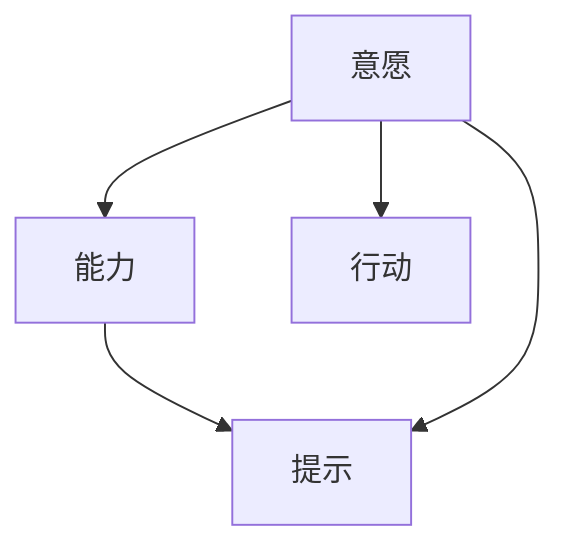
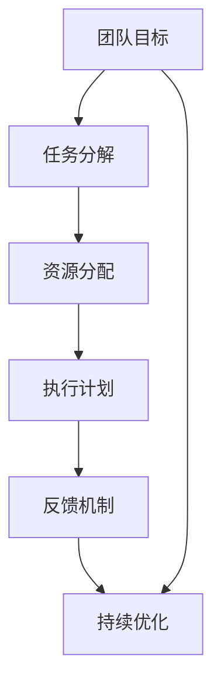

                 

# 如何利用福格模型提高团队效率

> 关键词：团队效率,福格模型,行为改变,目标设定,行为设计

## 1. 背景介绍

在当今快速变化的商业环境中，提高团队效率成为了每个组织的核心挑战之一。传统的管理方法，如严格的时间管理和目标设定，虽然在一定程度上提升了工作效率，但往往忽视了员工行为背后的心理学原理。行为设计学（Behavioral Design）的先驱B.J.福格（B.J. Fogg）提出了一个简单而强大的模型，帮助人们理解和设计行为。

福格模型基于一个核心观点：**人们会采取行动，当且仅当他们有能力并且有意愿去这么做**。这个模型简化了行为改变的研究，并提供了实用的框架来设计激励人们采取特定行动的策略。本文将深入探讨福格模型，并探索如何将其应用到团队管理中，以提高整体效率。

## 2. 核心概念与联系

### 2.1 核心概念概述

福格模型由三个要素组成：

1. **意愿**：指个体想要进行某个行为的内在动机。
2. **能力**：指个体执行某个行为的资源（如时间、精力、技能）。
3. **提示**：指触发个体进行某个行为的外部信号。

这三个要素构成了行为改变的基础，形成一个简单的三角形，如下图所示：



福格模型通过组合这三个要素，帮助设计出能够有效改变行为的策略。在团队管理中，我们可以通过调整意愿、能力和提示，来提升团队的效率和协作能力。

### 2.2 核心概念原理和架构的 Mermaid 流程图

以下是一个简单的 Mermaid 流程图，展示了福格模型的应用场景：



在这个流程图中，团队目标被分解为具体的任务，并分配必要的资源。执行计划确保每个成员能够按照计划进行，反馈机制用于评估进展并进行调整，持续优化保证团队能够不断适应新的环境。

## 3. 核心算法原理 & 具体操作步骤

### 3.1 算法原理概述

福格模型是一个行为设计的框架，通过调整意愿、能力和提示三个要素，来设计能够激励人们采取特定行为的策略。在团队管理中，福格模型的应用需要结合团队的具体情况，如成员个性、工作环境、目标设置等。

### 3.2 算法步骤详解

福格模型的应用步骤如下：

1. **明确团队目标**：首先，团队需要明确共同的长期目标，这是行为设计的起点。

2. **任务分解和资源分配**：将长期目标分解为具体的、可执行的任务，并分配必要的资源（如时间、人力、资金）。

3. **设计行动计划**：基于意愿、能力和提示，设计能够激励成员完成任务的行动计划。

4. **建立反馈机制**：定期收集进展数据，进行评估和反馈，确保团队在正确的轨道上前进。

5. **持续优化**：根据反馈结果，调整策略，优化团队的行为和资源分配，以达到最佳效果。

### 3.3 算法优缺点

福格模型有以下优点：

- **简单易行**：模型结构清晰，易于理解和应用。
- **效果显著**：通过明确目标和行动计划，可以有效提升团队效率。
- **灵活可变**：根据实际情况灵活调整策略，适应不同的团队和任务。

缺点包括：

- **需要持续监控**：模型依赖于持续的反馈和调整，需要投入一定的时间和精力。
- **可能过于复杂**：对于简单的任务，可能过度设计，增加了复杂性。
- **依赖团队协作**：模型依赖于团队成员的积极参与和协作，对团队文化和管理方式有较高要求。

### 3.4 算法应用领域

福格模型可以应用于各种团队管理场景，包括但不限于：

- **项目管理**：设计任务分解、资源分配和行动计划，提升项目完成效率。
- **团队激励**：通过调整意愿、能力和提示，激励团队成员积极完成任务。
- **知识共享**：设计团队成员之间知识分享和协作的机制，提升整体能力。
- **组织变革**：设计能够激励员工接受组织变革的行为策略。
- **客户服务**：设计能够提升客户满意度和忠诚度的服务策略。

## 4. 数学模型和公式 & 详细讲解 & 举例说明

### 4.1 数学模型构建

福格模型的核心思想可以用以下公式来表达：

$$
A = \text{提示} \times (\text{意愿} \times \text{能力})
$$

其中，$A$ 表示采取特定行为的动机，$P$ 表示意愿，$C$ 表示能力，$P \times C$ 表示意愿和能力联合作用的效果。

### 4.2 公式推导过程

推导过程如下：

1. 假设意愿和能力是独立的，则有：

$$
P \times C = P + C - 1
$$

2. 引入提示后，行为动机 $A$ 可表示为：

$$
A = P \times C = (P + C - 1) \times \text{提示}
$$

3. 当提示等于1时，行为动机 $A$ 最大，此时：

$$
A = P + C - 1
$$

4. 若提示增加，行为动机 $A$ 会增加，但增加幅度小于意愿和能力联合作用的效果。

### 4.3 案例分析与讲解

以一个软件开发团队为例，分析如何应用福格模型提高团队效率。

1. **明确团队目标**：团队的目标是按时交付高质量的软件产品。

2. **任务分解和资源分配**：将目标分解为具体的任务，如需求分析、设计、开发、测试等，并分配必要的资源，如时间、人员、设备等。

3. **设计行动计划**：
   - 意愿：通过目标设定和团队认可，增强团队成员的动机。
   - 能力：提供必要的培训和技术支持，提高团队成员的技能。
   - 提示：设计清晰的里程碑和时间表，提醒团队成员按时完成任务。

4. **建立反馈机制**：定期召开进展会议，评估任务进展，及时调整策略。

5. **持续优化**：根据反馈结果，优化任务分解、资源分配和行动计划，提升团队效率。

通过上述步骤，团队能够系统地设计和管理行为，从而提升整体效率和协作能力。

## 5. 项目实践：代码实例和详细解释说明

### 5.1 开发环境搭建

福格模型的应用主要依赖于项目管理工具和反馈机制。常用的工具包括Trello、Jira、Asana等。以下以Trello为例，介绍如何搭建开发环境。

1. 注册并登录Trello账户，创建项目。
2. 创建看板（Board），添加列表（List），如需求分析、设计、开发、测试等。
3. 在列表中创建卡片（Card），每个卡片代表一个具体任务。
4. 添加附件、评论、截止日期等，丰富卡片信息。

### 5.2 源代码详细实现

由于福格模型主要依赖于项目管理工具，不需要编写复杂的代码。以下是一个简化的代码示例，演示如何使用Python的Airflow库进行任务调度：

```python
from airflow import DAG
from airflow.operators.python_operator import PythonOperator
import datetime

default_args = {
    'owner': 'airflow',
    'depends_on_past': False,
    'start_date': datetime.datetime(2023, 1, 1),
    'retries': 1,
}

dag = DAG('task_decomposition', default_args=default_args, schedule_interval='@daily')

def task_decomposition():
    # 执行任务分解的代码
    pass

task_decomposition = PythonOperator(
    task_id='task_decomposition',
    python_callable=task_decomposition,
    dag=dag
)

task_decomposition
```

### 5.3 代码解读与分析

在上述示例中，我们使用Airflow库创建了一个简单的DAG（有向无环图），用于任务调度。每个任务（Card）表示一个具体的任务，任务之间通过依赖关系（Edge）进行连接。通过这种方式，可以清晰地展示任务执行的顺序和依赖关系，帮助团队更好地规划和执行。

## 6. 实际应用场景

### 6.1 项目管理

在项目管理中，福格模型可以帮助团队系统地分解任务，合理分配资源，设计行动计划，提升项目完成效率。例如，项目管理工具如Trello、Jira等，可以帮助团队成员协同工作，提高项目管理效率。

### 6.2 团队激励

福格模型通过调整意愿、能力和提示，可以设计出激励团队成员积极完成任务的策略。例如，通过设置明确的里程碑和奖励机制，提升团队成员的动机和能力。

### 6.3 知识共享

福格模型可以帮助团队设计知识共享和协作的机制，提升整体能力。例如，通过定期举行知识分享会，激励团队成员分享知识和经验。

### 6.4 组织变革

福格模型可以设计能够激励员工接受组织变革的行为策略。例如，通过明确变革目标，提供必要的培训和资源支持，设计变革计划的行动计划。

### 6.5 客户服务

福格模型可以设计提升客户满意度和忠诚度的服务策略。例如，通过设计清晰的服务流程和反馈机制，激励客服人员提供高质量的服务。

## 7. 工具和资源推荐

### 7.1 学习资源推荐

为了帮助读者深入理解福格模型，以下是一些推荐的学习资源：

1. **《行为设计学》（The Behavioral Design Cookbook）**：福格教授编写的实用指南，提供了数百个行为设计案例和策略。
2. **Coursera上的《行为设计》（Behavior Design）课程**：由斯坦福大学提供的在线课程，深入讲解行为设计原理和应用。
3. **TEDx Talks上的福格演讲**：福格教授的多次演讲，涵盖了行为设计的各个方面。
4. **《设计思维》（Design Thinking）**：关于创新和解决问题的综合方法，与行为设计紧密相关。

### 7.2 开发工具推荐

以下是一些推荐的项目管理和协作工具，可以帮助团队高效应用福格模型：

1. **Trello**：简单易用的看板工具，适合小型团队的项目管理。
2. **Jira**：功能强大的项目管理工具，适合大中型团队的任务调度和进度跟踪。
3. **Asana**：灵活的项目管理工具，适合多种项目和任务的协作管理。
4. **Notion**：全能型工作管理工具，集任务管理、文档协作、笔记记录于一体。
5. **Airflow**：开源的工作流管理工具，适合复杂的任务调度和自动化流程设计。

### 7.3 相关论文推荐

以下是一些关于行为设计和团队管理的经典论文，推荐阅读：

1. **《行为设计学》（Behavioral Design）**：福格教授的开创性论文，奠定了行为设计学的基础。
2. **《设计思维与组织变革》（Design Thinking and Organizational Change）**：探讨设计思维在组织变革中的应用。
3. **《团队动力学的理论研究》（The Theory of Teams）**：关于团队动力学的经典研究，提供了团队管理的理论基础。

## 8. 总结：未来发展趋势与挑战

### 8.1 研究成果总结

福格模型已经广泛应用于多个领域，并取得了显著成效。通过系统设计行为改变策略，福格模型帮助团队提升了整体效率和协作能力。

### 8.2 未来发展趋势

未来，福格模型将在以下几个方面继续发展：

1. **数据驱动的个性化**：利用大数据分析，设计更个性化的行为策略，提高团队效率。
2. **跨团队的协作设计**：设计跨团队的协作机制，提升整体组织效率。
3. **智能化的行为优化**：利用人工智能技术，实现行为设计的自动化和智能化。
4. **多模态的行为设计**：结合不同的行为设计方法和工具，提供更全面的解决方案。
5. **国际化的行为设计**：适应不同文化背景的行为设计策略，提升全球团队的协作效率。

### 8.3 面临的挑战

福格模型虽然应用广泛，但在实际应用中也面临一些挑战：

1. **复杂性的管理**：如何平衡行为设计的复杂性和实际操作的简洁性。
2. **数据的获取和分析**：需要大量的数据支持，数据获取和分析的难度较大。
3. **文化和个性差异**：不同文化和个性背景的团队成员，对行为设计的响应不同，需要灵活调整策略。
4. **长期效果评估**：行为设计的效果评估较为复杂，需要持续跟踪和调整。

### 8.4 研究展望

未来，福格模型的应用将更加深入和广泛，需要通过持续的研究和实践，不断优化和提升行为设计的理论和方法。以下是几个未来研究方向：

1. **多模态行为设计**：结合视觉、听觉、触觉等多模态信息，提升行为设计的丰富性和效果。
2. **混合设计方法**：结合行为设计和设计思维，提供更全面和系统的方法。
3. **跨学科研究**：结合心理学、社会学、神经科学等多个学科的知识，深入理解行为设计的机制和应用。
4. **技术融合**：利用人工智能、大数据等技术，实现行为设计的智能化和自动化。

总之，福格模型为行为设计提供了清晰的框架和实用的工具，帮助团队系统地设计和管理行为，提升整体效率和协作能力。未来，通过不断的研究和实践，福格模型将在更多领域发挥更大的作用。

## 9. 附录：常见问题与解答

**Q1：福格模型是否适用于所有团队？**

A: 福格模型适用于大多数团队，但需要根据具体情况进行调整。对于文化差异较大的团队，需要结合实际情况进行灵活设计。

**Q2：福格模型如何应对团队中的分歧？**

A: 福格模型强调共同目标和意愿，可以通过明确共同目标、建立共同愿景来减少团队中的分歧。同时，通过定期沟通和反馈，及时调整策略。

**Q3：如何设计高效的团队协作机制？**

A: 福格模型可以通过设计清晰的流程和规则，建立高效的协作机制。例如，通过设计协作工具和流程，明确每个成员的职责和任务。

**Q4：如何确保行为设计的长期有效性？**

A: 行为设计需要持续的监控和调整，定期收集反馈数据，评估效果并进行优化。同时，通过设定明确的里程碑和奖励机制，激励团队成员持续改进。

**Q5：福格模型是否适用于非技术团队？**

A: 福格模型不仅适用于技术团队，也适用于非技术团队。通过明确目标和设计有效的行动计划，可以提升非技术团队的协作效率和工作效果。

综上所述，福格模型为团队管理提供了系统化的方法，通过调整意愿、能力和提示三个要素，帮助团队提升整体效率和协作能力。通过不断的研究和实践，福格模型将在更多领域发挥更大的作用，推动组织变革和创新发展。

