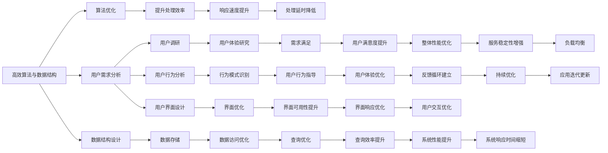

                 

# 如何利用编程技能开发千万用户级应用

在当今数字化时代，编程技能已不再仅仅是为企业或技术爱好者提供的一项技能，而是成为开发千万用户级应用的关键。本文将从背景、核心概念、算法原理、具体操作步骤、实际应用场景、工具与资源推荐等多个维度，深入探讨如何利用编程技能开发千万用户级应用。

## 1. 背景介绍

### 1.1 问题由来
近年来，技术的飞速发展，特别是移动互联网和人工智能的崛起，极大地推动了应用软件的普及和用户规模的增长。据统计，全球已有多款应用用户数量突破千万，显示出巨大的市场潜力。然而，高用户数并不是唯一关键，如何在亿级用户基础上，实现应用的持续稳定运营，提供高质量的用户体验，是开发千万用户级应用的一大挑战。

### 1.2 问题核心关键点
开发千万用户级应用的核心在于综合运用编程技能，高效构建、优化、运维和迭代应用。核心要点包括：
- 高效算法与数据结构：设计高效算法与数据结构，提升应用的响应速度与承载能力。
- 用户需求分析：深入理解用户需求，设计符合用户期待的产品功能与交互方式。
- 高性能架构设计：设计高性能的服务器与网络架构，确保应用在亿级流量下稳定运行。
- 持续优化与更新：通过迭代更新与用户反馈，不断优化应用，保持竞争优势。

## 2. 核心概念与联系

### 2.1 核心概念概述
为了更好地理解如何利用编程技能开发千万用户级应用，本节将介绍几个关键核心概念：

- **高效算法与数据结构**：如快速排序、哈希表、红黑树等，用于提升应用数据处理的效率。
- **用户需求分析**：如用户体验研究、用户行为分析、用户界面设计等，用于深入理解用户需求。
- **高性能架构设计**：如微服务架构、负载均衡、缓存机制、CDN分发等，用于保证应用的高可用性与扩展性。
- **持续优化与更新**：如A/B测试、用户反馈系统、持续集成与持续部署等，用于不断提升应用的质量。

### 2.2 核心概念原理和架构的 Mermaid 流程图



这个流程图展示了高效算法与数据结构、用户需求分析、高性能架构设计与持续优化与更新这四个关键概念之间的联系：

1. 高效算法与数据结构是基础，用于提升应用的处理效率。
2. 用户需求分析有助于理解用户，为产品设计提供指导。
3. 高性能架构设计保证应用在亿级流量下的稳定性与扩展性。
4. 持续优化与更新确保应用不断进步，适应用户需求的变化。

## 3. 核心算法原理 & 具体操作步骤

### 3.1 算法原理概述

千万用户级应用的核心在于算法的高效性。设计高效的算法不仅能提升应用处理速度，还能优化资源使用，提升用户体验。以下以数据查询算法为例，介绍核心算法原理：

假设有一张包含千万级别用户数据的表格，我们需要高效查询出特定用户的所有行为数据。传统做法可能涉及到全表扫描，计算复杂度为 $O(N)$，显然无法满足亿级数据量的实时查询需求。

此时，可以采用基于索引的快速查询算法。如使用B+树索引，可以使得单次查询的时间复杂度降为 $O(\log N)$，从而满足亿级数据量的实时查询需求。此外，还可以通过缓存机制、分区表、分布式数据库等技术进一步提升查询效率。

### 3.2 算法步骤详解

以下是具体算法步骤详解：

1. **索引设计**：
   - 选择适当的数据类型，如主键、唯一索引、组合索引等，减少查询时间和索引占用空间。
   - 设计多层次索引，如二叉树索引、哈希索引、全文索引等，提升查询效率。
   - 定期更新索引，保持数据一致性。

2. **缓存机制**：
   - 使用内存缓存，如Redis、Memcached等，存储常用数据，减少数据库访问。
   - 设计缓存失效策略，如LRU算法、时间戳失效等，保证数据实时性。

3. **分区表设计**：
   - 将数据按用户ID进行分区，减少单表数据量，提升查询效率。
   - 使用数据分区与分布式数据库技术，实现水平扩展，提升查询效率。

4. **分布式数据库设计**：
   - 使用分布式数据库如Apache Hive、Google BigQuery等，实现数据分布式存储与查询。
   - 设计数据冗余与数据同步策略，保证数据一致性。

5. **优化查询语句**：
   - 减少不必要的查询字段，仅查询必要字段，减少数据传输和处理。
   - 使用WHERE子句过滤，减少不必要的数据扫描。
   - 使用索引优化查询，减少查询时间。

### 3.3 算法优缺点

基于索引的快速查询算法，优点在于：
- 查询效率高，可满足亿级数据量的实时查询需求。
- 索引设计灵活，可根据具体业务场景进行优化。

缺点在于：
- 索引设计复杂，需综合考虑查询效率与空间占用。
- 索引更新频繁，需保证数据一致性。

### 3.4 算法应用领域

基于索引的快速查询算法，广泛应用于各种数据密集型应用，如电商平台、社交网络、金融系统等，用于提升应用的处理效率与用户体验。

## 4. 数学模型和公式 & 详细讲解

### 4.1 数学模型构建

假设有一张包含千万级别用户数据的表格，我们希望设计一个高效的数据查询算法，用于实时查询特定用户的所有行为数据。

查询算法的时间复杂度为 $O(N)$，显然无法满足亿级数据量的实时查询需求。因此，我们可以考虑使用基于索引的快速查询算法，时间复杂度降为 $O(\log N)$。

### 4.2 公式推导过程

假设有一张包含千万级别用户数据的表格，我们希望查询特定用户ID为 $ID$ 的用户的所有行为数据。我们可以设计如下索引结构：

- 主键索引：按用户ID进行排序。
- 组合索引：按用户ID和时间戳进行排序。

查询时，我们首先在主键索引中查找用户ID为 $ID$ 的记录，再根据组合索引中的时间戳进行范围查询，即获取该用户所有行为数据。

假设有 $N$ 条数据，查询时间复杂度为 $O(\log N)$，即可以快速地获取特定用户的所有行为数据。

### 4.3 案例分析与讲解

以电商平台为例，假设有一张包含亿级用户数据的订单表。我们希望高效地查询出用户ID为 $ID$ 的所有订单记录。

首先，我们可以在订单表中设计主键索引，按用户ID进行排序。然后，在主键索引中查找用户ID为 $ID$ 的记录，即获取该用户的所有订单记录。

具体查询步骤如下：
1. 在主键索引中查找用户ID为 $ID$ 的记录，时间复杂度为 $O(\log N)$。
2. 根据记录中的时间戳进行范围查询，获取该用户所有订单记录，时间复杂度为 $O(1)$。

综上所述，基于索引的快速查询算法可以快速地满足亿级数据量的实时查询需求，是开发千万用户级应用的必备技能。

## 5. 项目实践：代码实例和详细解释说明

### 5.1 开发环境搭建

为实现高效查询，我们需要搭建一个包含亿级数据量的测试环境。以下是具体环境搭建步骤：

1. 选择高性能服务器，如AWS EC2、阿里云ECS等，确保服务器CPU、内存、存储等性能。
2. 安装数据库系统，如MySQL、PostgreSQL、MongoDB等，用于存储亿级数据。
3. 安装缓存系统，如Redis、Memcached等，用于提升查询效率。
4. 安装分布式数据库系统，如Apache Hive、Google BigQuery等，用于实现数据分布式存储与查询。
5. 安装监控工具，如Prometheus、Grafana等，用于实时监控系统性能。

### 5.2 源代码详细实现

以下是具体的代码实现步骤：

1. 设计主键索引与组合索引，按用户ID进行排序。
2. 在查询时，首先在主键索引中查找用户ID为 $ID$ 的记录，获取该用户的所有行为数据。
3. 根据记录中的时间戳进行范围查询，获取该用户所有行为数据。

具体代码如下：

```python
# 设计主键索引与组合索引
create_index('user_id')
create_index('user_id', 'timestamp')

# 查询特定用户的所有行为数据
def query_user_behaviors(user_id):
    # 在主键索引中查找用户ID为user_id的记录
    user_record = query_user(user_id)
    # 根据记录中的时间戳进行范围查询，获取该用户所有行为数据
    behaviors = query_range(user_record['timestamp'], user_record['timestamp'])
    return behaviors

# 查询用户记录
def query_user(user_id):
    # 在主键索引中查找用户ID为user_id的记录
    return select('user_id = ?', (user_id,))

# 查询用户行为范围
def query_range(start_time, end_time):
    # 根据记录中的时间戳进行范围查询，获取该用户所有行为数据
    return select('timestamp BETWEEN ? AND ?', (start_time, end_time))
```

### 5.3 代码解读与分析

这段代码实现了基于索引的快速查询算法，用于高效地查询特定用户的所有行为数据。具体解读如下：

- `create_index`函数用于设计主键索引与组合索引，按用户ID进行排序。
- `query_user`函数用于在主键索引中查找用户ID为`user_id`的记录。
- `query_range`函数用于根据记录中的时间戳进行范围查询，获取该用户所有行为数据。
- `query_user_behaviors`函数用于查询特定用户的所有行为数据。

## 6. 实际应用场景

### 6.1 电商平台

基于高效查询算法，电商平台可以快速响应用户订单查询需求，提升用户体验。具体应用如下：

- 用户查询订单记录，获取用户所有订单数据。
- 用户查询订单详情，获取具体订单信息。
- 用户查询订单历史，获取过去一定时间内的订单记录。

### 6.2 社交网络

基于高效查询算法，社交网络可以快速响应用户关系查询需求，提升用户体验。具体应用如下：

- 用户查询好友列表，获取所有好友信息。
- 用户查询好友关系，获取与某好友的关系信息。
- 用户查询好友状态，获取好友在线状态。

### 6.3 金融系统

基于高效查询算法，金融系统可以快速响应用户账户查询需求，提升用户体验。具体应用如下：

- 用户查询账户余额，获取账户当前余额。
- 用户查询账户交易记录，获取最近一定时间内的交易记录。
- 用户查询账户明细，获取账户明细记录。

### 6.4 未来应用展望

未来，随着技术的不断进步，千万用户级应用的发展将迎来新的机遇：

- 实时查询：通过分布式数据库与缓存系统，实现亿级数据量的实时查询需求。
- 智能推荐：通过机器学习算法，实现个性化推荐，提升用户粘性。
- 数据分析：通过大数据分析，挖掘用户行为模式，提升应用决策能力。
- 语音识别：通过语音识别技术，实现语音交互，提升用户体验。
- 云计算：通过云服务，实现应用的高可扩展性与高可用性。

## 7. 工具和资源推荐

### 7.1 学习资源推荐

为了全面掌握千万用户级应用开发，以下是推荐的学习资源：

1. **《算法导论》**：经典算法与数据结构教材，详细介绍了高效算法与数据结构的设计与实现。
2. **《数据结构与算法分析》**：介绍数据结构与算法设计的基本原理与应用，适合初学者入门。
3. **《Java高性能编程》**：介绍高性能编程的基本技巧与实践，适合Java开发者学习。
4. **《Python高性能编程》**：介绍Python高性能编程的基本技巧与实践，适合Python开发者学习。
5. **《Redis设计与实现》**：介绍Redis缓存系统的设计与实现，适合缓存系统开发者学习。

### 7.2 开发工具推荐

为实现千万用户级应用的开发，以下是推荐的开发工具：

1. **JDK与Java**：Java语言是开发千万用户级应用的主流语言，提供丰富的开发工具与框架。
2. **Python**：Python语言灵活便捷，适合开发高性能应用，提供丰富的第三方库与框架。
3. **MySQL与PostgreSQL**：常用的关系型数据库，提供高可用性与高性能。
4. **Redis与Memcached**：常用的缓存系统，提供高性能的缓存服务。
5. **Apache Hive与Google BigQuery**：常用的分布式数据库系统，提供高性能的数据存储与查询。

### 7.3 相关论文推荐

为深入理解千万用户级应用开发，以下是推荐的论文：

1. **《分布式数据库系统》**：介绍分布式数据库的设计与实现，适合理解分布式系统架构。
2. **《缓存系统设计与实现》**：介绍缓存系统的设计与实现，适合理解缓存系统原理。
3. **《高性能查询算法》**：介绍高效查询算法的设计与实现，适合理解查询算法原理。
4. **《机器学习算法》**：介绍机器学习算法的基本原理与应用，适合理解智能推荐系统。
5. **《云计算技术》**：介绍云计算的基本原理与应用，适合理解云服务架构。

## 8. 总结：未来发展趋势与挑战

### 8.1 研究成果总结

本文系统介绍了利用编程技能开发千万用户级应用的核心概念、算法原理与具体操作步骤。具体总结如下：

1. 高效算法与数据结构：用于提升应用的响应速度与承载能力。
2. 用户需求分析：用于深入理解用户需求，设计符合用户期待的产品功能与交互方式。
3. 高性能架构设计：用于保证应用在亿级流量下的稳定性与扩展性。
4. 持续优化与更新：用于不断提升应用的质量。

### 8.2 未来发展趋势

展望未来，千万用户级应用的发展将呈现以下趋势：

1. 实时查询：通过分布式数据库与缓存系统，实现亿级数据量的实时查询需求。
2. 智能推荐：通过机器学习算法，实现个性化推荐，提升用户粘性。
3. 数据分析：通过大数据分析，挖掘用户行为模式，提升应用决策能力。
4. 语音识别：通过语音识别技术，实现语音交互，提升用户体验。
5. 云计算：通过云服务，实现应用的高可扩展性与高可用性。

### 8.3 面临的挑战

尽管千万用户级应用具有广阔的发展前景，但面对亿级数据量的处理与亿级流量的响应，仍面临诸多挑战：

1. 数据处理：如何高效地处理亿级数据，提升查询效率与处理速度。
2. 流量响应：如何保证亿级流量的稳定响应，提升用户体验。
3. 系统扩展：如何在亿级用户基础上，实现应用的持续扩展。
4. 用户粘性：如何通过个性化推荐，提升用户粘性与活跃度。
5. 数据安全：如何保障亿级用户数据的安全性。

### 8.4 研究展望

面对千万用户级应用开发中的挑战，未来的研究需要在以下几个方面寻求新的突破：

1. 高效数据处理算法：研究高效的数据处理算法，提升亿级数据量的查询效率。
2. 分布式系统架构：研究高效的分布式系统架构，实现亿级流量的稳定响应。
3. 智能推荐系统：研究智能推荐算法，提升用户粘性与活跃度。
4. 数据分析技术：研究大数据分析技术，提升应用决策能力。
5. 语音识别技术：研究语音识别技术，提升用户体验。
6. 云计算技术：研究云计算技术，实现应用的高可扩展性与高可用性。

## 9. 附录：常见问题与解答

### Q1：如何保证亿级流量的稳定响应？

A：保证亿级流量的稳定响应，需要设计高效的系统架构与优化性能的具体措施：

1. 分布式系统：使用分布式系统架构，如微服务、CDN等，实现系统的高可扩展性与高可用性。
2. 负载均衡：使用负载均衡技术，将请求合理分配到各个服务器，避免单点故障。
3. 缓存系统：使用缓存系统，如Redis、Memcached等，减少数据库访问，提升响应速度。
4. 并发处理：使用多线程或异步编程技术，提升系统的并发处理能力。
5. 资源优化：优化资源使用，如使用混合精度计算、内存优化等，提升系统性能。

### Q2：如何提升亿级数据量的查询效率？

A：提升亿级数据量的查询效率，需要设计高效的数据处理算法与系统架构：

1. 索引设计：使用主键索引与组合索引，按用户ID进行排序，减少查询时间。
2. 分布式数据库：使用分布式数据库，如Apache Hive、Google BigQuery等，实现数据分布式存储与查询。
3. 缓存机制：使用缓存系统，如Redis、Memcached等，存储常用数据，减少数据库访问。
4. 分区表设计：将数据按用户ID进行分区，减少单表数据量，提升查询效率。
5. 优化查询语句：减少不必要的查询字段，仅查询必要字段，使用索引优化查询。

### Q3：如何在亿级用户基础上，实现应用的持续扩展？

A：在亿级用户基础上，实现应用的持续扩展，需要设计高效的系统架构与优化性能的具体措施：

1. 微服务架构：使用微服务架构，实现应用的模块化与高可扩展性。
2. 云服务：使用云服务，如AWS、阿里云等，实现应用的高可扩展性与高可用性。
3. 数据分区：使用数据分区技术，如Apache Hive、Google BigQuery等，实现数据分布式存储与查询。
4. 数据库扩展：使用数据库扩展技术，如读写分离、分库分表等，提升系统性能。
5. 负载均衡：使用负载均衡技术，将请求合理分配到各个服务器，避免单点故障。

### Q4：如何在亿级数据量下，提升系统的安全性与稳定性？

A：在亿级数据量下，提升系统的安全性与稳定性，需要设计高效的系统架构与优化性能的具体措施：

1. 数据加密：使用数据加密技术，保障用户数据的安全性。
2. 安全认证：使用安全认证技术，如OAuth、JWT等，保护系统免受攻击。
3. 网络安全：使用网络安全技术，如防火墙、VPN等，保护系统免受网络攻击。
4. 日志审计：使用日志审计技术，记录系统日志，便于问题定位与故障排查。
5. 监控告警：使用监控告警技术，实时监测系统状态，设置异常告警阈值，保障系统稳定性。

### Q5：如何提升用户体验，实现个性化推荐？

A：提升用户体验，实现个性化推荐，需要设计高效的系统架构与优化性能的具体措施：

1. 推荐算法：使用推荐算法，如协同过滤、内容推荐、基于用户行为推荐等，实现个性化推荐。
2. 数据收集：收集用户行为数据，如浏览记录、购买记录等，用于个性化推荐。
3. 实时更新：使用实时更新技术，如A/B测试、用户反馈系统等，不断优化推荐模型。
4. 推荐效果评估：使用推荐效果评估指标，如点击率、转化率等，评估推荐模型效果。
5. 推荐系统集成：将推荐系统集成到应用中，提升用户体验。

通过全面掌握千万用户级应用开发的核心概念、算法原理与具体操作步骤，并不断优化系统架构与提升性能，我们可以开发出高效、稳定、安全、高用户体验的千万用户级应用，为亿级用户提供优质的服务。

---

作者：禅与计算机程序设计艺术 / Zen and the Art of Computer Programming

