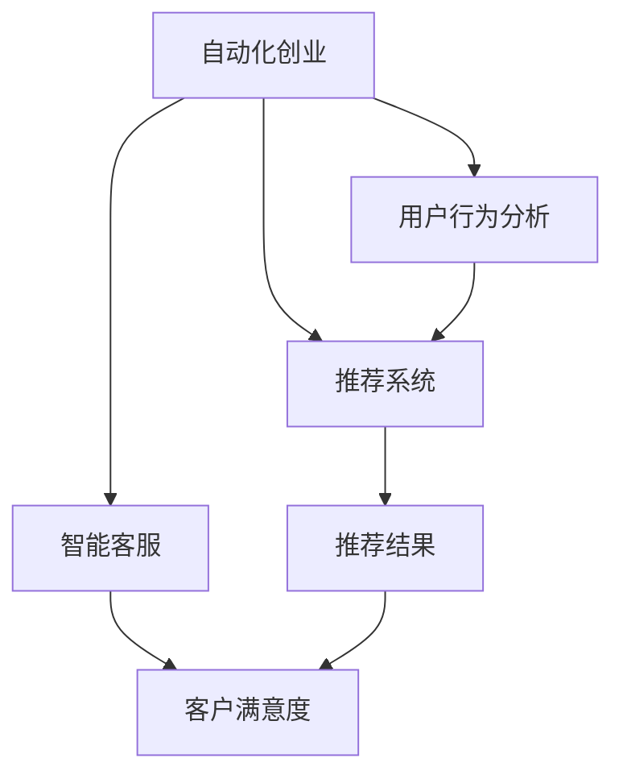

                 

# 如何在自动化创业中实现个性化服务

## 1. 背景介绍

### 1.1 问题由来
在当今快速变化的商业环境中，自动化创业成为了一种高效、灵活、低成本的商业模式。随着人工智能技术的不断发展，自动化系统在决策、运营、客服等方面提供了诸多高效支持，成为创业公司抢占市场的重要利器。

然而，随着自动化系统规模的扩大，如何满足不同用户的个性化需求，成为创业公司面临的挑战。尽管自动化技术能提高效率和稳定性，但在面对用户复杂、多样的需求时，往往显得一筹莫展。个性化服务是实现自动化创业的关键，但个性化服务的实施通常伴随着高昂的成本和复杂的技术门槛。

### 1.2 问题核心关键点
本文聚焦于如何在自动化创业中实现个性化服务，通过人工智能技术，自动适应用户行为和偏好，提升用户体验，增加用户粘性。

### 1.3 问题研究意义
个性化服务是自动化创业的核心竞争力之一，通过深入理解用户需求，提供精准的个性化推荐、定制化内容、智能客服等，能够极大提升用户满意度和留存率，增强市场竞争力。个性化服务的实现有助于快速响应市场变化，提高运营效率，降低运营成本。

## 2. 核心概念与联系

### 2.1 核心概念概述

为更好地理解个性化服务在自动化创业中的应用，本节将介绍几个关键概念：

- **自动化创业(Autonomous Startup)**：使用自动化技术驱动的创业模式，以降低人力成本，提高运营效率，加速产品迭代。
- **个性化服务(Personalized Services)**：根据用户行为、偏好、历史数据等，提供定制化的服务内容，提升用户体验和满意度。
- **用户行为分析(User Behavior Analysis, UBA)**：通过数据分析技术，理解用户行为模式、需求偏好等，从而提供个性化推荐和服务。
- **推荐系统(Recommender System)**：利用机器学习等技术，自动为用户推荐合适的产品或内容。
- **智能客服(Intelligent Customer Service)**：利用自然语言处理和机器学习技术，提供自动化的客服支持，提升客户满意度。
- **用户体验(User Experience, UX)**：以用户为中心，优化产品功能和设计，提供更加友好、高效的服务体验。

这些概念之间的联系可以通过以下Mermaid流程图来展示：



这个流程图展示了个性化服务在自动化创业中的关键流程：

1. 通过自动化创业实现运营自动化。
2. 利用用户行为分析理解用户需求。
3. 通过推荐系统为每个用户推荐个性化内容。
4. 智能客服提供自动化支持，提升用户满意度。
5. 通过不断优化用户体验，提升用户粘性和留存率。

## 3. 核心算法原理 & 具体操作步骤
### 3.1 算法原理概述

在自动化创业中实现个性化服务，关键在于构建一个用户画像，利用用户行为数据进行分析，并通过算法推荐系统为每个用户提供定制化的服务内容。其中，推荐系统是核心算法，其原理是通过分析用户历史行为，预测用户兴趣，并推荐相关内容。

推荐系统的一般流程包括：

1. **数据收集**：收集用户行为数据，如浏览历史、购买记录、搜索查询等。
2. **用户画像构建**：利用机器学习算法，建立每个用户的兴趣模型，形成用户画像。
3. **推荐算法应用**：根据用户画像，应用推荐算法生成推荐结果。
4. **结果反馈**：收集用户对推荐结果的反馈，进一步优化算法。

### 3.2 算法步骤详解

以下详细介绍推荐系统的主要步骤：

**Step 1: 数据收集**
收集用户行为数据，包括但不限于：
- 浏览历史：用户访问网页、文章、视频等记录。
- 购买记录：用户的购买商品、服务记录。
- 搜索查询：用户的搜索关键词、搜索次数、搜索结果。

**Step 2: 用户画像构建**
利用机器学习算法，建立每个用户的兴趣模型，主要步骤包括：
- 数据预处理：清洗、归一化、特征选择等。
- 模型训练：选择合适算法，如协同过滤、深度学习、内容推荐等，训练用户画像。
- 画像生成：将用户画像表示为向量形式，方便后续计算和匹配。

**Step 3: 推荐算法应用**
根据用户画像，应用推荐算法生成推荐结果，主要步骤包括：
- 相似度计算：计算用户画像之间的相似度，找到与目标用户兴趣相似的其他用户。
- 推荐结果生成：根据相似用户的历史行为，生成推荐结果。
- 结果过滤：结合用户偏好、多样性、新鲜度等策略，过滤并排序推荐结果。

**Step 4: 结果反馈**
收集用户对推荐结果的反馈，主要步骤包括：
- 反馈收集：收集用户对推荐结果的点击、浏览、购买等行为数据。
- 模型更新：根据反馈数据，更新推荐模型，提升推荐效果。
- 用户满意度：评估用户对推荐结果的满意度，反馈到系统改进中。

### 3.3 算法优缺点

推荐系统在个性化服务中应用广泛，但也存在一些局限性：

**优点**：
1. **高效性**：自动化处理用户数据，快速生成推荐结果。
2. **精准性**：根据用户历史行为预测兴趣，推荐更符合用户期望的内容。
3. **个性化**：提供量身定制的服务内容，提升用户体验。
4. **灵活性**：可以适应多种推荐场景，如商品推荐、内容推荐、搜索推荐等。

**缺点**：
1. **数据依赖**：推荐效果依赖于数据的全面性和准确性，数据质量影响推荐效果。
2. **冷启动问题**：新用户或物品缺少足够的历史数据，难以进行有效推荐。
3. **隐私风险**：用户行为数据敏感，需要严格的隐私保护措施。
4. **多样性**：过度依赖历史数据，可能导致推荐结果缺乏多样性。
5. **推荐公平性**：可能会存在推荐偏差，影响用户满意度。

### 3.4 算法应用领域

推荐系统广泛应用于多种领域，包括但不限于：

- **电商推荐**：如淘宝、京东等电商平台，根据用户购买行为推荐商品。
- **内容推荐**：如Netflix、YouTube等视频平台，根据用户观看历史推荐视频。
- **新闻推荐**：如今日头条、知乎等新闻平台，根据用户阅读行为推荐文章。
- **社交推荐**：如微信、Facebook等社交平台，根据用户关系网络推荐好友和内容。
- **搜索推荐**：如Google、Bing等搜索引擎，根据用户搜索记录推荐相关结果。

这些应用场景展示了推荐系统在不同领域中的广泛应用，极大提升了用户的体验和满意度。

## 4. 数学模型和公式 & 详细讲解 & 举例说明

### 4.1 数学模型构建

推荐系统通常使用协同过滤、深度学习等算法，构建用户画像和推荐结果。下面以协同过滤为例，介绍推荐系统的数学模型构建。

协同过滤分为基于用户的协同过滤和基于物品的协同过滤两种方法。这里以基于用户的协同过滤为例，构建推荐系统的数学模型。

假设用户集为 $U=\{u_1,u_2,...,u_m\}$，物品集为 $I=\{i_1,i_2,...,i_n\}$，每个用户 $u_i$ 对物品 $i_j$ 的评分 $r_{i_j} \in [1,5]$。构建用户 $u_i$ 的兴趣向量 $p_i$，物品 $i_j$ 的特征向量 $q_j$，则推荐模型可以表示为：

$$
\hat{r}_{i_j} = \sum_{k=1}^K p_{i,k}q_{j,k}
$$

其中 $K$ 为向量的维度，$p_{i,k}$ 和 $q_{j,k}$ 为用户和物品的特征值，$\hat{r}_{i_j}$ 为预测评分。

### 4.2 公式推导过程

基于用户的协同过滤推荐模型，可以通过矩阵分解的方式求解用户画像 $p_i$ 和物品画像 $q_j$。设用户-物品评分矩阵为 $R$，则 $R$ 可以表示为：

$$
R = P\times Q^T
$$

其中 $P=[p_1;p_2;...;p_m]$，$Q=[q_1;q_2;...;q_n]$。通过矩阵分解，可以求出用户画像 $p_i$ 和物品画像 $q_j$。

具体的求解过程如下：

1. 求解矩阵 $R$ 的奇异值分解：$R=U\Sigma V^T$。
2. 根据 $\Sigma$ 求出 $P$ 和 $Q$：$P=U\Sigma$，$Q=V\Sigma^{-1}$。
3. 利用 $P$ 和 $Q$ 生成推荐结果：$\hat{r}_{i_j} = \sum_{k=1}^K p_{i,k}q_{j,k}$。

### 4.3 案例分析与讲解

以电商推荐为例，假设用户 $u_i$ 对物品 $i_1,i_2,i_3$ 分别评分 $4,3,2$，用户 $u_j$ 对物品 $i_1,i_2,i_3$ 分别评分 $3,2,1$，则协同过滤模型可以生成如下预测评分：

1. 用户画像 $p_i$：假设 $K=2$，则 $p_i=[0.6,0.4]$。
2. 物品画像 $q_j$：假设 $K=2$，则 $q_j=[0.4,0.6]$。
3. 预测评分：$\hat{r}_{i_1}=0.6\times0.4+0.4\times0.6=0.8$，$\hat{r}_{i_2}=0.6\times0.4+0.4\times0.2=0.4$，$\hat{r}_{i_3}=0.6\times0.2+0.4\times0.6=0.4$。

因此，推荐系统可以推荐物品 $i_1$ 给用户 $u_i$。

## 5. 项目实践：代码实例和详细解释说明

### 5.1 开发环境搭建

在项目实践前，需要准备好开发环境。以下是使用Python进行Scikit-learn开发的环境配置流程：

1. 安装Anaconda：从官网下载并安装Anaconda，用于创建独立的Python环境。

2. 创建并激活虚拟环境：
```bash
conda create -n recommender-env python=3.8 
conda activate recommender-env
```

3. 安装Scikit-learn：从官网获取并安装Scikit-learn库。
```bash
conda install scikit-learn
```

4. 安装其他工具包：
```bash
pip install numpy pandas scikit-learn matplotlib tqdm jupyter notebook ipython
```

完成上述步骤后，即可在`recommender-env`环境中开始项目实践。

### 5.2 源代码详细实现

我们以电商推荐为例，给出使用Scikit-learn库进行协同过滤算法的Python代码实现。

```python
from sklearn.decomposition import TruncatedSVD
from sklearn.metrics.pairwise import cosine_similarity
import pandas as pd
import numpy as np

# 加载用户行为数据
data = pd.read_csv('user_based_ratings.csv')

# 构建用户画像矩阵
P = TruncatedSVD(n_components=10).fit_transform(data.pivot_table(values='rating', index='user', columns='item'))

# 构建物品画像矩阵
Q = TruncatedSVD(n_components=10).fit_transform(data.pivot_table(values='rating', index='item', columns='user'))

# 计算用户画像相似度
similarity_matrix = cosine_similarity(P)

# 预测推荐结果
def predict(user_id):
    user_vector = P[user_id]
    similarity_scores = np.dot(similarity_matrix[user_id, :], Q.T)
    return np.argmax(similarity_scores)

# 测试推荐结果
user_id = 1
print('推荐结果：', predict(user_id))
```

以上代码实现了基于用户画像的协同过滤算法，通过计算用户画像的相似度，预测推荐结果。

### 5.3 代码解读与分析

让我们再详细解读一下关键代码的实现细节：

**TruncatedSVD类**：
- 使用Scikit-learn的TruncatedSVD类进行奇异值分解，得到用户画像矩阵 $P$ 和物品画像矩阵 $Q$。

**cosine_similarity函数**：
- 使用Scikit-learn的cosine_similarity函数计算用户画像之间的相似度，得到相似度矩阵。

**predict函数**：
- 根据用户画像向量和相似度矩阵，计算推荐结果。
- 预测结果为与目标用户最相似的物品的索引。

**测试推荐结果**：
- 假设目标用户为1，通过调用predict函数，获取推荐结果。

可以看到，使用Scikit-learn实现协同过滤算法非常简洁高效，开发者可以方便地调用各种成熟的工具库，快速实现推荐系统。

当然，实际项目中还需要考虑更多因素，如数据预处理、模型训练、效果评估等。但核心的推荐范式基本与此类似。

## 6. 实际应用场景
### 6.1 电商平台推荐

电商平台通过协同过滤推荐系统，为用户推荐感兴趣的商品，极大地提升了用户购物体验。当用户访问电商平台时，系统会记录用户浏览、点击、购买等行为数据，并利用协同过滤算法生成推荐列表。用户可以根据推荐结果，快速找到感兴趣的商品，提高购买转化率。

### 6.2 视频平台推荐

视频平台如Netflix，通过协同过滤推荐系统，为用户推荐感兴趣的视频内容，提升用户观看体验。用户观看视频时，系统会记录观看历史、评分、收藏等行为数据，并利用协同过滤算法生成推荐列表。用户可以根据推荐结果，发现新的感兴趣的视频内容，提高观看时长。

### 6.3 新闻平台推荐

新闻平台如今日头条，通过协同过滤推荐系统，为用户推荐感兴趣的新闻文章，提升阅读体验。用户阅读新闻时，系统会记录阅读行为数据，并利用协同过滤算法生成推荐列表。用户可以根据推荐结果，发现新的感兴趣的新闻文章，提高阅读时长和粘性。

### 6.4 社交平台推荐

社交平台如Facebook，通过协同过滤推荐系统，为用户推荐感兴趣的朋友和内容，提升社交体验。用户浏览朋友圈时，系统会记录好友动态、点赞、评论等行为数据，并利用协同过滤算法生成推荐列表。用户可以根据推荐结果，发现新的感兴趣的朋友和内容，提高平台粘性和留存率。

## 7. 工具和资源推荐
### 7.1 学习资源推荐

为了帮助开发者系统掌握推荐系统的理论基础和实践技巧，这里推荐一些优质的学习资源：

1. **《推荐系统实践》**：李航所著，系统介绍了推荐系统的理论基础、常用算法和实际应用。
2. **《深度学习与推荐系统》**：彭晓云所著，全面介绍了深度学习在推荐系统中的应用。
3. **Coursera《Recommender Systems》课程**：斯坦福大学开设的推荐系统课程，涵盖推荐系统理论、算法和应用。
4. **Kaggle推荐系统竞赛**：参与Kaggle推荐系统竞赛，通过实际项目积累经验，提升实战能力。
5. **Recommender Systems on Amazon SageMaker**：Amazon提供的推荐系统教程，介绍SageMaker上推荐系统的部署和优化。

通过对这些资源的学习实践，相信你一定能够快速掌握推荐系统的精髓，并用于解决实际的推荐问题。

### 7.2 开发工具推荐

高效的开发离不开优秀的工具支持。以下是几款用于推荐系统开发的常用工具：

1. **Scikit-learn**：基于Python的开源机器学习库，提供协同过滤、深度学习等推荐算法。
2. **TensorFlow**：由Google主导开发的开源深度学习框架，支持大规模推荐系统的部署和优化。
3. **PyTorch**：基于Python的开源深度学习框架，支持推荐系统的自定义模型开发。
4. **ELK Stack**：用于推荐系统数据存储、处理和分析的日志收集工具，支持推荐系统实时监控和分析。
5. **Hadoop/Spark**：大数据平台，支持推荐系统的海量数据存储和处理，提升推荐系统性能。

合理利用这些工具，可以显著提升推荐系统的开发效率，加快创新迭代的步伐。

### 7.3 相关论文推荐

推荐系统的发展得益于学界的持续研究。以下是几篇奠基性的相关论文，推荐阅读：

1. **“The BellKor Recommendation Challenge 2008”**：Sergey Feldman等，提出协同过滤算法，成为推荐系统研究的基础。
2. **“Filmustering: Using Clustering for Large-Scale Recommender Systems”**：Daniel Lemire等，提出基于聚类的方法，提升推荐系统的准确性和泛化能力。
3. **“Adaptive Probabilistic Matrix Factorization”**：Christian Borgstrom等，提出基于概率模型的推荐算法，提升推荐系统的效果。
4. **“Deep Collaborative Filtering”**：Shi et al.，提出深度学习在推荐系统中的应用，提升推荐系统的精度和泛化能力。
5. **“Learning from Clicks: AI-Based Recommendation Systems”**：Liang et al.，提出基于点击流的推荐算法，提升推荐系统的实时性。

这些论文代表了大规模推荐系统的发展脉络，展示了推荐系统从协同过滤到深度学习的演变过程，值得深入学习和借鉴。

## 8. 总结：未来发展趋势与挑战
### 8.1 总结

本文对基于协同过滤的个性化推荐系统进行了全面系统的介绍。首先阐述了推荐系统在自动化创业中的重要性，明确了个性化推荐对提升用户满意度和运营效率的独特价值。其次，从原理到实践，详细讲解了推荐系统的数学原理和关键步骤，给出了推荐任务开发的完整代码实例。同时，本文还广泛探讨了推荐系统在电商平台、视频平台、新闻平台、社交平台等多个行业领域的应用前景，展示了推荐系统的广阔应用空间。

通过本文的系统梳理，可以看到，推荐系统通过自动化分析用户行为，实现个性化服务，极大地提升了用户满意度和运营效率。推荐系统是自动化创业的核心竞争力之一，其应用场景和实施方法值得深入研究和广泛推广。

### 8.2 未来发展趋势

展望未来，推荐系统将在多个领域持续演进和优化，展现其强大的应用潜力：

1. **深度学习技术的应用**：利用深度学习模型，提升推荐系统的精度和泛化能力，推动推荐系统向更加智能化的方向发展。
2. **联邦学习的应用**：引入联邦学习技术，保护用户隐私的同时，提升推荐系统的效果。
3. **多模态数据的融合**：结合文本、图像、视频等多模态数据，提升推荐系统的综合能力，提供更加全面的推荐服务。
4. **推荐系统的个性化**：利用用户画像、上下文信息等，提供更加个性化的推荐服务，满足用户多样化的需求。
5. **推荐系统的实时性**：通过流式处理和实时计算技术，提升推荐系统的响应速度，提供实时的推荐服务。
6. **推荐系统的多样性**：利用多样性优化算法，提升推荐结果的多样性，避免过度依赖历史数据。

以上趋势凸显了推荐系统在自动化创业中的重要价值。这些方向的探索发展，必将进一步提升推荐系统的精度和用户体验，增强自动化创业的竞争力。

### 8.3 面临的挑战

尽管推荐系统在自动化创业中已取得重要进展，但仍面临一些挑战：

1. **数据隐私问题**：用户行为数据敏感，需要严格的隐私保护措施，防止数据泄露和滥用。
2. **冷启动问题**：新用户或物品缺少足够的历史数据，难以进行有效推荐。
3. **推荐公平性**：推荐算法可能存在偏见，影响用户满意度，需确保推荐结果的公平性和公正性。
4. **推荐多样性**：过度依赖历史数据，可能导致推荐结果缺乏多样性，需结合多样性优化算法。
5. **推荐系统鲁棒性**：推荐系统可能对异常数据和噪声敏感，需提升系统的鲁棒性和稳定性。

### 8.4 研究展望

为了克服这些挑战，未来的推荐系统研究需要在以下几个方面寻求新的突破：

1. **隐私保护技术**：采用差分隐私、联邦学习等技术，保护用户隐私，提升数据安全。
2. **用户画像构建**：利用深度学习等技术，提升用户画像的准确性和全面性，改善推荐效果。
3. **推荐算法优化**：引入强化学习、元学习等算法，提升推荐算法的公平性和多样性。
4. **多模态数据融合**：结合文本、图像、视频等多模态数据，提升推荐系统的综合能力。
5. **实时处理技术**：采用流式处理和实时计算技术，提升推荐系统的响应速度和实时性。
6. **推荐系统鲁棒性**：引入鲁棒性优化算法，提升推荐系统的鲁棒性和稳定性。

这些研究方向的探索，必将推动推荐系统向更加智能化、个性化、安全化的方向发展，为自动化创业带来新的突破。

## 9. 附录：常见问题与解答

**Q1：推荐系统是否适用于所有行业？**

A: 推荐系统适用于大多数行业，特别是数据驱动、用户驱动的行业。如电商、视频、新闻、社交等平台，都可以利用推荐系统提升用户满意度和运营效率。但对于一些数据质量较差或用户行为简单的行业，推荐系统的效果可能有限。

**Q2：推荐系统如何处理冷启动问题？**

A: 冷启动问题通常通过以下方法解决：
1. 利用人口统计特征，如年龄、性别、职业等，进行基础推荐。
2. 利用基于物品的协同过滤算法，利用热门物品推荐给新用户。
3. 引入多臂赌博机算法，通过A/B测试，不断优化推荐策略。
4. 利用深度学习等技术，通过少量历史数据训练模型，进行初步推荐。

**Q3：推荐系统如何平衡推荐多样性和精度？**

A: 推荐系统通常使用多样性优化算法，如Boosting、Top-k Sampling等，平衡推荐多样性和精度。同时通过调整超参数，如多样性因子、采样比例等，优化推荐结果。

**Q4：推荐系统在实际应用中如何处理实时性问题？**

A: 推荐系统通常采用流式处理和实时计算技术，如Apache Kafka、Apache Flink等，处理实时数据，提升推荐系统的响应速度。

**Q5：推荐系统如何保护用户隐私？**

A: 推荐系统通常采用差分隐私、联邦学习等技术，保护用户隐私。差分隐私通过添加噪声，保护用户数据隐私；联邦学习通过分布式训练，保护用户数据不离开本地设备。

---

作者：禅与计算机程序设计艺术 / Zen and the Art of Computer Programming

