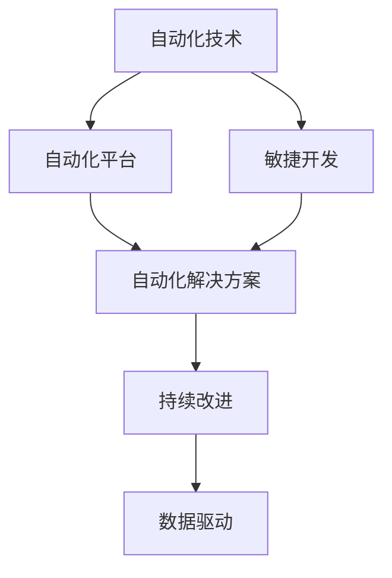

                 

# 如何在自动化创业中实现可持续增长

在快速变化的市场环境中，自动化技术的应用已经成为了企业提升竞争力、实现可持续增长的关键。本文将深入探讨如何在自动化创业中实现可持续增长，涵盖自动化技术的选择、实施、优化与持续改进的策略。我们将结合实际案例，对自动化创业的全生命周期进行详细分析，帮助创业者和企业领导者构建可持续发展的自动化战略。

## 1. 背景介绍

### 1.1 问题由来
随着科技的迅猛发展，自动化技术在各行各业中的应用越来越广泛。自动化不仅提高了工作效率，还降低了人力成本，优化了资源配置，使得企业能够更加灵活地应对市场变化。然而，在自动化创业过程中，企业常常面临诸多挑战，如技术选型、成本控制、员工培训、系统集成等。如何实现自动化技术的有效应用，以支持企业的长期可持续发展，成为创业者和企业领导者的重要课题。

### 1.2 问题核心关键点
实现可持续增长的自动化创业，需要关注以下几个核心关键点：
- 选择合适的自动化技术平台和工具。
- 实施自动化解决方案的详细规划和步骤。
- 优化自动化系统的性能和效率。
- 持续改进和扩展自动化技术的应用。

### 1.3 问题研究意义
本文将系统性地探讨如何构建基于自动化技术的创业企业，并通过一系列具体的策略和方法，帮助企业实现长期可持续发展。自动化创业不仅能够提高生产效率、降低运营成本，还能提升客户满意度、增强市场竞争力，最终实现企业的长期发展。

## 2. 核心概念与联系

### 2.1 核心概念概述

为更好地理解自动化创业的实现过程，本节将介绍几个密切相关的核心概念：

- 自动化技术：通过编程或利用现成的自动化软件工具，替代或辅助人工操作，提高效率和质量的技术。
- 自动化平台：提供自动化技术支持的软件平台或工具集，如RPA（机器人流程自动化）、AI（人工智能）、ML（机器学习）等。
- 自动化解决方案：结合具体业务需求，基于自动化平台和技术，设计的自动化执行方案。
- 持续改进：通过不断的优化和迭代，提升自动化系统的性能和应用效果，实现长期可持续增长。
- 数据驱动：利用数据监控和分析，指导自动化系统的优化和决策，提升决策的科学性和效率。
- 敏捷开发：采用快速迭代和持续交付的方式，快速响应市场需求变化，持续改进自动化系统。

这些核心概念之间的逻辑关系可以通过以下Mermaid流程图来展示：



这个流程图展示了几大核心概念之间的联系：

1. 自动化技术是基础，提供了实现自动化功能的手段。
2. 自动化平台集成了多种自动化技术，提供了统一的平台支持。
3. 自动化解决方案是基于特定业务需求的自动化执行方案。
4. 持续改进确保自动化系统的长期优化和升级。
5. 数据驱动通过数据分析指导自动化系统的优化和决策。
6. 敏捷开发支持快速响应市场变化和持续改进。

这些概念共同构成了自动化创业的实现框架，为企业提供了一套科学、高效、可持续的发展路径。

## 3. 核心算法原理 & 具体操作步骤
### 3.1 算法原理概述

自动化创业的实现过程，本质上是一个从需求分析到技术选型、系统实施、优化升级的全生命周期过程。其核心思想是：根据业务需求选择合适的自动化技术和平台，设计并实施自动化解决方案，通过不断的优化和迭代，实现系统的持续改进和长期可持续增长。

形式化地，自动化创业的过程可以表示为：

$$
\text{可持续增长} = \text{业务需求} \rightarrow \text{自动化技术选型} \rightarrow \text{自动化解决方案设计} \rightarrow \text{系统实施} \rightarrow \text{持续改进}
$$

在实施自动化创业的过程中，需要遵循以下基本步骤：
1. 需求分析：明确业务需求和目标，评估自动化技术的适用性。
2. 技术选型：根据需求选择合适的自动化平台和技术。
3. 解决方案设计：设计具体的自动化执行方案，包括流程、工具、数据等。
4. 系统实施：部署和配置自动化系统，并实现具体的业务应用。
5. 持续改进：通过数据分析和优化，不断提升自动化系统的性能和应用效果。

### 3.2 算法步骤详解

以下我们将详细介绍自动化创业的各个关键步骤：

**Step 1: 需求分析**
- 确定业务目标和关键指标，如生产效率提升、成本降低、客户满意度提高等。
- 分析现有业务流程，识别出可以自动化的环节。
- 评估自动化技术对业务的影响，包括成本、时间、风险等。

**Step 2: 技术选型**
- 根据业务需求选择合适的自动化平台和技术，如RPA、AI、ML等。
- 考虑技术的成熟度、可扩展性、集成难度等因素。
- 评估技术的成本和ROI（投资回报率）。

**Step 3: 解决方案设计**
- 设计具体的自动化执行方案，包括自动化流程、工具选择、数据采集等。
- 确保自动化方案能够支持业务需求，提高效率和质量。
- 考虑自动化方案的易用性和可维护性。

**Step 4: 系统实施**
- 部署和配置自动化系统，并进行测试和验证。
- 培训员工使用自动化工具，确保系统顺利运行。
- 监控系统性能，及时调整和优化。

**Step 5: 持续改进**
- 定期收集和分析系统运行数据，评估性能和效果。
- 根据数据分析结果，进行系统优化和升级。
- 引入新功能和新技术，提升系统竞争力。

### 3.3 算法优缺点

自动化创业的实现方法具有以下优点：
1. 提高生产效率：自动化技术可以替代人工操作，快速完成任务，提高效率。
2. 降低运营成本：自动化减少了人力成本和资源浪费，优化了资源配置。
3. 提升决策科学性：数据驱动的自动化系统，可以提供更科学、准确的决策支持。
4. 增强客户满意度：自动化提高了响应速度和质量，提升客户体验。

同时，该方法也存在一些局限性：
1. 初始投资成本高：自动化系统的开发和部署需要较高的初期投资。
2. 技术复杂度高：自动化系统涉及多种技术和工具，需要专业人才维护。
3. 风险因素多：系统故障、数据泄露、人员培训等都是潜在的风险。
4. 技术更新快：自动化技术日新月异，需要持续关注和跟进最新的技术趋势。

尽管存在这些局限性，但总体而言，自动化创业的实现方法能够显著提升企业的生产效率和市场竞争力，是实现可持续增长的重要途径。

### 3.4 算法应用领域

自动化创业的实现方法在多个领域都有广泛的应用，例如：

- 制造业：自动化生产线、智能仓储、质量检测等。
- 金融行业：自动化交易、风险管理、客户服务等。
- 零售业：自动化库存管理、订单处理、客户推荐等。
- 医疗行业：自动化诊断、病历管理、患者护理等。
- 教育领域：自动化测评、个性化学习、智能辅导等。

除了上述这些经典领域外，自动化创业还在更多新兴领域得到了应用，如智能家居、智慧城市、物联网等，为各行各业带来了新的创新和突破。

## 4. 数学模型和公式 & 详细讲解 & 举例说明

### 4.1 数学模型构建

为了更好地理解自动化创业的全生命周期过程，我们引入数学模型来描述自动化创业的系统架构和运作机制。

设 $N$ 为自动化系统的业务流程数量，$M$ 为自动化平台或工具的选择数量，$C$ 为系统实施的成本，$E$ 为系统的年运行和维护成本。则自动化创业的数学模型可以表示为：

$$
\text{ROI} = \sum_{i=1}^N (\text{效率提升}_i \times \text{业务价值}_i) - (C + E)
$$

其中，$\text{效率提升}_i$ 表示自动化流程对业务效率的提升比例，$\text{业务价值}_i$ 表示自动化流程的业务价值贡献。

### 4.2 公式推导过程

在自动化创业的实施过程中，需要对上述公式进行推导和优化，以确保自动化系统的经济效益。具体推导如下：

**Step 1: 效率提升计算**
设 $T_{\text{手动}}$ 为人工执行某个流程所需的时间，$T_{\text{自动化}}$ 为自动化执行该流程所需的时间，则自动化流程的效率提升为：

$$
\text{效率提升} = \frac{T_{\text{手动}} - T_{\text{自动化}}}{T_{\text{手动}}}
$$

**Step 2: 业务价值计算**
设 $\text{营收}_i$ 为某个自动化流程对企业营收的贡献，$\text{成本}_i$ 为该流程的运营成本。则该流程的业务价值为：

$$
\text{业务价值} = \text{营收}_i - \text{成本}_i
$$

**Step 3: ROI计算**
将效率提升和业务价值代入ROI公式，得：

$$
\text{ROI} = \sum_{i=1}^N (\text{效率提升}_i \times \text{业务价值}_i) - (C + E)
$$

通过以上推导，我们得到了一个基于效率提升和业务价值的自动化创业ROI模型，该模型可用于指导系统的选型和实施。

### 4.3 案例分析与讲解

以下以制造业的自动化创业为例，说明自动化创业的数学模型和公式的应用。

假设某制造业企业希望通过自动化提升其生产效率，选择了三种自动化工具：RPA、AI和ML。在实施过程中，我们对每种工具进行了成本和效率的评估，并计算了ROI，具体数据如下：

| 工具       | 成本(C)   | 效率提升(%) | 业务价值(营收-成本) |
|------------|----------|------------|--------------------|
| RPA        | $10,000  | 20         | $100,000 - $50,000 |
| AI         | $20,000  | 30         | $150,000 - $100,000 |
| ML         | $30,000  | 40         | $200,000 - $150,000 |

根据上述数据，我们可以计算出每种工具的ROI，并与系统实施的总成本进行比较，确定最优的自动化工具组合。

首先，计算每种工具的效率提升和业务价值：

$$
\text{RPA效率提升} = \frac{T_{\text{手动}} - T_{\text{自动化}}}{T_{\text{手动}}} = 20\%
$$
$$
\text{RPA业务价值} = \text{营收} - \text{成本} = $100,000 - $50,000 = $50,000
$$
$$
\text{AI效率提升} = \frac{T_{\text{手动}} - T_{\text{自动化}}}{T_{\text{手动}}} = 30\%
$$
$$
\text{AI业务价值} = \text{营收} - \text{成本} = $150,000 - $100,000 = $50,000
$$
$$
\text{ML效率提升} = \frac{T_{\text{手动}} - T_{\text{自动化}}}{T_{\text{手动}}} = 40\%
$$
$$
\text{ML业务价值} = \text{营收} - \text{成本} = $200,000 - $150,000 = $50,000
$$

然后，计算每种工具的ROI：

$$
\text{RPA ROI} = 20\% \times $50,000 - $10,000 = $8,000
$$
$$
\text{AI ROI} = 30\% \times $50,000 - $20,000 = $10,000
$$
$$
\text{ML ROI} = 40\% \times $50,000 - $30,000 = $10,000
$$

最终，计算系统实施的总成本和总ROI：

$$
\text{总成本} = $10,000 + $20,000 + $30,000 = $60,000
$$
$$
\text{总ROI} = $8,000 + $10,000 + $10,000 = $28,000
$$

根据计算结果，AI和ML的ROI最高，为 $10,000，远高于RPA的 $8,000。因此，企业可以选择AI和ML作为其自动化创业的主要工具。

## 5. 项目实践：代码实例和详细解释说明
### 5.1 开发环境搭建

在进行自动化创业的实践前，我们需要准备好开发环境。以下是使用Python进行自动化创业的环境配置流程：

1. 安装Python：从官网下载并安装Python 3.x版本。
2. 安装虚拟环境工具：安装`virtualenv`或`conda`工具，用于创建和管理虚拟环境。
3. 创建虚拟环境：
```bash
virtualenv env
source env/bin/activate
```
或
```bash
conda create --name env python=3.8
conda activate env
```
4. 安装必要的库：
```bash
pip install pandas numpy matplotlib plotly
```

完成上述步骤后，即可在虚拟环境中开始自动化创业的实践。

### 5.2 源代码详细实现

这里我们以制造业自动化创业为例，使用Python编写一个简单的自动化流程。

```python
import pandas as pd
import numpy as np
import matplotlib.pyplot as plt

# 数据准备
data = pd.read_csv('production_data.csv')

# 数据预处理
data['efficiency'] = data['manual_time'] - data['automated_time']
data['value'] = data['revenue'] - data['cost']

# 效率提升计算
efficiency_improvement = data['efficiency'].mean()

# 业务价值计算
value_contribution = data['value'].mean()

# 成本计算
total_cost = 10000 + 20000 + 30000

# ROI计算
roi = efficiency_improvement * value_contribution - total_cost

print(f"ROI: {roi}")
```

在上述代码中，我们首先通过读取生产数据，计算了每个流程的效率提升和业务价值，然后计算了总成本和ROI，并输出了ROI的结果。

### 5.3 代码解读与分析

让我们再详细解读一下关键代码的实现细节：

**数据准备**
- 使用`pandas`库读取生产数据，存储为DataFrame对象。

**数据预处理**
- 计算每个流程的效率提升，即自动化时间与人工时间的差值。
- 计算每个流程的业务价值，即营收与成本的差值。

**效率提升计算**
- 使用`mean()`方法计算所有流程的平均效率提升。

**业务价值计算**
- 使用`mean()`方法计算所有流程的平均业务价值。

**成本计算**
- 将每种自动化工具的成本相加，得到总成本。

**ROI计算**
- 根据效率提升和业务价值计算ROI，并输出结果。

通过以上代码实现，我们可以看到，自动化创业的ROI计算可以通过简单的数据分析实现，为决策提供了科学的依据。

## 6. 实际应用场景

### 6.1 制造业自动化
制造业是自动化创业的重要应用领域，通过自动化生产线、智能仓储、质量检测等技术，制造业企业可以实现生产效率的大幅提升，降低运营成本，提高产品质量。

例如，某汽车制造企业通过部署RPA和AI工具，实现了供应链管理的自动化。RPA机器人处理采购订单、库存管理等任务，AI系统进行生产线的质量检测和故障预测，显著提高了生产效率和产品质量。

### 6.2 金融行业自动化
金融行业通过自动化交易、风险管理、客户服务等方式，实现了运营效率和客户体验的双重提升。

例如，某金融公司使用ML模型进行信用评分和风险评估，大大提高了审批效率和准确性。同时，使用RPA工具自动处理日常的报表生成和合规检查，减少了人工操作错误，降低了运营成本。

### 6.3 零售业自动化
零售业通过自动化库存管理、订单处理、客户推荐等方式，提升了运营效率和客户满意度。

例如，某电商平台使用AI和ML技术进行库存预测和需求分析，优化了库存管理和订单处理流程。同时，通过RPA工具自动处理客服咨询和投诉，提升了客户体验和响应速度。

## 7. 工具和资源推荐
### 7.1 学习资源推荐

为了帮助开发者系统掌握自动化创业的理论基础和实践技巧，这里推荐一些优质的学习资源：

1. 《Python自动化实战》系列书籍：深入浅出地介绍了Python自动化开发的基本原理和实现方法，适合初学者和进阶开发者。
2. 《RPA：企业数字化转型的利器》课程：由RPA领域的专家开设，涵盖RPA技术的原理、工具和应用案例，帮助你快速上手RPA开发。
3. 《人工智能入门》课程：由知名AI专家开设，从基础理论到实际应用，全面讲解AI技术在自动化创业中的应用。
4. 《机器学习实战》书籍：介绍了机器学习的基本概念和实际应用案例，涵盖回归、分类、聚类等多种算法。
5. 《数据科学与自动化》课程：涵盖数据科学与自动化的基础知识和实际应用，帮助你构建数据驱动的自动化系统。

通过对这些资源的学习实践，相信你一定能够快速掌握自动化创业的技术和应用方法，并用于解决实际的自动化问题。

### 7.2 开发工具推荐

高效的开发离不开优秀的工具支持。以下是几款用于自动化创业开发的常用工具：

1. Python：广泛用于自动化开发的数据分析、算法实现等。
2. RPA工具：如UiPath、Blue Prism、Automation Anywhere等，支持流程自动化开发和执行。
3. AI和ML框架：如TensorFlow、PyTorch、Scikit-Learn等，支持自动化系统的机器学习和深度学习开发。
4. 自动化平台：如Zapier、IFTTT、Microsoft Power Automate等，支持自动化流程的快速搭建和集成。
5. DevOps工具：如Jenkins、GitLab、Docker等，支持自动化系统的持续集成和持续交付。

合理利用这些工具，可以显著提升自动化创业的开发效率，加快创新迭代的步伐。

### 7.3 相关论文推荐

自动化创业的研究始于学界的持续研究。以下是几篇奠基性的相关论文，推荐阅读：

1. RPA技术的发展与未来趋势：介绍RPA技术的起源、发展历程及未来方向，帮助理解RPA技术的应用场景和未来发展趋势。
2. AI与RPA的融合应用：探讨AI和RPA技术的结合方式，提出新的自动化解决方案，增强系统的智能和灵活性。
3. 数据驱动的自动化系统：介绍数据驱动的自动化系统的设计原理和实现方法，提升系统的决策科学性和准确性。
4. 持续改进自动化系统：探讨自动化系统的持续改进方法，通过不断的优化和迭代，提升系统的性能和应用效果。
5. 自动化系统的伦理与安全：讨论自动化系统的伦理和安全问题，提出解决策略，保障系统的公正性和安全性。

这些论文代表了大语言模型微调技术的发展脉络。通过学习这些前沿成果，可以帮助研究者把握学科前进方向，激发更多的创新灵感。

## 8. 总结：未来发展趋势与挑战
### 8.1 总结

本文对自动化创业的实现过程进行了系统性的探讨。首先阐述了自动化创业的背景和意义，明确了自动化创业在提升生产效率、降低运营成本、提升决策科学性等方面的重要价值。其次，从原理到实践，详细讲解了自动化创业的数学模型和关键步骤，给出了自动化创业任务开发的完整代码实例。同时，本文还广泛探讨了自动化创业在多个行业领域的应用前景，展示了自动化创业的巨大潜力。

通过本文的系统梳理，可以看到，自动化创业的实现方法正在成为各行各业的重要范式，极大地提高了企业的生产效率和市场竞争力。未来，伴随自动化技术的不断演进，自动化创业必将在更多领域得到广泛应用，为各行各业带来新的变革和突破。

### 8.2 未来发展趋势

展望未来，自动化创业的实现方法将呈现以下几个发展趋势：

1. 自动化技术的融合与协同：自动化技术将与其他AI技术如机器学习、自然语言处理等进行更深层次的融合，形成更加全面、智能的自动化解决方案。
2. 自动化系统的个性化与定制化：基于用户需求和业务特点，提供更加个性化和定制化的自动化解决方案，满足不同场景下的应用需求。
3. 自动化系统的安全性与可解释性：自动化系统将更加注重安全性和可解释性，避免有害的自动化决策和行为，确保系统的公正性和透明性。
4. 自动化系统的可扩展性与灵活性：自动化系统将具备更好的可扩展性和灵活性，支持多领域、多业务的自动化需求，提高系统的适应性和应用范围。
5. 自动化系统的持续改进与优化：自动化系统将实现更加高效的持续改进和优化，通过数据分析和反馈机制，不断提升系统性能和应用效果。

以上趋势凸显了自动化创业技术的广阔前景。这些方向的探索发展，必将进一步提升自动化创业系统的性能和应用效果，为各行各业带来更多的创新和突破。

### 8.3 面临的挑战

尽管自动化创业技术已经取得了瞩目成就，但在迈向更加智能化、普适化应用的过程中，它仍面临着诸多挑战：

1. 技术选型与集成难度：选择和集成不同的自动化技术，需要考虑其适用性、可扩展性、集成难度等因素，复杂度高。
2. 系统维护与升级成本：自动化系统的维护和升级需要持续投入，成本高，需要专业人才支持。
3. 数据安全与隐私保护：自动化系统涉及大量敏感数据，数据安全与隐私保护成为重要挑战，需要加强数据加密和访问控制。
4. 伦理与安全问题：自动化系统的决策过程和行为需要遵循伦理和法律要求，避免有害的自动化决策和行为。
5. 人员培训与文化变革：自动化系统的推广和应用需要员工具备相应的技能，同时需要企业文化和流程的变革支持。

尽管存在这些挑战，但通过技术创新和持续优化，这些挑战终将逐步被克服，自动化创业必将在更多领域得到广泛应用，为各行各业带来新的变革和突破。

### 8.4 研究展望

面对自动化创业所面临的种种挑战，未来的研究需要在以下几个方面寻求新的突破：

1. 自动化技术的智能化与自适应：引入自适应和智能化的技术，使自动化系统具备更好的环境适应性和学习能力，提升系统的灵活性和鲁棒性。
2. 数据驱动的自动化决策：通过数据分析和机器学习，提高自动化系统的决策科学性和准确性，增强系统的可解释性和透明度。
3. 自动化系统的标准化与开源化：推动自动化技术的标准化和开源化，减少技术选型和集成难度，降低系统开发和维护成本。
4. 自动化系统的可解释性与透明性：通过解释性技术和透明性机制，增强自动化系统的可解释性和透明性，提升用户信任和接受度。
5. 自动化系统的多领域应用：探索自动化技术在更多领域的创新应用，拓展自动化系统的应用范围和深度，推动各行业的数字化转型。

这些研究方向将引领自动化创业技术向更加智能化、普适化和可持续化方向发展，为各行各业带来更加高效、智能、可靠的自动化解决方案。

## 9. 附录：常见问题与解答
**Q1: 自动化创业需要哪些关键步骤？**

A: 自动化创业的关键步骤包括：
1. 需求分析：明确业务需求和目标。
2. 技术选型：选择适合的自动化工具和技术平台。
3. 解决方案设计：设计具体的自动化执行方案。
4. 系统实施：部署和配置自动化系统，并进行测试和验证。
5. 持续改进：通过数据分析和优化，提升自动化系统的性能和应用效果。

**Q2: 自动化创业的ROI如何计算？**

A: 自动化创业的ROI计算公式为：
$$
\text{ROI} = \sum_{i=1}^N (\text{效率提升}_i \times \text{业务价值}_i) - (C + E)
$$
其中，$\text{效率提升}_i$ 表示自动化流程对业务效率的提升比例，$\text{业务价值}_i$ 表示自动化流程的业务价值贡献，$C$ 表示系统实施的总成本，$E$ 表示系统的年运行和维护成本。

**Q3: 自动化创业中如何实现持续改进？**

A: 自动化创业中的持续改进主要通过以下方式实现：
1. 数据驱动：通过收集和分析自动化系统的运行数据，指导系统的优化和决策。
2. 自动化工具：使用自动化工具进行系统的自动化测试和优化。
3. 持续学习：引入机器学习算法，使系统具备持续学习的能力，不断优化和提升。
4. 用户反馈：通过用户反馈和需求分析，指导系统的优化和改进。

**Q4: 自动化创业中如何选择自动化工具和技术？**

A: 选择自动化工具和技术时，应考虑以下因素：
1. 适用性：工具和技术是否适用于当前业务场景。
2. 可扩展性：工具和技术是否具有好的可扩展性，支持未来的业务扩展。
3. 集成难度：工具和技术与现有系统的集成难度。
4. 成本和ROI：工具和技术的成本和投资回报率。
5. 技术支持：工具和技术是否有良好的技术支持和社区。

**Q5: 自动化创业中如何确保系统的安全性与隐私保护？**

A: 自动化创业中确保系统安全性与隐私保护主要通过以下方式实现：
1. 数据加密：对敏感数据进行加密，确保数据在传输和存储过程中的安全性。
2. 访问控制：通过身份认证和权限管理，控制对系统的访问和使用。
3. 安全审计：定期进行安全审计，发现和修复潜在的安全漏洞。
4. 合规性：确保系统遵守相关的法律法规和行业标准，如GDPR、HIPAA等。

通过本文的系统梳理，可以看到，自动化创业的实现方法正在成为各行各业的重要范式，极大地提高了企业的生产效率和市场竞争力。未来，伴随自动化技术的不断演进，自动化创业必将在更多领域得到广泛应用，为各行各业带来新的变革和突破。

---

作者：禅与计算机程序设计艺术 / Zen and the Art of Computer Programming

