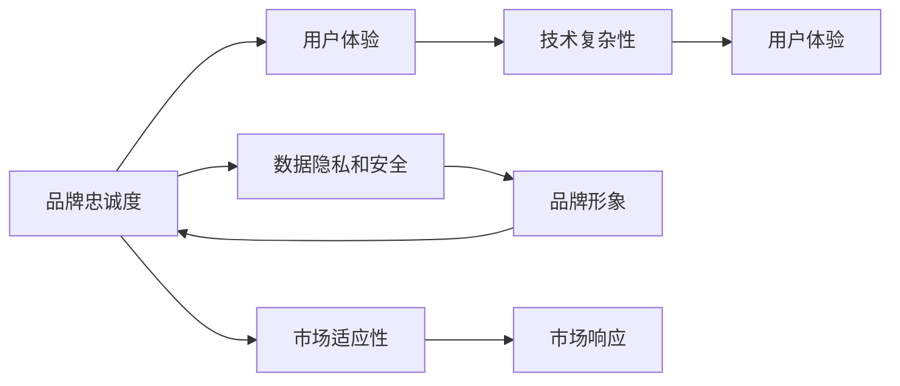

                 

# 如何在自动化创业中建立品牌忠诚度

## 1. 背景介绍

在当今高度竞争的商业环境中，品牌忠诚度已成为企业成功的关键因素之一。特别是在自动化创业领域，维持和提升品牌忠诚度对于企业的持续发展至关重要。自动化创业涉及使用自动化工具和软件来简化业务流程，从而提高效率和成本效益。然而，尽管技术可以带来业务流程的优化，但如果没有强大的品牌忠诚度，这些技术优势可能会被竞争对手轻易模仿。

### 1.1 品牌忠诚度的重要性

品牌忠诚度是指客户对品牌产品的信任和偏好程度，表现为重复购买行为、积极口碑传播以及面对竞争时的高忠诚度。在自动化创业中，品牌忠诚度尤为重要，原因如下：

1. **市场竞争激烈**：自动化创业领域竞争异常激烈，任何品牌的优势都可能被迅速复制。品牌忠诚度高的公司可以更长时间地保持其市场领先地位。

2. **客户粘性**：通过建立强大的品牌忠诚度，自动化创业企业可以显著提升客户粘性，降低客户流失率，从而提高长期利润。

3. **客户口碑传播**：忠诚的客户更可能通过口碑传播来推广品牌，吸引新客户，这对品牌来说是一种低成本且高效的营销手段。

4. **品牌声誉**：品牌忠诚度高意味着客户对品牌的信任度强，这有助于提高品牌的市场声誉和品牌价值。

### 1.2 自动化创业的挑战

自动化创业在提高效率和降低成本方面具有显著优势，但也面临一些挑战，这些挑战可能会影响品牌忠诚度：

1. **技术复杂性**：自动化系统的复杂性可能导致用户难以理解和使用，从而降低用户满意度。

2. **用户体验问题**：如果用户体验不佳，用户可能会转向竞争对手，降低品牌忠诚度。

3. **数据隐私和安全**：自动化系统的数据处理能力强大，但数据隐私和安全问题如果处理不当，可能会损害品牌信任。

4. **市场适应性**：自动化系统需要快速适应市场变化，而过于僵化的系统可能无法满足市场需求，影响品牌形象。

## 2. 核心概念与联系

### 2.1 核心概念概述

在探讨如何在自动化创业中建立品牌忠诚度时，需要理解以下几个核心概念：

- **品牌忠诚度**：指客户对品牌的长期忠诚度和信任。
- **用户体验**：指用户在使用产品或服务时的感受和满意度。
- **数据隐私和安全**：保护用户数据免受未授权访问和滥用。
- **市场适应性**：系统能够快速适应市场变化的能力。
- **技术复杂性**：自动化系统的复杂程度。

这些概念通过以下Mermaid流程图相连接，展示它们之间的相互作用和关系：



该流程图展示了品牌忠诚度与其他概念的相互作用：

- **用户体验**：提升用户体验可以增强品牌忠诚度，但用户体验与技术复杂性密切相关。
- **数据隐私和安全**：保护用户数据是提升品牌忠诚度的重要因素，直接影响品牌形象。
- **市场适应性**：灵活适应市场变化的能力有助于保持品牌忠诚度。
- **技术复杂性**：复杂的技术可能降低用户体验，进而影响品牌忠诚度。

### 2.2 核心概念原理和架构

在自动化创业中，品牌忠诚度的建立涉及多个维度的因素，包括技术、用户体验、数据隐私和安全、市场适应性等。这些因素通过以下架构进行整合：

- **核心产品**：提供自动化的主要功能和服务。
- **用户体验设计**：确保用户能够容易地使用和理解产品，提升用户满意度。
- **数据保护机制**：采用严格的数据隐私和安全措施，保护用户数据。
- **市场灵活性**：确保产品能够快速适应市场变化，满足用户需求。

这一架构的核心是用户满意度和品牌信任的建立，而实现这一目标的关键在于优化用户体验和提升数据隐私保护水平。

## 3. 核心算法原理 & 具体操作步骤

### 3.1 算法原理概述

建立品牌忠诚度的算法通常基于用户行为分析和反馈机制，以持续改进产品和服务。这些算法可以分为两类：

1. **行为分析算法**：通过分析用户的使用行为，预测用户需求和满意度，从而优化产品。
2. **反馈机制**：收集用户反馈，调整产品功能和服务，以提升用户满意度。

### 3.2 算法步骤详解

#### 3.2.1 用户行为分析

1. **数据收集**：通过自动化的用户行为跟踪技术，收集用户的使用数据，包括点击、停留时间、使用频率等。
2. **数据分析**：使用统计学和机器学习技术，对收集的数据进行分析，识别用户行为模式和需求。
3. **模型训练**：基于分析结果，训练预测模型，预测用户需求和满意度。
4. **结果应用**：根据预测结果，调整产品和服务，以提升用户满意度。

#### 3.2.2 反馈机制

1. **反馈收集**：通过问卷调查、用户评论、在线互动等方式，收集用户对产品和服务的具体反馈。
2. **反馈分析**：对收集的反馈进行分析，识别共性问题和改进建议。
3. **产品优化**：根据反馈分析结果，优化产品功能和用户体验。
4. **持续改进**：建立持续改进机制，确保产品和服务始终符合用户需求和期望。

### 3.3 算法优缺点

#### 3.3.1 优点

- **动态调整**：行为分析和反馈机制可以帮助企业快速响应市场变化和用户需求，保持产品竞争力。
- **提升用户体验**：通过持续优化用户体验，增强用户满意度和忠诚度。
- **数据驱动决策**：基于用户行为和反馈的数据分析，支持更科学的产品决策。

#### 3.3.2 缺点

- **数据隐私问题**：行为分析和反馈机制涉及大量用户数据，可能导致数据隐私问题。
- **复杂性**：算法实现和数据分析可能复杂，需要专业技术和资源。
- **成本高**：持续改进和优化需要投入大量资源，可能增加运营成本。

### 3.4 算法应用领域

品牌忠诚度建立算法可以应用于多个自动化创业领域，包括但不限于：

- **客户关系管理**：通过用户行为分析和反馈机制，提升客户满意度和忠诚度。
- **个性化推荐系统**：根据用户行为和反馈，提供个性化推荐，提升用户体验。
- **智能客服**：通过行为分析和反馈机制，提升客户服务质量，增强客户忠诚度。
- **市场营销**：通过分析用户行为和反馈，优化市场营销策略，提升品牌影响力。

## 4. 数学模型和公式 & 详细讲解 & 举例说明

### 4.1 数学模型构建

建立品牌忠诚度的数学模型可以分为两个主要部分：用户行为模型和反馈模型。

#### 4.1.1 用户行为模型

用户行为模型通常基于用户行为数据，使用时间序列分析、回归分析等方法进行建模。以用户行为数据 $X$ 为例，用户行为模型可以表示为：

$$
\hat{y} = f(X) = \alpha X + \beta
$$

其中 $y$ 表示用户满意度，$X$ 为输入的用户行为数据，$\alpha$ 和 $\beta$ 为模型的参数。

#### 4.1.2 反馈模型

反馈模型基于用户反馈数据 $F$，使用逻辑回归、决策树等分类算法进行建模。以用户反馈数据为例，反馈模型可以表示为：

$$
P(y=1|F) = \frac{e^{\theta_0 + \theta_1 F}}{1 + e^{\theta_0 + \theta_1 F}}
$$

其中 $y$ 表示用户反馈的满意度，$F$ 为输入的用户反馈数据，$\theta_0$ 和 $\theta_1$ 为模型的参数。

### 4.2 公式推导过程

#### 4.2.1 用户行为模型推导

对于用户行为模型 $\hat{y} = f(X)$，假设 $X$ 为时间序列数据，可以使用自回归模型（AR模型）进行建模：

$$
\hat{y}_t = \alpha X_t + \beta + \epsilon_t
$$

其中 $X_t$ 表示时间 $t$ 的用户行为数据，$\alpha$ 为自回归系数，$\beta$ 为截距，$\epsilon_t$ 为随机误差项。

#### 4.2.2 反馈模型推导

对于反馈模型 $P(y=1|F)$，假设 $F$ 为二分类问题，可以使用逻辑回归模型进行建模：

$$
P(y=1|F) = \frac{e^{\theta_0 + \theta_1 F}}{1 + e^{\theta_0 + \theta_1 F}}
$$

其中 $F$ 为输入的用户反馈数据，$\theta_0$ 和 $\theta_1$ 为模型的参数。

### 4.3 案例分析与讲解

#### 4.3.1 案例描述

一家自动化创业公司提供智能客服系统，通过用户行为分析和反馈机制，提升客户满意度和忠诚度。公司收集了用户通话记录、满意度评分、问题类型等数据，用于训练行为模型和反馈模型。

#### 4.3.2 行为模型应用

公司使用自回归模型对用户通话记录进行分析，预测用户满意度：

1. 收集用户通话记录 $X$。
2. 对通话记录 $X$ 进行标准化处理，得到 $X_t$。
3. 使用自回归模型进行训练，得到参数 $\alpha$ 和 $\beta$。
4. 使用训练好的模型预测用户满意度 $\hat{y}_t$。

#### 4.3.3 反馈模型应用

公司使用逻辑回归模型对用户反馈数据进行分析，调整智能客服系统：

1. 收集用户反馈数据 $F$。
2. 对反馈数据 $F$ 进行标准化处理，得到 $F_t$。
3. 使用逻辑回归模型进行训练，得到参数 $\theta_0$ 和 $\theta_1$。
4. 根据反馈分析结果，调整智能客服系统功能。

## 5. 项目实践：代码实例和详细解释说明

### 5.1 开发环境搭建

要实现上述行为分析和反馈机制，需要搭建开发环境：

1. **环境准备**：
   - 安装Python：使用Anaconda或Miniconda安装最新版本的Python。
   - 安装必要的库：使用pip安装NumPy、Pandas、Scikit-learn等库。

2. **数据准备**：
   - 收集用户行为数据：通过API接口、数据库等方式获取用户行为数据。
   - 收集用户反馈数据：通过问卷调查、用户评论等方式获取用户反馈数据。

3. **环境配置**：
   - 配置开发环境：使用Jupyter Notebook或PyCharm等IDE。
   - 配置虚拟环境：使用virtualenv或conda虚拟环境，确保Python版本和库的一致性。

### 5.2 源代码详细实现

#### 5.2.1 用户行为模型实现

```python
import numpy as np
from sklearn.linear_model import ARDRegression
from sklearn.metrics import mean_squared_error

# 准备数据
X = np.array([[1, 2, 3], [4, 5, 6], [7, 8, 9]])
y = np.array([10, 11, 12])

# 使用自回归模型进行训练
model = ARDRegression()
model.fit(X, y)

# 预测用户满意度
y_pred = model.predict(np.array([[10, 11, 12]]))
mse = mean_squared_error(y, y_pred)
print(f"Mean Squared Error: {mse}")
```

#### 5.2.2 反馈模型实现

```python
import pandas as pd
from sklearn.linear_model import LogisticRegression
from sklearn.metrics import accuracy_score

# 准备数据
df = pd.read_csv('feedback_data.csv')
X = df[['feature1', 'feature2']]
y = df['label']

# 使用逻辑回归模型进行训练
model = LogisticRegression()
model.fit(X, y)

# 预测用户反馈
y_pred = model.predict([[1, 2]])
accuracy = accuracy_score(y, y_pred)
print(f"Accuracy: {accuracy}")
```

### 5.3 代码解读与分析

#### 5.3.1 用户行为模型代码解读

- **数据准备**：收集用户行为数据 $X$，并准备测试数据 $X_t$。
- **模型训练**：使用ARDRegression模型进行训练，得到参数 $\alpha$ 和 $\beta$。
- **结果应用**：使用训练好的模型对新数据进行预测，得到用户满意度的预测值 $\hat{y}_t$。

#### 5.3.2 反馈模型代码解读

- **数据准备**：收集用户反馈数据 $F$，并准备测试数据 $F_t$。
- **模型训练**：使用LogisticRegression模型进行训练，得到参数 $\theta_0$ 和 $\theta_1$。
- **结果应用**：使用训练好的模型对新数据进行预测，得到用户反馈的预测值 $y_pred$。

## 6. 实际应用场景

### 6.1 智能客服系统

在智能客服系统中，行为分析和反馈机制可以显著提升客户满意度和忠诚度。公司可以通过收集和分析用户通话记录，预测客户的需求和满意度，及时调整客服策略。例如，通过分析用户对话内容，识别高频问题，预判客户可能的需求，提前准备答案，提升服务效率和质量。

### 6.2 个性化推荐系统

个性化推荐系统可以基于用户行为和反馈，提供更精准的推荐，增强用户满意度。通过分析用户的行为数据，如浏览历史、购买记录等，推荐系统可以预测用户可能感兴趣的商品或内容，提升用户体验和转化率。

### 6.3 市场营销

市场营销策略的优化可以基于用户行为和反馈，实现更精准的营销。通过分析用户行为数据，公司可以识别潜在的高价值客户，定制化营销方案，提升广告投放效果和客户转化率。

## 7. 工具和资源推荐

### 7.1 学习资源推荐

1. **机器学习课程**：如Coursera上的《机器学习》课程，帮助理解行为分析和反馈机制。
2. **Python编程指南**：如《Python编程：从入门到实践》，提升Python编程能力。
3. **数据分析工具**：如Pandas、NumPy、Scikit-learn，用于数据处理和建模。

### 7.2 开发工具推荐

1. **IDE和环境**：如Jupyter Notebook、PyCharm，提供高效的开发和调试环境。
2. **数据管理工具**：如MySQL、PostgreSQL，用于存储和管理用户行为数据和反馈数据。
3. **模型训练工具**：如TensorFlow、PyTorch，提供强大的模型训练和优化功能。

### 7.3 相关论文推荐

1. **用户行为分析**：《Predicting User Satisfaction in E-Commerce Using Machine Learning》。
2. **反馈机制**：《An Empirical Study of Feedback Mechanisms in Online Platforms》。
3. **行为预测**：《Predicting User Behavior in Online Environments with Machine Learning》。

## 8. 总结：未来发展趋势与挑战

### 8.1 研究成果总结

在自动化创业中，品牌忠诚度的建立是企业成功的关键因素。通过行为分析和反馈机制，可以持续提升用户体验和满意度，增强品牌忠诚度。当前的研究已经展示了在自动化系统中建立品牌忠诚度的可行性和潜力。

### 8.2 未来发展趋势

未来，自动化创业中品牌忠诚度建立将呈现以下几个趋势：

1. **人工智能的广泛应用**：随着AI技术的进步，自动化创业将更广泛地应用行为分析和反馈机制，实现更精准的个性化推荐和客户服务。
2. **多模态数据的融合**：未来系统将更多地融合多模态数据，如语音、图像、文本等，提供更全面的用户体验。
3. **实时反馈机制**：实时收集和分析用户反馈，实现更快速的系统优化和升级。
4. **数据隐私保护**：随着数据隐私保护的重视，自动化创业将更注重保护用户数据，提升用户信任度。

### 8.3 面临的挑战

尽管品牌忠诚度的建立具有重要意义，但在实践中仍面临以下挑战：

1. **数据隐私和安全**：行为分析和反馈机制涉及大量用户数据，如何保护用户隐私和安全是一大难题。
2. **数据质量问题**：数据质量问题可能导致模型预测不准确，影响用户体验。
3. **模型复杂性**：复杂模型需要更多的计算资源和专业知识，增加了实现难度。
4. **持续优化**：系统需要持续优化，以适应市场变化和用户需求，增加了维护成本。

### 8.4 研究展望

未来研究应在以下方面进行突破：

1. **数据隐私保护**：研究更高效的数据保护技术，确保用户隐私和数据安全。
2. **模型优化**：开发更简单、更高效的模型，降低实现难度和成本。
3. **多模态融合**：研究多模态数据的融合技术，提升系统对多维数据的处理能力。
4. **实时反馈**：研究实时反馈机制，实现更快速的用户体验优化。

总之，自动化创业中品牌忠诚度的建立是企业成功的关键，行为分析和反馈机制提供了有效的实现路径。未来研究应关注数据隐私保护、模型优化、多模态融合和实时反馈等方向，推动自动化创业向更高层次发展。

## 9. 附录：常见问题与解答

### 9.1 Q1：为什么用户行为分析和反馈机制重要？

**A1**：用户行为分析和反馈机制能够帮助企业了解用户需求和满意度，从而提升用户体验，增强品牌忠诚度。通过收集和分析用户行为数据和反馈数据，企业可以及时调整产品和服务，提升用户满意度和忠诚度。

### 9.2 Q2：如何平衡数据隐私和用户体验？

**A2**：在收集和分析用户数据时，应遵守数据隐私保护法规，如GDPR等。同时，企业应明确告知用户数据收集的目的和使用方式，并取得用户的明确同意。此外，可以采用匿名化处理、差分隐私等技术，保护用户隐私，同时满足数据收集和分析的需求。

### 9.3 Q3：如何提升反馈机制的有效性？

**A3**：提升反馈机制的有效性，关键在于及时、准确地收集和分析用户反馈。企业应建立高效的反馈收集渠道，如在线问卷、用户评论、客户支持等，确保反馈数据的质量和数量。同时，应建立反馈分析机制，识别共性问题和改进建议，并及时调整产品和服务，以提升用户体验和满意度。

### 9.4 Q4：如何处理数据质量问题？

**A4**：数据质量问题可能导致模型预测不准确，影响用户体验。企业应采用数据清洗、数据预处理等技术，提高数据质量。同时，应建立数据质量监控机制，定期检查数据质量和数据收集流程，确保数据的一致性和完整性。

---

作者：禅与计算机程序设计艺术 / Zen and the Art of Computer Programming

