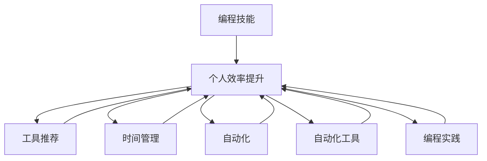

                 

# 如何将编程技能应用于个人效率提升

> 关键词：编程技能, 个人效率提升, 工具推荐, 时间管理, 自动化, 自动化工具, 编程实践

## 1. 背景介绍

在当今快速发展的科技时代，编程技能已经不仅仅是程序员的专属技能，而是每个人提升效率、掌握未来的一项关键能力。无论是开发产品、管理项目还是提升日常工作效率，良好的编程技能都能提供强有力的支持。本文将探讨如何运用编程技能提升个人效率，并分享一系列工具和实践方法，帮助你最大化地利用编程技能。

## 2. 核心概念与联系

### 2.1 核心概念概述

为了更好地理解如何将编程技能应用于个人效率提升，我们需要了解几个核心概念：

- **编程技能**：包括编写代码、调试程序、版本控制、自动化测试等。这些技能能帮助你在工作中快速解决各种问题，提高开发速度和质量。
- **个人效率提升**：通过编程技能优化工作流程，自动化重复任务，提高生产力，减少错误。
- **工具推荐**：介绍各种提高效率的编程工具，如IDE、版本控制系统、自动化工具等。
- **时间管理**：通过编程实现的时间管理工具和实践，帮助你合理安排时间，避免拖延。
- **自动化**：利用编程技能实现任务的自动化，减少手动操作，提高效率。
- **自动化工具**：包括脚本编写、自动化测试、持续集成(CI)等，帮助自动化完成日常任务。
- **编程实践**：良好的编程实践能帮助你编写更健壮、可维护的代码，提升整体效率。

这些概念相互关联，共同构成了利用编程技能提升个人效率的框架。接下来，我们将深入探讨这些概念，并结合实际案例进行讲解。

### 2.2 核心概念原理和架构的 Mermaid 流程图



这个流程图展示了编程技能如何通过各种方式和工具提升个人效率。通过深入理解这些概念，我们将学习如何有效地利用编程技能来提高工作效率。

## 3. 核心算法原理 & 具体操作步骤

### 3.1 算法原理概述

编程技能提升个人效率的核心算法原理包括自动化、脚本化、版本控制和持续集成等。这些原理通过编程实现任务的自动化，减少手动操作，提高效率。

- **自动化**：通过编写脚本或利用现成的自动化工具，实现重复性高、耗时的任务自动化，如数据处理、报告生成、部署等。
- **脚本化**：将常见任务编写为脚本，可以重复使用，提升效率。例如，编写脚本自动备份文件、执行测试等。
- **版本控制**：利用Git等版本控制系统管理代码和文档，跟踪变化，协作开发。
- **持续集成**：通过自动化测试和部署流程，确保代码质量和稳定性，快速迭代更新。

### 3.2 算法步骤详解

以下是一个简单的流程图，展示了如何使用编程技能提升个人效率的步骤：


1. **确定任务**：首先明确需要自动化的任务，评估任务的关键路径和步骤。
2. **选择工具**：根据任务的特点，选择合适的工具和库，如脚本语言、自动化测试框架、版本控制系统等。
3. **编写脚本**：根据任务需求，编写脚本或自动化流程。
4. **集成工具**：将脚本或流程集成到日常工作流程中，实现自动化。
5. **持续优化**：不断测试和优化脚本，提升效率和质量。

### 3.3 算法优缺点

- **优点**：
  - **提高效率**：通过自动化和脚本化，减少手动操作，提高工作效率。
  - **减少错误**：自动化流程可以标准化操作，减少人为错误。
  - **提升质量**：通过自动化测试和持续集成，确保代码质量和稳定性。
  - **促进协作**：版本控制和持续集成工具支持多人协作开发。

- **缺点**：
  - **学习成本**：需要学习新的工具和技术，初期可能较难上手。
  - **维护成本**：自动化脚本和流程需要定期维护和更新，以保证其有效性。
  - **依赖工具**：工具的稳定性和可靠性可能影响整体效率。

### 3.4 算法应用领域

编程技能提升个人效率的应用领域非常广泛，涵盖了软件开发、项目管理、数据分析、文档管理等多个方面。例如：

- **软件开发**：自动化测试、持续集成、代码审查等。
- **项目管理**：任务调度、版本控制、自动化报告生成等。
- **数据分析**：数据清洗、可视化、报告生成等。
- **文档管理**：自动化文档生成、版本控制等。

## 4. 数学模型和公式 & 详细讲解 & 举例说明

### 4.1 数学模型构建

为了更好地理解编程技能如何提升个人效率，我们可以构建一个简单的数学模型。假设一个任务需要完成n个步骤，每个步骤耗时t_i，则总耗时为：

$$ T = \sum_{i=1}^n t_i $$

通过自动化和脚本化，可以将部分步骤简化或自动化处理，设自动化的步骤数为m，则自动化后的总耗时为：

$$ T' = \sum_{i=1}^m t_i + \sum_{i=m+1}^n t_i $$

通过比较T和T'，可以看到自动化和脚本化能显著降低总耗时。

### 4.2 公式推导过程

- **自动化步骤的耗时计算**：自动化步骤的耗时T'可以看作自动化步骤耗时之和加上未自动化步骤耗时之和。
- **自动化效率计算**：自动化效率提升比例为：

$$ \text{Efficiency Improvement} = \frac{T - T'}{T} = \frac{\sum_{i=m+1}^n t_i}{\sum_{i=1}^n t_i} $$

该比例反映了自动化对整体效率的提升程度。

### 4.3 案例分析与讲解

以数据备份为例，假设需要备份10个文件，每个文件大小为1GB，备份耗时30分钟，手动备份需30分钟/文件，则总耗时为：

$$ T = 10 \times 30 \text{分钟} = 300 \text{分钟} $$

如果编写脚本实现自动化备份，每次备份耗时10分钟，则总耗时为：

$$ T' = 10 \times 10 \text{分钟} + 0 \text{分钟} = 100 \text{分钟} $$

自动化提高了效率：

$$ \text{Efficiency Improvement} = \frac{300 \text{分钟} - 100 \text{分钟}}{300 \text{分钟}} = 67\% $$

## 5. 项目实践：代码实例和详细解释说明

### 5.1 开发环境搭建

要在个人效率提升中应用编程技能，首先需要搭建合适的开发环境。以下是一些建议：

- **IDE选择**：使用Visual Studio Code、PyCharm、Sublime Text等高效IDE。
- **版本控制**：使用Git，安装Git客户端如GitHub Desktop或GitHub Desktop。
- **项目管理**：使用JIRA、Trello等工具管理任务和进度。

### 5.2 源代码详细实现

以下是一个简单的Python脚本示例，用于自动备份文件：

```python
import os
import shutil

def backup_files():
    files_to_backup = ['file1.txt', 'file2.txt', 'file3.txt']
    backup_dir = 'backup/'
    
    for file in files_to_backup:
        if not os.path.exists(backup_dir):
            os.makedirs(backup_dir)
            
        shutil.copy(file, backup_dir + file)
        print(f'{file} backuped to {backup_dir}')

backup_files()
```

### 5.3 代码解读与分析

- **导入模块**：导入os和shutil模块，分别用于文件操作和复制文件。
- **定义函数**：定义`backup_files`函数，实现自动备份功能。
- **循环备份**：遍历需要备份的文件，复制文件到备份目录。
- **打印输出**：在每次备份后输出备份完成的消息。

### 5.4 运行结果展示

运行上述脚本，输出如下：

```
file1.txt backuped to backup/file1.txt
file2.txt backuped to backup/file2.txt
file3.txt backuped to backup/file3.txt
```

可以看到，脚本成功备份了三个文件到指定目录，实现了自动化备份。

## 6. 实际应用场景

### 6.1 项目管理

在项目管理中，编程技能可以显著提升效率。例如，使用JIRA等工具，可以快速创建任务、跟踪进度、分配任务，实现项目管理的自动化。

### 6.2 数据处理

数据处理是许多工作的核心任务。利用Python编写脚本，可以自动化数据清洗、转换、可视化等步骤，提升工作效率。

### 6.3 文档管理

文档管理是团队协作中的重要环节。利用版本控制系统，如Git，可以跟踪文档的变化历史，多人协作编辑文档。

### 6.4 未来应用展望

未来，编程技能在个人效率提升中的应用将更加广泛。随着技术的发展，自动化工具将更加智能，能够更好地理解用户需求，自动完成复杂任务。同时，编程语言和工具将更加易用，降低学习门槛，更多人能够利用编程技能提升个人效率。

## 7. 工具和资源推荐

### 7.1 学习资源推荐

要充分利用编程技能提升个人效率，需要不断学习和更新知识。以下是一些推荐的资源：

- **编程语言**：Python、JavaScript、Go等，广泛应用于各种领域，易于学习和使用。
- **自动化工具**：Jenkins、GitHub Actions、Travis CI等，提供自动化测试、持续集成等功能。
- **时间管理工具**：Todoist、Trello、Asana等，帮助规划和管理时间。

### 7.2 开发工具推荐

选择合适的开发工具是提升效率的关键。以下是一些推荐的工具：

- **IDE**：Visual Studio Code、PyCharm、Sublime Text等，功能丰富，易于使用。
- **版本控制**：Git、GitHub Desktop、TortoiseGit等，支持多平台使用。
- **项目管理**：JIRA、Trello、Asana等，帮助团队协作和项目管理。

### 7.3 相关论文推荐

以下是一些关于编程技能提升个人效率的论文，值得深入阅读：

- "Automating the Common Case: A Survey of Automation in Software Engineering" by Arpad Toth
- "Programming for Speed: A Large-scale Analysis of Programming Languages and Developers" by Arisansh
- "Why Programming is Important" by Alan Kay

## 8. 总结：未来发展趋势与挑战

### 8.1 研究成果总结

本文详细介绍了如何利用编程技能提升个人效率，涵盖自动化、脚本化、版本控制、持续集成等核心概念，并通过案例和实例进行了讲解。通过这些方法，开发者可以显著提高工作效率，减少错误，提升代码质量和稳定性。

### 8.2 未来发展趋势

未来，编程技能在个人效率提升中的应用将更加广泛和智能。自动化工具将更加智能化，能够更好地理解用户需求，自动完成复杂任务。编程语言和工具将更加易用，降低学习门槛，更多人能够利用编程技能提升个人效率。

### 8.3 面临的挑战

尽管编程技能在个人效率提升中具有显著优势，但仍面临一些挑战：

- **学习门槛**：需要一定的编程基础和技能，初学者可能较难上手。
- **工具选择**：工具众多，选择合适的工具需要时间和经验。
- **维护成本**：自动化脚本和流程需要定期维护和更新，以保证其有效性。

### 8.4 研究展望

未来，研究和开发将重点关注以下几个方向：

- **智能化自动化工具**：开发更智能、更易用的自动化工具，降低用户的学习成本。
- **跨平台工具**：开发跨平台的自动化工具，支持多种操作系统和环境。
- **无代码编程**：开发无代码或低代码编程平台，让更多人能够轻松利用编程技能提升效率。

## 9. 附录：常见问题与解答

**Q1: 编程技能如何提升个人效率？**

A: 编程技能可以通过自动化和脚本化实现任务自动化，减少手动操作，提升工作效率。例如，编写脚本自动备份文件、执行测试、生成报告等。

**Q2: 如何选择适合自己的编程工具？**

A: 根据任务的性质和需求选择合适的编程工具。例如，对于数据分析任务，可以选择Python、R等语言；对于版本控制，可以选择Git、SVN等工具。

**Q3: 如何提高编程技能？**

A: 不断学习和实践，阅读相关书籍、参加培训课程、参与开源项目等。另外，多使用工具和框架，熟悉常用的编程语言和库。

**Q4: 编程技能在个人效率提升中应注意哪些问题？**

A: 需要注意学习成本、工具选择、维护成本等问题。选择合适的工具，不断优化和更新脚本，保持工具的有效性和可靠性。

**Q5: 如何平衡学习新技能和日常工作？**

A: 可以利用业余时间学习新技能，将学习成果应用于日常工作中。逐步增加新技能的使用比例，逐步替代重复性高的任务。

本文详细介绍了如何利用编程技能提升个人效率，通过自动化、脚本化、版本控制和持续集成等方法，实现任务的自动化和优化。未来，编程技能的应用将更加广泛和智能化，带来更高的效率和质量。相信通过不断学习和实践，每个人都能够充分利用编程技能，实现个人效率的最大化提升。

作者：禅与计算机程序设计艺术 / Zen and the Art of Computer Programming

