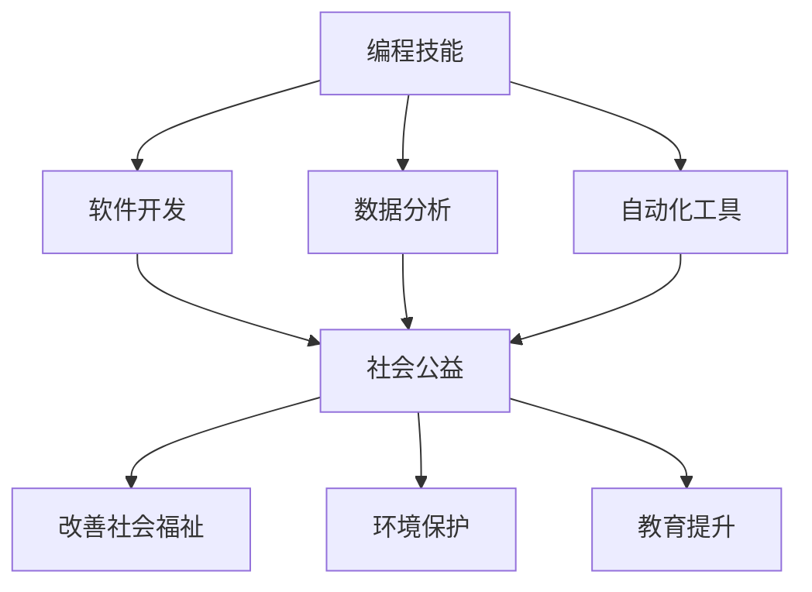

                 

# 如何将编程技能应用于社会公益

## 1. 背景介绍

在数字时代，编程技能已成为现代社会的重要工具。从解决日常生活中的问题，到推动科技发展，编程技能的应用已经无所不在。然而，编程技能的应用并不仅限于商业和技术领域，它同样可以成为推动社会公益的重要力量。本文将探讨如何将编程技能应用于社会公益，以及这一领域的发展趋势和挑战。

## 2. 核心概念与联系

### 2.1 核心概念概述

- **编程技能**：包括编程语言、算法、数据结构、软件工程等知识，是构建和维护软件系统的基础。
- **社会公益**：泛指以改善社会福祉、促进环境保护、提升教育水平等为目的的活动。
- **编程在社会公益中的应用**：通过编程技能开发软件、自动化工具、数据分析等方式，帮助实现社会公益目标。

### 2.2 核心概念原理和架构的 Mermaid 流程图



这个流程图展示了编程技能如何通过不同的应用形式，推动社会公益的实现。编程技能在社会公益中扮演了关键角色，可以从软件开发、数据分析、自动化工具等多个角度进行创新。

## 3. 核心算法原理 & 具体操作步骤

### 3.1 算法原理概述

将编程技能应用于社会公益，核心在于利用编程技能开发能够解决实际问题的软件系统和工具。这些系统可以用于提高效率、优化资源、实现自动化和智能化等功能，从而推动社会公益的发展。

### 3.2 算法步骤详解

1. **需求分析**：明确社会公益项目的具体需求，包括目标、受益群体、实现方式等。
2. **技术选型**：根据需求选择合适的编程语言和技术栈，考虑性能、可维护性、可扩展性等因素。
3. **系统设计**：设计系统的架构和功能模块，确保系统能够满足需求。
4. **软件开发**：实现系统功能和算法，进行单元测试和集成测试。
5. **部署与维护**：将系统部署到目标环境，持续监控和维护系统运行状态，确保系统稳定运行。

### 3.3 算法优缺点

#### 优点

- **高效性**：通过编程技能开发的软件系统可以大幅提高工作效率，降低人力成本。
- **可扩展性**：编程技能支持系统的灵活扩展和升级，可以适应不断变化的社会需求。
- **数据驱动**：利用编程技能进行数据分析，可以提供科学决策的依据，提升社会公益的实施效果。

#### 缺点

- **技术门槛**：编程技能需要一定的技术背景和经验，门槛较高。
- **资源需求**：开发和维护系统需要一定的硬件和软件资源，对于资源有限的组织可能是一个挑战。
- **安全与隐私**：编程技能在处理敏感数据时，需要特别注意数据安全和隐私保护。

### 3.4 算法应用领域

编程技能在社会公益中的应用领域非常广泛，包括但不限于：

- **教育提升**：开发在线教育平台、学习管理系统等，提供高质量的教育资源。
- **环境保护**：开发环境监测系统、资源管理系统等，推动环境保护和可持续发展。
- **社会福祉**：开发社区服务、慈善捐赠管理平台等，提升社区居民的生活质量。
- **健康医疗**：开发电子病历系统、健康数据分析工具等，提高医疗服务的质量和效率。

## 4. 数学模型和公式 & 详细讲解 & 举例说明

### 4.1 数学模型构建

以一个简单的社会公益项目为例，考虑开发一个教育提升平台。该平台的数学模型可以表示为：

$$
\text{平台效果} = \text{用户参与度} \times \text{内容质量} \times \text{技术支持}
$$

其中，用户参与度表示用户使用平台的活跃程度，内容质量表示平台上提供的教育资源质量，技术支持表示平台的技术实现和维护能力。

### 4.2 公式推导过程

假设用户参与度为 $u$，内容质量为 $c$，技术支持为 $t$，则平台的整体效果为 $P$，可以表示为：

$$
P = u \times c \times t
$$

对于每个变量，可以通过以下公式进行计算：

- 用户参与度 $u$：$u = \frac{\text{日活跃用户数}}{\text{总用户数}}$
- 内容质量 $c$：$c = \frac{\text{用户评价}}{\text{总评价数}}$
- 技术支持 $t$：$t = \text{系统可用时间} \div \text{总运行时间}$

### 4.3 案例分析与讲解

假设开发一个在线教育平台，通过编程技能实现以下功能：

1. **用户注册与登录**：开发用户管理系统，支持用户注册、登录、信息管理等。
2. **课程内容管理**：开发课程发布、编辑、审核系统，提供丰富的教育资源。
3. **学习进度跟踪**：开发学习管理系统，记录用户学习进度，提供个性化推荐。
4. **数据分析与优化**：通过编程技能进行数据分析，优化课程内容和推荐算法，提升用户满意度。

## 5. 项目实践：代码实例和详细解释说明

### 5.1 开发环境搭建

为了实现上述功能，需要以下开发环境：

- **编程语言**：Python，使用Flask框架进行后端开发。
- **数据库**：MySQL，用于存储用户数据和课程信息。
- **开发工具**：Git、Docker、Kubernetes，用于版本控制、容器化部署和容器编排。

### 5.2 源代码详细实现

以下是一个简单的用户注册与登录系统的实现代码：

```python
from flask import Flask, request, jsonify

app = Flask(__name__)

@app.route('/register', methods=['POST'])
def register():
    data = request.get_json()
    username = data['username']
    password = data['password']
    # 将用户信息保存到数据库
    # ...
    return jsonify({'message': '注册成功'})

@app.route('/login', methods=['POST'])
def login():
    data = request.get_json()
    username = data['username']
    password = data['password']
    # 验证用户信息并登录
    # ...
    return jsonify({'message': '登录成功'})

if __name__ == '__main__':
    app.run(debug=True)
```

### 5.3 代码解读与分析

该代码展示了如何使用Flask框架实现一个简单的用户注册与登录系统。使用HTTP请求的方式，通过POST方法发送注册和登录数据，后端代码接收数据并处理。注册和登录的过程包括数据验证、数据库存储和用户验证等步骤。

### 5.4 运行结果展示

成功注册和登录后，用户可以访问教育平台的其他功能，如课程浏览、学习进度跟踪等。

## 6. 实际应用场景

### 6.1 教育提升

通过编程技能，可以开发在线教育平台，提供丰富的教育资源和个性化学习体验。例如，可以开发数学、物理等学科的在线课程，利用编程技术进行互动式学习，提升学生的学习效果。

### 6.2 环境保护

利用编程技能开发环境监测系统，可以实现实时空气质量监测、水资源管理等功能，帮助环境保护机构更好地进行环境保护工作。

### 6.3 社会福祉

通过编程技能开发社区服务应用，如社区互助平台、慈善捐赠管理等，提升社区居民的生活质量和社会福祉。

### 6.4 未来应用展望

未来，编程技能在社会公益中的应用将更加广泛和深入。例如，利用人工智能和大数据技术，可以实现更加智能化的社会公益项目，如智能交通系统、智慧医疗等。

## 7. 工具和资源推荐

### 7.1 学习资源推荐

1. **在线教育平台**：Coursera、edX、Udacity等，提供编程技能和社会公益相关的课程。
2. **开源项目**：GitHub、Apache、Linux Foundation等，提供丰富的编程资源和开源项目。
3. **社区平台**：Stack Overflow、GitHub、Reddit等，提供技术交流和资源分享。

### 7.2 开发工具推荐

1. **编程语言**：Python、JavaScript、Java等，广泛用于各种领域。
2. **框架和库**：Flask、Django、React等，提供丰富的开发工具和库。
3. **容器化工具**：Docker、Kubernetes等，支持应用的部署和扩展。

### 7.3 相关论文推荐

1. **编程教育与社会公益**：探讨编程教育在社会公益中的应用和影响。
2. **编程技能与社会创新**：分析编程技能在推动社会创新中的作用和潜力。
3. **人工智能与社会公益**：研究人工智能技术在社会公益中的应用和挑战。

## 8. 总结：未来发展趋势与挑战

### 8.1 研究成果总结

本文探讨了如何将编程技能应用于社会公益，并分析了相关领域的发展趋势和挑战。编程技能在社会公益中的应用已经取得了显著的进展，未来还有巨大的发展空间。

### 8.2 未来发展趋势

1. **智能化和自动化**：利用人工智能和大数据技术，推动社会公益的智能化和自动化发展。
2. **跨领域融合**：编程技能与社会学、心理学、经济学等多领域的融合，实现更加全面的社会公益解决方案。
3. **公众参与**：鼓励公众参与编程和公益项目，提升社会公益的参与度和影响力。

### 8.3 面临的挑战

1. **技术门槛**：编程技能需要一定的技术背景和经验，门槛较高。
2. **资源限制**：资源有限的组织可能难以承受开发和维护系统的成本。
3. **数据安全和隐私**：在处理敏感数据时，需要注意数据安全和隐私保护。

### 8.4 研究展望

未来，需要在以下几个方面进行深入研究：

1. **编程教育普及**：提升公众的编程技能，降低编程技能在社会公益中的门槛。
2. **技术创新**：推动技术创新，实现更加高效、智能的社会公益解决方案。
3. **公众参与**：鼓励公众参与编程和公益项目，提升社会公益的参与度和影响力。

## 9. 附录：常见问题与解答

**Q1：编程技能在社会公益中的作用是什么？**

A: 编程技能可以通过开发软件系统和工具，解决社会公益中的实际问题，提升社会福祉和环境保护水平。

**Q2：如何降低编程技能在社会公益中的技术门槛？**

A: 可以通过简化编程语言的语法，提供易用的开发工具和框架，以及开展编程教育普及活动，降低编程技能的应用门槛。

**Q3：如何确保编程技能在社会公益中的数据安全和隐私保护？**

A: 需要采用数据加密、访问控制、匿名化等技术手段，确保数据在处理和传输过程中的安全和隐私保护。

**Q4：如何通过编程技能实现智能化的社会公益项目？**

A: 利用人工智能和大数据技术，可以开发智能化的社会公益项目，如智能交通系统、智慧医疗等，实现更加高效、精准的社会服务。

**Q5：编程技能在社会公益中的应用有哪些？**

A: 编程技能可以应用于教育提升、环境保护、社会福祉、健康医疗等多个领域，推动社会公益的发展。

---

作者：禅与计算机程序设计艺术 / Zen and the Art of Computer Programming

