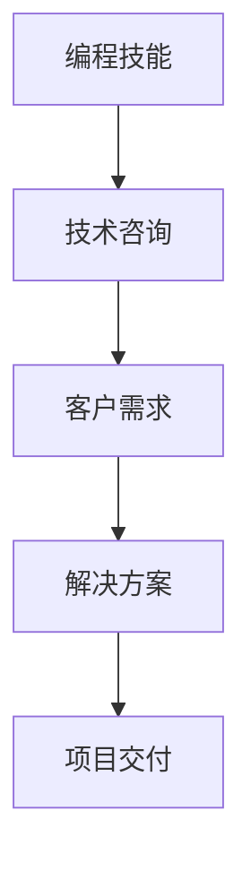
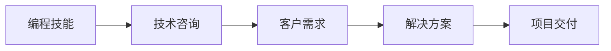

                 

## 1. 背景介绍

在当今数字化时代，编程技能已经不仅仅是一种技术手段，更是一种可以转化为商业价值的咨询服务。随着企业数字化转型的加速，企业对技术咨询的需求日益增长。如何将个人的编程技能转化为咨询服务，是一个值得探讨的课题。本文将详细介绍如何将编程技能转化为咨询业务的方法、策略和实施步骤，帮助开发者更好地融入商业环境，提供专业的技术咨询服务。

## 2. 核心概念与联系

### 2.1 核心概念概述

在将编程技能转化为咨询业务的过程中，涉及多个核心概念。这些概念之间存在紧密的联系，共同构成了一个完整的咨询体系。

- **编程技能**：指软件开发人员具备的编程语言、算法、架构设计等技术能力。
- **技术咨询**：指提供技术方案、架构设计、代码优化等专业建议和支持的服务。
- **客户需求**：指客户在项目开发、产品设计、系统优化等方面存在的具体问题和需求。
- **解决方案**：指根据客户需求提供的技术方案和实施步骤。
- **项目交付**：指项目开发的最终结果，通常以可运行的软件或系统为输出。

这些概念之间的关系可以通过以下Mermaid流程图来展示：



这个流程图展示了编程技能如何转化为技术咨询，并最终实现客户需求的满足。

### 2.2 核心概念原理和架构的 Mermaid 流程图

以下是编程技能转化为技术咨询的Mermaid流程图，展示了不同概念之间的联系：



在这个架构中，编程技能是基础，通过技术咨询转化为咨询服务，并根据客户需求提供解决方案，最终完成项目交付。

## 3. 核心算法原理 & 具体操作步骤

### 3.1 算法原理概述

将编程技能转化为咨询业务的算法原理主要包括以下几个方面：

- **需求分析**：了解客户的具体需求和问题。
- **解决方案设计**：根据客户需求设计合适的技术方案。
- **实施与优化**：根据设计方案实施开发，并根据客户反馈进行优化。
- **项目交付**：交付最终成果，并为客户提供技术支持。

### 3.2 算法步骤详解

将编程技能转化为咨询业务的算法步骤可以分为以下几个阶段：

1. **需求分析阶段**：
   - 与客户进行沟通，了解其业务背景、需求和痛点。
   - 收集客户现有的系统、数据和资源信息。
   - 分析客户的需求，确定项目的目标和范围。

2. **解决方案设计阶段**：
   - 根据客户需求设计合适的技术方案。
   - 确定技术选型、架构设计和开发计划。
   - 制定详细的项目计划和进度安排。

3. **实施与优化阶段**：
   - 根据设计方案进行开发，并逐步实施。
   - 根据客户反馈进行优化和调整。
   - 进行测试和验证，确保系统的稳定性和性能。

4. **项目交付阶段**：
   - 交付最终成果，并进行系统部署。
   - 提供技术支持和维护服务。
   - 收集客户反馈，进行后期优化和改进。

### 3.3 算法优缺点

将编程技能转化为咨询业务的算法有以下优缺点：

#### 优点：
- **多样性**：编程技能可以应用于多个领域，如软件开发、数据分析、人工智能等。
- **灵活性**：可以根据客户需求灵活调整解决方案。
- **成本低**：相较于全栈开发，咨询服务的成本较低。

#### 缺点：
- **缺乏经验**：技术人员可能缺乏项目管理和客户沟通的经验。
- **客户依赖**：客户的需求和反馈对项目的成功至关重要。
- **技术局限**：编程技能可能不足以覆盖所有技术问题。

### 3.4 算法应用领域

将编程技能转化为咨询业务的算法广泛应用于以下领域：

- **软件开发咨询**：提供软件开发方案、架构设计、代码优化等服务。
- **数据分析咨询**：提供数据分析模型、数据仓库设计、数据可视化等服务。
- **人工智能咨询**：提供人工智能算法、模型训练、系统部署等服务。
- **系统集成咨询**：提供系统集成方案、接口开发、系统测试等服务。

## 4. 数学模型和公式 & 详细讲解 & 举例说明

### 4.1 数学模型构建

将编程技能转化为咨询业务的数学模型主要包括以下几个部分：

- **需求分析模型**：用于分析客户需求，确定项目目标和范围。
- **解决方案设计模型**：用于设计合适的技术方案和架构。
- **实施与优化模型**：用于指导开发和优化。
- **项目交付模型**：用于评估项目成果和客户满意度。

### 4.2 公式推导过程

以软件开发咨询为例，需求分析模型的公式推导如下：

设客户需求为 $D$，其中包含 $d_1, d_2, ..., d_n$ 多个具体需求。将每个需求按照优先级排序，记为 $p_1, p_2, ..., p_n$。根据客户需求设计软件需求文档，公式推导如下：

$$
\text{需求文档} = \sum_{i=1}^{n} p_i \times d_i
$$

其中 $p_i$ 为需求 $d_i$ 的优先级权重。

### 4.3 案例分析与讲解

以下是一个软件开发咨询的案例：

客户需求：开发一个电商平台，需要具备用户注册、商品展示、购物车、订单管理等功能。

需求分析：
- 用户注册：包括用户登录、注册页面设计、用户信息保存等功能。
- 商品展示：包括商品列表、商品详情、商品搜索等功能。
- 购物车：包括商品加入购物车、购物车展示、结算支付等功能。
- 订单管理：包括订单生成、订单状态查询、订单支付等功能。

解决方案设计：
- 技术选型：选择Spring Boot框架进行后端开发，MySQL数据库进行数据存储。
- 架构设计：设计基于RESTful API的架构，前端使用Vue.js进行页面开发。
- 开发计划：按照MVP（最小可行产品）的思路，优先实现核心功能。

实施与优化：
- 根据设计方案进行开发，逐步实现核心功能。
- 进行测试和验证，确保系统的稳定性和性能。
- 根据客户反馈进行优化和调整。

项目交付：
- 交付最终成果，并进行系统部署。
- 提供技术支持和维护服务。
- 收集客户反馈，进行后期优化和改进。

## 5. 项目实践：代码实例和详细解释说明

### 5.1 开发环境搭建

在进行软件开发咨询的项目实践前，我们需要准备好开发环境。以下是使用Python进行Django开发的环境配置流程：

1. 安装Anaconda：从官网下载并安装Anaconda，用于创建独立的Python环境。

2. 创建并激活虚拟环境：
```bash
conda create -n django-env python=3.8 
conda activate django-env
```

3. 安装Django：从官网获取安装命令。例如：
```bash
pip install django
```

4. 安装Django REST framework：
```bash
pip install djangorestframework
```

5. 安装PostgreSQL：
```bash
sudo apt-get install postgresql
```

6. 安装psycopg2：
```bash
pip install psycopg2-binary
```

7. 安装MySQL：
```bash
sudo apt-get install mysql-server
```

8. 安装PyMySql：
```bash
pip install pymysql
```

完成上述步骤后，即可在`django-env`环境中开始项目实践。

### 5.2 源代码详细实现

以下是一个基于Django REST framework的电商平台开发项目实现，包括用户注册、商品展示、购物车、订单管理等功能。

1. 创建Django项目：
```bash
django-admin startproject e-commerce
cd e-commerce
```

2. 创建Django应用：
```bash
python manage.py startapp ecommerce
```

3. 配置数据库：
```python
DATABASES = {
    'default': {
        'ENGINE': 'django.db.backends.mysql',
        'NAME': 'ecommerce',
        'USER': 'root',
        'PASSWORD': 'password',
        'HOST': 'localhost',
        'PORT': '3306',
    }
}
```

4. 定义用户注册模型：
```python
from django.contrib.auth.models import AbstractUser
from django.db import models

class User(AbstractUser):
    class Meta:
        verbose_name = 'User'
        verbose_name_plural = 'Users'
```

5. 定义商品展示模型：
```python
class Product(models.Model):
    name = models.CharField(max_length=100)
    price = models.DecimalField(max_digits=10, decimal_places=2)
    description = models.TextField()

    class Meta:
        verbose_name = 'Product'
        verbose_name_plural = 'Products'
```

6. 定义购物车模型：
```python
class ShoppingCart(models.Model):
    user = models.ForeignKey(User, on_delete=models.CASCADE)
    product = models.ForeignKey(Product, on_delete=models.CASCADE)
    quantity = models.IntegerField(default=1)

    class Meta:
        verbose_name = 'ShoppingCart'
        verbose_name_plural = 'ShoppingCarts'
```

7. 定义订单模型：
```python
class Order(models.Model):
    user = models.ForeignKey(User, on_delete=models.CASCADE)
    product = models.ForeignKey(Product, on_delete=models.CASCADE)
    order_date = models.DateTimeField(auto_now_add=True)
    total_price = models.DecimalField(max_digits=10, decimal_places=2)

    class Meta:
        verbose_name = 'Order'
        verbose_name_plural = 'Orders'
```

8. 定义API视图：
```python
from django.views.decorators.csrf import csrf_exempt
from rest_framework import generics
from rest_framework.response import Response
from .models import User, Product, ShoppingCart, Order

@csrf_exempt
class UserView(generics.CreateAPIView):
    def post(self, request):
        data = request.POST
        user = User.objects.create_user(data['username'], data['password'])
        return Response({'user_id': user.id})

@csrf_exempt
class ProductView(generics.ListAPIView):
    def get(self, request):
        products = Product.objects.all()
        return Response(products)

@csrf_exempt
class ShoppingCartView(generics.CreateAPIView):
    def post(self, request):
        data = request.POST
        user = User.objects.get(id=data['user_id'])
        product = Product.objects.get(id=data['product_id'])
        cart, created = ShoppingCart.objects.get_or_create(user=user, product=product)
        cart.quantity += 1
        cart.save()
        return Response({'quantity': cart.quantity})

@csrf_exempt
class OrderView(generics.CreateAPIView):
    def post(self, request):
        data = request.POST
        user = User.objects.get(id=data['user_id'])
        product = Product.objects.get(id=data['product_id'])
        order = Order.objects.create(user=user, product=product, total_price=product.price)
        return Response({'order_id': order.id})
```

9. 配置URL：
```python
urlpatterns = [
    path('users/', views.UserView.as_view(), name='user-list'),
    path('products/', views.ProductView.as_view(), name='product-list'),
    path('shopping-carts/', views.ShoppingCartView.as_view(), name='shopping-cart-list'),
    path('orders/', views.OrderView.as_view(), name='order-list'),
]
```

10. 运行项目：
```bash
python manage.py runserver
```

### 5.3 代码解读与分析

让我们再详细解读一下关键代码的实现细节：

**User类**：
- 继承自Django的抽象用户模型，增加了数据库表名。

**Product类**：
- 定义了商品的名称、价格和描述，用于展示商品信息。

**ShoppingCart类**：
- 用于管理用户的购物车，包含用户、商品和数量信息。

**Order类**：
- 用于管理用户的订单，包含用户、商品和订单日期。

**UserView类**：
- 实现用户注册API视图，接受POST请求创建新用户。

**ProductView类**：
- 实现商品展示API视图，获取所有商品信息。

**ShoppingCartView类**：
- 实现购物车API视图，接受POST请求添加商品到购物车。

**OrderView类**：
- 实现订单API视图，接受POST请求创建新订单。

这些类和视图定义了电商平台的各个功能模块，并通过RESTful API进行交互。

### 5.4 运行结果展示

运行上述代码后，可以在浏览器中访问http://127.0.0.1:8000/，查看电商平台的各个功能模块。例如，访问http://127.0.0.1:8000/users/，提交POST请求创建新用户。

## 6. 实际应用场景

### 6.1 软件开发咨询

软件开发咨询是编程技能转化为咨询业务的典型场景。通过深入理解客户需求，提供专业的软件设计、开发和优化服务，帮助客户实现业务目标。软件开发咨询可以应用于各种类型的软件开发项目，如Web应用、移动应用、企业管理系统等。

### 6.2 数据分析咨询

数据分析咨询是另一个重要的应用场景。通过数据分析模型和工具，帮助客户从数据中提取有价值的信息，进行决策支持。数据分析咨询可以应用于市场分析、用户行为分析、销售预测等领域。

### 6.3 人工智能咨询

人工智能咨询是编程技能转化为咨询业务的高级应用。通过深度学习、自然语言处理、计算机视觉等技术，为客户提供智能解决方案。人工智能咨询可以应用于智能客服、推荐系统、语音识别等领域。

## 7. 工具和资源推荐

### 7.1 学习资源推荐

为了帮助开发者系统掌握将编程技能转化为咨询业务的方法，这里推荐一些优质的学习资源：

1. **Django官方文档**：Django的官方文档是学习Django框架的必备资料，涵盖了Django的所有核心概念和功能。

2. **Django REST framework官方文档**：Django REST framework的官方文档详细介绍了如何使用Django REST framework进行API开发。

3. **Python编程语言指南**：《Python编程语言指南》是学习Python编程的权威书籍，涵盖了Python的所有核心语法和标准库。

4. **《深入理解计算机系统》**：这是一本关于计算机系统和编程语言的经典书籍，涵盖了计算机系统和编程语言的基础知识。

5. **Coursera**：Coursera提供了大量高质量的计算机科学课程，涵盖了软件工程、数据科学、人工智能等领域。

### 7.2 开发工具推荐

高效的开发离不开优秀的工具支持。以下是几款用于将编程技能转化为咨询业务的常用工具：

1. **Visual Studio Code**：一款轻量级的代码编辑器，支持多种编程语言和扩展，是开发和学习编程的好帮手。

2. **Git**：版本控制系统，用于管理和协作开发项目。

3. **Docker**：容器化平台，用于部署和管理应用程序。

4. **Anaconda**：Python环境管理系统，用于创建和管理Python环境。

5. **JIRA**：项目管理工具，用于跟踪和协调开发任务。

### 7.3 相关论文推荐

将编程技能转化为咨询业务的研究源于学界的持续探索。以下是几篇奠基性的相关论文，推荐阅读：

1. **《Software Engineering: A Practitioner's Approach》**：这本书是软件工程领域的经典教材，涵盖了软件工程的核心概念和方法。

2. **《The Pragmatic Programmer》**：这本书是软件开发领域的经典著作，提供了大量实用的编程技巧和经验。

3. **《Code Complete》**：这本书是软件开发领域的经典著作，提供了系统化的编程方法论和最佳实践。

4. **《Design Patterns: Elements of Reusable Object-Oriented Software》**：这本书是设计模式领域的经典著作，介绍了多种常用的设计模式和设计原则。

5. **《Building Microservices》**：这本书是微服务架构领域的经典著作，介绍了微服务架构的设计和实现。

通过学习这些前沿成果，可以帮助研究者把握学科前进方向，激发更多的创新灵感。

## 8. 总结：未来发展趋势与挑战

### 8.1 总结

本文对将编程技能转化为咨询业务的方法进行了全面系统的介绍。首先阐述了编程技能转化为咨询业务的背景和意义，明确了咨询业务的价值。其次，从原理到实践，详细讲解了咨询业务的数学模型和实施步骤，给出了完整的代码实现。同时，本文还广泛探讨了咨询业务在软件开发、数据分析、人工智能等领域的实际应用，展示了咨询业务的多样性和广泛性。此外，本文精选了咨询业务的学习资源、开发工具和相关论文，力求为读者提供全方位的技术指引。

通过本文的系统梳理，可以看到，将编程技能转化为咨询业务具有广阔的应用前景和潜在的商业价值。编程技能可以应用于多种业务场景，通过提供专业的技术咨询服务，帮助客户解决实际问题，实现业务目标。随着技术的不断进步和业务需求的不断变化，相信编程技能转化为咨询业务将为开发者带来更多的职业发展机遇。

### 8.2 未来发展趋势

展望未来，将编程技能转化为咨询业务将呈现以下几个发展趋势：

1. **云化服务**：随着云计算技术的不断发展，软件开发咨询和数据分析咨询将越来越多地以云服务形式提供，降低客户部署和运维成本。

2. **自动化和智能决策**：通过引入人工智能技术，自动化和智能决策将提高咨询业务的效率和准确性。例如，使用机器学习算法进行需求分析，使用自然语言处理技术进行自动化代码生成和测试。

3. **跨领域融合**：将编程技能与数据科学、人工智能、区块链等跨领域技术融合，提供更加全面和综合的咨询服务。

4. **平台化和生态化**：建立平台化的咨询业务生态系统，整合多种资源和服务，提供一站式解决方案。

5. **个性化和定制化**：根据客户需求进行个性化和定制化的咨询服务，提升客户满意度。

这些趋势将推动咨询业务向更高层次和更广泛的应用场景发展，为开发者和客户带来更多机会和收益。

### 8.3 面临的挑战

尽管将编程技能转化为咨询业务具有广阔的前景，但在迈向更加智能化、普适化应用的过程中，仍面临诸多挑战：

1. **技术更新快**：技术领域的快速发展要求开发者不断学习新技术，更新知识体系。

2. **客户需求多样化**：不同客户的需求差异较大，需要开发者具备较强的沟通和理解能力。

3. **市场竞争激烈**：咨询业务市场竞争激烈，需要开发者具备较强的市场洞察力和业务能力。

4. **项目管理和协作**：咨询项目通常涉及多个部门和人员，需要开发者具备较强的项目管理能力和团队协作能力。

5. **客户需求变化快**：客户需求变化较快，需要开发者具备较强的应变能力和灵活性。

6. **资源配置复杂**：咨询项目通常需要协调多种资源，包括人力资源、技术资源和财务资源。

这些挑战需要开发者不断学习和积累经验，提升自身素质和能力，才能更好地适应咨询业务的发展需求。

### 8.4 研究展望

面对将编程技能转化为咨询业务的诸多挑战，未来的研究需要在以下几个方面寻求新的突破：

1. **自动化工具开发**：开发更多的自动化工具和平台，提高咨询业务的效率和准确性。

2. **智能化算法研究**：研究智能化算法和模型，提升咨询业务的智能化水平。

3. **跨领域技术融合**：推动跨领域技术融合，提供更加全面和综合的咨询服务。

4. **个性化和定制化服务**：提供个性化和定制化的咨询服务，提升客户满意度。

5. **平台化和服务化**：建立平台化的咨询业务生态系统，整合多种资源和服务。

6. **咨询技能培训**：开发针对性的咨询技能培训课程，提升开发者的咨询技能。

这些研究方向的探索，必将推动咨询业务向更高的层次和更广阔的应用场景发展，为开发者和客户带来更多的机会和收益。总之，将编程技能转化为咨询业务是一项既具有挑战性又充满机遇的工作，需要开发者不断学习和积累经验，提升自身素质和能力，才能在竞争激烈的咨询市场中获得成功。

## 9. 附录：常见问题与解答

**Q1：如何理解编程技能转化为咨询业务的本质？**

A: 编程技能转化为咨询业务的本质是利用编程技能为客户的业务需求提供解决方案和支持。编程技能不仅仅是编码和开发，更是一种思维方式和解决问题的方法。通过理解客户需求，运用编程技能设计合适的技术方案，为客户提供专业的咨询服务，帮助客户实现业务目标。

**Q2：编程技能转化为咨询业务的优势和劣势是什么？**

A: 编程技能转化为咨询业务的优势包括：

- **专业性**：编程技能本身具有较强的专业性，可以为客户提供高质量的技术支持。
- **高效性**：通过编程技能，可以快速实现业务需求，提高客户满意度。
- **成本低**：相较于全栈开发，咨询业务的成本较低。

劣势包括：

- **灵活性不足**：编程技能可能无法覆盖所有业务需求，需要不断学习和积累经验。
- **客户依赖**：客户的需求和反馈对项目的成功至关重要。
- **技术局限**：编程技能可能不足以覆盖所有技术问题。

**Q3：如何将编程技能转化为咨询业务的具体步骤是什么？**

A: 将编程技能转化为咨询业务的具体步骤包括：

1. **需求分析**：与客户进行沟通，了解其业务背景、需求和痛点。
2. **解决方案设计**：根据客户需求设计合适的技术方案和架构。
3. **实施与优化**：根据设计方案进行开发，并逐步实施。
4. **项目交付**：交付最终成果，并进行系统部署。
5. **技术支持和维护**：提供技术支持和维护服务。

**Q4：如何提高编程技能转化为咨询业务的效率？**

A: 提高编程技能转化为咨询业务的效率可以从以下几个方面入手：

1. **学习新技术**：持续学习新技术和工具，保持技术领先性。
2. **提高沟通能力**：提高与客户的沟通和理解能力，更好地把握客户需求。
3. **自动化工具**：开发和利用自动化工具和平台，提高工作效率。
4. **跨领域融合**：推动跨领域技术融合，提供更加全面和综合的咨询服务。

**Q5：如何在编程技能转化为咨询业务的过程中，保持客户满意度？**

A: 在编程技能转化为咨询业务的过程中，保持客户满意度可以从以下几个方面入手：

1. **需求分析准确性**：准确把握客户需求，提供符合预期的解决方案。
2. **项目管理和协作**：加强项目管理和协作，确保项目按时按质完成。
3. **技术支持和维护**：提供及时的技术支持和维护，确保系统稳定运行。
4. **客户反馈**：积极收集客户反馈，持续改进和优化服务。

---

作者：禅与计算机程序设计艺术 / Zen and the Art of Computer Programming

