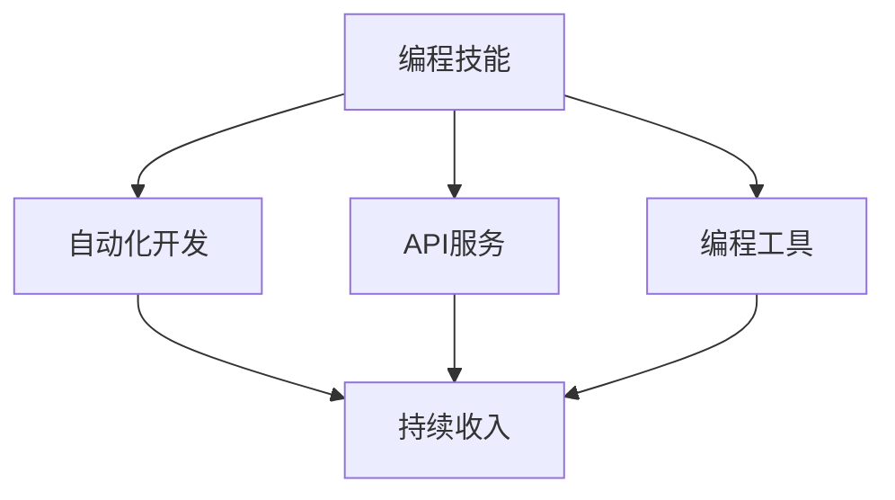

                 

# 如何将编程技能转化为被动收入

## 1. 背景介绍

在当今快速发展的互联网时代，技术的力量正在不断改变我们的生活方式。程序员作为技术创新的核心力量，不仅驱动了数字经济的发展，也在寻找新的方式将自己的技能转化为持续的被动收入。随着编程自动化和AI技术的发展，程序员可以开发出能够自动化执行代码的软件工具，从而实现持续的被动收入。本文将介绍几种将编程技能转化为被动收入的方法，包括自动化开发、API服务和编程工具开发。

## 2. 核心概念与联系

### 2.1 核心概念概述

为了更好地理解如何将编程技能转化为被动收入，我们将介绍几个核心概念：

- **编程技能**：指程序员掌握的编程语言、算法、数据结构、软件工程等知识和技能。
- **自动化开发**：使用编程技能开发可以自动执行特定任务的代码，以减少人工干预和提高效率。
- **API服务**：通过编写API，使软件模块可以与其他系统交互，提供特定的服务功能。
- **编程工具**：开发编程辅助工具，如代码生成器、调试器、性能分析器等，以提升程序员的生产力。
- **被动收入**：通过编程技能开发的软件产品或服务，能够在不需要直接参与的情况下，持续产生收入。

这些概念之间的联系可以用以下Mermaid流程图来表示：

这个流程图展示了编程技能通过自动化开发、API服务和编程工具等形式转化为持续收入的路径。

## 3. 核心算法原理 & 具体操作步骤

### 3.1 算法原理概述

将编程技能转化为被动收入的核心在于开发出可重复使用的代码和工具。这需要应用软件工程中的模块化、可测试性和可维护性等原则。以下是几种实现这一目标的算法原理：

- **模块化**：将复杂问题分解为多个小型、可复用的模块，每个模块负责一个特定的功能。
- **测试驱动开发(TDD)**：通过编写测试用例来驱动开发过程，确保代码质量。
- **持续集成(CI)**：通过自动化的测试和部署流程，确保代码变更的稳定性和可靠性。
- **容器化**：将应用程序及其依赖打包到容器中，方便部署和扩展。
- **微服务架构**：将应用程序拆分为多个小服务，每个服务独立运行，以提高系统的灵活性和可扩展性。

### 3.2 算法步骤详解

基于上述算法原理，下面是将编程技能转化为被动收入的具体操作步骤：

**Step 1: 确定目标领域和需求**

确定要开发的领域和具体需求。例如，可以开发一个自动化测试工具，或者是一个API服务，提供数据处理和分析功能。

**Step 2: 设计架构和功能**

根据需求设计应用程序的架构，包括模块划分、数据流和交互接口。确定需要提供的功能和特性。

**Step 3: 编写代码和测试**

按照TDD流程编写代码，并编写单元测试用例来验证代码的正确性。使用自动化测试工具进行测试。

**Step 4: 集成和部署**

将各个模块集成到一起，使用CI工具自动化测试和部署。将应用程序部署到服务器或云平台。

**Step 5: 持续迭代**

根据用户反馈和市场变化，不断迭代改进应用程序。使用A/B测试等方法优化用户界面和功能。

**Step 6: 商业化**

选择合适的商业模式，如订阅制、按需付费或广告收入等。使用市场营销策略推广应用程序。

### 3.3 算法优缺点

将编程技能转化为被动收入有以下优点：

- **高效性**：自动化和模块化开发可以显著提高开发效率，减少重复劳动。
- **灵活性**：微服务架构和容器化使得系统具有高度的可扩展性和灵活性。
- **可靠性**：使用CI和自动化测试工具可以确保系统的稳定性和可靠性。

同时，也存在一些缺点：

- **成本高**：初期的开发和部署成本较高，需要一定的技术积累和资金支持。
- **维护难度**：需要持续的维护和优化，以适应市场和技术的变化。
- **市场竞争**：市场上已存在大量的同类产品，竞争激烈。

### 3.4 算法应用领域

将编程技能转化为被动收入的方法可以应用于多个领域，包括但不限于：

- **软件开发**：开发各种类型的应用程序，如企业管理系统、移动应用、网站等。
- **数据分析**：开发数据处理和分析工具，如数据可视化、机器学习模型等。
- **人工智能**：开发AI算法和模型，提供图像识别、语音识别、自然语言处理等技术服务。
- **云服务**：提供云存储、云计算和云安全等服务。
- **自动化测试**：开发自动化测试工具，提高软件质量和测试效率。

## 4. 数学模型和公式 & 详细讲解

### 4.1 数学模型构建

假设我们需要开发一个自动化测试工具，用于检测软件的缺陷。该工具的基本数学模型可以表示为：

$$
R = f(D, T)
$$

其中，$R$ 表示测试结果，$D$ 表示输入的源代码，$T$ 表示测试用例和测试策略。

### 4.2 公式推导过程

根据上述模型，我们可以进一步推导出测试结果的概率模型：

$$
P(R=pass) = P(D|pass) \times P(T|pass)
$$

$$
P(R=fail) = P(D|fail) \times P(T|fail)
$$

其中，$P(D|pass)$ 表示源代码在通过测试用例和策略的情况下不被检测到的概率，$P(T|pass)$ 表示测试用例和策略在源代码通过测试的情况下被执行的概率。

### 4.3 案例分析与讲解

我们可以使用上述模型来分析自动化测试工具的效果。例如，如果一个测试用例能够检测到99%的缺陷，但只有90%的测试用例被执行，那么工具的缺陷检测率仅为81%。

## 5. 项目实践：代码实例和详细解释说明

### 5.1 开发环境搭建

**Step 1: 安装开发工具**

安装必要的开发工具，如Python、Java、Node.js等。安装IDE（如IntelliJ IDEA、Visual Studio Code等）和版本控制系统（如Git）。

**Step 2: 配置开发环境**

配置开发环境，包括设置开发服务器、数据库、缓存和日志等。

**Step 3: 搭建开发平台**

搭建开发平台，如Docker容器、Kubernetes集群等，以便于部署和扩展应用程序。

### 5.2 源代码详细实现

**Step 1: 设计架构**

设计应用程序的架构，包括模块划分、数据流和交互接口。使用UML图表示架构。

**Step 2: 编写代码**

按照TDD流程编写代码，并编写单元测试用例来验证代码的正确性。使用单元测试框架，如JUnit、pytest等。

**Step 3: 集成测试**

将各个模块集成到一起，编写集成测试用例来验证系统功能。使用持续集成工具，如Jenkins、Travis CI等。

**Step 4: 部署应用程序**

将应用程序部署到服务器或云平台，使用容器化技术，如Docker、Kubernetes等。

### 5.3 代码解读与分析

**Step 1: 设计模式**

使用常见的设计模式来提高代码的可复用性和可维护性。例如，使用单例模式管理资源，使用工厂模式创建对象。

**Step 2: 代码重构**

对代码进行重构，提高代码的可读性和可维护性。使用重构工具，如SonarQube、Sonarlint等。

**Step 3: 代码审查**

进行代码审查，确保代码质量。使用代码审查工具，如Review Board、GitHub等。

### 5.4 运行结果展示

使用性能分析工具，如JProfiler、VisualVM等，对应用程序进行性能分析，找出瓶颈并进行优化。

## 6. 实际应用场景

### 6.1 自动化测试工具

开发自动化测试工具，可以减少人工测试的工作量，提高软件质量。例如，可以使用Selenium和WebDriver等工具，开发自动化测试脚本，检测Web应用的功能和性能。

### 6.2 API服务

开发API服务，提供数据处理和分析功能。例如，可以开发一个RESTful API服务，提供数据存储、查询和分析功能，供其他应用使用。

### 6.3 编程工具

开发编程工具，提高程序员的生产力。例如，可以开发代码生成器、调试器、性能分析器等工具，提高编程效率。

### 6.4 未来应用展望

随着技术的发展，未来将出现更多的自动化和智能化工具，帮助程序员更高效地开发软件。例如，人工智能辅助编程、自动化重构等技术将进一步提升编程效率和代码质量。

## 7. 工具和资源推荐

### 7.1 学习资源推荐

1. **《Clean Code》**：一本关于编写干净、可读和可维护代码的书籍，提供了许多编程技巧和最佳实践。
2. **《Effective Java》**：一本关于Java编程的最佳实践的书籍，涵盖了代码风格、异常处理、多线程等方面的内容。
3. **《Design Patterns》**：一本介绍设计模式的经典书籍，提供了许多常用的设计模式和最佳实践。
4. **《Selenium WebDriver》**：一本关于Selenium WebDriver的书籍，介绍了如何使用Selenium进行自动化测试。
5. **《RESTful Web Services》**：一本关于RESTful Web服务的书籍，介绍了RESTful架构和API设计的最佳实践。

### 7.2 开发工具推荐

1. **IntelliJ IDEA**：一款功能强大的Java IDE，支持代码自动完成、重构、调试等功能。
2. **Visual Studio Code**：一款多语言的IDE，支持多种编程语言和框架。
3. **GitHub**：一款基于Git的代码托管平台，提供版本控制和协作开发功能。
4. **Jenkins**：一款开源的持续集成工具，支持自动化测试、部署和监控等功能。
5. **Docker**：一款容器化平台，支持应用程序的打包、部署和扩展。

### 7.3 相关论文推荐

1. **《Refactoring: Improving the Design of Existing Code》**：关于代码重构的经典书籍，介绍了重构的方法和技巧。
2. **《Clean Code: A Handbook of Agile Software Craftsmanship》**：一本关于编写干净代码的书籍，提供了许多编程技巧和最佳实践。
3. **《Design Patterns: Elements of Reusable Object-Oriented Software》**：一本介绍设计模式的经典书籍，提供了许多常用的设计模式和最佳实践。
4. **《Effective Java》**：一本关于Java编程的最佳实践的书籍，涵盖了代码风格、异常处理、多线程等方面的内容。
5. **《Selenium WebDriver》**：一本关于Selenium WebDriver的书籍，介绍了如何使用Selenium进行自动化测试。

## 8. 总结：未来发展趋势与挑战

### 8.1 总结

本文系统地介绍了将编程技能转化为被动收入的方法和步骤。从核心概念的介绍到实际应用场景的分析，全面阐述了这一过程的实现。通过案例分析和代码实例，展示了如何将编程技能转化为高效、可靠的被动收入。

### 8.2 未来发展趋势

未来，编程技能转化为被动收入将更加普及和高效。随着自动化和智能化技术的不断发展，编程工具和API服务将更加丰富和智能化，程序员可以更容易地开发和维护软件。

### 8.3 面临的挑战

尽管存在许多机遇，但也面临一些挑战。例如，技术快速变化、市场需求不确定等，都需要程序员不断学习和适应。

### 8.4 研究展望

未来，编程技能转化为被动收入的研究将集中在以下几个方面：

1. **人工智能辅助编程**：使用人工智能技术，如机器学习和自然语言处理，辅助编程工作。
2. **自动化重构**：使用自动化工具，如静态分析工具、代码审查工具等，进行代码重构和优化。
3. **云计算和微服务**：使用云计算和微服务技术，提高软件的可扩展性和灵活性。

总之，编程技能转化为被动收入是程序员获取持续收入的重要途径。通过不断学习和实践，程序员可以开发出高效、可靠的被动收入工具，提升自身的工作效率和收入水平。

## 9. 附录：常见问题与解答

**Q1: 编程技能转化为被动收入的过程是否适合所有类型的程序员？**

A: 是的，编程技能转化为被动收入的过程适合各种类型的程序员，无论你是前端开发、后端开发还是全栈开发，都可以通过这一过程获得持续的收入。

**Q2: 开发自动化测试工具需要掌握哪些技术？**

A: 开发自动化测试工具需要掌握多种技术，包括编程语言（如Java、Python等）、测试框架（如JUnit、pytest等）、Web技术和测试工具（如Selenium、WebDriver等）。

**Q3: 如何将编程技能转化为被动收入？**

A: 将编程技能转化为被动收入的关键在于开发出可重复使用的代码和工具。通过设计、编写和测试代码，并将这些代码打包成应用程序或API服务，就可以在不需要直接参与的情况下，持续产生收入。

**Q4: 如何提高编程技能转化为被动收入的成功率？**

A: 提高成功率的关键在于持续学习和实践。不断学习最新的技术，掌握更多的编程技巧和最佳实践，并积极参与开源社区和开发者会议，可以获得更多的灵感和经验。

**Q5: 如何选择合适的开发平台和工具？**

A: 选择合适的开发平台和工具需要考虑多个因素，包括编程语言、开发环境、开发工具、版本控制等。建议根据项目需求和使用习惯选择合适的工具，并使用开源工具进行开发和部署。

---

作者：禅与计算机程序设计艺术 / Zen and the Art of Computer Programming

