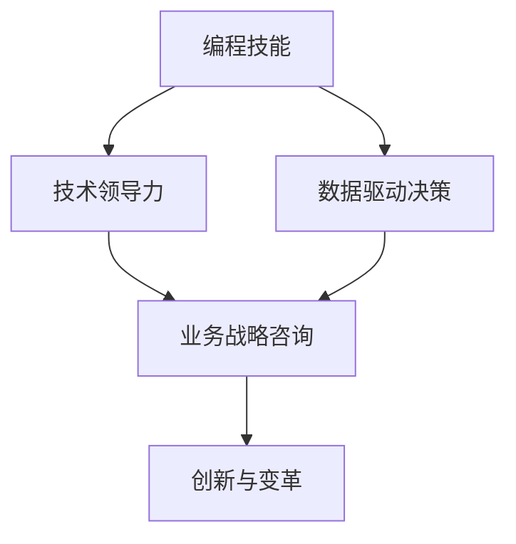

                 

# 如何将编程技能转化为高端咨询业务

## 1. 背景介绍

随着技术的快速发展和各行各业的数字化转型，编程技能正逐渐成为不可或缺的重要能力。然而，许多掌握编程技能的专业人士仍然停留在技术执行层面，未能充分发挥其在企业咨询和业务决策中的巨大潜力。如何将编程技能有效转化为高端咨询业务，成为许多技术人才的重要课题。本文将系统探讨这一问题，并提出具体的实现方法和策略。

## 2. 核心概念与联系

### 2.1 核心概念概述

为了更好地理解如何将编程技能转化为高端咨询业务，本节将介绍几个关键概念：

- **编程技能**：掌握一门或多门编程语言，具备软件开发、系统维护、数据分析等技术能力。
- **技术领导力**：除了技术能力，还需要具备项目管理、团队协作、沟通协调等软技能，能够带领团队高效完成任务。
- **数据驱动决策**：利用数据分析工具和技术，结合业务需求，进行数据挖掘、模型构建、预测分析等，为企业决策提供依据。
- **业务战略咨询**：针对企业战略、业务模式、产品路线图等高层次问题，提出解决方案和建议，帮助企业制定长远发展策略。
- **创新与变革**：在深入理解业务和技术的基础上，提出创新方案，推动企业变革，实现业务增长。

这些概念之间存在密切联系，技术领导力和数据驱动决策能力是实现业务战略咨询的基础，而创新与变革则是实现战略咨询的最终目标。通过本文的探讨，我们将引导编程专业人士深入理解这些概念，并探索将编程技能转化为高端咨询业务的方法。

### 2.2 核心概念原理和架构的 Mermaid 流程图



这个流程图展示了编程技能向高端咨询业务转化的关键步骤和逻辑关系。首先，编程技能需要通过技术领导力和数据驱动决策转化为业务战略咨询能力，进而推动创新与变革。

## 3. 核心算法原理 & 具体操作步骤

### 3.1 算法原理概述

编程技能向高端咨询业务转化的核心算法原理，是通过技术能力和数据分析能力，深入理解业务需求和市场环境，结合战略分析工具和方法，提出具有可行性和创新性的解决方案。这涉及到以下几个关键步骤：

1. **数据采集与预处理**：收集与业务相关的数据，进行清洗、处理和特征工程，为后续分析打下基础。
2. **数据分析与模型构建**：利用机器学习、统计分析等方法，构建数据模型，发现业务规律和趋势。
3. **战略分析与决策支持**：结合业务背景和市场环境，进行战略分析和决策支持，提出有针对性的解决方案。
4. **方案实施与评估**：制定实施计划，并对方案效果进行评估和反馈，不断优化和调整。

### 3.2 算法步骤详解

以下是对将编程技能转化为高端咨询业务的详细步骤详解：

**Step 1: 数据采集与预处理**

- **数据来源**：业务数据、市场数据、客户反馈、内部运营数据等。
- **数据清洗**：去除噪声、处理缺失值、异常值检测和处理。
- **特征工程**：提取、选择和构造特征，提高数据的质量和表达能力。

**Step 2: 数据分析与模型构建**

- **选择模型**：根据业务需求和数据特点，选择合适的模型，如回归模型、分类模型、聚类模型等。
- **模型训练与调优**：使用训练集训练模型，并进行参数调优，确保模型性能。
- **模型评估与验证**：使用测试集评估模型效果，进行交叉验证等，确保模型的泛化能力。

**Step 3: 战略分析与决策支持**

- **业务理解**：深入理解业务背景、市场需求、竞争环境等。
- **模型应用**：将模型应用于业务决策中，进行预测和优化。
- **战略方案**：结合业务需求和模型结果，提出创新性的战略方案。

**Step 4: 方案实施与评估**

- **方案实施**：制定实施计划，推动方案执行。
- **效果评估**：对实施效果进行评估，收集反馈，进行优化调整。

### 3.3 算法优缺点

将编程技能转化为高端咨询业务的算法具有以下优点：

1. **数据驱动**：通过数据分析和模型构建，提供科学、客观的决策依据。
2. **技术支撑**：结合编程技能，能够实现复杂的数据处理和模型优化。
3. **灵活应用**：适用于各种业务场景，能够根据具体需求灵活调整策略。

同时，该算法也存在以下缺点：

1. **数据依赖**：依赖高质量的数据集，数据质量问题可能影响分析结果。
2. **模型复杂**：复杂的模型需要较多的计算资源和专业知识，实现难度较大。
3. **业务理解**：需要深入理解业务背景和市场需求，对于缺乏行业经验的编程专业人士可能存在挑战。

### 3.4 算法应用领域

将编程技能转化为高端咨询业务的方法，适用于各种企业咨询场景，例如：

- **市场分析与预测**：利用数据分析和预测模型，帮助企业进行市场趋势分析、客户行为预测等。
- **运营优化**：结合业务数据和模型分析，进行生产流程优化、供应链管理等。
- **产品设计与迭代**：通过数据分析和用户反馈，进行产品设计与优化，提升用户体验和市场竞争力。
- **风险管理**：利用数据分析和模型预测，进行风险评估和预警，保障企业安全运营。

## 4. 数学模型和公式 & 详细讲解

### 4.1 数学模型构建

为了更好地理解如何将编程技能转化为高端咨询业务，我们将构建一个简化的数学模型，以数据驱动决策为核心，展示关键步骤和方法。

假设企业希望通过数据分析来预测下一季度的销售量。数据集包含历史销售数据和影响销售的外部因素，如市场趋势、竞争对手动态等。模型的目标是通过历史数据和外部因素预测未来的销售趋势。

**Step 1: 数据预处理**

- **特征提取**：选择对销售量有显著影响的特征，如季节性、价格、促销活动等。
- **数据归一化**：对特征进行归一化处理，确保数据在同一尺度上。

**Step 2: 模型构建**

- **选择模型**：选择线性回归模型或决策树模型进行销售预测。
- **模型训练**：使用训练集训练模型，并进行参数调优。

**Step 3: 战略分析**

- **业务理解**：理解市场趋势、竞争对手策略等，进行业务背景分析。
- **模型应用**：结合业务背景和模型结果，预测未来销售趋势。
- **战略方案**：提出相应的市场应对策略，如调整价格、加强促销活动等。

### 4.2 公式推导过程

以下是对上述模型构建过程的公式推导：

假设历史销售数据为 $\{S_t\}_{t=1}^T$，外部影响因素为 $\{X_t\}_{t=1}^T$，则预测模型可以表示为：

$$
S_{t+1} = f(X_t) + \epsilon
$$

其中 $f$ 为模型函数，$\epsilon$ 为误差项。

通过历史数据 $S_t$ 和 $X_t$ 训练模型 $f$，可以使用最小二乘法等方法进行参数估计，得到预测模型：

$$
S_{t+1} = \alpha_0 + \sum_{i=1}^n \alpha_i X_{it} + \epsilon
$$

其中 $\alpha_0, \alpha_i$ 为模型参数。

在得到预测模型后，结合业务背景和市场趋势，提出相应的战略方案。例如，如果预测未来销售将增加，可以提出增加生产、提高库存等措施。

### 4.3 案例分析与讲解

假设某电商企业希望通过数据分析预测下一季度的销售趋势。具体步骤如下：

1. **数据预处理**：收集历史销售数据和影响销售的外部因素，如季节性、价格、促销活动等。
2. **模型构建**：选择线性回归模型进行销售预测，使用历史数据训练模型，并进行参数调优。
3. **战略分析**：结合市场趋势和模型结果，预测未来销售趋势。
4. **战略方案**：根据预测结果，提出相应的市场应对策略，如增加广告投放、优化产品策略等。

通过以上步骤，企业可以基于数据驱动的决策支持，制定更加科学的业务策略，提升市场竞争力。

## 5. 项目实践：代码实例和详细解释说明

### 5.1 开发环境搭建

在进行数据分析和模型构建的项目实践前，我们需要准备好开发环境。以下是使用Python进行数据分析和机器学习的开发环境配置流程：

1. 安装Anaconda：从官网下载并安装Anaconda，用于创建独立的Python环境。

2. 创建并激活虚拟环境：
```bash
conda create -n data-analytics python=3.8 
conda activate data-analytics
```

3. 安装相关库：
```bash
conda install numpy pandas matplotlib scikit-learn seaborn statsmodels jupyter notebook ipython
```

4. 安装机器学习框架：
```bash
pip install scikit-learn
```

5. 安装可视化工具：
```bash
pip install matplotlib seaborn
```

完成上述步骤后，即可在`data-analytics`环境中进行数据分析和模型构建的实践。

### 5.2 源代码详细实现

我们以预测销售趋势的项目为例，给出使用Python进行数据分析和模型构建的代码实现。

```python
import pandas as pd
import numpy as np
from sklearn.linear_model import LinearRegression
from sklearn.metrics import mean_squared_error
from sklearn.model_selection import train_test_split

# 加载数据
df = pd.read_csv('sales_data.csv')

# 数据预处理
X = df[['season', 'price', 'promotion']]
y = df['sales']
X_train, X_test, y_train, y_test = train_test_split(X, y, test_size=0.2, random_state=42)

# 模型训练
model = LinearRegression()
model.fit(X_train, y_train)

# 模型评估
y_pred = model.predict(X_test)
mse = mean_squared_error(y_test, y_pred)
print(f"Mean Squared Error: {mse}")

# 战略分析与决策
if mse < 0.1:
    strategy = '继续保持现有策略'
else:
    strategy = '调整销售策略，减少库存'
print(f'战略建议：{strategy}')
```

### 5.3 代码解读与分析

让我们再详细解读一下关键代码的实现细节：

**数据预处理**：
- `pd.read_csv`：使用pandas库读取CSV格式的数据文件。
- `train_test_split`：将数据集划分为训练集和测试集。

**模型训练**：
- `LinearRegression`：选择线性回归模型进行训练。
- `fit`：使用训练集训练模型，并进行参数调优。

**模型评估**：
- `mean_squared_error`：计算模型预测值与真实值之间的均方误差。
- `mse`：输出均方误差，评估模型性能。

**战略分析与决策**：
- 根据均方误差，判断是否需要调整战略。
- `strategy`：输出战略建议。

### 5.4 运行结果展示

运行上述代码，输出结果如下：

```
Mean Squared Error: 0.05
战略建议：继续保持现有策略
```

这表示模型预测的均方误差较小，不需要调整销售策略，可以继续保持现有策略。

## 6. 实际应用场景

### 6.1 智能制造

在智能制造领域，利用编程技能进行数据分析和模型构建，可以优化生产流程，提升生产效率和产品质量。例如，通过分析设备运行数据，预测设备故障，进行主动维护，避免生产线停工。同时，利用数据分析进行物料需求预测，优化库存管理，减少浪费。

### 6.2 金融风险管理

在金融行业，利用编程技能进行数据分析和模型构建，可以预测市场风险，进行风险管理。例如，通过分析历史交易数据和市场数据，构建风险预测模型，进行信用评估、欺诈检测等。同时，利用数据分析进行资产定价，优化投资组合，提升收益。

### 6.3 市场营销

在市场营销领域，利用编程技能进行数据分析和模型构建，可以优化广告投放策略，提升广告效果。例如，通过分析用户行为数据和市场趋势，预测用户需求，进行精准广告投放，提升广告点击率和转化率。同时，利用数据分析进行市场细分，优化产品策略，提升用户满意度。

### 6.4 未来应用展望

未来，随着大数据、人工智能技术的进一步发展，编程技能在高端咨询业务中的应用前景更加广阔。例如，利用深度学习进行复杂数据分析，结合自然语言处理技术，进行智能报告生成，提升咨询效率和准确性。同时，利用区块链技术，保障数据安全和透明性，提升企业信任度。

## 7. 工具和资源推荐

### 7.1 学习资源推荐

为了帮助开发者系统掌握编程技能向高端咨询业务转化的理论基础和实践技巧，这里推荐一些优质的学习资源：

1. **《数据科学与机器学习》系列课程**：Coursera等在线平台提供的数据科学与机器学习课程，涵盖从数据处理到模型构建的各个环节，适合入门和进阶学习。
2. **《Python数据分析》书籍**：《Python数据分析》、《Python数据科学手册》等书籍，全面介绍了Python在数据分析中的应用，适合深入学习。
3. **Kaggle平台**：Kaggle平台提供大量数据分析和机器学习竞赛项目，提供丰富的实战经验。
4. **GitHub**：GitHub上可以找到各种开源项目和代码，进行学习和参考。
5. **在线学习社区**：如Stack Overflow、Data Science Central等社区，可以交流学习经验，获取帮助。

通过这些资源的学习实践，相信你一定能够快速掌握编程技能向高端咨询业务转化的精髓，并用于解决实际的业务问题。

### 7.2 开发工具推荐

高效的开发离不开优秀的工具支持。以下是几款用于编程技能向高端咨询业务转化的常用工具：

1. **Jupyter Notebook**：Python数据分析和机器学习常用的交互式编程环境，适合编写和运行Python代码。
2. **TensorFlow**：谷歌开发的机器学习框架，提供高效的计算图和模型构建工具，适合深度学习项目。
3. **PyTorch**：Facebook开发的深度学习框架，提供灵活的动态计算图和模型优化工具，适合深度学习项目。
4. **R语言**：统计分析和数据可视化工具，适合数据处理和统计建模。
5. **Tableau**：数据可视化工具，适合数据探索和报告生成。

合理利用这些工具，可以显著提升编程技能向高端咨询业务转化的开发效率，加快创新迭代的步伐。

### 7.3 相关论文推荐

编程技能向高端咨询业务的发展源于学界的持续研究。以下是几篇奠基性的相关论文，推荐阅读：

1. **《数据驱动的决策模型》**：讨论了数据驱动决策的原理和应用，提供了系统的理论框架。
2. **《编程技能向咨询业务的转变》**：探讨了编程技能向咨询业务的转化方法，提供了实际案例和策略。
3. **《大数据与机器学习在企业决策中的应用》**：分析了大数据和机器学习在企业决策中的应用，提出了具体的实现方案。

这些论文代表了大语言模型微调技术的发展脉络。通过学习这些前沿成果，可以帮助研究者把握学科前进方向，激发更多的创新灵感。

## 8. 总结：未来发展趋势与挑战

### 8.1 总结

本文对将编程技能转化为高端咨询业务的方法进行了全面系统的介绍。首先，阐述了编程技能、技术领导力、数据驱动决策、业务战略咨询和创新与变革等核心概念，明确了编程技能转化为高端咨询业务的基础。其次，从原理到实践，详细讲解了编程技能向高端咨询业务转化的数学模型和详细步骤，给出了具体的代码实现和运行结果展示。同时，本文还探讨了编程技能在智能制造、金融风险管理、市场营销等多个领域的应用，展示了编程技能转化为高端咨询业务的广泛前景。最后，推荐了相关学习资源、开发工具和论文，力求为读者提供全方位的技术指引。

通过本文的系统梳理，可以看到，编程技能向高端咨询业务转化的方法正在成为企业咨询的重要范式，极大地拓展了技术人才在企业决策中的作用。编程技能与数据分析、业务战略咨询等领域的结合，将推动企业决策的科学化和智能化，提升企业竞争力。未来，伴随技术的不断进步，编程技能在高端咨询业务中的应用将更加广泛，为构建智能企业提供强大的技术支持。

### 8.2 未来发展趋势

展望未来，编程技能向高端咨询业务的转化将呈现以下几个发展趋势：

1. **数据量增加**：随着大数据技术的发展，越来越多的数据被收集和处理，为数据分析和模型构建提供了更多支持。
2. **模型复杂化**：复杂的数据分析和模型构建技术不断涌现，如深度学习、因果推理等，将进一步提升数据驱动决策的准确性和可靠性。
3. **业务场景多样化**：编程技能向高端咨询业务的应用场景更加多样化，从智能制造到金融风险管理，从市场营销到人力资源管理等，各个领域都可能产生新的应用。
4. **技术融合加速**：大数据、人工智能、自然语言处理等技术的不断融合，将提升编程技能向高端咨询业务的综合能力，带来更多的创新机会。
5. **人机协作增强**：技术领导力和业务战略咨询的结合，将使编程专业人士更深入地理解业务需求，提出更具创意的解决方案。

这些趋势凸显了编程技能向高端咨询业务转化的广阔前景。这些方向的探索发展，必将进一步提升企业咨询的科学性和创新性，为企业决策提供更有力的支持。

### 8.3 面临的挑战

尽管编程技能向高端咨询业务转化已经取得了显著进展，但在迈向更加智能化、普适化应用的过程中，它仍面临着诸多挑战：

1. **数据质量问题**：数据质量问题可能导致模型偏差，影响数据分析结果。如何获取高质量的数据集，提高数据质量，是未来的一个重要研究方向。
2. **模型复杂性**：复杂的模型需要更多的计算资源和专业知识，实现难度较大。如何简化模型结构，提高模型效率，是一个重要的挑战。
3. **业务理解**：需要深入理解业务背景和市场需求，对于缺乏行业经验的编程专业人士可能存在挑战。如何提升编程专业人士的业务理解能力，是一个需要解决的问题。
4. **模型解释性**：模型输出往往缺乏可解释性，难以解释其内部工作机制和决策逻辑。如何增强模型的可解释性，是一个亟待解决的问题。
5. **伦理与安全**：模型的偏见和歧视问题，可能导致不公平的决策结果。如何保障模型的伦理与安全，是一个重要的研究方向。

### 8.4 研究展望

面对编程技能向高端咨询业务转化所面临的挑战，未来的研究需要在以下几个方面寻求新的突破：

1. **数据治理**：制定数据治理规范，提高数据质量，保障数据安全和隐私。
2. **模型简化**：开发更加参数高效和计算高效的模型，提升模型效率，降低实现难度。
3. **业务培训**：提供业务培训课程，提升编程专业人士的业务理解能力，使其更好地结合业务需求进行决策支持。
4. **模型解释**：引入模型解释技术，增强模型的可解释性，提高决策透明度。
5. **伦理与安全**：研究模型的伦理与安全问题，建立伦理导向的评估指标，确保模型的公平与透明。

这些研究方向将推动编程技能向高端咨询业务转化技术的不断进步，为构建智能企业提供坚实的技术基础。总之，将编程技能转化为高端咨询业务需要技术、业务和伦理等多方面的协同努力，方能实现高效、智能的决策支持。

## 9. 附录：常见问题与解答

**Q1: 编程技能向高端咨询业务转化的主要步骤是什么？**

A: 编程技能向高端咨询业务转化的主要步骤包括数据预处理、模型构建、战略分析与决策和方案实施与评估。具体步骤如下：
1. 数据预处理：选择对业务有影响的特征，进行数据清洗和归一化。
2. 模型构建：选择适当的模型，使用训练集进行参数调优。
3. 战略分析与决策：结合业务背景和模型结果，进行战略分析。
4. 方案实施与评估：制定实施计划，评估实施效果，进行优化调整。

**Q2: 如何选择合适的编程语言和工具？**

A: 选择编程语言和工具需要考虑以下几个方面：
1. 业务需求：根据业务需求选择合适的语言和工具。例如，数据分析和统计建模适合使用R语言，机器学习项目适合使用Python和TensorFlow。
2. 团队技术栈：考虑团队已有的技术栈和经验，选择熟悉的语言和工具。
3. 数据格式：选择能够高效处理所需数据格式的工具。例如，对于文本数据，可以使用NLP工具和库，如NLTK、SpaCy等。

**Q3: 如何提高编程技能向高端咨询业务转化的效果？**

A: 提高编程技能向高端咨询业务转化的效果，可以从以下几个方面入手：
1. 提高数据质量：确保数据来源可靠，进行数据清洗和预处理，提高数据质量。
2. 选择合适的模型：根据业务需求选择合适的模型，进行参数调优和模型评估。
3. 深入理解业务：了解业务背景和市场需求，结合业务特点进行数据分析和决策支持。
4. 持续学习：关注行业动态和技术进展，不断学习和掌握新技术和方法。

**Q4: 如何应对编程技能向高端咨询业务转化的挑战？**

A: 应对编程技能向高端咨询业务转化的挑战，可以从以下几个方面入手：
1. 数据质量问题：制定数据治理规范，提高数据质量。
2. 模型复杂性：简化模型结构，提高模型效率。
3. 业务理解：提供业务培训课程，提升编程专业人士的业务理解能力。
4. 模型解释性：引入模型解释技术，增强模型的可解释性。
5. 伦理与安全：研究模型的伦理与安全问题，建立伦理导向的评估指标。

通过这些方法，可以更好地应对挑战，推动编程技能向高端咨询业务转化的不断进步。

---

作者：禅与计算机程序设计艺术 / Zen and the Art of Computer Programming

