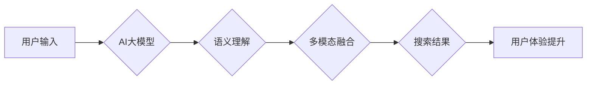

                 

## AI大模型：改善电商平台搜索结果多样性的新思路

> 关键词：电商平台、搜索结果、AI大模型、自然语言处理、推荐系统、多模态搜索、用户体验

## 1. 背景介绍

电商平台作为现代商业的重要组成部分，其搜索引擎是用户获取商品信息和完成购买的核心环节。然而，传统的基于关键词匹配的搜索算法往往难以满足用户日益增长的个性化需求，导致搜索结果单一、缺乏多样性，从而影响用户体验和转化率。

近年来，随着深度学习技术的快速发展，AI大模型在自然语言处理、图像识别等领域取得了突破性进展。这些模型具备强大的语义理解和知识表示能力，为改善电商平台搜索结果多样性提供了新的思路。

## 2. 核心概念与联系

### 2.1  AI大模型

AI大模型是指在海量数据上训练的深度学习模型，其参数规模庞大，具备强大的泛化能力和学习能力。常见的AI大模型包括BERT、GPT、T5等，它们在自然语言理解、文本生成、机器翻译等任务上表现出色。

### 2.2  电商平台搜索

电商平台搜索是指用户在平台上输入关键词或商品信息，系统根据算法规则返回匹配结果的过程。传统的搜索算法主要依赖关键词匹配，忽略了用户意图和语义理解，导致搜索结果缺乏针对性和多样性。

### 2.3  多模态搜索

多模态搜索是指融合文本、图像、音频等多种数据类型进行搜索，以提供更全面、更精准的搜索结果。AI大模型可以有效处理多模态数据，为电商平台搜索提供更丰富的搜索体验。

**核心概念与联系流程图**



## 3. 核心算法原理 & 具体操作步骤

### 3.1  算法原理概述

基于AI大模型的电商平台搜索算法主要包括以下步骤：

1. **用户意图理解:** 利用AI大模型对用户的搜索词进行语义分析，识别用户的真实需求和意图。
2. **商品信息表示:** 将商品信息转化为AI大模型可以理解的向量表示，例如使用BERT模型对商品标题、描述进行编码。
3. **搜索结果排序:** 根据用户意图和商品信息向量之间的相似度，对搜索结果进行排序，并返回多样化的结果集。
4. **结果展示优化:** 根据用户行为和偏好，对搜索结果进行个性化展示，例如推荐相关商品、提供商品评价等信息。

### 3.2  算法步骤详解

1. **数据预处理:** 收集电商平台的商品信息、用户搜索历史、商品评价等数据，并进行清洗、格式化等预处理操作。
2. **模型训练:** 利用预处理后的数据训练AI大模型，例如使用BERT模型进行预训练，然后进行微调，使其能够理解电商平台的特定语境。
3. **用户搜索:** 当用户输入搜索词时，将搜索词输入到训练好的AI大模型中，获取用户的意图向量。
4. **商品检索:** 根据用户的意图向量，检索与之相关的商品信息，并将其转化为向量表示。
5. **结果排序:** 利用相似度计算算法，例如余弦相似度，计算用户意图向量与商品信息向量的相似度，并对商品进行排序。
6. **结果展示:** 将排序后的商品信息返回给用户，并根据用户行为和偏好进行个性化展示。

### 3.3  算法优缺点

**优点:**

* **语义理解能力强:** AI大模型能够理解用户的真实意图，提供更精准的搜索结果。
* **多样性提升:** 通过融合多模态数据和语义分析，可以提供更丰富的搜索结果，满足用户多样化的需求。
* **个性化推荐:** 基于用户行为和偏好，可以提供个性化的商品推荐，提升用户体验。

**缺点:**

* **模型训练成本高:** 训练大型AI模型需要大量的计算资源和数据，成本较高。
* **模型解释性差:** AI大模型的决策过程较为复杂，难以解释其背后的逻辑，导致模型的可解释性较差。
* **数据安全问题:** AI模型训练需要使用大量用户数据，需要妥善处理用户隐私和数据安全问题。

### 3.4  算法应用领域

基于AI大模型的搜索算法在电商平台、搜索引擎、问答系统等领域具有广泛的应用前景。

## 4. 数学模型和公式 & 详细讲解 & 举例说明

### 4.1  数学模型构建

**用户意图向量:**

假设用户输入的搜索词为 $q$, 使用BERT模型对其进行编码，得到用户意图向量 $u_q$:

$$u_q = BERT(q)$$

**商品信息向量:**

假设商品信息包含标题、描述等文本信息，使用BERT模型对其进行编码，得到商品信息向量 $v_i$:

$$v_i = BERT(t_i, d_i)$$

其中，$t_i$ 为商品标题，$d_i$ 为商品描述。

### 4.2  公式推导过程

**余弦相似度:**

计算用户意图向量 $u_q$ 与商品信息向量 $v_i$ 的余弦相似度，作为商品排序的依据:

$$sim(u_q, v_i) = \frac{u_q \cdot v_i}{||u_q|| ||v_i||}$$

其中，$\cdot$ 表示向量点积，$||u_q||$ 和 $||v_i||$ 分别表示用户意图向量和商品信息向量的模长。

### 4.3  案例分析与讲解

假设用户搜索关键词为 "智能手机", 系统会根据用户的搜索词生成用户意图向量 $u_q$. 然后，系统会检索所有商品信息，并将其转化为向量表示 $v_i$. 最后，根据余弦相似度计算用户意图向量 $u_q$ 与每个商品信息向量 $v_i$ 的相似度，并对商品进行排序，将与 "智能手机" 相关度最高的商品展示在搜索结果的第一位。

## 5. 项目实践：代码实例和详细解释说明

### 5.1  开发环境搭建

* Python 3.7+
* TensorFlow 2.x 或 PyTorch 1.x
* CUDA 和 cuDNN (可选，用于GPU加速)
* 其他依赖库：transformers, numpy, pandas等

### 5.2  源代码详细实现

```python
from transformers import AutoTokenizer, AutoModel

# 加载预训练模型和词典
model_name = "bert-base-uncased"
tokenizer = AutoTokenizer.from_pretrained(model_name)
model = AutoModel.from_pretrained(model_name)

# 用户搜索词
query = "智能手机"

# 商品信息
products = [
    {"title": "小米13", "description": "高性能旗舰手机"},
    {"title": "华为P60", "description": "影像旗舰手机"},
    {"title": "苹果iPhone 14", "description": "高端智能手机"},
]

# 对用户搜索词和商品信息进行编码
query_encoding = tokenizer(query, return_tensors="pt")
product_encodings = []
for product in products:
    product_encoding = tokenizer(product["title"] + " " + product["description"], return_tensors="pt")
    product_encodings.append(product_encoding)

# 使用预训练模型获取语义向量
query_vector = model(**query_encoding).last_hidden_state[:, 0, :]
product_vectors = [model(**encoding).last_hidden_state[:, 0, :] for encoding in product_encodings]

# 计算余弦相似度
similarities = []
for product_vector in product_vectors:
    similarity = torch.cosine_similarity(query_vector, product_vector)
    similarities.append(similarity.item())

# 根据相似度排序商品
sorted_products = sorted(zip(products, similarities), key=lambda x: x[1], reverse=True)

# 打印排序后的商品
for product, similarity in sorted_products:
    print(f"商品: {product['title']}, 相似度: {similarity:.4f}")
```

### 5.3  代码解读与分析

* 代码首先加载预训练的BERT模型和词典。
* 然后，对用户搜索词和商品信息进行编码，得到相应的语义向量。
* 使用预训练模型获取语义向量，并计算用户意图向量与每个商品信息向量的余弦相似度。
* 根据相似度对商品进行排序，并打印排序后的商品信息。

### 5.4  运行结果展示

运行代码后，会输出与 "智能手机" 相关度最高的商品信息，并显示其与用户搜索词的相似度。

## 6. 实际应用场景

### 6.1  电商平台搜索

基于AI大模型的搜索算法可以应用于电商平台的搜索引擎，提供更精准、更多样化的搜索结果，提升用户体验和转化率。

### 6.2  个性化推荐

AI大模型可以分析用户的搜索历史、购买记录、浏览行为等数据，为用户提供个性化的商品推荐，提高用户粘性和购买意愿。

### 6.3  多模态搜索

AI大模型可以融合文本、图像、音频等多种数据类型进行搜索，例如用户可以通过语音搜索商品，或者上传图片进行视觉搜索，提供更丰富的搜索体验。

### 6.4  未来应用展望

随着AI技术的不断发展，基于AI大模型的搜索算法将应用于更多领域，例如：

* **医疗诊断:** 利用AI大模型分析患者的症状、病史等信息，辅助医生进行诊断。
* **教育教学:** 利用AI大模型个性化推荐学习资源，提高学习效率。
* **金融理财:** 利用AI大模型分析用户的财务状况，提供个性化的理财建议。

## 7. 工具和资源推荐

### 7.1  学习资源推荐

* **书籍:**
    * 《深度学习》 - Ian Goodfellow, Yoshua Bengio, Aaron Courville
    * 《自然语言处理》 - Dan Jurafsky, James H. Martin
* **在线课程:**
    * Coursera: 深度学习 Specialization
    * Udacity: 自然语言处理 Nanodegree
* **博客和网站:**
    * TensorFlow Blog: https://blog.tensorflow.org/
    * PyTorch Blog: https://pytorch.org/blog/

### 7.2  开发工具推荐

* **深度学习框架:** TensorFlow, PyTorch
* **自然语言处理库:** transformers, spaCy, NLTK
* **数据处理工具:** Pandas, NumPy

### 7.3  相关论文推荐

* BERT: Pre-training of Deep Bidirectional Transformers for Language Understanding
* GPT: Generative Pre-trained Transformer
* T5: Text-to-Text Transfer Transformer

## 8. 总结：未来发展趋势与挑战

### 8.1  研究成果总结

基于AI大模型的电商平台搜索算法取得了显著的成果，能够提供更精准、更多样化的搜索结果，提升用户体验和转化率。

### 8.2  未来发展趋势

* **模型规模和能力提升:** 未来，AI大模型的规模和能力将进一步提升，能够更好地理解用户意图和商品信息。
* **多模态搜索的融合:** AI大模型将更加融合多模态数据，例如文本、图像、音频等，提供更丰富的搜索体验。
* **个性化推荐的精细化:** AI大模型将更加精细化地分析用户的行为数据，提供更加个性化的商品推荐。

### 8.3  面临的挑战

* **模型训练成本高:** 训练大型AI模型需要大量的计算资源和数据，成本较高。
* **模型解释性差:** AI模型的决策过程较为复杂，难以解释其背后的逻辑，导致模型的可解释性较差。
* **数据安全问题:** AI模型训练需要使用大量用户数据，需要妥善处理用户隐私和数据安全问题。

### 8.4  研究展望

未来，研究者将继续探索AI大模型在电商平台搜索领域的应用，并致力于解决模型训练成本高、模型解释性差、数据安全问题等挑战，推动AI技术在电商领域的更广泛应用。

## 9. 附录：常见问题与解答

**Q1: 如何选择合适的AI大模型？**

A1: 选择合适的AI大模型需要根据具体应用场景和需求进行选择。例如，对于电商平台搜索，可以选择预训练好的BERT模型，因为它在自然语言理解方面表现出色。

**Q2: 如何处理用户数据隐私问题？**

A2: 处理用户数据隐私问题需要采取以下措施:

* **数据匿名化:** 将用户数据进行匿名处理，去除个人识别信息。
* **数据加密:** 使用加密技术保护用户数据的安全。
* **数据最小化:** 只收集必要的用户数据，避免过度收集。
* **用户隐私政策:** 明确告知用户数据的使用方式和隐私保护措施。

**Q3: 如何评估AI大模型的性能？**

A3: 可以使用以下指标评估AI大模型的性能:

* **准确率:** 模型预测结果与真实结果的匹配度。
* **召回率:** 模型能够召回所有真实结果的比例。
* **F1-score:** 准确率和召回率的调和平均值。
* **用户满意度:** 用户对模型搜索结果的满意度。


作者：禅与计算机程序设计艺术 / Zen and the Art of Computer Programming 
<end_of_turn>

