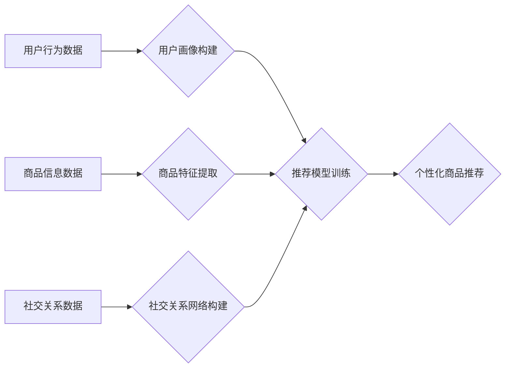

                 

## AI推荐在社交电商中的创新应用

> 关键词：社交电商、推荐系统、深度学习、协同过滤、内容推荐、个性化推荐、用户画像

## 1. 背景介绍

社交电商作为电商新模式的代表，以其社交属性和用户粘性，迅速崛起，成为电商领域的新增长点。社交电商平台将商品交易与社交互动相结合，用户可以通过社交关系链进行商品浏览、购买和分享，形成了一种全新的消费体验。然而，面对海量商品和用户，如何精准推荐用户感兴趣的商品，提升用户购物体验，成为社交电商平台面临的重大挑战。

传统的推荐系统主要依赖于用户历史行为和商品特征，例如协同过滤、基于内容的推荐等。但随着社交电商平台的快速发展，用户行为更加复杂多样，商品信息更加丰富，传统的推荐算法难以满足用户个性化需求。

人工智能技术的快速发展为社交电商推荐系统提供了新的机遇。深度学习算法能够从海量用户数据和商品数据中挖掘更深层的特征，实现更精准的商品推荐。

## 2. 核心概念与联系

社交电商推荐系统融合了传统推荐系统和社交网络分析，其核心概念包括：

* **用户画像:** 通过分析用户在社交平台上的行为、兴趣、偏好等信息，构建用户画像，刻画用户的个性化特征。
* **商品特征:**  提取商品的属性、类别、价格、评论等信息，构建商品特征向量，描述商品的本质属性。
* **社交关系:**  挖掘用户之间的社交关系，例如关注、好友、评论等，构建社交关系网络，利用社交关系信息辅助商品推荐。
* **内容推荐:**  根据用户兴趣和社交关系，推荐与用户相关的内容，例如商品信息、品牌故事、用户评价等。

**核心架构流程图:**



## 3. 核心算法原理 & 具体操作步骤

### 3.1  算法原理概述

深度学习算法在社交电商推荐系统中发挥着重要作用，例如：

* **协同过滤:**  基于用户历史行为和商品购买记录，预测用户对特定商品的兴趣。
* **内容推荐:**  基于商品特征和用户兴趣，推荐与用户偏好相符的商品。
* **图神经网络:**  利用社交关系网络信息，挖掘用户之间的潜在关系，提升推荐精准度。

### 3.2  算法步骤详解

以协同过滤算法为例，其具体操作步骤如下：

1. **数据预处理:**  收集用户行为数据和商品信息数据，进行清洗、转换和特征提取。
2. **用户-商品评分矩阵构建:**  将用户行为数据转换为用户-商品评分矩阵，其中每个元素表示用户对特定商品的评分或购买行为。
3. **模型训练:**  使用协同过滤算法训练模型，例如基于矩阵分解的协同过滤算法，学习用户和商品之间的潜在关系。
4. **预测评分:**  将训练好的模型应用于新的用户和商品组合，预测用户对特定商品的评分或购买行为。
5. **推荐排序:**  根据预测评分，对商品进行排序，推荐给用户。

### 3.3  算法优缺点

**优点:**

* 能够捕捉用户隐性偏好，推荐更精准的商品。
* 算法模型相对简单，易于理解和实现。

**缺点:**

* 数据稀疏性问题，当用户行为数据不足时，算法效果会下降。
* 冷启动问题，对于新用户和新商品，算法难以进行准确推荐。

### 3.4  算法应用领域

协同过滤算法广泛应用于电商推荐系统、电影推荐系统、音乐推荐系统等领域。

## 4. 数学模型和公式 & 详细讲解 & 举例说明

### 4.1  数学模型构建

协同过滤算法的核心是构建用户-商品评分矩阵，并利用矩阵分解技术学习用户和商品之间的潜在关系。

假设用户集合为U，商品集合为I，用户-商品评分矩阵为R，其中R(u,i)表示用户u对商品i的评分。

### 4.2  公式推导过程

矩阵分解模型将用户-商品评分矩阵分解成两个低维矩阵：用户特征矩阵P和商品特征矩阵Q。

$$R \approx P Q^T$$

其中，P(u,k)表示用户u在第k个潜在特征上的评分，Q(i,k)表示商品i在第k个潜在特征上的评分。

目标函数是最小化预测评分与实际评分之间的误差，可以使用均方误差作为损失函数。

$$Loss = \frac{1}{2} \sum_{u \in U, i \in I} (R(u,i) - P(u) Q(i))^2$$

### 4.3  案例分析与讲解

假设有三个用户和三个商品，用户-商品评分矩阵为：

$$R = \begin{bmatrix}
5 & 3 & 4 \\
4 & 5 & 2 \\
3 & 2 & 5
\end{bmatrix}$$

使用矩阵分解模型，可以将用户-商品评分矩阵分解成两个低维矩阵，例如：

$$P = \begin{bmatrix}
0.8 & 0.6 \\
0.5 & 0.7 \\
0.3 & 0.4
\end{bmatrix}, Q = \begin{bmatrix}
0.9 & 0.7 & 0.5 \\
0.6 & 0.8 & 0.9
\end{bmatrix}$$

通过计算PQ^T，可以得到预测评分矩阵，并与实际评分矩阵进行比较，评估模型的性能。

## 5. 项目实践：代码实例和详细解释说明

### 5.1  开发环境搭建

推荐系统开发环境通常包括：

* **编程语言:** Python
* **深度学习框架:** TensorFlow、PyTorch
* **数据处理工具:** Pandas、NumPy
* **云计算平台:** AWS、Azure、GCP

### 5.2  源代码详细实现

以下是一个使用Python和TensorFlow实现协同过滤算法的简单代码示例：

```python
import tensorflow as tf

# 定义用户-商品评分矩阵
ratings = tf.constant([[5, 3, 4],
                      [4, 5, 2],
                      [3, 2, 5]])

# 定义用户特征矩阵和商品特征矩阵
num_users = ratings.shape[0]
num_items = ratings.shape[1]
latent_dim = 2

user_embeddings = tf.Variable(tf.random.normal([num_users, latent_dim]))
item_embeddings = tf.Variable(tf.random.normal([num_items, latent_dim]))

# 计算预测评分
predictions = tf.matmul(user_embeddings, item_embeddings, transpose_b=True)

# 定义损失函数
loss = tf.reduce_mean(tf.square(ratings - predictions))

# 定义优化器
optimizer = tf.keras.optimizers.Adam()

# 训练模型
for epoch in range(100):
    with tf.GradientTape() as tape:
        loss_value = loss
    gradients = tape.gradient(loss_value, [user_embeddings, item_embeddings])
    optimizer.apply_gradients(zip(gradients, [user_embeddings, item_embeddings]))

# 打印损失值
print(loss_value)
```

### 5.3  代码解读与分析

* 代码首先定义用户-商品评分矩阵和潜在特征维度。
* 然后初始化用户特征矩阵和商品特征矩阵。
* 使用矩阵乘法计算预测评分。
* 定义均方误差作为损失函数，并使用Adam优化器训练模型。
* 训练完成后，打印损失值，评估模型性能。

### 5.4  运行结果展示

运行代码后，会输出模型训练过程中损失值的变化趋势，可以观察到损失值随着训练epochs的增加逐渐降低，表明模型正在学习用户和商品之间的潜在关系。

## 6. 实际应用场景

社交电商推荐系统在以下场景中发挥着重要作用：

* **商品推荐:**  根据用户兴趣和行为，推荐相关商品，提升用户购物体验。
* **内容推荐:**  推荐与用户兴趣相关的商品信息、品牌故事、用户评价等内容，增强用户粘性。
* **社交营销:**  利用社交关系网络，推荐商品给用户的朋友，实现病毒式传播。

### 6.4  未来应用展望

随着人工智能技术的不断发展，社交电商推荐系统将朝着以下方向发展：

* **更精准的推荐:**  利用更先进的深度学习算法，挖掘更深层的用户特征和商品关系，实现更精准的商品推荐。
* **个性化推荐:**  根据用户的个性化需求，提供定制化的商品推荐，提升用户体验。
* **多模态推荐:**  融合文本、图像、视频等多模态数据，实现更丰富的商品推荐。

## 7. 工具和资源推荐

### 7.1  学习资源推荐

* **书籍:**
    * 《推荐系统实践》
    * 《深度学习》
* **在线课程:**
    * Coursera: Machine Learning
    * Udacity: Deep Learning Nanodegree

### 7.2  开发工具推荐

* **深度学习框架:** TensorFlow、PyTorch
* **数据处理工具:** Pandas、NumPy
* **云计算平台:** AWS、Azure、GCP

### 7.3  相关论文推荐

* **协同过滤:**
    * "Collaborative Filtering for Implicit Feedback Datasets"
    * "Matrix Factorization Techniques for Recommender Systems"
* **图神经网络:**
    * "Graph Convolutional Networks for Web-Scale Recommender Systems"
    * "Deep Graph Infomax"

## 8. 总结：未来发展趋势与挑战

### 8.1  研究成果总结

社交电商推荐系统在人工智能技术的推动下取得了显著进展，能够提供更精准、个性化的商品推荐，提升用户购物体验。

### 8.2  未来发展趋势

未来社交电商推荐系统将朝着更精准、个性化、多模态的方向发展，并与其他技术融合，例如自然语言处理、计算机视觉等。

### 8.3  面临的挑战

社交电商推荐系统仍然面临一些挑战，例如数据稀疏性、冷启动问题、用户隐私保护等。

### 8.4  研究展望

未来研究将重点关注以下方面：

* 开发更鲁棒的推荐算法，解决数据稀疏性和冷启动问题。
* 探索更有效的用户画像构建方法，提升推荐精准度。
* 研究多模态推荐技术，提供更丰富的用户体验。
* 加强用户隐私保护，构建安全可靠的推荐系统。

## 9. 附录：常见问题与解答

* **Q1: 如何解决数据稀疏性问题？**

* **A1:** 可以使用以下方法解决数据稀疏性问题：
    * 使用协同过滤算法的改进版本，例如基于矩阵分解的协同过滤算法。
    * 利用其他数据源，例如用户画像、商品信息等，丰富用户-商品评分矩阵。
    * 使用迁移学习技术，将已训练好的模型迁移到新的数据集上。

* **Q2: 如何解决冷启动问题？**

* **A2:** 可以使用以下方法解决冷启动问题：
    * 利用用户画像和商品信息，对新用户和新商品进行初始推荐。
    * 使用基于内容的推荐算法，推荐与新用户或新商品相关的商品。
    * 收集用户反馈，不断更新推荐模型。


作者：禅与计算机程序设计艺术 / Zen and the Art of Computer Programming 
<end_of_turn>

