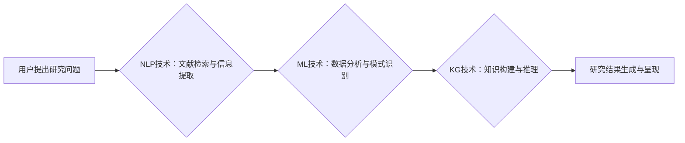

                 

## 关键词：人工智能、学术研究、自然语言处理、知识图谱、机器学习、数据挖掘

## 1. 背景介绍

学术研究是人类文明进步的基石，它推动着科技发展、社会进步和人类认知的提升。然而，传统的学术研究方式面临着诸多挑战，例如信息爆炸、研究效率低下、重复性工作繁多等。随着人工智能技术的飞速发展，AI技术为学术研究带来了新的机遇和可能性，有望彻底改变学术研究的模式和效率。

近年来，人工智能在学术研究领域的应用已经取得了显著进展。例如，自然语言处理（NLP）技术可以帮助学者快速阅读和理解大量文献，提取关键信息，发现研究热点和潜在的研究方向；机器学习（ML）算法可以帮助学者分析复杂数据，发现隐藏的模式和规律，并辅助进行数据驱动的研究；知识图谱（KG）技术可以帮助学者构建学科知识体系，实现知识的组织、共享和重用。

## 2. 核心概念与联系

AI辅助学术研究的核心概念包括：

* **自然语言处理（NLP）：** 致力于使计算机能够理解、处理和生成人类语言。在学术研究中，NLP技术可以用于文献综述、关键词提取、文本摘要、研究方向发现等。
* **机器学习（ML）：** 是一种人工智能技术，通过算法学习数据中的模式，并根据学习到的模式进行预测或分类。在学术研究中，ML技术可以用于数据分析、研究趋势预测、论文质量评估等。
* **知识图谱（KG）：**  一种结构化的知识表示形式，将知识表示为实体和关系的网络。在学术研究中，KG技术可以帮助学者构建学科知识体系，实现知识的组织、共享和重用。

**AI辅助学术研究的流程图：**



## 3. 核心算法原理 & 具体操作步骤

### 3.1  算法原理概述

在AI辅助学术研究中，常用的算法包括：

* **文本分类算法：** 用于将文本归类到预定义的类别中，例如文献主题分类、研究方向分类等。常见的文本分类算法包括朴素贝叶斯算法、支持向量机（SVM）算法、深度学习算法等。
* **关键词提取算法：** 用于从文本中提取最重要的关键词，例如文献关键词提取、研究热点关键词提取等。常见的关键词提取算法包括TF-IDF算法、RAKE算法、LDA算法等。
* **文本摘要算法：** 用于生成文本的简短摘要，例如文献摘要生成、会议论文摘要生成等。常见的文本摘要算法包括抽取式摘要算法、生成式摘要算法等。
* **知识图谱构建算法：** 用于从文本数据中提取实体和关系，构建知识图谱。常见的知识图谱构建算法包括规则抽取、机器学习、深度学习等。

### 3.2  算法步骤详解

以文本分类算法为例，其具体操作步骤如下：

1. **数据预处理：** 对文本数据进行清洗、分词、词干提取等预处理操作，以便于算法训练和使用。
2. **特征提取：** 从预处理后的文本数据中提取特征，例如词频、词向量、语法结构等。
3. **模型训练：** 使用训练数据训练文本分类模型，例如朴素贝叶斯模型、SVM模型、深度学习模型等。
4. **模型评估：** 使用测试数据评估模型的性能，例如准确率、召回率、F1-score等。
5. **模型部署：** 将训练好的模型部署到实际应用场景中，用于对新文本进行分类。

### 3.3  算法优缺点

不同的算法具有不同的优缺点，需要根据实际应用场景选择合适的算法。例如，朴素贝叶斯算法简单易实现，但对特征选择敏感；SVM算法性能较好，但训练时间较长；深度学习算法性能更优，但需要大量数据进行训练。

### 3.4  算法应用领域

AI辅助学术研究的算法应用领域广泛，例如：

* **文献综述：** 自动生成文献综述，快速了解研究领域最新进展。
* **研究方向发现：** 挖掘文献中的研究热点和潜在的研究方向。
* **论文质量评估：** 利用机器学习算法对论文质量进行评估，提高论文筛选效率。
* **数据分析：** 利用机器学习算法分析复杂数据，发现隐藏的模式和规律。
* **知识发现：** 利用知识图谱技术构建学科知识体系，实现知识的组织、共享和重用。

## 4. 数学模型和公式 & 详细讲解 & 举例说明

### 4.1  数学模型构建

在AI辅助学术研究中，常用的数学模型包括：

* **词向量模型：** 将单词映射到低维向量空间，捕捉单词之间的语义关系。常见的词向量模型包括Word2Vec、GloVe等。
* **主题模型：** 用于从文本数据中发现潜在的主题，例如LDA主题模型。
* **知识图谱模型：** 用于表示实体和关系，构建知识图谱。常见的知识图谱模型包括RDF、OWL等。

### 4.2  公式推导过程

以Word2Vec模型为例，其目标是学习一个词向量表示，使得相似的单词在向量空间中距离较近。Word2Vec模型使用神经网络结构，包括输入层、隐藏层和输出层。

**Word2Vec模型的损失函数：**

$$
J(\theta) = -\frac{1}{N} \sum_{i=1}^{N} \sum_{j \in \mathcal{C}(w_i)} \log p(j|w_i)
$$

其中：

* $\theta$ 是模型参数
* $N$ 是训练样本数量
* $w_i$ 是第 $i$ 个单词
* $\mathcal{C}(w_i)$ 是 $w_i$ 的上下文单词集合
* $p(j|w_i)$ 是给定 $w_i$ 的条件下单词 $j$ 的概率

### 4.3  案例分析与讲解

Word2Vec模型可以用于许多任务，例如：

* **单词相似度计算：** 计算两个单词之间的语义相似度。例如，"国王" 和 "皇后" 的相似度较高。
* **词义消歧：** 对于多义词，根据上下文语境确定其正确的词义。
* **文本分类：** 将文本分类到预定义的类别中。例如，将新闻文章分类到不同的主题类别中。

## 5. 项目实践：代码实例和详细解释说明

### 5.1  开发环境搭建

AI辅助学术研究项目可以使用Python语言进行开发，常用的库包括：

* **NLTK：** 自然语言处理工具包
* **spaCy：** 高性能自然语言处理库
* **Gensim：** 主题模型和词向量模型库
* **TensorFlow：** 深度学习框架
* **PyTorch：** 深度学习框架

### 5.2  源代码详细实现

以下是一个使用Gensim库进行文本主题模型训练的代码示例：

```python
from gensim import corpora
from gensim.models import LdaModel

# 文本数据
documents = [
    "This is the first document.",
    "This document is the second document.",
    "And this is the third one.",
    "Is this the first document?"
]

# 词汇表
dictionary = corpora.Dictionary(documents)

# 词袋模型
corpus = [dictionary.doc2bow(doc) for doc in documents]

# 主题模型训练
lda_model = LdaModel(corpus=corpus, id2word=dictionary, num_topics=2)

# 打印主题分布
print(lda_model.print_topics())
```

### 5.3  代码解读与分析

* **corpora.Dictionary()：** 创建词汇表，将每个单词映射到一个唯一的ID。
* **dictionary.doc2bow()：** 将文本文档转换为词袋模型，表示每个文档中每个单词的词频。
* **LdaModel()：** 训练LDA主题模型，将文档聚类到不同的主题中。
* **lda_model.print_topics()：** 打印每个主题的关键词分布。

### 5.4  运行结果展示

运行上述代码后，会输出每个主题的关键词分布，例如：

```
(0, '0.167*"document" + 0.142*"this" + 0.119*"is" + 0.098*"the" + 0.087*"one"')
(1, '0.197*"first" + 0.178*"second" + 0.156*"third" + 0.131*"and" + 0.108*"document"')
```

这表明，第一个主题主要关注文档的概念，第二个主题主要关注文档的顺序。

## 6. 实际应用场景

AI辅助学术研究已经应用于多个领域，例如：

* **文献综述：** 自动生成文献综述，节省时间和精力。
* **研究方向发现：** 挖掘文献中的研究热点和潜在的研究方向，为学者提供新的研究思路。
* **论文质量评估：** 利用机器学习算法对论文质量进行评估，提高论文筛选效率。
* **数据分析：** 利用机器学习算法分析复杂数据，发现隐藏的模式和规律。
* **知识发现：** 利用知识图谱技术构建学科知识体系，实现知识的组织、共享和重用。

### 6.4  未来应用展望

未来，AI辅助学术研究将更加深入地融入学术研究各个环节，例如：

* **智能问答系统：** 能够理解学术问题，并提供准确的答案。
* **个性化学习平台：** 根据学者的学习风格和需求，提供个性化的学习资源和指导。
* **协同研究平台：** 帮助学者进行协同研究，共享知识和资源。

## 7. 工具和资源推荐

### 7.1  学习资源推荐

* **Stanford NLP Group：** https://nlp.stanford.edu/
* **DeepLearning.AI：** https://www.deeplearning.ai/
* **Hugging Face：** https://huggingface.co/

### 7.2  开发工具推荐

* **Python：** https://www.python.org/
* **NLTK：** https://www.nltk.org/
* **spaCy：** https://spacy.io/
* **Gensim：** https://radimrehurek.com/gensim/

### 7.3  相关论文推荐

* **Word2Vec：** Mikolov, T., Sutskever, I., Chen, K., Corrado, G. S., & Dean, J. (2013). Distributed representations of words and phrases and their compositionality. Advances in neural information processing systems, 26.
* **LDA主题模型：** Blei, D. M., Ng, A. Y., & Jordan, M. I. (2003). Latent dirichlet allocation. Journal of machine learning research, 3(Jan), 993-1022.

## 8. 总结：未来发展趋势与挑战

### 8.1  研究成果总结

AI辅助学术研究取得了显著进展，为学术研究带来了新的机遇和可能性。NLP、ML和KG技术为学术研究提供了强大的工具，可以帮助学者更高效地进行文献综述、研究方向发现、论文质量评估、数据分析和知识发现等工作。

### 8.2  未来发展趋势

未来，AI辅助学术研究将朝着以下方向发展：

* **更深层次的理解：** AI模型将能够更深入地理解学术文本，例如理解逻辑关系、推理能力等。
* **更个性化的服务：** AI系统将能够根据学者的个性化需求提供更精准的学术服务。
* **更广泛的应用场景：** AI技术将应用于学术研究的更多环节，例如教学、科研管理等。

### 8.3  面临的挑战

AI辅助学术研究也面临着一些挑战：

* **数据质量问题：** AI模型的性能依赖于高质量的数据，而学术数据往往存在不完整、不一致等问题。
* **算法解释性问题：** 许多AI算法是黑箱模型，难以解释其决策过程，这可能会影响学者的信任和接受度。
* **伦理问题：** AI技术可能会带来一些伦理问题，例如数据隐私、算法偏见等，需要引起重视和解决。

### 8.4  研究展望

未来，我们需要继续加强AI辅助学术研究的理论研究和技术开发，解决上述挑战，推动AI技术更好地服务于学术研究，促进人类文明的进步。

## 9. 附录：常见问题与解答

**Q1：AI辅助学术研究会取代人类学者吗？**

A1：AI辅助学术研究不会取代人类学者，而是会成为人类学者工作的新工具，帮助学者更高效地进行研究。人类学者仍然需要发挥其创造力、批判性思维和解决问题的能力。

**Q2：如何保证AI辅助学术研究的准确性和可靠性？**

A2：保证AI辅助学术研究的准确性和可靠性需要从多个方面入手，例如：

* 使用高质量的数据进行训练。
* 选择合适的算法模型。
* 对模型进行严格的评估和测试。
* 结合人类专家进行审核和验证。

**Q3：AI辅助学术研究有哪些伦理问题？**

A3：AI辅助学术研究可能会带来一些伦理问题，例如：

* 数据隐私：AI模型需要访问大量学术数据，需要确保数据的隐私安全。
* 算法偏见：AI模型可能会受到训练数据的影响，产生偏见，需要进行算法公平性评估和修正。
* 知识产权：AI生成的学术成果的知识产权归属问题需要明确。


作者：禅与计算机程序设计艺术 / Zen and the Art of Computer Programming 
<end_of_turn>

