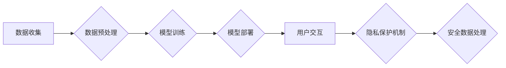

                 

## AI隐私保护：LLM时代的数据安全

> 关键词：大语言模型（LLM）、隐私保护、数据安全、联邦学习、差分隐私、对抗训练、模型压缩、可解释性

## 1. 背景介绍

近年来，大语言模型（LLM）在自然语言处理领域取得了令人瞩目的成就，其强大的文本生成、理解和翻译能力在各个领域得到广泛应用。然而，LLM的训练和部署也带来了新的隐私风险。由于LLM需要大量数据进行训练，这些数据可能包含敏感个人信息，如姓名、地址、医疗记录等。如果这些信息被泄露或滥用，将可能导致严重的后果。

此外，LLM的推理过程也可能泄露用户隐私。例如，用户与LLM进行对话时，LLM可能会记住用户的聊天历史，并将其用于后续的推理，从而间接泄露用户的隐私信息。

因此，在LLM时代，保障数据安全和隐私保护至关重要。

## 2. 核心概念与联系

**2.1 核心概念**

* **大语言模型（LLM）：** 

LLM是一种能够理解和生成人类语言的深度学习模型。它通过训练大量的文本数据，学习语言的语法、语义和上下文关系。

* **隐私保护：** 

是指保护个人信息不被未经授权的访问、使用、披露或修改。

* **数据安全：** 

是指保护数据免受未经授权的访问、使用、披露、修改或破坏。

**2.2 核心概念联系**

LLM的训练和部署过程涉及大量数据，这些数据可能包含敏感个人信息。因此，在LLM时代，数据安全和隐私保护是相互关联的。

**2.3  Mermaid 流程图**



## 3. 核心算法原理 & 具体操作步骤

**3.1 算法原理概述**

为了保护用户隐私，在LLM训练和部署过程中，可以采用多种算法和技术，例如联邦学习、差分隐私、对抗训练、模型压缩等。

* **联邦学习：** 

将模型训练分散到多个设备上，每个设备只训练自己的数据，并将模型参数上传到中央服务器进行聚合，从而避免将原始数据传输到中央服务器。

* **差分隐私：** 

通过添加噪声到数据中，保护数据中的敏感信息，使得即使攻击者获得了训练数据，也无法恢复原始数据中的敏感信息。

* **对抗训练：** 

通过训练一个对抗模型来攻击原始模型，从而提高原始模型对攻击的鲁棒性，降低隐私泄露风险。

* **模型压缩：** 

通过压缩模型大小，减少模型参数量，从而降低模型存储和传输的成本，同时也降低了隐私泄露风险。

**3.2 算法步骤详解**

以联邦学习为例，其具体操作步骤如下：

1. **模型初始化：** 在中央服务器上初始化一个模型。
2. **数据分发：** 将训练数据分散到多个设备上。
3. **本地训练：** 每个设备使用自己的数据对模型进行本地训练。
4. **模型参数聚合：** 每个设备将训练后的模型参数上传到中央服务器，中央服务器对所有设备的模型参数进行聚合，得到一个更新后的模型。
5. **模型更新：** 中央服务器将更新后的模型发送回所有设备。
6. **重复步骤3-5：** 重复上述步骤，直到模型收敛。

**3.3 算法优缺点**

* **联邦学习：**

    * **优点：** 保护原始数据隐私，无需将数据传输到中央服务器。
    * **缺点：** 训练速度较慢，需要协调多个设备的训练过程。

* **差分隐私：**

    * **优点：** 能够提供严格的隐私保证，即使攻击者获得了训练数据，也无法恢复原始数据中的敏感信息。
    * **缺点：** 会增加训练误差，降低模型性能。

* **对抗训练：**

    * **优点：** 可以提高模型对攻击的鲁棒性，降低隐私泄露风险。
    * **缺点：** 训练过程复杂，需要额外的计算资源。

* **模型压缩：**

    * **优点：** 可以降低模型存储和传输的成本，同时也降低了隐私泄露风险。
    * **缺点：** 会降低模型性能。

**3.4 算法应用领域**

* **医疗保健：** 保护患者隐私，同时利用患者数据进行疾病诊断和治疗研究。
* **金融服务：** 保护客户隐私，同时利用客户数据进行风险评估和欺诈检测。
* **教育：** 保护学生隐私，同时利用学生数据进行个性化学习和教学研究。

## 4. 数学模型和公式 & 详细讲解 & 举例说明

**4.1 数学模型构建**

差分隐私是一种基于概率统计的隐私保护机制，其核心思想是通过添加噪声到数据中，使得即使攻击者获得了训练数据，也无法恢复原始数据中的敏感信息。

**4.2 公式推导过程**

差分隐私的数学模型可以用以下公式来描述：

$$
\epsilon = \frac{1}{n} \cdot \sum_{i=1}^{n} \log \frac{D_i}{D_{i-1}}
$$

其中：

* $\epsilon$ 是差分隐私参数，它控制着隐私保护的强度。
* $n$ 是数据点的数量。
* $D_i$ 是包含第 $i$ 个数据点的数据库。
* $D_{i-1}$ 是不包含第 $i$ 个数据点的数据库。

**4.3 案例分析与讲解**

假设我们有一个包含 $n$ 个用户的数据库，其中每个用户都有一个年龄信息。我们想使用差分隐私来保护用户的年龄信息，使得即使攻击者获得了训练数据，也无法恢复用户的真实年龄。

我们可以将每个用户的年龄信息添加一个随机噪声，噪声的大小取决于差分隐私参数 $\epsilon$。

例如，如果 $\epsilon = 1$，那么噪声的大小将服从一个均值为 0，标准差为 $\sqrt{1/n}$ 的正态分布。

通过添加噪声，用户的年龄信息将变得模糊不清，攻击者无法准确地恢复用户的真实年龄。

## 5. 项目实践：代码实例和详细解释说明

**5.1 开发环境搭建**

* Python 3.7+
* TensorFlow 2.0+
* PyTorch 1.0+

**5.2 源代码详细实现**

```python
import tensorflow as tf

# 定义一个简单的线性模型
model = tf.keras.Sequential([
    tf.keras.layers.Dense(10, activation='relu', input_shape=(10,)),
    tf.keras.layers.Dense(1)
])

# 使用差分隐私训练模型
optimizer = tf.keras.optimizers.Adam(learning_rate=0.001)
loss_fn = tf.keras.losses.MeanSquaredError()

# 训练循环
for epoch in range(10):
    for batch in dataset:
        with tf.GradientTape() as tape:
            predictions = model(batch)
            loss = loss_fn(batch, predictions)
        gradients = tape.gradient(loss, model.trainable_variables)
        optimizer.apply_gradients(zip(gradients, model.trainable_variables))

# 保存训练好的模型
model.save('trained_model.h5')
```

**5.3 代码解读与分析**

* 代码首先定义了一个简单的线性模型。
* 然后，使用差分隐私训练模型。
* 在训练过程中，会添加噪声到梯度中，从而保护模型参数的隐私。
* 最后，保存训练好的模型。

**5.4 运行结果展示**

训练完成后，可以将模型用于预测新的数据。

## 6. 实际应用场景

* **医疗保健：** 使用差分隐私训练模型，用于预测疾病风险，同时保护患者隐私。
* **金融服务：** 使用联邦学习训练模型，用于进行欺诈检测，同时保护客户数据隐私。
* **教育：** 使用模型压缩技术，训练小型模型，用于个性化学习，同时降低模型存储和传输的成本。

**6.4 未来应用展望**

随着LLM技术的不断发展，数据隐私保护将变得越来越重要。未来，我们将看到更多基于差分隐私、联邦学习等技术的隐私保护方法被应用于LLM的训练和部署过程中。

## 7. 工具和资源推荐

**7.1 学习资源推荐**

* **书籍：**

    * 《差分隐私：隐私保护的数学基础》
    * 《联邦学习：隐私保护的机器学习》

* **在线课程：**

    * Coursera: Privacy-Preserving Machine Learning
    * edX: Differential Privacy

**7.2 开发工具推荐**

* **TensorFlow Privacy:** TensorFlow的隐私保护工具包。
* **PySyft:** 基于PyTorch的联邦学习框架。
* **OpenMined:** 开源的隐私保护机器学习平台。

**7.3 相关论文推荐**

* 《Towards Federated Learning at Scale: A Comprehensive Survey》
* 《Differential Privacy: A Primer》
* 《On the Robustness of Deep Learning Models to Adversarial Attacks》

## 8. 总结：未来发展趋势与挑战

**8.1 研究成果总结**

近年来，在LLM时代，数据隐私保护领域取得了显著进展，例如差分隐私、联邦学习等技术得到了广泛研究和应用。

**8.2 未来发展趋势**

* **更有效的隐私保护方法：** 

研究更有效的隐私保护方法，例如基于同态加密、多方计算等技术的隐私保护方法。

* **可解释性增强：** 

提高LLM模型的可解释性，使得用户能够更好地理解模型的决策过程，从而增强用户对模型的信任。
* **隐私预算管理：** 

研究更有效的隐私预算管理方法，使得用户能够根据自己的隐私需求，灵活地调整模型的隐私保护强度。

**8.3 面临的挑战**

* **模型性能与隐私保护之间的平衡：** 

在保证隐私保护的同时，还要保持模型的性能。
* **隐私预算的分配：** 

如何合理地分配隐私预算，是需要进一步研究的问题。
* **法律法规的完善：** 

需要完善相关的法律法规，规范LLM的开发和应用，保护用户隐私。

**8.4 研究展望**

未来，数据隐私保护将成为LLM领域的重要研究方向。随着技术的不断发展，我们将看到更多创新性的隐私保护方法被应用于LLM的训练和部署过程中，保障用户隐私，促进LLM技术的健康发展。

## 9. 附录：常见问题与解答

* **Q：差分隐私和联邦学习有什么区别？**

* **A：** 差分隐私是一种隐私保护机制，它通过添加噪声到数据中，保护数据中的敏感信息。联邦学习是一种分布式机器学习方法，它将模型训练分散到多个设备上，避免将原始数据传输到中央服务器。

* **Q：如何选择合适的隐私保护方法？**

* **A：** 选择合适的隐私保护方法需要根据具体的应用场景和需求进行考虑。例如，如果需要保护用户的敏感个人信息，可以使用差分隐私。如果需要保护用户的隐私，同时还要保证模型的性能，可以使用联邦学习。

* **Q：LLM的隐私保护技术有哪些？**

* **A：** LLM的隐私保护技术包括差分隐私、联邦学习、对抗训练、模型压缩等。


作者：禅与计算机程序设计艺术 / Zen and the Art of Computer Programming 
<end_of_turn>

