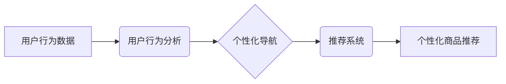

                 

## AI驱动的电商个性化导航优化

> 关键词：电商个性化、导航优化、人工智能、推荐系统、深度学习、用户行为分析、自然语言处理

## 1. 背景介绍

随着电商行业的蓬勃发展，用户对购物体验的需求日益提高。传统的电商平台导航结构往往过于僵化，难以满足用户个性化的需求。如何精准引导用户，提升购物效率和转化率，成为电商平台亟待解决的关键问题。

人工智能技术的快速发展为电商个性化导航优化提供了新的机遇。通过对用户行为、偏好和购物历史的深度分析，AI算法可以构建个性化的导航路径，推荐更符合用户需求的商品和服务。

## 2. 核心概念与联系

### 2.1  电商个性化导航

电商个性化导航是指根据用户的个人特征、购物历史、浏览行为等信息，定制化地引导用户浏览商品和服务，提供更精准、更便捷的购物体验。

### 2.2  AI驱动的推荐系统

推荐系统是AI驱动的电商个性化导航的核心技术之一。通过分析用户的行为数据，推荐系统可以预测用户对哪些商品感兴趣，并将其推荐给用户。

### 2.3  用户行为分析

用户行为分析是指通过收集和分析用户的行为数据，例如浏览记录、购买记录、评价记录等，以了解用户的购物偏好、兴趣爱好和消费习惯。

**核心概念与联系流程图**



## 3. 核心算法原理 & 具体操作步骤

### 3.1  算法原理概述

常用的电商个性化导航算法包括：

* **基于内容的推荐算法:** 根据商品的属性和描述，推荐与用户过去浏览或购买的商品相似的商品。
* **基于协同过滤的推荐算法:** 根据用户的历史购买行为，推荐与具有相似购买偏好的其他用户购买过的商品。
* **基于深度学习的推荐算法:** 利用深度神经网络，从用户的行为数据中学习更复杂的特征，进行更精准的商品推荐。

### 3.2  算法步骤详解

以基于协同过滤的推荐算法为例，其具体操作步骤如下：

1. **数据收集:** 收集用户的历史购买行为数据，例如用户ID、商品ID、购买时间等。
2. **用户-商品矩阵构建:** 将用户和商品信息构建成一个用户-商品矩阵，其中每个元素表示用户对商品的评分或购买行为。
3. **相似用户/商品计算:** 利用余弦相似度等算法，计算用户之间的相似度或商品之间的相似度。
4. **推荐商品:** 根据用户的相似用户或商品，推荐用户可能感兴趣的商品。

### 3.3  算法优缺点

**基于协同过滤的推荐算法:**

* **优点:** 可以发现用户之间的隐性关联，推荐更个性化的商品。
* **缺点:** 数据稀疏性问题，当用户购买历史数据较少时，难以准确计算相似度。

### 3.4  算法应用领域

基于协同过滤的推荐算法广泛应用于电商平台、音乐平台、视频平台等，用于个性化商品推荐、音乐推荐、视频推荐等场景。

## 4. 数学模型和公式 & 详细讲解 & 举例说明

### 4.1  数学模型构建

**用户-商品矩阵:**

设用户集合为U，商品集合为I，用户-商品矩阵为R，其中R(u,i)表示用户u对商品i的评分或购买行为。

**相似度计算:**

常用的相似度计算方法包括余弦相似度、皮尔逊相关系数等。

**余弦相似度:**

$$
\text{相似度}(u,v) = \frac{\mathbf{u} \cdot \mathbf{v}}{\|\mathbf{u}\| \|\mathbf{v}\|}
$$

其中，u和v分别表示两个用户的向量表示，$\cdot$表示点积，$\|\mathbf{u}\|$和$\|\mathbf{v}\|$分别表示u和v的范数。

### 4.2  公式推导过程

余弦相似度的推导过程如下：

1. 将用户u和v的向量表示分别为$\mathbf{u}$和$\mathbf{v}$。
2. 计算两个向量的点积$\mathbf{u} \cdot \mathbf{v}$。
3. 计算两个向量的范数$\|\mathbf{u}\|$和$\|\mathbf{v}\|$。
4. 将点积除以两个向量的范数的乘积，得到余弦相似度。

### 4.3  案例分析与讲解

假设有两个用户A和B，他们的购买行为数据如下：

| 商品 | A | B |
|---|---|---|
| 商品1 | 5 | 4 |
| 商品2 | 3 | 2 |
| 商品3 | 4 | 5 |

我们可以将用户的购买行为数据表示成向量：

* $\mathbf{A} = [5, 3, 4]$
* $\mathbf{B} = [4, 2, 5]$

计算两个向量的余弦相似度：

$$
\text{相似度}(A,B) = \frac{[5, 3, 4] \cdot [4, 2, 5]}{\sqrt{5^2 + 3^2 + 4^2} \sqrt{4^2 + 2^2 + 5^2}} = \frac{20 + 6 + 20}{\sqrt{50} \sqrt{45}} = \frac{46}{\sqrt{2250}} \approx 0.96
$$

余弦相似度为0.96，表明用户A和B的购买行为非常相似。

## 5. 项目实践：代码实例和详细解释说明

### 5.1  开发环境搭建

* Python 3.x
* TensorFlow/PyTorch
* Scikit-learn

### 5.2  源代码详细实现

```python
# 导入必要的库
import pandas as pd
from sklearn.metrics.pairwise import cosine_similarity

# 加载用户-商品矩阵数据
data = pd.read_csv('user_item_matrix.csv')

# 计算用户之间的余弦相似度
similarity_matrix = cosine_similarity(data)

# 获取用户A的相似用户
user_A_id = 1
similar_users = similarity_matrix[user_A_id].argsort()[:-6:-1]  # 获取前5个相似用户

# 推荐商品给用户A
recommended_items = data.iloc[similar_users].mean().sort_values(ascending=False)
```

### 5.3  代码解读与分析

* 首先，我们导入必要的库，并加载用户-商品矩阵数据。
* 然后，我们使用Scikit-learn库中的`cosine_similarity`函数计算用户之间的余弦相似度。
* 接着，我们获取用户A的相似用户，并推荐用户A可能感兴趣的商品。

### 5.4  运行结果展示

运行代码后，我们可以得到用户A的相似用户列表和推荐商品列表。

## 6. 实际应用场景

### 6.1  商品推荐

AI驱动的个性化导航可以根据用户的兴趣和购买历史，推荐更符合用户需求的商品。

### 6.2  导航引导

AI算法可以分析用户的浏览行为，引导用户浏览更相关的商品和服务，提高用户购物效率。

### 6.3  个性化营销

AI可以根据用户的个人特征和行为数据，进行个性化的营销推广，提高营销效果。

### 6.4  未来应用展望

随着人工智能技术的不断发展，AI驱动的电商个性化导航将更加智能化、精准化，为用户提供更个性化、更便捷的购物体验。

## 7. 工具和资源推荐

### 7.1  学习资源推荐

* **书籍:**
    * 《推荐系统实践》
    * 《深度学习》
* **在线课程:**
    * Coursera: Recommender Systems
    * Udacity: Deep Learning Nanodegree

### 7.2  开发工具推荐

* **Python:** 
    * TensorFlow
    * PyTorch
    * Scikit-learn
* **云平台:**
    * AWS
    * Azure
    * Google Cloud

### 7.3  相关论文推荐

* **Collaborative Filtering for Implicit Feedback Datasets**
* **Deep Learning for Recommender Systems**

## 8. 总结：未来发展趋势与挑战

### 8.1  研究成果总结

AI驱动的电商个性化导航已经取得了显著的成果，为用户提供了更便捷、更个性化的购物体验。

### 8.2  未来发展趋势

* **更精准的推荐:** 利用更先进的AI算法，例如强化学习、迁移学习等，进行更精准的商品推荐。
* **多模态融合:** 将文本、图像、视频等多模态数据融合，构建更全面的用户画像，进行更个性化的导航。
* **实时个性化:** 基于用户的实时行为数据，动态调整导航路径，提供更实时、更个性化的购物体验。

### 8.3  面临的挑战

* **数据隐私保护:** 如何保护用户的隐私数据，是AI驱动的电商个性化导航面临的重要挑战。
* **算法可解释性:** 如何提高AI算法的可解释性，让用户理解推荐结果背后的逻辑，也是一个重要的研究方向。
* **算法公平性:** 如何避免算法产生偏见，确保推荐结果公平公正，也是需要解决的问题。

### 8.4  研究展望

未来，AI驱动的电商个性化导航将朝着更智能化、更精准化、更个性化的方向发展，为用户提供更便捷、更愉快的购物体验。


## 9. 附录：常见问题与解答

**Q1: 如何评估AI驱动的电商个性化导航的效果？**

**A1:** 可以通过以下指标评估效果：

* 点击率
* 购买转化率
* 用户满意度

**Q2: 如何解决数据稀疏性问题？**

**A2:** 可以采用以下方法解决数据稀疏性问题：

* 利用协同过滤算法中的矩阵分解技术
* 使用深度学习算法，例如神经网络，学习更复杂的特征
* 利用其他数据源，例如用户画像数据，补充用户-商品交互数据

**Q3: 如何保证算法的公平性？**

**A3:** 可以采用以下方法保证算法的公平性：

* 使用公平性约束条件进行模型训练
* 对模型进行公平性评估，并进行调整
* 定期对算法进行审计，确保算法公平公正

作者：禅与计算机程序设计艺术 / Zen and the Art of Computer Programming 


<end_of_turn>

