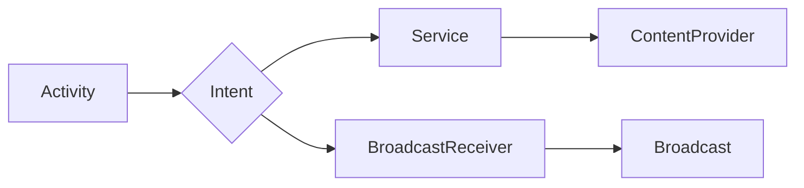

                 

## Android全栈开发指南

> 关键词：Android, 全栈开发, Java, Kotlin, Jetpack Compose, Architecture Components, MVP, MVVM, 网络请求, 数据存储, UI设计, 测试

## 1. 背景介绍

在当今移动互联网时代，Android作为全球最受欢迎的操作系统之一，拥有庞大的用户群体和丰富的应用生态。掌握Android全栈开发技能，能够让你从需求分析到产品发布，全方位参与到移动应用的开发过程中，并拥有更深入的理解和掌控力。

全栈开发是指能够涵盖应用程序开发的各个环节，包括前端、后端、数据库、网络等方面的技能。对于Android开发而言，全栈开发意味着需要具备以下方面的能力：

* **Java/Kotlin语言编程:** 掌握Android开发的核心编程语言，能够编写流畅、高效的代码。
* **Android SDK和框架:** 熟悉Android软件开发工具包（SDK）和框架，例如Activity、Fragment、Service、BroadcastReceiver等，能够构建应用程序的基本结构和功能。
* **UI设计和开发:** 了解Android UI设计原则和规范，能够使用XML布局文件和Jetpack Compose等工具设计和开发美观、易用的用户界面。
* **数据存储和处理:** 掌握Android数据存储机制，例如SharedPreferences、SQLite数据库、Room数据库等，能够高效地存储和处理应用程序的数据。
* **网络请求和通信:** 了解Android网络请求机制，例如HTTP、HTTPS等协议，能够实现应用程序与服务器的通信和数据交互。
* **版本控制和代码管理:** 熟悉Git等版本控制工具，能够进行代码管理和协作开发。
* **测试和调试:** 掌握Android测试工具和调试技巧，能够确保应用程序的稳定性和可靠性。

## 2. 核心概念与联系

Android应用程序的开发基于组件化的架构，每个组件都具有特定的功能和职责。

**核心组件:**

* **Activity:** 应用程序的单个屏幕界面，负责处理用户交互和显示内容。
* **Fragment:** Activity内部的独立模块，可以被复用，用于构建复杂的界面。
* **Service:** 后台运行的组件，负责执行长时间运行的任务，例如播放音乐、下载文件等。
* **BroadcastReceiver:** 接收系统广播消息的组件，可以响应系统事件，例如手机连接网络、电池电量变化等。
* **ContentProvider:** 提供数据访问接口的组件，可以将数据共享给其他应用程序。

**组件间通信:**

* **Intent:** 用于组件间传递数据的机制，可以启动Activity、Service、BroadcastReceiver等组件。
* **Broadcast:** 系统发送的事件通知，可以被BroadcastReceiver接收和处理。
* **ContentResolver:** 用于访问ContentProvider的数据。

**架构模式:**

* **MVP (Model-View-Presenter):** 将应用程序逻辑分离为模型、视图和呈现层，提高代码的可维护性和可测试性。
* **MVVM (Model-View-ViewModel):** 将应用程序逻辑分离为模型、视图和视图模型层，更加注重数据绑定和状态管理。

**Mermaid 流程图:**



## 3. 核心算法原理 & 具体操作步骤

### 3.1  算法原理概述

Android应用程序开发中，涉及到各种算法，例如数据排序、搜索、加密等。这些算法的原理和实现方式，直接影响到应用程序的性能和效率。

### 3.2  算法步骤详解

* **数据排序:** 常见的排序算法包括冒泡排序、插入排序、快速排序、归并排序等。每个算法都有其独特的步骤和时间复杂度。
* **搜索算法:** 常见的搜索算法包括线性搜索、二分搜索等。选择合适的搜索算法，可以提高搜索效率。
* **加密算法:** Android应用程序中，需要使用加密算法来保护敏感数据，例如用户密码、个人信息等。常见的加密算法包括AES、RSA等。

### 3.3  算法优缺点

* **冒泡排序:** 简单易实现，但时间复杂度较高。
* **插入排序:** 时间复杂度较低，但对于大规模数据，效率较低。
* **快速排序:** 时间复杂度平均为O(n log n)，但最坏情况下时间复杂度为O(n^2)。
* **归并排序:** 时间复杂度为O(n log n)，稳定性好。
* **线性搜索:** 时间复杂度为O(n)，适用于数据量较小的情况。
* **二分搜索:** 时间复杂度为O(log n)，适用于有序数据。
* **AES:** 安全性高，但计算量较大。
* **RSA:** 安全性高，但计算量更大。

### 3.4  算法应用领域

* **数据排序:** 用于对应用程序的数据进行排序，例如联系人列表、邮件列表等。
* **搜索算法:** 用于在应用程序中快速查找数据，例如搜索历史记录、联系人信息等。
* **加密算法:** 用于保护应用程序中的敏感数据，例如用户密码、个人信息等。

## 4. 数学模型和公式 & 详细讲解 & 举例说明

### 4.1  数学模型构建

Android应用程序开发中，涉及到各种数学模型，例如图形变换、动画效果、数据分析等。这些模型的构建，需要根据应用程序的具体需求和功能，选择合适的数学公式和算法。

### 4.2  公式推导过程

* **图形变换:** 使用矩阵变换来实现图形的旋转、缩放、平移等操作。

$$
\begin{bmatrix}
x' \\
y' \\
1
\end{bmatrix}
=
\begin{bmatrix}
a & b & c \\
d & e & f \\
0 & 0 & 1
\end{bmatrix}
\begin{bmatrix}
x \\
y \\
1
\end{bmatrix}
$$

* **动画效果:** 使用贝塞尔曲线来实现动画的平滑过渡效果。

### 4.3  案例分析与讲解

* **图形旋转:** 使用旋转矩阵来实现图形的旋转操作。

```java
// 旋转矩阵
float[][] rotationMatrix = new float[3][3];
rotationMatrix[0][0] = (float) Math.cos(angle);
rotationMatrix[0][1] = -(float) Math.sin(angle);
rotationMatrix[1][0] = (float) Math.sin(angle);
rotationMatrix[1][1] = (float) Math.cos(angle);
rotationMatrix[2][2] = 1;

// 旋转点坐标
float[] point = {x, y};

// 旋转后的坐标
float[] rotatedPoint = matrixMultiply(rotationMatrix, point);
```

## 5. 项目实践：代码实例和详细解释说明

### 5.1  开发环境搭建

* 安装Android Studio IDE。
* 设置Android SDK和NDK。
* 配置虚拟设备或连接物理设备。

### 5.2  源代码详细实现

* 创建一个新的Android Studio项目。
* 添加必要的依赖库，例如Retrofit、Gson等。
* 设计应用程序的UI界面，使用XML布局文件或Jetpack Compose。
* 实现应用程序的业务逻辑，例如网络请求、数据处理、UI更新等。

### 5.3  代码解读与分析

* 详细解释代码的结构和功能。
* 分析代码的性能和效率。
* 讨论代码的可维护性和可测试性。

### 5.4  运行结果展示

* 展示应用程序的运行效果。
* 讲解应用程序的功能和使用场景。

## 6. 实际应用场景

* **社交媒体应用:** 

* **电商平台:** 

* **游戏应用:** 

### 6.4  未来应用展望

* **人工智能:** 将人工智能技术应用于Android应用程序开发，例如语音识别、图像识别、个性化推荐等。
* **物联网:** 将Android应用程序与物联网设备连接，实现远程控制、数据采集、智能家居等功能。
* **虚拟现实:** 将Android应用程序与虚拟现实设备结合，打造沉浸式的用户体验。

## 7. 工具和资源推荐

### 7.1  学习资源推荐

* **Android官方文档:** https://developer.android.com/docs
* **Android Developers博客:** https://android-developers.googleblog.com/
* **Udacity Android开发课程:** https://www.udacity.com/course/android-developer-nanodegree--nd801

### 7.2  开发工具推荐

* **Android Studio:** https://developer.android.com/studio
* **Git:** https://git-scm.com/
* **Postman:** https://www.postman.com/

### 7.3  相关论文推荐

* **Android Architecture Components:** https://developer.android.com/topic/libraries/architecture
* **Jetpack Compose:** https://developer.android.com/jetpack/compose

## 8. 总结：未来发展趋势与挑战

### 8.1  研究成果总结

Android全栈开发是一个不断发展的领域，近年来取得了显著的进展。Jetpack Compose、Architecture Components等新技术，提高了应用程序开发的效率和质量。

### 8.2  未来发展趋势

* **人工智能:** 将人工智能技术应用于Android应用程序开发，打造更智能、更个性化的用户体验。
* **物联网:** 将Android应用程序与物联网设备连接，实现万物互联的智能生活。
* **跨平台开发:** 使用跨平台开发框架，例如Flutter、React Native等，开发能够在多个平台上运行的应用程序。

### 8.3  面临的挑战

* **技术复杂性:** Android应用程序开发涉及到多种技术，例如Java/Kotlin语言、UI设计、数据存储、网络通信等，需要开发者具备全面的技能。
* **碎片化设备:** Android设备的型号和配置多样，需要开发者进行适配和测试，确保应用程序能够在所有设备上正常运行。
* **安全问题:** Android应用程序需要保护用户数据和隐私安全，需要开发者关注安全漏洞和攻击风险。

### 8.4  研究展望

未来，Android全栈开发领域将继续发展和创新，需要开发者不断学习和提升技能，才能在竞争激烈的市场中脱颖而出。


## 9. 附录：常见问题与解答

* **Q: 如何选择合适的Android开发框架？**
* **A:** 选择合适的Android开发框架需要根据应用程序的具体需求和功能，例如UI设计、数据处理、网络通信等。

* **Q: 如何进行Android应用程序的测试？**
* **A:** Android应用程序的测试包括单元测试、集成测试、UI测试等。可以使用Android Studio提供的测试工具和框架进行测试。

* **Q: 如何发布Android应用程序到Google Play商店？**
* **A:** 发布Android应用程序到Google Play商店需要注册开发者账号、准备应用程序图标、描述等信息，并上传应用程序包文件。


作者：禅与计算机程序设计艺术 / Zen and the Art of Computer Programming 
<end_of_turn>

