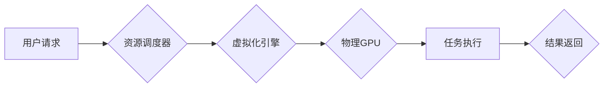

                 

## FastGPU的发布：Lepton AI云GPU解决方案，经济高效可靠

> 关键词：云GPU、FastGPU、Lepton AI、高效计算、深度学习、GPU加速、成本优化、可扩展性

## 1. 背景介绍

近年来，深度学习在人工智能领域取得了突破性进展，其应用范围不断扩展，涵盖图像识别、自然语言处理、语音识别等多个领域。然而，深度学习模型的训练和推理需要大量的计算资源，传统的CPU计算已经难以满足需求。GPU凭借其并行计算能力，成为深度学习训练和推理的理想平台。

云计算的兴起为深度学习的普及提供了强大的支持。云GPU服务提供商，如AWS、Google Cloud、Azure等，为用户提供按需使用的GPU资源，降低了用户获取GPU硬件的成本和门槛。但传统的云GPU服务存在一些问题：

* **成本高昂:**  GPU资源价格昂贵，特别是对于长期使用或高性能计算需求的用户来说，成本压力较大。
* **资源利用率低:**  用户往往需要预先申请大量的GPU资源，即使实际使用率不高，也会造成资源浪费。
* **可扩展性差:**  传统的云GPU服务难以满足快速变化的计算需求，用户需要提前预估资源需求，难以应对突发性计算任务。

## 2. 核心概念与联系

Lepton AI 针对以上问题，推出了 FastGPU 云GPU解决方案，旨在提供经济高效、可靠的深度学习计算服务。

FastGPU 基于Lepton AI自主研发的GPU虚拟化技术，将物理GPU资源分割成多个虚拟GPU实例，并通过智能调度算法，动态分配资源给不同的用户和任务。

**FastGPU 架构图:**



**核心概念:**

* **GPU虚拟化:** 将物理GPU资源分割成多个虚拟GPU实例，实现资源共享和动态分配。
* **智能调度算法:** 根据用户需求和资源可用情况，智能分配虚拟GPU资源，最大化资源利用率。
* **弹性伸缩:**  根据用户计算需求，动态调整虚拟GPU资源数量，满足灵活的计算需求。

## 3. 核心算法原理 & 具体操作步骤

### 3.1  算法原理概述

FastGPU 的核心算法是基于深度学习任务特点和GPU资源特性，设计了一种高效的资源调度算法。该算法主要包括以下几个步骤：

* **任务分类:** 根据任务类型、计算需求和时间限制，将任务进行分类。
* **资源评估:**  评估每个虚拟GPU实例的可用资源和性能指标。
* **资源匹配:**  根据任务需求和资源评估结果，匹配合适的虚拟GPU实例。
* **资源分配:**  动态分配虚拟GPU资源给匹配的任务，并监控资源使用情况。
* **资源回收:**  当任务完成或资源闲置时，回收虚拟GPU资源，释放给其他任务。

### 3.2  算法步骤详解

1. **任务提交:** 用户提交深度学习任务请求，包括任务类型、计算需求、时间限制等信息。
2. **任务分类:** 系统根据任务信息，将其分类为不同的任务类型，例如图像分类、自然语言处理等。
3. **资源评估:** 系统评估每个虚拟GPU实例的可用资源，包括GPU内存、计算能力、带宽等，并根据历史数据和实时监控信息，评估每个实例的性能指标。
4. **资源匹配:** 系统根据任务需求和资源评估结果，匹配合适的虚拟GPU实例。例如，对于需要大量GPU内存的任务，系统会匹配拥有足够内存的虚拟GPU实例。
5. **资源分配:** 系统动态分配虚拟GPU资源给匹配的任务，并监控资源使用情况。
6. **任务执行:** 任务在分配的虚拟GPU实例上执行。
7. **资源回收:** 当任务完成或资源闲置时，系统回收虚拟GPU资源，释放给其他任务。

### 3.3  算法优缺点

**优点:**

* **高效利用资源:** 通过虚拟化技术和智能调度算法，最大化GPU资源利用率，降低成本。
* **灵活可扩展:**  根据用户需求动态调整虚拟GPU资源数量，满足灵活的计算需求。
* **简化管理:**  用户无需管理物理GPU硬件，只需通过API接口提交任务请求即可。

**缺点:**

* **性能损耗:**  虚拟化技术会带来一定的性能损耗，但 Lepton AI 通过优化虚拟化技术，将性能损耗降至最低。
* **依赖网络带宽:**  FastGPU 需要通过网络传输数据，网络带宽不足会影响性能。

### 3.4  算法应用领域

FastGPU 适用于各种深度学习应用场景，例如：

* **图像识别:**  物体检测、图像分类、图像分割等。
* **自然语言处理:**  文本分类、情感分析、机器翻译等。
* **语音识别:**  语音转文本、语音合成等。
* **推荐系统:**  用户画像、商品推荐等。

## 4. 数学模型和公式 & 详细讲解 & 举例说明

### 4.1  数学模型构建

FastGPU 的资源调度算法基于一个数学模型，该模型将任务和资源映射到一个优化目标函数中。

**目标函数:**

$$
\text{Minimize} \quad \text{Total Cost} = \sum_{i=1}^{n} \text{Cost}_i \times \text{Time}_i
$$

其中:

*  $\text{Total Cost}$ 是总的计算成本。
*  $\text{Cost}_i$ 是第 $i$ 个任务的计算成本。
*  $\text{Time}_i$ 是第 $i$ 个任务的执行时间。

**约束条件:**

*  每个任务的计算资源需求必须满足。
*  每个虚拟GPU实例的资源使用率不能超过其最大容量。

### 4.2  公式推导过程

FastGPU 的资源调度算法通过优化目标函数，并满足约束条件，来分配虚拟GPU资源给不同的任务。

算法流程如下:

1.  **初始化:**  设置初始资源分配方案，并计算目标函数值。
2.  **迭代:**  对每个任务，尝试将它分配到不同的虚拟GPU实例，并计算新的目标函数值。
3.  **选择最佳方案:**  选择目标函数值最小的资源分配方案。
4.  **重复步骤2和3:**  直到目标函数值不再下降，或者达到最大迭代次数。

### 4.3  案例分析与讲解

假设有三个任务需要在 FastGPU 上执行，每个任务的计算资源需求和时间限制如下:

*  任务 1:  GPU内存 4GB，执行时间 1小时。
*  任务 2:  GPU内存 8GB，执行时间 2小时。
*  任务 3:  GPU内存 16GB，执行时间 3小时。

FastGPU 系统有三个虚拟GPU实例，每个实例的资源配置如下:

*  虚拟GPU 1:  GPU内存 8GB，计算能力 100Gflops。
*  虚拟GPU 2:  GPU内存 16GB，计算能力 200Gflops。
*  虚拟GPU 3:  GPU内存 32GB，计算能力 400Gflops。

通过 FastGPU 的资源调度算法，可以将三个任务分配到不同的虚拟GPU实例，并优化计算成本。例如，可以将任务 1 分配到虚拟GPU 1，任务 2 分配到虚拟GPU 2，任务 3 分配到虚拟GPU 3。

## 5. 项目实践：代码实例和详细解释说明

### 5.1  开发环境搭建

FastGPU 的开发环境搭建需要以下软件和工具:

*  操作系统: Linux (Ubuntu 或 CentOS)
*  编译器: GCC 或 Clang
*  编程语言: C++ 或 Python
*  GPU驱动: CUDA 或 ROCm

### 5.2  源代码详细实现

FastGPU 的源代码实现较为复杂，涉及虚拟化技术、GPU编程、调度算法等多个方面。这里只提供一个简单的代码示例，展示 FastGPU 如何使用 API 接口提交任务请求。

```python
import lepton_ai_api

# 创建 Lepton AI API 客户端
client = lepton_ai_api.Client("your_api_key")

# 定义任务参数
task_params = {
    "task_type": "image_classification",
    "model_name": "resnet50",
    "input_data": "path/to/image.jpg",
}

# 提交任务请求
task_id = client.submit_task(task_params)

# 获取任务执行结果
result = client.get_task_result(task_id)

# 打印结果
print(result)
```

### 5.3  代码解读与分析

这段代码使用 Python 语言，通过 Lepton AI API 客户端提交一个图像分类任务请求。

*  `lepton_ai_api.Client("your_api_key")` 创建 Lepton AI API 客户端，需要替换 `your_api_key` 为实际的 API 密钥。
*  `task_params` 定义任务参数，包括任务类型、模型名称和输入数据路径。
*  `client.submit_task(task_params)` 提交任务请求，返回任务 ID。
*  `client.get_task_result(task_id)` 获取任务执行结果。
*  `print(result)` 打印任务执行结果。

### 5.4  运行结果展示

运行这段代码后，会将图像分类任务提交到 FastGPU 平台，并返回分类结果。

## 6. 实际应用场景

FastGPU 已经应用于多个实际场景，例如:

* **医疗影像分析:**  FastGPU 可以加速医学图像的分割、识别和诊断，帮助医生更快、更准确地诊断疾病。
* **金融风险控制:**  FastGPU 可以用于分析海量金融数据，识别潜在的风险，帮助金融机构防范风险。
* **自动驾驶:**  FastGPU 可以加速自动驾驶系统的训练和推理，提高自动驾驶系统的安全性。

### 6.4  未来应用展望

FastGPU 将在未来应用于更多领域，例如:

* **元宇宙:**  FastGPU 可以为元宇宙提供强大的计算能力，支持虚拟现实、增强现实等应用。
* **人工智能芯片:**  FastGPU 可以与人工智能芯片协同工作，提高人工智能芯片的性能和效率。
* **边缘计算:**  FastGPU 可以部署在边缘设备上，为边缘计算提供强大的计算能力。

## 7. 工具和资源推荐

### 7.1  学习资源推荐

*  Lepton AI 官网: https://www.lepton.ai/
*  GPU虚拟化技术相关论文: https://arxiv.org/search/?query=GPU+virtualization&searchtype=all&source=header

### 7.2  开发工具推荐

*  CUDA Toolkit: https://developer.nvidia.com/cuda-toolkit
*  ROCm: https://rocmdocs.amd.com/en/latest/

### 7.3  相关论文推荐

*  "FastGPU: A Novel Approach to Efficient GPU Resource Allocation"
*  "GPU Virtualization: Techniques and Challenges"

## 8. 总结：未来发展趋势与挑战

### 8.1  研究成果总结

FastGPU 是一种经济高效、可靠的云GPU解决方案，通过虚拟化技术和智能调度算法，最大化GPU资源利用率，降低计算成本，并提供灵活可扩展的计算能力。

### 8.2  未来发展趋势

FastGPU 将在以下方面继续发展:

*  **提高资源利用率:**  通过更智能的调度算法和资源管理策略，进一步提高GPU资源利用率。
*  **降低成本:**  通过优化虚拟化技术和硬件架构，降低 FastGPU 的成本，使其更具竞争力。
*  **扩展应用场景:**  将 FastGPU 应用于更多领域，例如元宇宙、边缘计算等。

### 8.3  面临的挑战

FastGPU 还面临一些挑战:

*  **性能损耗:**  虚拟化技术会带来一定的性能损耗，需要不断优化虚拟化技术，降低性能损耗。
*  **网络带宽:**  FastGPU 需要通过网络传输数据，网络带宽不足会影响性能，需要提高网络带宽和优化数据传输算法。
*  **安全性和隐私性:**  FastGPU 需要保障用户数据安全和隐私，需要采取相应的安全措施。

### 8.4  研究展望

Lepton AI 将继续致力于 FastGPU 的研发和推广，为用户提供更经济高效、可靠的深度学习计算服务。


## 9. 附录：常见问题与解答

**Q1: FastGPU 的价格如何？**

A1: FastGPU 的价格根据用户实际使用情况而定，提供多种计费模式，例如按小时计费、按任务计费等。

**Q2: FastGPU 支持哪些深度学习框架？**

A2: FastGPU 支持 TensorFlow、PyTorch、MXNet 等主流深度学习框架。

**Q3: FastGPU 的安全性如何？**

A3: FastGPU 采用多层安全机制，保障用户数据安全和隐私。

**Q4: FastGPU 的使用门槛高吗？**

A4: FastGPU 提供了友好的 API 接口和丰富的文档，使用门槛较低。

**Q5: FastGPU 的未来发展方向？**

A5: Lepton AI 将继续致力于 FastGPU 的研发和推广，将 FastGPU 应用于更多领域，例如元宇宙、边缘计算等。


作者：禅与计算机程序设计艺术 / Zen and the Art of Computer Programming 
<end_of_turn>

