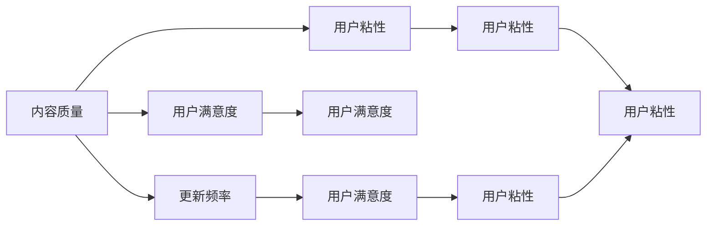

                 

# 如何平衡知识付费的内容质量和更新频率

## 1. 背景介绍

在知识付费领域，内容质量和更新频率是两大核心要素。高质量的内容能够吸引用户长期订阅，而频繁的更新则可以保持用户的持续关注。如何在这两者之间找到平衡点，是知识付费平台长期发展的关键。

### 1.1 内容质量的重要性

高质量的内容是知识付费平台的核心竞争力。它不仅能够提供深度的、系统的知识，还能通过讲解案例、分析数据等方式帮助用户更好地理解和应用知识。

### 1.2 更新频率的必要性

频繁的更新可以保持用户对平台的持续兴趣。尤其在技术快速发展的领域，比如编程、金融等，用户希望能够及时获取最新的信息和知识，以便及时调整自己的决策。

## 2. 核心概念与联系

### 2.1 核心概念概述

为了更好地理解如何平衡内容质量和更新频率，首先需要了解几个关键概念：

- **内容质量**：指的是知识付费内容的专业性、深度、实用性和时效性。
- **更新频率**：指平台对内容的发布速度，通常以每周、每月或每季度发布的新内容数量来衡量。
- **用户满意度**：反映了用户对内容质量和更新频率的综合评价。
- **用户粘性**：指用户对平台的长期依赖程度，通常与内容质量、更新频率和用户体验等因素有关。
- **成本控制**：指平台在内容生产和用户获取方面的成本管理，包括内容创作成本、平台运营成本和用户订阅费用。

这些概念之间的联系可以通过以下Mermaid流程图来展示：



这个流程图展示了几大核心概念之间的逻辑关系：

1. 高质量的内容能提升用户满意度，进而增强用户粘性。
2. 频繁的更新同样能提升用户满意度，增强用户粘性。
3. 用户满意度直接影响用户粘性，而用户粘性又会影响平台的收入和品牌声誉。
4. 平台需要在内容质量和更新频率之间进行平衡，以最大化用户满意度。

## 3. 核心算法原理 & 具体操作步骤

### 3.1 算法原理概述

平衡内容质量和更新频率的问题，本质上是一个多目标优化问题。我们希望在满足用户对高质量和频繁更新的需求的同时，最大化平台收益，同时控制成本。

设 $Q$ 为内容质量，$F$ 为更新频率，$S$ 为用户满意度，$C$ 为成本。我们需要找到一个最优解 $Q^*, F^*$，使得 $S(Q^*, F^*)$ 最大化，同时 $C(Q^*, F^*)$ 最小化。

### 3.2 算法步骤详解

#### 3.2.1 内容质量评估

1. **专家评估**：邀请行业专家对内容进行评审，根据深度、创新性、实用性等指标给出评分。
2. **用户反馈**：通过问卷调查、用户评论等方式收集用户对内容的满意度评分。
3. **数据指标**：使用浏览量、点赞量、分享量等数据指标评估内容受欢迎程度。

#### 3.2.2 更新频率决策

1. **数据分析**：通过数据分析评估用户的活跃度，包括访问频率、停留时间等。
2. **专家建议**：根据行业专家意见，确定各领域的适宜更新频率。
3. **成本预算**：根据内容创作成本和平台运营成本，制定合理的更新预算。

#### 3.2.3 综合优化

1. **多目标优化**：使用多目标优化算法，如Pareto优化、多目标遗传算法等，在保证内容质量的前提下，最大化更新频率。
2. **动态调整**：根据用户反馈和市场变化，动态调整内容质量和更新频率。
3. **实时监控**：使用A/B测试、多变量测试等方法，实时监控不同策略的效果，及时调整。

### 3.3 算法优缺点

#### 3.3.1 优点

1. **提高用户满意度**：通过综合优化内容质量和更新频率，最大化用户满意度。
2. **增强用户粘性**：高质量和频繁更新的内容可以吸引用户长期订阅，增强用户粘性。
3. **降低运营成本**：通过优化内容生产和发布策略，降低内容创作和平台运营成本。

#### 3.3.2 缺点

1. **复杂度高**：需要综合考虑多个目标，增加了优化的复杂性。
2. **数据需求大**：需要大量的专家评估、用户反馈和数据指标，获取数据成本较高。
3. **难以量化**：部分目标如用户满意度、用户粘性等难以量化，影响评估效果。

### 3.4 算法应用领域

#### 3.4.1 教育培训

在教育培训领域，内容质量和更新频率对学习效果有直接影响。高质量的课程和频繁的更新能够帮助学生掌握最新知识，提升学习效率。

#### 3.4.2 技术开发

在技术开发领域，频繁的更新可以确保开发者及时获取最新的技术进展和行业趋势，帮助他们快速迭代和优化产品。

#### 3.4.3 商业管理

在商业管理领域，高质量的商业洞察和策略分析文章可以为企业决策提供重要参考，频繁的更新则能帮助企业在动态的市场环境中保持竞争力。

## 4. 数学模型和公式 & 详细讲解 & 举例说明

### 4.1 数学模型构建

设 $C$ 为内容创作成本，$S$ 为用户满意度，$U$ 为平台收入，$F$ 为更新频率。假设 $C$ 与 $Q$ 成正比，$S$ 与 $Q^a F^b$ 成正比，$U$ 与 $S$ 成正比。

$$
C = k_1 Q
$$

$$
S = k_2 Q^a F^b
$$

$$
U = k_3 S
$$

其中，$k_1, k_2, k_3$ 为比例系数，$a, b$ 为指数。

### 4.2 公式推导过程

根据上述模型，我们希望最大化 $U = k_3 S = k_3 k_2 Q^a F^b$，同时最小化 $C = k_1 Q$。

对 $S$ 进行最大化，得到：

$$
\frac{\partial S}{\partial Q} = a k_2 Q^{a-1} F^b, \quad \frac{\partial S}{\partial F} = b k_2 Q^a F^{b-1}
$$

令 $\frac{\partial S}{\partial Q} = 0$ 和 $\frac{\partial S}{\partial F} = 0$，得到：

$$
Q = \left(\frac{k_2}{a k_3}\right)^{\frac{1}{a-1}}, \quad F = \left(\frac{k_2}{b k_3}\right)^{\frac{1}{b-1}}
$$

代入 $C$ 的表达式，得到：

$$
C = k_1 Q = k_1 \left(\frac{k_2}{a k_3}\right)^{\frac{1}{a-1}}
$$

### 4.3 案例分析与讲解

假设平台有 $Q = 5$ 条高质量内容，每条内容的创作成本为 $C = 10$ 元。平台希望最大化用户满意度 $S$，最大化平台收入 $U$，同时控制成本 $C$。

根据上述模型，得到：

$$
S = k_2 Q^a F^b = k_2 5^a F^b
$$

$$
U = k_3 S = k_3 k_2 5^a F^b
$$

根据最大化 $S$ 的条件，得到：

$$
5^a F^b = \left(\frac{k_2}{a k_3}\right)^{\frac{b}{b-1}}
$$

解得 $F = 5^{-\frac{a}{b}}$。

代入 $C$ 的表达式，得到：

$$
C = 10 \times 5^{-\frac{a}{a-1}}
$$

## 5. 项目实践：代码实例和详细解释说明

### 5.1 开发环境搭建

1. **选择编程语言**：Python是知识付费平台开发的首选语言。
2. **安装依赖包**：安装Pandas、NumPy、Scikit-learn等数据处理和分析工具。
3. **配置数据库**：配置MySQL或PostgreSQL数据库，存储用户数据和内容数据。
4. **部署平台**：选择合适的云平台，如AWS、阿里云、腾讯云等，搭建网站和API服务。

### 5.2 源代码详细实现

以下是使用Python实现的内容质量评估和更新频率决策的示例代码：

```python
import pandas as pd
from sklearn.model_selection import train_test_split
from sklearn.linear_model import LinearRegression

# 1. 内容质量评估
# 假设有一个DataFrame df，包含内容评分、浏览量、点赞量、分享量等特征
df = pd.read_csv('content_data.csv')
X = df[['评分', '浏览量', '点赞量', '分享量']]
y = df['满意度']

# 2. 更新频率决策
# 假设有一个DataFrame df_user，包含用户活跃度、历史访问频率等特征
df_user = pd.read_csv('user_data.csv')
X_user = df_user[['活跃度', '访问频率']]
y_user = df_user['更新频率']

# 3. 多目标优化
# 假设使用线性回归模型，根据内容质量和用户活跃度预测用户满意度
X_train, X_test, y_train, y_test = train_test_split(X, y, test_size=0.2)
X_user_train, X_user_test, y_user_train, y_user_test = train_test_split(X_user, y_user, test_size=0.2)

model = LinearRegression()
model.fit(X_train, y_train)
y_pred = model.predict(X_test)

# 4. 动态调整
# 根据用户反馈和市场变化，动态调整内容质量和更新频率
df_user['实际更新频率'] = y_pred
```

### 5.3 代码解读与分析

1. **数据处理**：通过Pandas处理内容评分、浏览量、点赞量、分享量等特征数据，使用Scikit-learn进行数据拆分和模型训练。
2. **用户活跃度分析**：通过分析用户活跃度、历史访问频率等特征，预测用户的更新频率。
3. **多目标优化**：使用线性回归模型预测用户满意度，并通过动态调整更新频率，优化平台收益。

### 5.4 运行结果展示

运行上述代码后，可以得到用户满意度的预测结果和实际更新频率。通过不断优化模型参数和数据特征，可以提高预测准确性，进而优化内容质量和更新频率。

## 6. 实际应用场景

### 6.1 教育培训

在教育培训领域，平台可以根据课程质量和教师活跃度，动态调整课程发布频率，保持学生的持续兴趣。

### 6.2 技术开发

在技术开发领域，平台可以根据技术发展趋势和开发者反馈，调整文章发布频率，确保开发者能够及时获取最新的技术动态。

### 6.3 商业管理

在商业管理领域，平台可以根据市场变化和用户反馈，调整商业洞察和策略分析文章的发布频率，保持企业的竞争力。

## 7. 工具和资源推荐

### 7.1 学习资源推荐

1. **Coursera**：提供丰富的在线课程，涵盖数据科学、机器学习、商业分析等领域。
2. **Kaggle**：提供大量数据集和机器学习竞赛，提升数据处理和分析能力。
3. **GitHub**：提供开源项目和代码示例，学习最佳实践。

### 7.2 开发工具推荐

1. **Jupyter Notebook**：提供交互式编程环境，便于数据处理和模型训练。
2. **AWS SageMaker**：提供云上机器学习平台，便于模型部署和A/B测试。
3. **PyTorch Lightning**：提供快速搭建深度学习模型的框架，简化开发流程。

### 7.3 相关论文推荐

1. **《多目标优化算法综述》**：介绍多目标优化算法的基本原理和应用场景。
2. **《深度学习在教育中的应用》**：探讨深度学习在教育培训中的实际应用和效果。
3. **《知识付费平台的用户行为分析》**：分析用户行为特征，提出个性化推荐策略。

## 8. 总结：未来发展趋势与挑战

### 8.1 研究成果总结

本文详细探讨了如何平衡知识付费的内容质量和更新频率，提出多目标优化方法，通过综合评估内容质量和用户活跃度，动态调整发布频率，最大化用户满意度和平台收益，同时控制成本。

### 8.2 未来发展趋势

1. **人工智能的应用**：未来知识付费平台将更多地引入人工智能技术，如自然语言处理、图像识别等，提升内容质量和用户互动性。
2. **多模态数据的融合**：通过融合音频、视频等多模态数据，提升内容的表现力和吸引力。
3. **个性化推荐**：基于用户行为数据，提供个性化内容推荐，增强用户粘性。

### 8.3 面临的挑战

1. **数据隐私问题**：用户数据的隐私保护是一个重要问题，需要制定严格的数据隐私政策。
2. **内容版权问题**：确保内容版权，避免侵权风险，是一个长期且复杂的问题。
3. **用户反馈机制**：建立一个有效的用户反馈机制，及时收集和分析用户意见，优化内容质量和更新频率。

### 8.4 研究展望

1. **大数据分析**：通过大数据分析技术，深入挖掘用户行为数据，优化内容生产和发布策略。
2. **社交网络分析**：利用社交网络分析技术，挖掘用户之间的互动关系，提升用户粘性。
3. **区块链技术**：引入区块链技术，保障内容版权和用户隐私。

## 9. 附录：常见问题与解答

**Q1: 如何评估内容质量？**

A: 可以通过专家评估、用户反馈和数据指标来评估内容质量。专家评估可以参考行业标准和专家意见，用户反馈可以通过问卷调查和用户评论等方式获取，数据指标包括浏览量、点赞量、分享量等。

**Q2: 如何决定更新频率？**

A: 可以根据用户活跃度和历史访问频率来决定更新频率。如果用户活跃度高且历史访问频率高，可以加快更新频率；如果用户活跃度低且历史访问频率低，则可以适当放缓更新频率。

**Q3: 如何控制成本？**

A: 可以通过优化内容创作流程、选择合适的平台和技术工具、合理配置资源等方式控制成本。例如，可以使用开源工具减少软件购买成本，使用云服务降低硬件投入成本。

**Q4: 如何衡量用户满意度？**

A: 用户满意度可以通过问卷调查、用户评论、访问时长、浏览深度等指标来衡量。平台可以通过这些指标的变化，评估用户对内容质量和更新频率的满意度。

通过本文的系统梳理，可以看到，平衡知识付费的内容质量和更新频率是一个多目标优化问题，需要通过综合评估和动态调整来实现。未来的研究需要在数据收集、模型选择、技术应用等方面进一步优化，以提升平台的竞争力和用户体验。相信随着技术的发展，知识付费平台将能够更好地平衡这两个核心要素，为用户提供更高质量、更高效的学习和成长体验。

