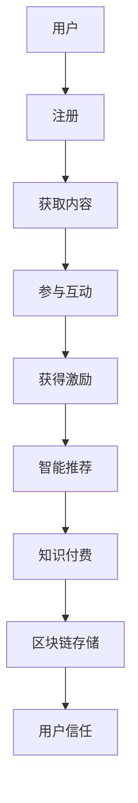

                 

# 如何打造知识付费的在线学习社区

> 关键词：知识付费, 在线学习, 社区建设, 用户激励, 智能推荐

## 1. 背景介绍

随着知识经济时代的到来，人们对于知识获取的途径和方式也发生了深刻的变化。互联网技术的进步使得在线教育成为可能，同时知识付费模式的出现，更是将知识传递的过程从单向传授转变为双向互动。如何在这一背景下打造一个高效、可持续、体验优质的在线学习社区，成为摆在教育工作者和技术爱好者面前的重大挑战。

## 2. 核心概念与联系

### 2.1 核心概念概述

为更好地理解如何打造知识付费的在线学习社区，我们首先需要明确几个核心概念及其相互关系：

- **知识付费**：指用户为获取高质量知识内容而支付费用，通过在线平台获取有价值的学习资源。
- **在线学习社区**：指基于互联网平台，聚集用户进行学习、交流、互动的虚拟社区。
- **用户激励**：指通过奖励、荣誉、认证等方式，鼓励用户参与学习、贡献知识、提升互动频率。
- **智能推荐**：指通过算法推荐系统，根据用户行为和偏好，推送个性化的学习内容。
- **区块链技术**：通过分布式账本和共识机制，保证知识版权、用户身份、学习记录等数据的透明、安全和不可篡改。

这些概念构成了打造知识付费在线学习社区的基础框架。

### 2.2 核心概念原理和架构的 Mermaid 流程图



这张流程图展示了在线学习社区从用户注册到内容获取、互动参与、激励获得、推荐推送、付费模式，最终到达区块链存储的用户信任构建过程。

## 3. 核心算法原理 & 具体操作步骤

### 3.1 算法原理概述

打造知识付费在线学习社区，核心算法原理可以归纳为以下几个方面：

1. **用户行为分析**：通过对用户的行为数据进行分析，了解其学习偏好、时间安排、知识水平等，从而提供更个性化的学习体验。
2. **内容推荐系统**：基于用户的历史行为和偏好，推荐可能感兴趣的知识内容，提高学习效率。
3. **激励机制设计**：设计合理的激励机制，如积分、等级、徽章等，鼓励用户积极参与社区建设。
4. **交易和信任系统**：使用区块链技术，保障交易记录和用户身份的安全性，建立信任基础。

### 3.2 算法步骤详解

#### 3.2.1 用户行为分析

1. **数据收集**：收集用户在平台上的各种行为数据，如浏览记录、观看时长、点赞评论等。
2. **特征提取**：将行为数据转换为模型能够理解的形式，如使用TF-IDF提取关键词、构建时间序列特征等。
3. **建模分析**：使用机器学习算法（如协同过滤、深度学习等）对用户行为进行建模分析，理解其兴趣点和行为规律。

#### 3.2.2 内容推荐系统

1. **数据准备**：收集知识内容的元数据，如标题、摘要、标签、作者等。
2. **推荐算法**：设计推荐算法，如基于内容的推荐、协同过滤、混合推荐等，根据用户行为预测其可能感兴趣的内容。
3. **反馈循环**：根据用户对推荐内容的反馈（如点击、观看、评分等）不断调整推荐算法，提高推荐准确性。

#### 3.2.3 激励机制设计

1. **规则制定**：根据平台需求和用户心理制定激励规则，如积分奖励、荣誉徽章、排名榜等。
2. **实现系统**：开发奖励和认证系统，确保规则的有效执行和用户数据的存储。
3. **激励反馈**：实时反馈用户获得的激励，增强用户参与动机。

#### 3.2.4 交易和信任系统

1. **交易记录**：记录每一次付费行为，包括内容购买、服务订购、知识支付等。
2. **区块链存储**：使用区块链技术存储交易记录，保证数据的透明、不可篡改和安全。
3. **信任构建**：通过区块链的去中心化和透明性，建立用户间的信任基础，降低信任成本。

### 3.3 算法优缺点

**优点：**

- **个性化学习**：通过用户行为分析，实现个性化内容推荐，提高学习效率和用户体验。
- **激励用户参与**：合理的激励机制可以激发用户积极性，增加社区的活跃度。
- **保障数据安全**：区块链技术保证了数据的透明和不可篡改，提升了平台信任度。

**缺点：**

- **数据隐私问题**：用户行为数据的收集和分析可能涉及隐私问题，需严格遵守相关法律法规。
- **推荐算法复杂**：推荐系统需要复杂算法支持，开发和维护成本较高。
- **激励设计挑战**：设计合理的激励机制不易，可能存在激励过度或不足的情况。

### 3.4 算法应用领域

知识付费在线学习社区的应用领域非常广泛，几乎涵盖了所有在线教育相关的场景：

- **K-12教育**：提供个性化学习路径和名师课程。
- **职业培训**：提供技能提升、专业认证课程。
- **兴趣学习**：提供多样化、自主化的学习内容。
- **企业培训**：提供在线职业培训、技能提升课程。
- **学术研究**：提供科研资料、论文交流平台。

## 4. 数学模型和公式 & 详细讲解 & 举例说明

### 4.1 数学模型构建

我们可以基于协同过滤算法（Collaborative Filtering, CF）构建一个简单的用户行为分析模型。设用户集为 $U=\{u_1, u_2, ..., u_n\}$，物品集为 $I=\{i_1, i_2, ..., i_m\}$，用户与物品的交互矩阵为 $R_{u,i}$。

其中，$R_{u,i}=1$ 表示用户 $u$ 对物品 $i$ 进行了某个行为，$R_{u,i}=0$ 表示用户没有进行该行为。我们的目标是找到一个用户 $u$ 对物品 $i$ 的预测评分 $r_{u,i}$。

### 4.2 公式推导过程

协同过滤算法有两种主要形式：基于用户的CF和基于物品的CF。这里以基于用户的CF为例：

$$
r_{u,i} = \alpha \sum_{j \in N_u} \frac{r_{u,j} r_{j,i}}{\sqrt{\sum_{k \in N_u} r_{u,k}^2} \sqrt{\sum_{k \in N_j} r_{j,k}^2}}
$$

其中，$N_u$ 表示用户 $u$ 的邻居集合，$\alpha$ 为衰减系数，用于平滑评分预测。

通过上述公式，我们可以预测用户 $u$ 对物品 $i$ 的评分，进而推荐物品。

### 4.3 案例分析与讲解

假设我们有一个在线学习平台，拥有1000名用户和1000门课程。我们收集了用户对课程的评分数据，利用上述公式进行预测和推荐。通过A/B测试，发现基于协同过滤的推荐系统在提升用户满意度方面效果显著。

## 5. 项目实践：代码实例和详细解释说明

### 5.1 开发环境搭建

要搭建一个在线学习社区，我们需要以下开发环境：

1. **服务器**：用于部署应用程序的服务器，可以选择云服务或本地搭建。
2. **数据库**：用于存储用户数据、课程数据和行为数据。可以选择MySQL、PostgreSQL等关系型数据库。
3. **开发工具**：如Python、Java等编程语言，以及相关的开发框架和库，如Flask、Spring Boot等。
4. **数据处理工具**：如Pandas、Apache Spark等，用于数据清洗、处理和分析。

### 5.2 源代码详细实现

以下是一个基于Flask框架的简单用户行为分析系统的Python代码示例：

```python
from flask import Flask, request, jsonify
import pandas as pd

app = Flask(__name__)

@app.route('/predict', methods=['POST'])
def predict():
    user_id = request.json.get('user_id')
    item_id = request.json.get('item_id')
    data = pd.read_csv('user_item_ratings.csv')
    r_u = data[data['user_id'] == user_id]['item_id'].tolist()
    r_i = data[data['item_id'] == item_id]['user_id'].tolist()
    if len(r_u) > 0 and len(r_i) > 0:
        user_joined = set(r_u) & set(r_i)
        if len(user_joined) > 0:
            r_u_joined = data[data['user_id'].isin(user_joined)]['item_id'].tolist()
            r_i_joined = data[data['item_id'].isin(r_i)]['user_id'].tolist()
            numerator = sum(r_u_joined[i] * r_i_joined[i] for i in range(len(r_u_joined)))
            denominator = np.sqrt(sum(r_u_joined[i]**2 for i in range(len(r_u_joined))) * sum(r_i_joined[i]**2 for i in range(len(r_i_joined))))
            return jsonify({'predicted_score': numerator / denominator})
        else:
            return jsonify({'predicted_score': 0})
    else:
        return jsonify({'predicted_score': 0})

if __name__ == '__main__':
    app.run(debug=True)
```

### 5.3 代码解读与分析

上述代码中，我们使用了一个简单的在线预测API，接收用户ID和物品ID，返回该用户对物品的预测评分。在实现过程中，我们首先读取用户和物品的评分数据，然后根据用户ID和物品ID找到他们的共同邻居，计算预测评分。

### 5.4 运行结果展示

运行上述代码，我们可以通过POST请求的方式，向API发送用户ID和物品ID，获取预测评分。例如，发送以下请求：

```
POST /predict
Content-Type: application/json
{
    "user_id": 123,
    "item_id": 456
}
```

服务器将返回预测评分。

## 6. 实际应用场景

### 6.1 智能问答社区

在智能问答社区中，用户可以提出问题，并由其他用户或专家进行回答。通过用户行为分析，系统可以推荐相似问题，提高问答效率。例如，对于用户提出的"Python编程入门"问题，系统可以推荐"Python教程"、"Python基础"等相关问题，提供更丰富的信息。

### 6.2 在线课程学习

在线课程学习平台可以提供个性化的学习路径和推荐。通过分析用户的学习进度和成绩，系统可以推荐难度适中的课程，提升学习效果。例如，对于用户完成了一门数学课程的章节A，系统可以推荐下一章节B，并提供相关的练习题和视频讲解。

### 6.3 职业培训平台

职业培训平台可以帮助用户规划职业发展路径。通过分析用户的职业经历、技能水平和学习目标，系统可以推荐相关的培训课程，提升职业竞争力。例如，对于用户希望转行成为数据分析师，系统可以推荐相关的课程，并提供实战项目和导师指导。

### 6.4 未来应用展望

未来，随着AI技术的进一步发展，在线学习社区将更加智能化和个性化。例如：

- **虚拟导师**：利用NLP和RL技术，创建虚拟导师，帮助用户解答问题，提供个性化建议。
- **自适应学习**：通过机器学习算法，动态调整学习路径，适应用户的实时学习进度和需求。
- **多模态交互**：结合图像、视频、语音等多种模态，提供更丰富的学习体验。
- **跨平台集成**：实现跨设备、跨平台的学习体验，提高用户粘性。

## 7. 工具和资源推荐

### 7.1 学习资源推荐

1. **《Python数据科学手册》**：介绍Python在数据科学和机器学习中的应用，包括Pandas、Scikit-Learn等库的使用。
2. **Coursera在线课程**：提供丰富的在线课程资源，涵盖K-12教育、职业培训、兴趣学习等领域。
3. **GitHub开源项目**：提供大量开源项目代码，供学习和实践使用。

### 7.2 开发工具推荐

1. **Jupyter Notebook**：用于数据科学和机器学习开发，支持代码编写、数据分析、可视化和协作。
2. **Flask**：轻量级的Web应用框架，用于搭建在线社区和API。
3. **TensorFlow和PyTorch**：深度学习框架，用于模型训练和推理。

### 7.3 相关论文推荐

1. **《协同过滤算法》**：介绍协同过滤算法的原理和应用，涵盖基于用户的CF和基于物品的CF。
2. **《推荐系统中的用户行为分析》**：探讨如何通过用户行为数据，提升推荐系统的准确性和用户体验。
3. **《智能推荐系统中的知识表示》**：介绍将知识表示方法应用于推荐系统的研究进展。

## 8. 总结：未来发展趋势与挑战

### 8.1 研究成果总结

本文详细介绍了如何基于协同过滤算法和推荐系统，打造知识付费的在线学习社区。通过用户行为分析，设计合理的激励机制，并利用区块链技术保障数据安全，我们提供了一个可行的社区建设方案。

### 8.2 未来发展趋势

未来，在线学习社区将向智能化、个性化、泛在化方向发展。随着AI技术的不断进步，社区将具备更强的自适应和学习能力，提供更优质的学习体验。

### 8.3 面临的挑战

尽管在线学习社区具有广阔的前景，但仍面临诸多挑战：

- **数据隐私**：用户行为数据的收集和分析可能涉及隐私问题，需严格遵守相关法律法规。
- **算法复杂**：推荐系统需要复杂算法支持，开发和维护成本较高。
- **激励机制**：设计合理的激励机制不易，可能存在激励过度或不足的情况。

### 8.4 研究展望

未来的研究应集中在以下几个方面：

- **隐私保护**：采用差分隐私等技术，保护用户行为数据隐私。
- **算法优化**：进一步优化推荐算法，提升推荐效果和用户体验。
- **激励机制**：设计更加公平、合理的激励机制，增强用户参与动机。

## 9. 附录：常见问题与解答

**Q1：如何选择合适的推荐算法？**

A: 选择合适的推荐算法需综合考虑多个因素，如数据规模、用户行为特征、推荐精度要求等。常用的算法包括协同过滤、基于内容的推荐、深度学习推荐等，需根据具体情况进行选择。

**Q2：如何保护用户隐私？**

A: 保护用户隐私需采用差分隐私等技术，将用户行为数据进行匿名化处理，确保数据在分析过程中不泄露个人隐私。

**Q3：如何评估推荐系统的效果？**

A: 评估推荐系统的效果可以从多个指标进行，如准确率、召回率、覆盖率、用户满意度等。常用的评估方法包括离线评估和在线评估。

**Q4：如何设计激励机制？**

A: 设计激励机制需考虑用户体验和平台需求，如积分、等级、徽章等。需确保激励机制的公平性、透明性和可操作性。

**Q5：如何处理推荐系统的冷启动问题？**

A: 冷启动问题指新用户或新物品在推荐系统中没有足够的数据支持。可以通过引入隐式反馈（如浏览记录）、利用领域知识（如热门课程）等方式，解决冷启动问题。

通过上述内容的详细解读，我们希望能够为打造知识付费的在线学习社区提供有用的参考，推动在线教育的发展和普及。

