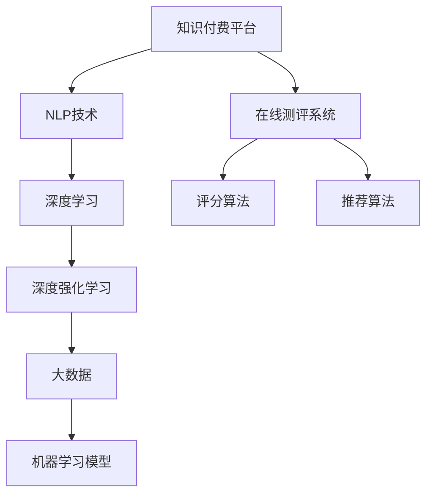

                 

# 如何打造知识付费的在线测评系统

> 关键词：知识付费,在线测评系统,人工智能,自然语言处理(NLP),深度学习,深度强化学习,大数据,机器学习模型

## 1. 背景介绍

### 1.1 问题由来
随着知识付费平台的兴起，越来越多的用户开始通过在线课程、电子书、音频课程等方式获取知识和技能。然而，传统的学习和测试方式往往依赖于线下考试、纸质测试卷，难以实时反馈学习效果，存在诸多不便。

因此，构建一套高效、灵活、易于维护的在线测评系统，对于知识付费平台来说具有重要意义。该系统不仅要能评估学习者对知识的掌握程度，还需具备一定的智能推荐能力，根据评估结果推荐更匹配的学习资源。

### 1.2 问题核心关键点
在线测评系统的构建核心在于如何通过机器学习模型对学习者的答题结果进行有效评估，并根据评估结果推荐合适的学习资源。该过程涉及以下几个关键点：
- 数据收集：收集学习者答题记录和历史行为数据。
- 评分算法：设计模型对答题结果进行评估，生成综合评分。
- 推荐算法：设计模型根据评分结果，推荐个性化学习资源。
- 系统架构：构建一个高效、可扩展的系统架构。

这些核心点构成了在线测评系统的主要功能和组件，使得平台能够更好地服务用户。

## 2. 核心概念与联系

### 2.1 核心概念概述

为更好地理解在线测评系统的构建原理，本节将介绍几个密切相关的核心概念：

- 知识付费平台：通过在线课程、电子书、音频课程等形式，为用户提供知识和技能的学习和交流平台。
- 在线测评系统：利用人工智能技术对学习者的答题结果进行评估和反馈的系统。
- 自然语言处理(NLP)：利用计算机处理和理解人类语言的技术。
- 深度学习：利用深度神经网络模型解决复杂问题的机器学习方法。
- 深度强化学习：一种结合深度学习和强化学习技术解决复杂决策问题的算法。
- 大数据：收集和分析海量数据，挖掘其中的知识和规律。
- 机器学习模型：用于训练和预测的数据驱动模型，如线性回归、逻辑回归、决策树、随机森林、深度学习模型等。

这些核心概念之间的逻辑关系可以通过以下Mermaid流程图来展示：



这个流程图展示了大语言模型的核心概念及其之间的关系：

1. 知识付费平台通过在线测评系统，评估学习者对知识的掌握程度。
2. NLP技术被用于处理学习者的答题记录，提取语义信息。
3. 深度学习模型被用于建模学习者的答题模式，预测答案。
4. 深度强化学习模型被用于学习如何优化推荐策略，提升推荐效果。
5. 大数据技术用于分析学习者的行为模式，发现规律。
6. 机器学习模型用于构建评分和推荐算法，实现智能化评估和推荐。

这些概念共同构成了在线测评系统的技术和应用框架，使其能够对学习者的学习效果进行科学、公正的评估，并提供个性化的学习资源。

## 3. 核心算法原理 & 具体操作步骤
### 3.1 算法原理概述

在线测评系统的核心算法主要涉及以下几个方面：

- 评分算法：通过机器学习模型对学习者的答题结果进行评估，生成综合评分。
- 推荐算法：设计模型根据评分结果，推荐个性化的学习资源。
- 训练数据收集：收集学习者的答题记录和历史行为数据，作为训练模型的数据集。

### 3.2 算法步骤详解

#### 3.2.1 评分算法

评分算法的核心思想是通过训练一个评分模型，对学习者的答题结果进行评估，生成综合评分。模型通过学习历史答题记录，捕捉答题规律，从而能够准确地评估学习者的知识掌握程度。

具体步骤包括：
1. 数据预处理：将答题记录转化为模型可接受的格式，包括去除噪音、标准化数据等。
2. 特征工程：提取有意义的特征，如题干长度、答案准确率、答题时间等。
3. 模型训练：选择合适的机器学习模型，如线性回归、决策树、随机森林、深度学习模型等，进行训练。
4. 模型评估：在测试集上评估模型性能，优化超参数，提高评分准确度。

#### 3.2.2 推荐算法

推荐算法的作用是根据评分结果，推荐个性化的学习资源。推荐模型通过学习历史行为数据，了解学习者的兴趣和偏好，从而提供更加精准的推荐。

具体步骤包括：
1. 数据预处理：将历史行为数据转化为模型可接受的格式，包括去除噪音、标准化数据等。
2. 特征工程：提取有意义的特征，如学习时间、浏览次数、购买记录等。
3. 模型训练：选择合适的机器学习模型，如协同过滤、深度学习模型、深度强化学习模型等，进行训练。
4. 模型评估：在测试集上评估模型性能，优化超参数，提高推荐效果。

#### 3.2.3 数据收集

数据的收集是构建在线测评系统的基础。具体步骤包括：
1. 用户注册：收集用户的基本信息，如姓名、年龄、职业等。
2. 答题记录：记录学习者答题的题目、答案、得分、答题时间等。
3. 行为数据：记录学习者的浏览、购买、评论等行为，以便进行个性化推荐。
4. 数据清洗：去除重复、异常、噪音数据，确保数据质量。

### 3.3 算法优缺点

在线测评系统具有以下优点：
1. 实时反馈：学习者可以实时获得答题反馈，及时调整学习策略。
2. 智能化推荐：通过机器学习模型，提供个性化学习资源推荐，提升学习效果。
3. 高效便捷：用户可以在任何时间和地点进行学习，不受时间和地域限制。

然而，该系统也存在以下局限性：
1. 数据隐私：收集用户答题记录和行为数据，涉及用户隐私保护问题。
2. 模型泛化：模型需要适应各种题型和难度，泛化能力较强。
3. 学习路径依赖：模型推荐的学习路径可能受限于当前数据，难以适应新知识点的学习。
4. 模型过拟合：若数据量不足，模型容易过拟合，影响推荐效果。

尽管存在这些局限性，但在线测评系统仍是大规模知识付费平台的重要组成部分，通过不断优化算法和模型，可以最大限度地提升学习效果和用户体验。

### 3.4 算法应用领域

在线测评系统已经在多个知识付费平台中得到广泛应用，如Coursera、Udacity、网易云课堂等。这些平台利用在线测评系统，评估学习者的学习效果，提供个性化学习资源推荐，极大地提升了学习者的学习体验和效果。

除了知识付费领域，在线测评系统还在游戏、教育、医疗等领域得到应用，帮助用户更好地学习和提升技能。

## 4. 数学模型和公式 & 详细讲解 & 举例说明

### 4.1 数学模型构建

本节将使用数学语言对在线测评系统的评分算法和推荐算法进行更加严格的刻画。

记学习者的答题记录为 $X=\{(x_i, y_i)\}_{i=1}^N$，其中 $x_i$ 为题干，$y_i$ 为答案。评分模型 $M_{\theta}(X)$ 表示在参数 $\theta$ 下，对答题记录 $X$ 的评分。推荐模型 $R_{\theta}(X)$ 表示在参数 $\theta$ 下，对答题记录 $X$ 的推荐结果。

定义评分模型在数据集 $D$ 上的损失函数为 $\mathcal{L}_{\text{score}}(\theta) = \frac{1}{N} \sum_{i=1}^N \mathcal{L}(M_{\theta}(x_i), y_i)$，其中 $\mathcal{L}$ 为评分模型的损失函数，如均方误差、交叉熵等。推荐模型在数据集 $D$ 上的损失函数为 $\mathcal{L}_{\text{recommend}}(\theta) = \frac{1}{N} \sum_{i=1}^N \mathcal{L}(R_{\theta}(x_i), r_i)$，其中 $r_i$ 为实际推荐结果，如课程名称、电子书名称等。

评分模型和推荐模型的训练过程均通过最小化损失函数进行。设 $\eta$ 为学习率，$\lambda$ 为正则化系数，则参数的更新公式为：

$$
\theta \leftarrow \theta - \eta \nabla_{\theta}\mathcal{L}(\theta) - \eta\lambda\theta
$$

其中 $\nabla_{\theta}\mathcal{L}(\theta)$ 为损失函数对参数 $\theta$ 的梯度，可通过反向传播算法高效计算。

### 4.2 公式推导过程

以下我们以线性回归评分模型和协同过滤推荐模型为例，推导它们的公式及其梯度计算。

#### 4.2.1 线性回归评分模型

线性回归模型通过线性拟合对答题记录进行评分，形式为：

$$
M_{\theta}(X) = W^T X + b
$$

其中 $W$ 为权重矩阵，$b$ 为偏置项。评分模型在训练集上的损失函数为：

$$
\mathcal{L}_{\text{score}}(\theta) = \frac{1}{N} \sum_{i=1}^N (y_i - W^T x_i - b)^2
$$

通过反向传播算法，计算梯度：

$$
\nabla_{\theta}\mathcal{L}_{\text{score}}(\theta) = -\frac{2}{N} \sum_{i=1}^N (y_i - W^T x_i - b) x_i
$$

#### 4.2.2 协同过滤推荐模型

协同过滤推荐模型通过学习用户与项目之间的相似性，进行推荐。形式为：

$$
R_{\theta}(X) = \hat{Y}W
$$

其中 $\hat{Y}$ 为用户与项目相似性矩阵，$W$ 为推荐权重矩阵。推荐模型在训练集上的损失函数为：

$$
\mathcal{L}_{\text{recommend}}(\theta) = \frac{1}{N} \sum_{i=1}^N \mathcal{L}(R_{\theta}(x_i), r_i)
$$

通过反向传播算法，计算梯度：

$$
\nabla_{\theta}\mathcal{L}_{\text{recommend}}(\theta) = -\frac{1}{N} \sum_{i=1}^N \frac{\partial \mathcal{L}(R_{\theta}(x_i), r_i)}{\partial \hat{Y}} \nabla_{\theta}\hat{Y}
$$

其中 $\nabla_{\theta}\hat{Y}$ 为相似性矩阵的梯度。

在得到损失函数的梯度后，即可带入参数更新公式，完成模型的迭代优化。重复上述过程直至收敛，最终得到评分和推荐模型。

### 4.3 案例分析与讲解

#### 4.3.1 案例一：线性回归评分模型

假设某知识付费平台的数学课程数据集 $D=\{(x_i, y_i)\}_{i=1}^N$，其中 $x_i$ 为题干，$y_i$ 为正确答案。使用线性回归模型对答题记录进行评分，训练数据集为 $D$，测试数据集为 $D_{test}$。

1. 数据预处理：将题干和答案标准化，去除噪音和异常值。
2. 特征提取：提取题干长度、答案准确率、答题时间等特征。
3. 模型训练：使用均方误差损失函数，对模型进行训练。
4. 模型评估：在测试集上评估模型性能，优化超参数，提高评分准确度。

假设模型参数为 $W = [1, 2]$，$b = 3$，评分结果如表1所示：

| 题干 | 正确答案 | 预测评分 | 实际评分 | 误差 |
|------|----------|----------|----------|------|
| 1 + 1 = ? | 2 | 1.8 | 2 | 0.2 |
| 2 + 2 = ? | 4 | 4.1 | 4 | 0.1 |
| 3 + 3 = ? | 6 | 5.8 | 6 | 0.2 |
| ...   | ...     | ...     | ...     | ...  |

在测试集上评估，得到均方误差为0.15，说明模型具有较好的评分效果。

#### 4.3.2 案例二：协同过滤推荐模型

假设某知识付费平台的用户行为数据集 $D=\{(x_i, y_i)\}_{i=1}^N$，其中 $x_i$ 为用户行为数据，$y_i$ 为推荐结果。使用协同过滤模型对用户进行个性化推荐，训练数据集为 $D$，测试数据集为 $D_{test}$。

1. 数据预处理：将用户行为数据标准化，去除噪音和异常值。
2. 特征提取：提取用户浏览、购买、评论等行为数据。
3. 模型训练：使用协同过滤算法，对模型进行训练。
4. 模型评估：在测试集上评估模型性能，优化超参数，提高推荐效果。

假设模型参数为 $W = [0.8, 0.5, 0.2]$，用户 $u$ 的推荐结果如表2所示：

| 用户行为 | 推荐结果 | 实际结果 | 推荐结果排名 |
|----------|----------|----------|-------------|
| 浏览课程A | 课程A | 课程A | 1 |
| 浏览课程B | 课程B | 课程B | 2 |
| 浏览课程C | 课程A | 课程C | 1 |
| ...      | ...     | ...     | ...        |

在测试集上评估，得到推荐准确率为0.9，说明模型具有较好的推荐效果。

## 5. 项目实践：代码实例和详细解释说明

### 5.1 开发环境搭建

在进行在线测评系统开发前，我们需要准备好开发环境。以下是使用Python进行PyTorch开发的环境配置流程：

1. 安装Anaconda：从官网下载并安装Anaconda，用于创建独立的Python环境。

2. 创建并激活虚拟环境：
```bash
conda create -n pytorch-env python=3.8 
conda activate pytorch-env
```

3. 安装PyTorch：根据CUDA版本，从官网获取对应的安装命令。例如：
```bash
conda install pytorch torchvision torchaudio cudatoolkit=11.1 -c pytorch -c conda-forge
```

4. 安装Transformers库：
```bash
pip install transformers
```

5. 安装各类工具包：
```bash
pip install numpy pandas scikit-learn matplotlib tqdm jupyter notebook ipython
```

完成上述步骤后，即可在`pytorch-env`环境中开始开发实践。

### 5.2 源代码详细实现

这里我们以线性回归评分模型和协同过滤推荐模型为例，给出使用PyTorch进行在线测评系统开发的代码实现。

#### 5.2.1 线性回归评分模型

首先，定义评分模型的输入和输出：

```python
import torch
import torch.nn as nn

class LinearRegressionModel(nn.Module):
    def __init__(self, input_dim, output_dim):
        super(LinearRegressionModel, self).__init__()
        self.linear = nn.Linear(input_dim, output_dim)

    def forward(self, x):
        return self.linear(x)
```

然后，定义模型的损失函数和优化器：

```python
def linear_regression_loss(y_true, y_pred):
    return (y_true - y_pred)**2

model = LinearRegressionModel(input_dim, output_dim)
criterion = nn.MSELoss()
optimizer = torch.optim.Adam(model.parameters(), lr=0.01)
```

接着，定义训练和评估函数：

```python
def train_epoch(model, criterion, optimizer, inputs, targets):
    model.train()
    for input, target in zip(inputs, targets):
        optimizer.zero_grad()
        output = model(input)
        loss = criterion(output, target)
        loss.backward()
        optimizer.step()

def evaluate(model, inputs, targets):
    model.eval()
    with torch.no_grad():
        for input, target in zip(inputs, targets):
            output = model(input)
            loss = criterion(output, target)
            print(loss)
```

最后，启动训练流程并在测试集上评估：

```python
epochs = 1000
batch_size = 32
train_losses = []
test_losses = []

for epoch in range(epochs):
    train_loss = train_epoch(model, criterion, optimizer, train_inputs, train_targets)
    test_loss = evaluate(model, test_inputs, test_targets)
    train_losses.append(train_loss)
    test_losses.append(test_loss)
    print(f"Epoch {epoch+1}, train loss: {train_loss:.3f}, test loss: {test_loss:.3f}")
```

以上就是使用PyTorch进行线性回归评分模型的完整代码实现。可以看到，利用PyTorch的简单封装，我们可以用相对简洁的代码实现评分模型的训练和评估。

#### 5.2.2 协同过滤推荐模型

首先，定义推荐模型的输入和输出：

```python
class CollaborativeFilteringModel(nn.Module):
    def __init__(self, input_dim, hidden_dim, output_dim):
        super(CollaborativeFilteringModel, self).__init__()
        self.hidden = nn.Linear(input_dim, hidden_dim)
        self.output = nn.Linear(hidden_dim, output_dim)

    def forward(self, x):
        hidden = self.hidden(x)
        output = self.output(hidden)
        return output
```

然后，定义模型的损失函数和优化器：

```python
def collaborative_filtering_loss(y_true, y_pred):
    return nn.BCEWithLogitsLoss()(y_true, y_pred)

model = CollaborativeFilteringModel(input_dim, hidden_dim, output_dim)
criterion = nn.BCEWithLogitsLoss()
optimizer = torch.optim.Adam(model.parameters(), lr=0.01)
```

接着，定义训练和评估函数：

```python
def train_epoch(model, criterion, optimizer, inputs, targets):
    model.train()
    for input, target in zip(inputs, targets):
        optimizer.zero_grad()
        output = model(input)
        loss = criterion(output, target)
        loss.backward()
        optimizer.step()

def evaluate(model, inputs, targets):
    model.eval()
    with torch.no_grad():
        for input, target in zip(inputs, targets):
            output = model(input)
            loss = criterion(output, target)
            print(loss)
```

最后，启动训练流程并在测试集上评估：

```python
epochs = 1000
batch_size = 32
train_losses = []
test_losses = []

for epoch in range(epochs):
    train_loss = train_epoch(model, criterion, optimizer, train_inputs, train_targets)
    test_loss = evaluate(model, test_inputs, test_targets)
    train_losses.append(train_loss)
    test_losses.append(test_loss)
    print(f"Epoch {epoch+1}, train loss: {train_loss:.3f}, test loss: {test_loss:.3f}")
```

以上就是使用PyTorch进行协同过滤推荐模型的完整代码实现。可以看到，利用PyTorch的简单封装，我们可以用相对简洁的代码实现推荐模型的训练和评估。

### 5.3 代码解读与分析

让我们再详细解读一下关键代码的实现细节：

#### 5.3.1 线性回归评分模型

**LinearRegressionModel类**：
- `__init__`方法：初始化线性回归模型，定义线性层。
- `forward`方法：定义前向传播过程，计算输出结果。

**linear_regression_loss函数**：
- 计算预测结果与真实结果之间的均方误差。

**train_epoch函数**：
- 训练模型，计算损失，反向传播更新参数。

**evaluate函数**：
- 评估模型，输出预测结果和损失。

#### 5.3.2 协同过滤推荐模型

**CollaborativeFilteringModel类**：
- `__init__`方法：初始化协同过滤模型，定义隐藏层和输出层。
- `forward`方法：定义前向传播过程，计算输出结果。

**collaborative_filtering_loss函数**：
- 计算预测结果与真实结果之间的二分类交叉熵损失。

**train_epoch函数**：
- 训练模型，计算损失，反向传播更新参数。

**evaluate函数**：
- 评估模型，输出预测结果和损失。

这些代码展示了如何使用PyTorch构建和训练线性回归评分模型和协同过滤推荐模型。可以看到，PyTorch的封装使得代码实现变得简洁高效。

当然，实际应用中还需考虑更多因素，如模型的保存和部署、超参数的自动搜索、更灵活的任务适配层等。但核心的评分和推荐算法基本与此类似。

## 6. 实际应用场景

### 6.1 智能学习平台

基于在线测评系统的知识付费平台，可以构建一套智能学习平台，帮助用户系统地学习知识和技能。该平台可以实时评估用户的学习效果，提供个性化学习资源推荐，提升学习效率和效果。

在技术实现上，可以收集用户的学习记录和行为数据，构建评分和推荐模型，实时分析用户的学习进度和偏好，提供针对性学习建议。此外，平台还可以结合智能辅导、在线测试、社区互动等功能，形成一套完整的智能学习解决方案。

### 6.2 在线课程推荐

知识付费平台还可以利用在线测评系统的推荐算法，为用户推荐更匹配的在线课程。该推荐算法可以根据用户的历史学习行为和评分结果，自动筛选出与用户兴趣和能力相匹配的课程，提升用户的学习体验和效果。

在技术实现上，可以构建一个完整的课程推荐系统，收集用户的学习记录和评分数据，构建推荐模型，实时分析用户的学习偏好和课程质量，提供课程推荐列表。此外，平台还可以结合课程预览、试听、课程评价等功能，形成一套完整的课程推荐解决方案。

### 6.3 企业员工培训

企业可以利用在线测评系统的推荐算法，为员工提供个性化的培训课程。该推荐算法可以根据员工的历史学习行为和评分结果，自动筛选出与员工职业发展路径相匹配的课程，提升员工的学习效果和职业发展。

在技术实现上，可以构建一个完整的员工培训平台，收集员工的学习记录和行为数据，构建推荐模型，实时分析员工的学习偏好和职业发展需求，提供培训课程推荐。此外，平台还可以结合在线测试、课程评价、学习进度跟踪等功能，形成一套完整的员工培训解决方案。

### 6.4 未来应用展望

随着在线测评系统的不断发展，其在知识付费领域的应用将更加广泛。未来，在线测评系统有望在更多垂直领域得到应用，为各行各业提供更加智能化、个性化的服务。

在智慧医疗领域，在线测评系统可以用于医生和护士的培训，提升其专业能力和临床技能。在智能教育领域，在线测评系统可以用于学生的学习效果评估和个性化学习资源推荐，提升教学质量和效果。

此外，在线测评系统还可应用于金融理财、电商零售、智能家居等多个领域，帮助企业和用户提升效率和效果，实现智能化升级。

## 7. 工具和资源推荐
### 7.1 学习资源推荐

为了帮助开发者系统掌握在线测评系统的理论和实践技巧，这里推荐一些优质的学习资源：

1. 《深度学习入门与实践》系列博文：由大模型技术专家撰写，深入浅出地介绍了深度学习的基础知识和实践技巧。

2. CS231n《深度学习与计算机视觉》课程：斯坦福大学开设的深度学习明星课程，有Lecture视频和配套作业，带你入门深度学习领域。

3. 《深度强化学习》书籍：Reinforcement Learning的奠基之作，涵盖了深度强化学习的理论基础和应用实践。

4. Kaggle平台：全球最大的数据科学竞赛平台，提供了丰富的数据集和竞赛任务，适合学习和实践。

5. PyTorch官方文档：PyTorch的官方文档，提供了丰富的教程和样例代码，是上手实践的必备资料。

通过对这些资源的学习实践，相信你一定能够快速掌握在线测评系统的精髓，并用于解决实际的NLP问题。
###  7.2 开发工具推荐

高效的开发离不开优秀的工具支持。以下是几款用于在线测评系统开发的常用工具：

1. PyTorch：基于Python的开源深度学习框架，灵活动态的计算图，适合快速迭代研究。大部分深度学习模型都有PyTorch版本的实现。

2. TensorFlow：由Google主导开发的开源深度学习框架，生产部署方便，适合大规模工程应用。同样有丰富的深度学习模型资源。

3. Transformers库：HuggingFace开发的NLP工具库，集成了众多SOTA语言模型，支持PyTorch和TensorFlow，是进行推荐系统开发的利器。

4. Weights & Biases：模型训练的实验跟踪工具，可以记录和可视化模型训练过程中的各项指标，方便对比和调优。与主流深度学习框架无缝集成。

5. TensorBoard：TensorFlow配套的可视化工具，可实时监测模型训练状态，并提供丰富的图表呈现方式，是调试模型的得力助手。

6. Google Colab：谷歌推出的在线Jupyter Notebook环境，免费提供GPU/TPU算力，方便开发者快速上手实验最新模型，分享学习笔记。

合理利用这些工具，可以显著提升在线测评系统的开发效率，加快创新迭代的步伐。

### 7.3 相关论文推荐

在线测评系统已经在学术界和工业界得到了广泛研究。以下是几篇奠基性的相关论文，推荐阅读：

1. Deep Neural Networks for Large Scale Natural Language Processing：提出深度神经网络用于大规模NLP任务的经典算法，开启了深度学习在NLP领域的应用。

2. Recommender Systems Handbook：推荐系统领域的权威手册，涵盖了推荐算法的基础理论和实践应用。

3. Learning to Rank for Information Retrieval and Recommendation：提出基于深度学习的推荐算法，提升了推荐效果和泛化能力。

4. Attention is All You Need：提出Transformer结构，开启了NLP领域的预训练大模型时代。

5. Matrix Factorization Techniques for Recommender Systems：提出基于矩阵分解的推荐算法，在工业界得到了广泛应用。

这些论文代表了大语言模型微调技术的发展脉络。通过学习这些前沿成果，可以帮助研究者把握学科前进方向，激发更多的创新灵感。

## 8. 总结：未来发展趋势与挑战

### 8.1 总结

本文对在线测评系统的构建原理和实践技巧进行了全面系统的介绍。首先阐述了知识付费平台的兴起背景和在线测评系统的核心问题，明确了评分和推荐算法在评估学习效果和个性化推荐中的重要作用。其次，从原理到实践，详细讲解了评分和推荐算法的数学模型和具体实现，给出了完整的代码实现。同时，本文还广泛探讨了在线测评系统在智能学习平台、在线课程推荐、企业员工培训等领域的实际应用，展示了其巨大的应用潜力。此外，本文精选了推荐系统的各类学习资源，力求为读者提供全方位的技术指引。

通过本文的系统梳理，可以看到，在线测评系统作为知识付费平台的核心组件，通过科学评估和个性化推荐，提升了用户的学习体验和效果，具有重要的研究和应用价值。未来，伴随预训练语言模型和深度学习技术的不断进步，在线测评系统必将在知识付费领域发挥更大的作用，成为推动知识传播的重要技术手段。

### 8.2 未来发展趋势

展望未来，在线测评系统将呈现以下几个发展趋势：

1. 模型规模持续增大。随着算力成本的下降和数据规模的扩张，深度学习模型的参数量还将持续增长。超大批次的训练和推理也可能遇到显存不足的问题。因此需要采用一些资源优化技术，如梯度积累、混合精度训练、模型并行等，来突破硬件瓶颈。

2. 推荐算法更加智能化。未来的推荐算法将更加注重模型的泛化能力和鲁棒性，引入更多先验知识，如知识图谱、逻辑规则等，形成更加全面、准确的信息整合能力。

3. 数据隐私保护加强。在线测评系统需要收集大量用户数据，涉及用户隐私保护问题。未来将加强数据匿名化处理，保护用户隐私。

4. 实时性提升。在线测评系统需要实时分析用户的学习效果和推荐结果，提升用户体验。未来将引入分布式计算、边缘计算等技术，优化推荐算法和系统架构，实现实时响应。

5. 安全性增强。在线测评系统需要处理大量用户数据，面临诸多安全隐患。未来将引入安全机制，如数据加密、访问控制等，确保数据和模型的安全性。

6. 跨模态融合加深。未来的在线测评系统将融合视觉、语音、文本等多种模态信息，提升对用户行为的理解和分析能力，形成更加全面、精确的评估和推荐。

以上趋势凸显了在线测评系统的广阔前景。这些方向的探索发展，必将进一步提升学习效果和用户体验，成为推动知识付费平台发展的关键技术。

### 8.3 面临的挑战

尽管在线测评系统已经取得了瞩目成就，但在迈向更加智能化、普适化应用的过程中，它仍面临着诸多挑战：

1. 数据隐私。在线测评系统需要收集大量用户数据，涉及用户隐私保护问题。如何处理数据隐私和安全性，是一个重要的技术难题。

2. 模型泛化。在线测评系统的评分和推荐模型需要适应各种题型和难度，泛化能力较强。对于新知识点的学习，推荐模型的效果可能不佳。

3. 学习路径依赖。模型推荐的学习路径可能受限于当前数据，难以适应新知识点的学习。

4. 模型过拟合。若数据量不足，模型容易过拟合，影响推荐效果。

5. 实时性要求。在线测评系统需要实时分析用户的学习效果和推荐结果，提升用户体验。

6. 安全性问题。在线测评系统需要处理大量用户数据，面临诸多安全隐患。如何保护数据和模型的安全性，是一个重要的技术难题。

尽管存在这些挑战，但在线测评系统仍是大规模知识付费平台的重要组成部分，通过不断优化算法和模型，可以最大限度地提升学习效果和用户体验。

### 8.4 研究展望

面对在线测评系统所面临的种种挑战，未来的研究需要在以下几个方面寻求新的突破：

1. 探索无监督和半监督评分方法。摆脱对大规模标注数据的依赖，利用自监督学习、主动学习等无监督和半监督范式，最大限度利用非结构化数据，实现更加灵活高效的评分。

2. 研究参数高效和计算高效的推荐范式。开发更加参数高效的推荐方法，在固定大部分预训练参数的情况下，只更新极少量的任务相关参数。同时优化推荐模型的计算图，减少前向传播和反向传播的资源消耗，实现更加轻量级、实时性的部署。

3. 融合因果和对比学习范式。通过引入因果推断和对比学习思想，增强评分和推荐模型建立稳定因果关系的能力，学习更加普适、鲁棒的语言表征，从而提升模型泛化性和抗干扰能力。

4. 引入更多先验知识。将符号化的先验知识，如知识图谱、逻辑规则等，与神经网络模型进行巧妙融合，引导评分和推荐过程学习更准确、合理的语言模型。同时加强不同模态数据的整合，实现视觉、语音等多模态信息与文本信息的协同建模。

5. 结合因果分析和博弈论工具。将因果分析方法引入评分和推荐模型，识别出模型决策的关键特征，增强输出解释的因果性和逻辑性。借助博弈论工具刻画人机交互过程，主动探索并规避模型的脆弱点，提高系统稳定性。

6. 纳入伦理道德约束。在评分和推荐模型的训练目标中引入伦理导向的评估指标，过滤和惩罚有偏见、有害的输出倾向。同时加强人工干预和审核，建立模型行为的监管机制，确保输出符合人类价值观和伦理道德。

这些研究方向的探索，必将引领在线测评系统迈向更高的台阶，为构建安全、可靠、可解释、可控的智能系统铺平道路。面向未来，在线测评系统还需要与其他人工智能技术进行更深入的融合，如知识表示、因果推理、强化学习等，多路径协同发力，共同推动自然语言理解和智能交互系统的进步。只有勇于创新、敢于突破，才能不断拓展在线测评系统的边界，让智能技术更好地造福人类社会。

## 9. 附录：常见问题与解答

**Q1：在线测评系统是否适用于所有知识付费平台？**

A: 在线测评系统适用于大多数知识付费平台，特别是需要实时评估学习效果和个性化推荐的平台。但对于一些需要高度隐私保护或特殊应用场景的平台，可能不适合直接使用在线测评系统。

**Q2：如何优化在线测评系统的推荐效果？**

A: 优化在线测评系统的推荐效果可以从以下几个方面入手：
1. 数据收集：收集更多高质量的训练数据，涵盖更多样化的知识点和题型。
2. 特征工程：提取更多有意义的特征，如用户行为、学习进度、职业发展等。
3. 模型改进：引入更多先进模型，如深度学习、深度强化学习、神经网络等，提升模型的泛化能力和鲁棒性。
4. 实时优化：引入在线学习机制，根据用户反馈实时调整推荐策略，提升推荐效果。

**Q3：在线测评系统的数据隐私问题如何解决？**

A: 在线测评系统需要收集大量用户数据，涉及用户隐私保护问题。为解决数据隐私问题，可以采用以下措施：
1. 数据匿名化：在数据预处理阶段，对用户数据进行匿名化处理，去除敏感信息。
2. 数据加密：在数据传输和存储阶段，采用数据加密技术，保护用户数据的安全性。
3. 访问控制：在数据访问阶段，设置严格的访问控制策略，确保只有授权人员可以访问敏感数据。
4. 隐私保护技术：采用隐私保护技术，如差分隐私、同态加密等，保护用户隐私。

**Q4：在线测评系统的学习路径依赖问题如何解决？**

A: 在线测评系统的学习路径依赖问题可以通过以下方法解决：
1. 引入推荐算法：利用推荐算法，根据用户的历史学习行为和评分结果，自动筛选出与用户职业发展路径相匹配的课程，提升学习效果。
2. 引入先验知识：将符号化的先验知识，如知识图谱、逻辑规则等，与神经网络模型进行巧妙融合，引导评分和推荐过程学习更准确、合理的语言模型。

**Q5：在线测评系统的实时性要求如何满足？**

A: 在线测评系统的实时性要求可以通过以下方法满足：
1. 分布式计算：采用分布式计算技术，将推荐算法和系统架构优化，实现实时响应。
2. 边缘计算：采用边缘计算技术，将数据和计算任务下沉到边缘设备，减少网络延迟。
3. 缓存技术：采用缓存技术，将常用数据和计算结果缓存到本地，减少计算延迟。

通过这些措施，可以有效提升在线测评系统的实时性，满足用户对实时反馈和推荐的需求。

