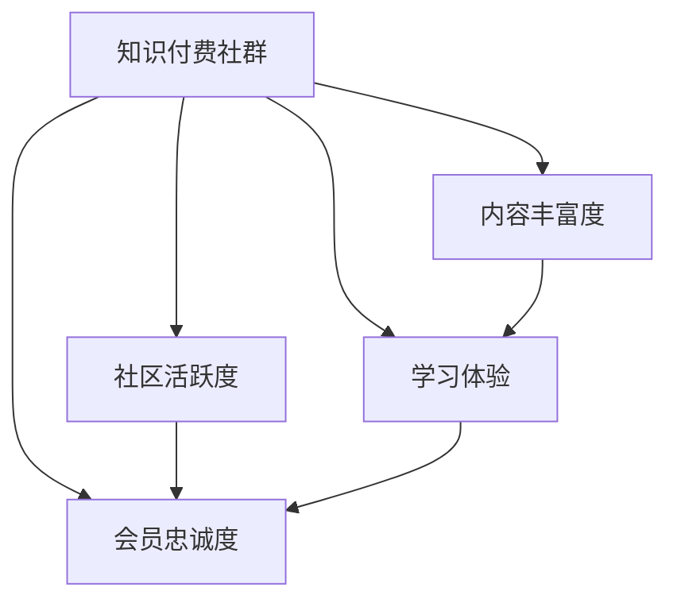
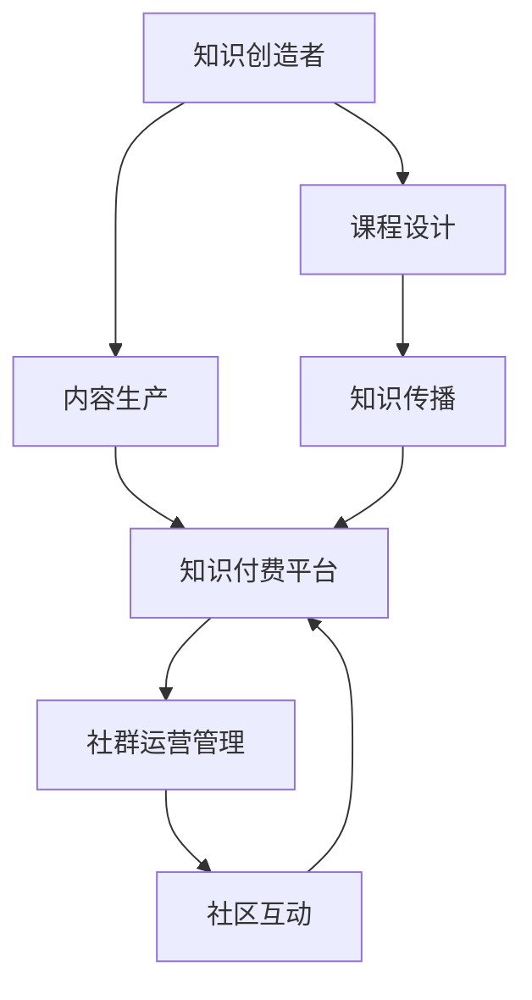

                 

# 如何打造高忠诚度的程序员知识付费社群

## 1. 背景介绍

在当今信息爆炸的时代，程序员面临的知识更新速度和复杂度前所未有。如何快速获取有价值的技能提升内容，已经成为技术人员自我成长的重要课题。为此，知识付费社群应运而生，成为连接知识创造者与学习者之间的桥梁，帮助广大开发者通过支付一定的费用，获取高质量的学习资源和指导服务。然而，如何打造一个高忠诚度的程序员知识付费社群，却是一个值得深思的问题。本文将从背景、核心概念、算法原理、具体操作步骤等多个维度出发，系统探讨这一重要话题。

## 2. 核心概念与联系

### 2.1 核心概念概述

为更好地理解高忠诚度程序员知识付费社群的打造方法，我们需要了解一些核心概念：

- **知识付费社群**：一个以专业知识共享为核心价值，通过知识付费模式运营的社群。旨在为成员提供高质量的知识服务，促进其职业成长和技术提升。
- **社区活跃度**：指社群成员之间的互动频率和社区内容的参与度，是社群健康发展的关键指标。
- **内容丰富度**：社群中各类知识和技能的学习资源数量和质量，直接影响到成员的学习效果。
- **学习体验**：知识获取的流畅度、便捷性和互动性，是社群能否长期吸引成员的重要因素。
- **会员忠诚度**：成员对社群的满意度和归属感，是社群持续发展的根基。

这些概念之间的关系可以用以下Mermaid流程图来描述：



这个流程图展示了知识付费社群的各个关键维度和它们之间的内在联系：社区活跃度、内容丰富度和学习体验共同支撑着社群的健康发展；而会员忠诚度则是社群运营的核心目标。

### 2.2 核心概念原理和架构的 Mermaid 流程图

知识付费社群的核心在于知识内容的提供和社群互动的促进。我们可以将知识付费社群的架构划分为三层，如以下Mermaid流程图所示：



在这个架构中，知识创造者通过内容生产，将知识传递到知识付费平台，再通过社群运营管理推动社区互动。内容设计、知识传播和社区互动则是知识付费社群的三大核心环节。

## 3. 核心算法原理 & 具体操作步骤

### 3.1 算法原理概述

打造高忠诚度的程序员知识付费社群，涉及到多个维度的优化，包括内容推荐、社群管理、互动机制等多个方面。本文将以内容推荐为例，介绍基于协同过滤和深度学习的推荐算法，其核心思想是通过分析用户行为，预测用户可能感兴趣的内容，从而提高社区活跃度和用户满意度。

### 3.2 算法步骤详解

#### 3.2.1 协同过滤推荐算法

协同过滤（Collaborative Filtering, CF）算法通过分析用户的历史行为和偏好，推荐可能感兴趣的内容。具体步骤如下：

1. **数据收集**：收集用户的学习记录、评分历史、互动数据等。
2. **构建用户-物品矩阵**：将用户对不同内容的评分转化为矩阵形式，表示用户对物品的兴趣程度。
3. **相似度计算**：计算用户和物品之间的相似度，可以使用余弦相似度、皮尔逊相关系数等。
4. **推荐结果排序**：将相似度高的物品推荐给用户，排序方式可以根据评分预测模型的输出进行。

#### 3.2.2 深度学习推荐算法

深度学习推荐算法（如神经协同过滤、深度神经网络等）通过学习用户行为数据和物品特征，预测用户对新物品的评分。具体步骤如下：

1. **数据预处理**：将原始数据转化为适合深度学习的格式，如将用户行为转化为向量表示。
2. **构建深度神经网络**：设计神经网络结构，如用户嵌入、物品嵌入、评分预测层等。
3. **模型训练**：使用用户行为数据训练模型，调整网络参数，最小化预测误差。
4. **推荐结果生成**：使用训练好的模型预测新用户对新物品的评分，排序后推荐给用户。

### 3.3 算法优缺点

#### 3.3.1 协同过滤推荐算法的优缺点

- **优点**：
  - **无需物品特征**：无需事先知道物品特征，只需要用户行为数据即可推荐。
  - **可扩展性好**：能够处理大规模稀疏数据，适用于用户数和物品数都很大的场景。
  - **实时性好**：推荐结果可以实时生成，满足用户即时需求。

- **缺点**：
  - **数据冷启动问题**：新用户或新物品缺少历史行为数据，难以进行有效推荐。
  - **矩阵分解误差**：推荐结果受矩阵分解的准确性影响，存在一定的偏差。
  - **尺度敏感**：对评分数据的尺度和分布敏感，需要预先处理。

#### 3.3.2 深度学习推荐算法的优缺点

- **优点**：
  - **特征学习能力**：能够学习到高维稀疏特征，发现潜在关联。
  - **泛化能力强**：通过大规模数据训练，能够适应更多样化的数据分布。
  - **推荐精度高**：深度模型能够更好地捕捉用户和物品之间的复杂关系。

- **缺点**：
  - **计算复杂度高**：模型训练和推理需要大量计算资源，难以实时处理。
  - **数据要求高**：需要高质量、大量、多维度的数据，否则训练效果不佳。
  - **可解释性差**：深度模型通常是"黑盒"，难以解释推荐结果背后的原因。

### 3.4 算法应用领域

协同过滤和深度学习推荐算法在多个领域都有广泛应用，例如电商、音乐、电影推荐等。在程序员知识付费社群中，这些算法可以应用于课程推荐、内容个性化、社区互动等多个环节，提升用户的学习效果和社群的活跃度。

## 4. 数学模型和公式 & 详细讲解 & 举例说明

### 4.1 数学模型构建

假设我们有一个用户-物品矩阵 $U \in \mathbb{R}^{N \times M}$，其中 $N$ 为用户数，$M$ 为物品数。矩阵中的每个元素 $U_{ij}$ 表示用户 $i$ 对物品 $j$ 的评分，$0 \leq U_{ij} \leq 1$。

协同过滤算法通过用户之间的相似度 $S_{ij}$ 来推荐物品，其中 $S_{ij} \in [0,1]$ 表示用户 $i$ 和用户 $j$ 的相似度。推荐物品的评分预测模型为：

$$
\hat{U}_{ij} = \sum_{k=1}^K a_{ik}b_{kj} + c_i + d_j + \epsilon_{ij}
$$

其中 $a_i,b_j,c_i,d_j$ 为模型参数，$\epsilon_{ij}$ 为误差项。

### 4.2 公式推导过程

深度学习推荐算法通常使用神经网络模型进行推荐，以神经协同过滤为例：

1. **用户嵌入层**：将用户行为数据转化为用户嵌入 $U^{user} \in \mathbb{R}^{N \times D_{user}}$，其中 $D_{user}$ 为嵌入维度。
2. **物品嵌入层**：将物品特征数据转化为物品嵌入 $I^{item} \in \mathbb{R}^{M \times D_{item}}$，其中 $D_{item}$ 为嵌入维度。
3. **交互层**：将用户嵌入和物品嵌入进行交互，得到用户-物品交互嵌入 $H \in \mathbb{R}^{N \times M}$。
4. **评分预测层**：通过多层感知机或神经网络对 $H$ 进行评分预测，输出用户对物品的评分预测值。

深度学习推荐算法的目标是优化损失函数 $L$，通常使用均方误差损失（Mean Squared Error, MSE）：

$$
L = \frac{1}{N} \sum_{i=1}^N \sum_{j=1}^M (U_{ij} - \hat{U}_{ij})^2
$$

### 4.3 案例分析与讲解

在实际应用中，可以使用协同过滤算法和深度学习算法进行课程推荐。以下是两种算法的实现案例：

#### 协同过滤推荐算法案例

1. **用户行为收集**：收集用户的学习历史数据，包括学习时间、评分、反馈等。
2. **相似度计算**：使用余弦相似度计算用户之间的相似度，公式为：

$$
S_{ij} = \frac{A_i \cdot B_j}{||A_i|| \cdot ||B_j||}
$$

其中 $A_i$ 和 $B_j$ 分别为用户 $i$ 和物品 $j$ 的行为向量。
3. **推荐结果排序**：使用 KNN（K-Nearest Neighbors）算法找到与目标用户 $i$ 最相似的用户 $k$，计算物品 $j$ 的评分预测值，排序后推荐给用户。

#### 深度学习推荐算法案例

1. **数据预处理**：将用户行为数据转化为向量表示，如将学习时间、评分等转化为数值型特征。
2. **模型构建**：设计用户嵌入、物品嵌入、交互层和评分预测层，使用 TensorFlow 或 PyTorch 实现。
3. **模型训练**：使用用户行为数据训练模型，调整网络参数，最小化预测误差。
4. **推荐结果生成**：使用训练好的模型预测新用户对新物品的评分，排序后推荐给用户。

## 5. 项目实践：代码实例和详细解释说明

### 5.1 开发环境搭建

在进行知识付费社群的实践开发时，我们需要准备以下开发环境：

1. **编程语言**：Python，安装 Python 3.x 和相关依赖。
2. **数据库**：MySQL、MongoDB 等，用于存储用户行为数据和社群内容。
3. **前端框架**：React、Vue 等，用于构建社群界面和用户交互。
4. **后端框架**：Django、Flask 等，用于处理用户请求和数据存储。
5. **推荐算法库**：如 Surprise、TensorFlow、PyTorch 等，用于实现推荐算法。

### 5.2 源代码详细实现

#### 协同过滤推荐算法实现

```python
from surprise import Dataset, Reader, SVD
from surprise.model_selection import cross_validate

# 准备数据
reader = Reader(line_format='user item rating', sep=',')
data = Dataset.load_from_file('ratings.csv', reader=reader)
data.build_full_trainset()

# 创建协同过滤模型
algo = SVD()

# 模型训练和交叉验证
cross_validate(algo, data, measures=['RMSE', 'MAE'], cv=5, verbose=True)

# 预测推荐结果
user_id = 1
test_items = [2, 3, 4, 5]
predictions = algo.test(test_items)

# 输出推荐结果
for pred in predictions:
    print(f"User {user_id} may like item {pred.iid}: {pred.est} -> {pred.rating}")
```

#### 深度学习推荐算法实现

```python
import tensorflow as tf
from tensorflow.keras.layers import Input, Dense, Embedding, Dot, Concatenate, Add

# 准备数据
user_data = tf.keras.preprocessing.sequence.pad_sequences(...
item_data = tf.keras.preprocessing.sequence.pad_sequences(...

# 构建用户嵌入层
user_input = Input(shape=(MAX_LEN,))
user_embedding = Embedding(USER_EMBEDDING_SIZE, DIM, input_length=MAX_LEN)(user_input)

# 构建物品嵌入层
item_input = Input(shape=(MAX_LEN,))
item_embedding = Embedding(ITEM_EMBEDDING_SIZE, DIM, input_length=MAX_LEN)(item_input)

# 构建交互层
interaction = Dot(axes=[2, 2])([user_embedding, item_embedding])

# 构建评分预测层
prediction = Dense(1)(interaction)

# 构建模型
model = tf.keras.Model(inputs=[user_input, item_input], outputs=prediction)

# 编译模型
model.compile(optimizer=tf.keras.optimizers.Adam(), loss='mse')

# 训练模型
model.fit([user_data, item_data], labels, epochs=10, batch_size=64)

# 预测推荐结果
test_user = tf.keras.preprocessing.sequence.pad_sequences(...
test_item = tf.keras.preprocessing.sequence.pad_sequences(...
predictions = model.predict([test_user, test_item])
```

### 5.3 代码解读与分析

**协同过滤推荐算法**：

- **数据处理**：使用 `surprise` 库加载数据集，并进行数据预处理。
- **模型训练**：使用 SVD 算法进行协同过滤模型训练，并使用交叉验证评估模型性能。
- **推荐预测**：使用训练好的模型对目标用户进行推荐，输出评分预测值。

**深度学习推荐算法**：

- **数据预处理**：使用 `tensorflow` 的 `pad_sequences` 函数进行数据预处理，将文本数据转化为数值型特征。
- **模型构建**：使用 `Embedding` 层构建用户嵌入和物品嵌入，通过 `Dot` 层进行交互，再使用 `Dense` 层进行评分预测。
- **模型训练**：使用 `compile` 函数编译模型，并使用 `fit` 函数训练模型。
- **推荐预测**：使用训练好的模型对目标用户进行推荐，输出评分预测值。

## 6. 实际应用场景

### 6.1 智能课程推荐

在程序员知识付费社群中，智能课程推荐是其核心功能之一。通过分析用户的历史学习行为，如课程评分、学习时长、反馈等，可以推荐出最适合用户当前学习阶段和兴趣爱好的课程。

具体实现时，可以使用协同过滤算法或深度学习推荐算法，结合用户画像、课程标签等特征，构建推荐模型。例如，可以使用 BERT 嵌入用户和课程的描述文本，构建神经网络模型，进行评分预测和排序推荐。

### 6.2 个性化学习路径

知识付费社群不仅提供课程推荐，还可以通过个性化学习路径引导用户系统学习。根据用户的职业背景、技能水平和学习目标，为用户定制个性化的学习路径，包括推荐的课程、学习计划、学习资源等。

这可以通过协同过滤和深度学习推荐算法实现，结合用户画像、学习历史记录、目标和兴趣等特征，动态调整推荐结果。例如，可以使用协同过滤算法推荐课程，再通过深度学习算法生成个性化学习路径。

### 6.3 社区互动和知识分享

知识付费社群不仅是课程推荐和学习路径规划的平台，更是知识交流和社区互动的场所。用户可以通过提问、讨论、分享等方式，进行深度学习和知识交流。

为了促进社区互动，可以引入推荐算法，推荐用户感兴趣的主题和话题。例如，可以使用协同过滤算法推荐热门话题和经典文章，或使用深度学习算法生成个性化的知识推荐。

## 7. 工具和资源推荐

### 7.1 学习资源推荐

- **《推荐系统实战》**：详细介绍了推荐系统的核心技术和算法实现，适用于初学者和进阶开发者。
- **《Deep Learning for Recommendations》**：介绍了深度学习在推荐系统中的应用，涵盖协同过滤、深度神经网络等多种算法。
- **Coursera《推荐系统》**：斯坦福大学开设的推荐系统课程，涵盖了协同过滤、深度学习、协同学习等多种推荐算法。
- **Kaggle 竞赛**：参加 Kaggle 上的推荐系统竞赛，实践推荐算法并获取反馈，提升实战能力。

### 7.2 开发工具推荐

- **Python 3.x**：简单易学，生态丰富，适用于推荐系统开发。
- **TensorFlow**：Google 开发的深度学习框架，支持分布式训练和部署。
- **PyTorch**：Facebook 开发的深度学习框架，灵活高效，适用于深度推荐算法开发。
- **Jupyter Notebook**：Python 开发环境，支持代码编写和实时交互，便于调试和测试。

### 7.3 相关论文推荐

- **《TensorFlow Recommenders》**：Google 开发的推荐系统框架，涵盖协同过滤、深度学习等多种推荐算法。
- **《Neural Collaborative Filtering》**：提出基于深度学习的协同过滤算法，显著提高了推荐系统的性能。
- **《Deep Interest Networks for Recommendation System》**：使用深度神经网络模型进行推荐，取得了最新的推荐系统 SOTA。

## 8. 总结：未来发展趋势与挑战

### 8.1 研究成果总结

本文介绍了协同过滤和深度学习推荐算法在程序员知识付费社群中的应用，详细讲解了推荐算法的原理和操作步骤。通过实际案例和代码实现，展示了推荐算法在课程推荐、个性化学习路径和社区互动等场景中的应用，并推荐了相关学习资源和开发工具。

### 8.2 未来发展趋势

未来，推荐系统将朝着更加个性化、动态化、智能化的方向发展。以下趋势值得关注：

- **多模态推荐**：结合文本、图像、视频等多种模态信息，提升推荐系统的多样性和准确性。
- **实时推荐**：通过流式数据处理和在线学习，实现实时推荐，提升用户体验。
- **混合推荐**：结合协同过滤和深度学习算法，构建混合推荐系统，提升推荐效果。
- **跨领域推荐**：将推荐系统扩展到多个领域，如电商、医疗、金融等，满足不同领域的需求。

### 8.3 面临的挑战

尽管推荐系统在许多场景下取得了良好的效果，但仍面临以下挑战：

- **数据质量问题**：推荐系统依赖于大量高质标注数据，但获取高质量数据成本较高。
- **算法复杂度高**：深度学习推荐算法计算复杂度高，难以实时处理大规模数据。
- **可解释性差**：深度学习推荐算法通常是"黑盒"，难以解释推荐结果背后的原因。
- **隐私保护**：推荐系统需要收集用户行为数据，如何保护用户隐私成为重要课题。

### 8.4 研究展望

未来，推荐系统的研究将围绕以下几个方向进行：

- **深度学习算法的优化**：探索更高效、更易于解释的深度学习算法，提升推荐系统性能。
- **推荐系统的跨领域应用**：将推荐系统扩展到更多领域，如医疗、金融、教育等，推动行业智能化升级。
- **推荐系统的伦理与安全**：研究推荐系统的公平性、透明性和安全性，保护用户权益和数据隐私。

通过这些努力，推荐系统将逐步成为更加智能、高效、可信的辅助决策工具，助力各行各业的发展和创新。

## 9. 附录：常见问题与解答

**Q1: 推荐系统如何处理数据冷启动问题？**

A: 数据冷启动是推荐系统中的常见问题。为了处理新用户或新物品缺少历史行为数据的情况，可以采用以下方法：

- **基于内容的推荐**：根据物品的特征和标签，进行推荐。例如，对于新物品，可以分析其类别和属性，推荐与该类别或属性相似的物品。
- **用户迁移**：将新用户与相似用户进行迁移，利用相似用户的历史行为数据进行推荐。例如，通过聚类算法找到新用户的相似用户，使用这些相似用户的历史行为数据进行推荐。
- **协同过滤增强**：结合协同过滤和内容推荐，构建混合推荐系统。例如，对于新用户，使用协同过滤推荐相似用户的历史物品，再结合内容推荐，推荐新物品。

**Q2: 推荐系统如何提高推荐结果的可解释性？**

A: 推荐系统的可解释性是一个重要问题。为了提高推荐结果的可解释性，可以采用以下方法：

- **特征重要性分析**：分析用户行为数据中的特征重要性，解释推荐结果背后的原因。例如，可以使用特征重要性算法，如 SHAP 值，分析用户评分和推荐结果之间的关系。
- **多模态特征融合**：结合多种模态的特征，提升推荐系统的可解释性。例如，结合文本、图像、音频等多种模态信息，进行推荐解释。
- **用户反馈机制**：引入用户反馈机制，收集用户对推荐结果的评价，进行系统优化和解释。例如，通过用户评分和反馈，调整推荐算法参数，提升推荐效果和可解释性。

**Q3: 推荐系统如何平衡推荐效果和用户隐私？**

A: 推荐系统需要在推荐效果和用户隐私之间进行平衡。为了保护用户隐私，可以采用以下方法：

- **匿名化处理**：对用户行为数据进行匿名化处理，保护用户隐私。例如，使用 K-匿名算法，将用户数据进行泛化处理，去除个人身份信息。
- **差分隐私**：使用差分隐私技术，保护用户隐私。例如，在推荐算法中引入噪声，保证个体隐私不被泄露。
- **隐私保护算法**：使用隐私保护算法，如 LDP（Local Differential Privacy）算法，保护用户数据隐私。例如，在推荐算法中，使用 LDP 算法，限制查询结果对个体数据的泄露。

**Q4: 推荐系统如何处理多样性和新颖性？**

A: 推荐系统需要兼顾多样性和新颖性，提升推荐结果的多样性和新颖性。可以采用以下方法：

- **多样性约束**：在推荐算法中引入多样性约束，保证推荐结果的多样性。例如，使用协同过滤算法，限制推荐结果中的物品数量，保证多样性。
- **新颖性推荐**：结合用户历史行为数据和流行趋势，推荐新颖物品。例如，通过时间序列分析，预测流行趋势，推荐与流行趋势相关的物品。
- **多目标优化**：将多样性和新颖性作为优化目标，构建多目标优化算法。例如，使用 Pareto 优化算法，同时优化多样性和新颖性。

通过这些努力，推荐系统将能够更好地平衡推荐效果和用户隐私，提升推荐结果的多样性和新颖性，满足用户的多样化需求。

