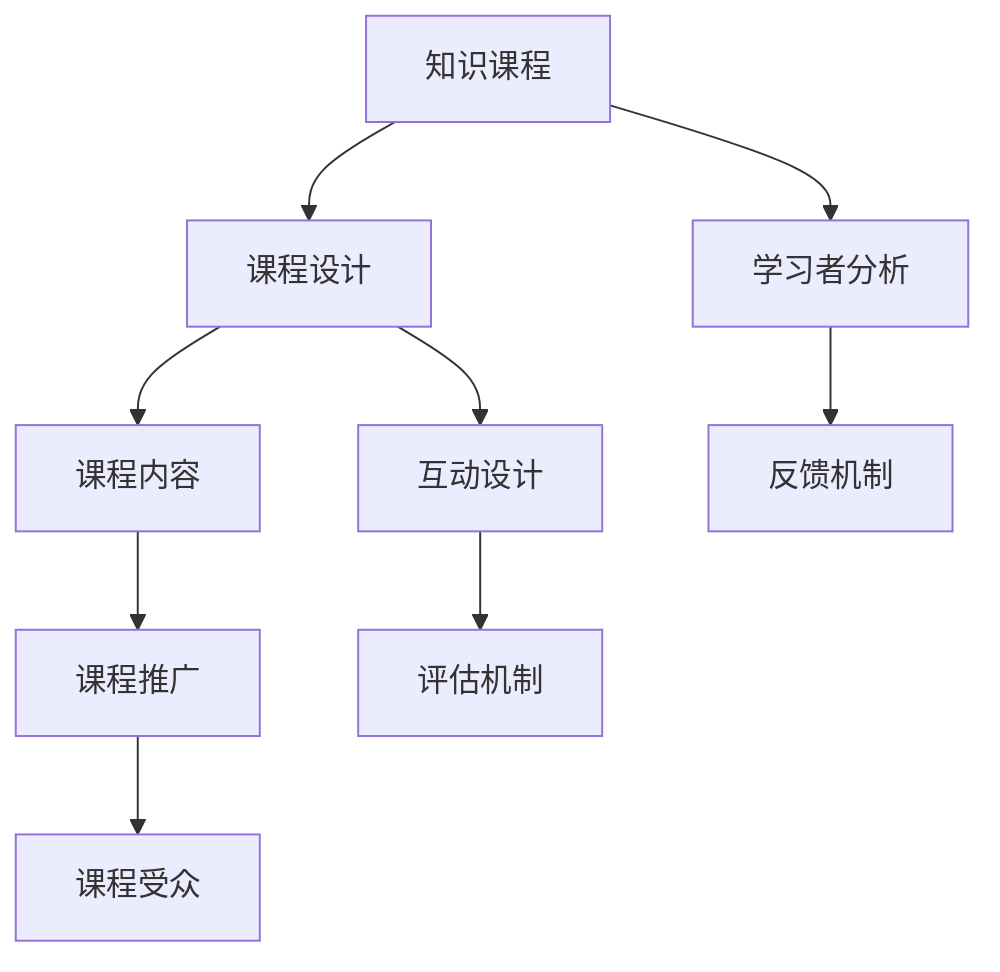

                 

# 如何打造高转化率的程序员知识课程

> 关键词：程序员知识课程, 课程设计, 课程评估, 学习者分析, 课程开发, 课程推广, 学习效果

## 1. 背景介绍

### 1.1 问题由来
在当今快速变化的科技环境中，程序员需要不断学习新技能来适应技术变化和提升工作效率。然而，传统的以知识传授为中心的课程往往难以满足现代程序员的学习需求。一方面，信息过载导致学习者难以集中注意力；另一方面，知识不成体系，导致学习效率低下，难以实现知识和技能的高效转化。

### 1.2 问题核心关键点
打造高转化率的程序员知识课程需要关注以下几个关键点：
- 学习者的需求和痛点分析
- 课程内容的系统化和实用化
- 互动式学习的设计
- 有效的课程评估和反馈机制
- 多渠道的课程推广策略

### 1.3 问题研究意义
高质量的程序员知识课程能够显著提升学习者的技能水平和工作效率，减少项目延期，降低技术债务，并加速企业技术创新。通过系统化设计课程，利用多渠道推广，可以有效地吸引和留住优秀人才，提高企业竞争力。

## 2. 核心概念与联系

### 2.1 核心概念概述

为了更好地理解高转化率程序员知识课程的设计原理，本节将介绍几个关键概念：

- **知识课程（Knowledge Course）**：围绕特定主题设计的系统化学习计划，旨在帮助学习者掌握相关知识和技能。
- **课程设计（Course Design）**：系统化构建课程内容和评估策略的过程，涵盖教学目标、内容组织、互动环节等方面。
- **学习者分析（Learner Analysis）**：通过对学习者的行为、需求和反馈进行数据分析，指导课程内容和互动设计。
- **课程推广（Course Promotion）**：利用多种渠道推广课程，提高课程的知名度和吸引力。
- **课程评估（Course Evaluation）**：通过评估机制和反馈机制，监测和改进课程效果。

这些核心概念通过以下Mermaid流程图来展示：



这个流程图展示了大语言模型的核心概念及其之间的关系：

1. 知识课程是课程设计的基础，包含教学目标和内容结构。
2. 学习者分析指导课程内容设计，确保课程符合学习者的需求。
3. 互动设计使课程更具吸引力和参与度。
4. 课程推广吸引更多学习者，扩大课程影响力。
5. 评估和反馈机制监测课程效果，指导后续改进。

## 3. 核心算法原理 & 具体操作步骤
### 3.1 算法原理概述

高转化率程序员知识课程的构建是一个动态过程，涉及课程设计、学习者分析、互动设计、课程推广和评估等多个环节。核心算法原理主要围绕以下几个方面：

- **课程设计算法**：根据学习目标和内容需求，系统化构建课程结构和内容体系。
- **学习者分析算法**：利用数据挖掘和机器学习技术，分析学习者的行为和反馈，指导课程内容的优化。
- **互动设计算法**：通过互动环节提升学习者的参与度和学习效果，如讨论、项目实践等。
- **课程推广算法**：利用SEO、社交媒体、在线广告等多种手段推广课程。
- **课程评估算法**：设计有效的评估机制，如测验、问卷调查等，监测课程效果，指导改进。

### 3.2 算法步骤详解

以下详细介绍各个算法的详细步骤：

#### 3.2.1 课程设计算法

**步骤1: 确定教学目标**
- 确定课程的总体目标和每个单元的具体目标。
- 目标应具备可测量性，如掌握某项编程技能或理解某个算法原理。

**步骤2: 选择课程内容**
- 选择与目标相关的知识点，涵盖从基础到高级的多个层次。
- 确保内容具有前瞻性和实用性，涵盖最新技术趋势。

**步骤3: 设计课程结构**
- 将课程内容组织成逻辑清晰的结构，如模块、章节、子主题等。
- 利用图表、流程图等工具辅助内容展示。

#### 3.2.2 学习者分析算法

**步骤1: 收集数据**
- 收集学习者的基本信息，如背景、技能水平等。
- 利用在线学习平台的数据分析工具，收集学习者的学习行为数据，如观看时长、互动频率等。

**步骤2: 分析数据**
- 利用数据分析工具，对收集的数据进行统计和挖掘，识别学习者的需求和痛点。
- 进行聚类分析，发现不同学习群体的特征。

**步骤3: 优化课程内容**
- 根据分析结果，优化课程内容，增加互动环节，调整难度和深度。
- 针对不同学习群体，设计个性化的学习路径。

#### 3.2.3 互动设计算法

**步骤1: 设计互动环节**
- 增加讨论、问答、编程实践等互动环节，提高学习者的参与度。
- 利用在线协作工具，如GitHub、Discord等，促进学习者之间的交流和协作。

**步骤2: 反馈机制设计**
- 设计即时反馈机制，如在线测验、即时评分系统等。
- 通过学习者反馈，持续改进课程内容和互动设计。

#### 3.2.4 课程推广算法

**步骤1: 内容优化**
- 优化课程内容，确保其质量和吸引力。
- 制作高质量的教学视频、文档、案例等辅助材料。

**步骤2: 多渠道推广**
- 利用SEO优化课程页面，提高搜索引擎排名。
- 在社交媒体、技术社区等平台发布课程信息，吸引目标受众。
- 利用在线广告，如Google Ads、社交媒体广告等，提高课程曝光率。

#### 3.2.5 课程评估算法

**步骤1: 设计评估机制**
- 设计课程评估工具，如在线测验、项目作业等。
- 评估内容应涵盖课程的各个方面，如知识掌握、技能应用、团队协作等。

**步骤2: 收集反馈**
- 通过问卷调查、用户访谈等方式，收集学习者的课程反馈。
- 定期收集和分析学习者的评估结果，指导课程改进。

**步骤3: 持续改进**
- 根据评估结果，调整课程内容，优化教学方法。
- 针对学习者的反馈，及时调整互动设计和反馈机制。

### 3.3 算法优缺点

高转化率程序员知识课程的构建算法具有以下优点：
- 系统化设计确保课程内容具有逻辑性和实用性，提升学习效果。
- 学习者分析指导课程优化，提高学习者的参与度和满意度。
- 互动设计提升学习体验，增强学习者的学习动机。
- 多渠道推广提高课程知名度，吸引更多学习者。
- 课程评估和反馈机制及时监测和改进课程效果，确保课程持续优化。

同时，该算法也存在以下局限性：
- 设计和优化课程需要大量时间和资源，初期投入较大。
- 需要持续收集和分析学习者反馈，过程繁琐复杂。
- 推广渠道多样，需要综合考虑各种因素，如预算、人力等。
- 课程推广和评估的效果受市场环境和技术发展的影响较大。

尽管存在这些局限性，但就目前而言，系统化设计和多渠道推广的结合方法仍是高转化率课程构建的主流范式。未来相关研究的重点在于如何进一步优化学习者分析工具，提高课程推广效果，同时兼顾课程质量和用户体验。

### 3.4 算法应用领域

高转化率程序员知识课程的构建方法，广泛应用于在线教育、企业培训、开源社区等多个领域，具体应用如下：

- **在线教育平台**：如Coursera、Udemy等，提供系统化的课程设计和互动学习体验。
- **企业内部培训**：企业可以根据员工的需求和痛点，设计定制化的培训课程，提升团队技能水平。
- **开源社区**：如GitHub、Stack Overflow等，通过社区内专家分享和互动学习，促进社区成员技能提升。
- **技能认证考试**：如AWS认证、Oracle认证等，提供系统化的课程内容和评估机制，确保学习者具备相应的技能水平。

除了上述这些常见应用外，高转化率课程构建方法还可以创新性地应用于更多场景中，如在线编程挑战、技术工作坊等，为程序员提供更加多样化的学习路径和提升机会。

## 4. 数学模型和公式 & 详细讲解  
### 4.1 数学模型构建

本节将使用数学语言对高转化率程序员知识课程的设计过程进行更加严格的刻画。

假设课程由 $N$ 个单元组成，每个单元 $i$ 的目标为 $T_i$，其中 $T_i$ 为可测量指标，如掌握某项编程技能。

**课程设计算法**：
目标函数为 $\max_{T} \sum_{i=1}^{N} T_i$，即最大化所有单元的目标和。

**学习者分析算法**：
假设学习者特征向量为 $\mathbf{x} = [x_1, x_2, ..., x_m]$，目标函数为 $\min_{\mathbf{x}} \sum_{i=1}^{N} \ell_i(x)$，其中 $\ell_i(x)$ 为单元 $i$ 的损失函数，衡量学习者特征与目标 $T_i$ 的拟合度。

**互动设计算法**：
假设单元 $i$ 的互动环节数为 $M_i$，目标函数为 $\max_{M} \sum_{i=1}^{N} M_i$，即最大化所有单元的互动环节数。

**课程推广算法**：
假设推广渠道数量为 $C$，推广成本为 $B_i$，目标函数为 $\max_{C, B} \sum_{i=1}^{N} \frac{R_i}{B_i}$，其中 $R_i$ 为单元 $i$ 的推广收益，$B_i$ 为推广成本。

**课程评估算法**：
假设评估工具数量为 $E$，成本为 $S_i$，目标函数为 $\max_{E, S} \sum_{i=1}^{N} \frac{A_i}{S_i}$，其中 $A_i$ 为单元 $i$ 的评估收益，$S_i$ 为评估成本。

### 4.2 公式推导过程

以下我们以编程语言课程为例，推导学习者分析算法中的损失函数公式。

假设单元 $i$ 的学习者特征向量为 $\mathbf{x}_i = [x_{i1}, x_{i2}, ..., x_{im}]$，目标函数为 $\min_{\mathbf{x}} \sum_{i=1}^{N} \ell_i(x)$。

单元 $i$ 的学习目标为掌握某种编程技能，设 $T_i = \sum_{j=1}^{m} w_{ij} \mathbf{x}_{ij}$，其中 $w_{ij}$ 为学习者特征 $x_{ij}$ 对目标 $T_i$ 的权重。

单元 $i$ 的损失函数 $\ell_i(x)$ 为：

$$
\ell_i(x) = \sum_{j=1}^{m} |T_i - w_{ij} x_{ij}|
$$

将所有单元的损失函数求和，得到学习者分析的目标函数：

$$
\min_{\mathbf{x}} \sum_{i=1}^{N} \ell_i(x)
$$

通过对学习者特征 $x_{ij}$ 的优化，最小化单元 $i$ 的学习目标与实际学习者特征的差距，从而指导课程内容的优化。

## 5. 项目实践：代码实例和详细解释说明
### 5.1 开发环境搭建

在进行课程构建实践前，我们需要准备好开发环境。以下是使用Python进行Django开发的环境配置流程：

1. 安装Python：从官网下载并安装Python 3.7及以上版本。
2. 安装虚拟环境管理工具virtualenv，确保代码库的独立运行。
3. 安装Django框架和所需依赖库：
```bash
pip install django
pip install django-crispy-forms
```
4. 创建虚拟环境并激活：
```bash
virtualenv env
source env/bin/activate
```
5. 安装Django模板和静态文件管理工具：
```bash
pip install django-summernote django-compressor
```

完成上述步骤后，即可在虚拟环境中开始课程构建实践。

### 5.2 源代码详细实现

下面我们以编程语言课程为例，给出使用Django进行在线课程开发的PyTorch代码实现。

**创建课程模型（models.py）**

```python
from django.db import models

class Course(models.Model):
    name = models.CharField(max_length=200)
    description = models.TextField()
    creator = models.ForeignKey('User', on_delete=models.CASCADE)

    def __str__(self):
        return self.name

class Unit(models.Model):
    course = models.ForeignKey('Course', on_delete=models.CASCADE)
    name = models.CharField(max_length=200)
    target = models.TextField()
    learning_resources = models.TextField()
    interactions = models.TextField()
    assessment = models.TextField()

    def __str__(self):
        return self.name

class User(models.Model):
    username = models.CharField(max_length=200)
    email = models.EmailField()
    password = models.CharField(max_length=200)
```

**创建课程视图（views.py）**

```python
from django.shortcuts import render
from .models import Course, Unit

def course_list(request):
    courses = Course.objects.all()
    return render(request, 'courses/list.html', {'courses': courses})

def course_detail(request, pk):
    course = Course.objects.get(pk=pk)
    units = Unit.objects.filter(course=course)
    return render(request, 'courses/detail.html', {'course': course, 'units': units})

def unit_detail(request, pk):
    unit = Unit.objects.get(pk=pk)
    return render(request, 'courses/unit_detail.html', {'unit': unit})
```

**创建课程模板（templates/courses/list.html）**

```html


  <h1>All Courses</h1>
  <ul>
    
      <li><a href="">{{ course.name }}</a></li>
    
  </ul>

```

**创建课程模板（templates/courses/detail.html）**

```html


  <h1>{{ course.name }}</h1>
  <p>{{ course.description }}</p>
  <h2>Units</h2>
  <ul>
    
      <li><a href="">{{ unit.name }}</a></li>
    
  </ul>

```

**创建课程模板（templates/courses/unit_detail.html）**

```html


  <h1>{{ unit.name }}</h1>
  <p>{{ unit.target }}</p>
  <p>{{ unit.learning_resources }}</p>
  <p>{{ unit.interactions }}</p>
  <p>{{ unit.assessment }}</p>

```

**创建课程静态文件（static/course.css）**

```css
body {
  font-family: Arial, sans-serif;
}
```

**创建课程视图（urls.py）**

```python
from django.urls import path
from .views import course_list, course_detail, unit_detail

urlpatterns = [
    path('courses/', course_list, name='course_list'),
    path('courses/<int:pk>/', course_detail, name='course_detail'),
    path('courses/<int:pk>/units/<int:pk>/', unit_detail, name='unit_detail'),
]
```

**创建基础模板（templates/base.html）**

```html
<!DOCTYPE html>
<html>
  <head>
    <title>Courses</title>
    <link rel="stylesheet" href="">
  </head>
  <body>
    
    
  </body>
</html>
```

**创建课程应用（course/urls.py）**

```python
from django.urls import path
from .views import course_list, course_detail, unit_detail

urlpatterns = [
    path('', course_list, name='course_list'),
    path('<int:pk>/', course_detail, name='course_detail'),
    path('<int:pk>/units/<int:pk>/', unit_detail, name='unit_detail'),
]
```

### 5.3 代码解读与分析

让我们再详细解读一下关键代码的实现细节：

**Course、Unit和User模型**

- **Course模型**：定义了课程的基本属性，如名称、描述、创建者等。
- **Unit模型**：定义了课程单元的基本属性，如单元名称、学习目标、学习资源、互动设计、评估机制等。
- **User模型**：定义了用户的基本属性，如用户名、邮箱、密码等。

**course_list、course_detail和unit_detail视图**

- **course_list视图**：展示了所有课程的列表，包含课程名称和链接。
- **course_detail视图**：展示了特定课程的详细信息，包括课程描述和单元列表。
- **unit_detail视图**：展示了特定单元的详细信息，包括单元目标、学习资源、互动设计和评估机制。

**templates/courses/list.html、templates/courses/detail.html和templates/courses/unit_detail.html模板**

- **list.html模板**：展示了所有课程的列表，每个课程包含名称和链接。
- **detail.html模板**：展示了特定课程的详细信息，包含课程描述和单元列表。
- **unit_detail.html模板**：展示了特定单元的详细信息，包括单元目标、学习资源、互动设计和评估机制。

**course.css静态文件**

- **course.css文件**：定义了课程页面的基本样式。

**course/urls.py应用**

- **urls.py文件**：定义了课程应用的路由规则，确保不同视图和模板的路径正确。

通过以上代码实现，我们可以看到，Django框架提供了简洁高效的Web开发工具，可以快速搭建一个完整的课程管理后台，支持课程的创建、管理和展示。开发者可以根据实际需求，自定义模型和视图，设计个性化的课程页面和功能。

当然，工业级的系统实现还需考虑更多因素，如用户认证、权限控制、数据备份、安全性等。但核心的课程构建流程基本与此类似。

## 6. 实际应用场景
### 6.1 在线编程挑战平台

高转化率的程序员知识课程构建方法，可以应用于在线编程挑战平台。挑战平台能够吸引全球程序员参与，通过互动环节和实时反馈，提升学习者的编程技能和问题解决能力。

具体而言，挑战平台可以通过以下方式实现：
- 设计多个难度层次的编程挑战，涵盖基础、进阶和高级的不同阶段。
- 提供即时反馈和评分机制，通过代码评语和评分结果，指导学习者改进代码。
- 利用排行榜、徽章等激励措施，激发学习者的参与热情和竞争意识。
- 定期组织线上编程比赛，提供丰厚的奖励，进一步吸引和激励学习者。

### 6.2 企业内部技术培训

对于企业而言，高转化率的课程构建方法可以应用于内部技术培训，帮助员工掌握新技能，提升工作效率和项目质量。

具体而言，企业可以设计如下课程：
- 根据技术栈需求，设计专项技能培训课程，如Java开发、Python数据科学等。
- 结合公司项目需求，设计实战项目课程，帮助员工解决实际工作中的问题。
- 利用企业内外部专家资源，设计在线讲座和工作坊，丰富课程内容。
- 建立课程反馈机制，及时收集和改进课程效果，确保课程内容紧跟技术趋势。

### 6.3 开源社区技术分享

高转化率的课程构建方法同样适用于开源社区，帮助社区成员提升技能，促进知识共享和技术传播。

具体而言，开源社区可以设计如下课程：
- 组织技术分享会和讨论组，邀请社区成员分享最新的技术成果和实践经验。
- 利用GitHub等平台，创建技术博客和教程，记录和传播社区成员的技术实践。
- 提供线上编程竞赛和协作项目，促进社区成员的交流和合作。
- 利用社区内专家资源，设计技术培训课程，提升社区成员的技能水平。

### 6.4 未来应用展望

随着技术的不断进步和应用场景的不断拓展，高转化率的程序员知识课程构建方法将迎来更多创新和突破：

1. **人工智能辅助设计**：利用自然语言处理和机器学习技术，自动生成课程大纲和互动环节，提升课程设计的效率和质量。
2. **游戏化学习设计**：通过角色扮演、任务驱动等游戏化元素，增强学习者的学习动机和参与度。
3. **混合现实技术应用**：利用AR/VR等混合现实技术，提供沉浸式的学习体验，提升学习效果。
4. **跨领域融合设计**：结合不同领域的知识，设计综合性课程，培养复合型人才。
5. **个性化学习路径**：利用大数据和个性化推荐技术，为不同学习者设计个性化学习路径，提升学习效率。
6. **全球化课程推广**：利用多语言支持和国际合作，将高转化率课程推广至全球，服务更多学习者。

以上趋势凸显了高转化率程序员知识课程构建方法在现代教育和技术培训中的重要作用，相信随着技术的不断进步和应用场景的不断拓展，高转化率课程构建方法必将在全球范围内得到广泛应用。

## 7. 工具和资源推荐
### 7.1 学习资源推荐

为了帮助开发者系统掌握程序员知识课程的设计原理和实践技巧，这里推荐一些优质的学习资源：

1. **《Deep Learning for Coders with fast.ai》**：由fast.ai团队编写，深入浅出地介绍了深度学习在NLP、图像识别等领域的应用，适合程序员自学。
2. **Coursera和edX**：全球领先的在线教育平台，提供大量的高质量课程和认证项目，涵盖从基础到高级的各种主题。
3. **Udacity和Coursera**：提供大规模开放在线课程（MOOCs），涵盖数据科学、机器学习、编程语言等热门领域。
4. **Kaggle**：全球最大的数据科学竞赛平台，提供丰富的学习资源和实践机会，促进数据科学和机器学习技能的发展。
5. **Kaggle Learn**：Kaggle提供的学习平台，涵盖数据科学、机器学习、编程语言等领域的课程，适合初学者和进阶学习者。

通过对这些资源的学习实践，相信你一定能够快速掌握高转化率程序员知识课程的设计技巧，并用于解决实际的课程开发问题。

### 7.2 开发工具推荐

高效的开发离不开优秀的工具支持。以下是几款用于程序员知识课程开发的常用工具：

1. **Django**：Python的开源Web框架，提供高效的模板引擎和ORM，支持快速搭建Web应用。
2. **Flask**：Python的开源Web框架，适合小型项目和快速原型开发。
3. **React**：JavaScript的前端框架，支持动态UI和单页面应用开发。
4. **Angular**：JavaScript的前端框架，适合大型复杂Web应用的开发。
5. **Bootstrap**：HTML、CSS和JavaScript的前端框架，提供现代化的UI组件和样式。
6. **Vuetify**：基于Vue.js的UI组件库，提供丰富的UI组件和样式。
7. **GitHub**：全球最大的代码托管平台，支持代码版本控制和协作开发。
8. **Bitbucket**：支持代码托管和协作开发，提供丰富的项目管理功能。

合理利用这些工具，可以显著提升程序员知识课程的开发效率，加快创新迭代的步伐。

### 7.3 相关论文推荐

高转化率程序员知识课程的构建方法源于学界的持续研究。以下是几篇奠基性的相关论文，推荐阅读：

1. **《Learning Analytics: What, Why and How?》**：探讨了学习分析的概念、应用和挑战，为课程评估提供了理论基础。
2. **《Designing Effective Learning Paths》**：介绍了如何根据学习者的需求和痛点设计个性化的学习路径，提高学习效果。
3. **《A Comparison of E-Learning Platforms》**：比较了多种在线学习平台的特点和优缺点，指导选择合适的平台和工具。
4. **《The Effectiveness of Learning Analytics in Higher Education》**：研究了学习分析在高等教育中的应用效果，为课程评估提供了实证支持。
5. **《How to Create High Quality Online Learning Materials》**：介绍了如何设计和制作高质量的在线学习材料，提升课程质量。

这些论文代表了大语言模型微调技术的发展脉络。通过学习这些前沿成果，可以帮助研究者把握学科前进方向，激发更多的创新灵感。

## 8. 总结：未来发展趋势与挑战
### 8.1 总结

本文对高转化率程序员知识课程的设计原理和实践技巧进行了全面系统的介绍。首先阐述了高转化率课程构建的背景和意义，明确了课程设计和评估的关键点。其次，从原理到实践，详细讲解了课程构建的数学模型和算法步骤，给出了课程开发的完整代码实例。同时，本文还广泛探讨了课程在在线编程挑战、企业培训、开源社区等多个领域的应用前景，展示了课程构建方法的巨大潜力。此外，本文精选了课程设计的各类学习资源，力求为开发者提供全方位的技术指引。

通过本文的系统梳理，可以看到，高转化率程序员知识课程构建方法在现代教育和技术培训中扮演着越来越重要的角色。利用系统化设计和互动式学习，可以显著提升学习者的学习效果，加速技术知识的传播和应用。未来，随着技术的不断进步和应用场景的不断拓展，高转化率课程构建方法必将在全球范围内得到广泛应用。

### 8.2 未来发展趋势

展望未来，高转化率程序员知识课程构建方法将呈现以下几个发展趋势：

1. **人工智能辅助设计**：利用自然语言处理和机器学习技术，自动生成课程大纲和互动环节，提升课程设计的效率和质量。
2. **游戏化学习设计**：通过角色扮演、任务驱动等游戏化元素，增强学习者的学习动机和参与度。
3. **混合现实技术应用**：利用AR/VR等混合现实技术，提供沉浸式的学习体验，提升学习效果。
4. **跨领域融合设计**：结合不同领域的知识，设计综合性课程，培养复合型人才。
5. **个性化学习路径**：利用大数据和个性化推荐技术，为不同学习者设计个性化学习路径，提升学习效率。
6. **全球化课程推广**：利用多语言支持和国际合作，将高转化率课程推广至全球，服务更多学习者。

以上趋势凸显了高转化率程序员知识课程构建方法在现代教育和技术培训中的重要作用，相信随着技术的不断进步和应用场景的不断拓展，高转化率课程构建方法必将在全球范围内得到广泛应用。

### 8.3 面临的挑战

尽管高转化率程序员知识课程构建方法已经取得了显著成果，但在迈向更加智能化、普适化应用的过程中，它仍面临诸多挑战：

1. **数据质量问题**：课程设计和评估依赖于大量学习者数据，数据质量和准确性直接影响课程效果。
2. **技术复杂性**：课程设计和推广涉及多种技术和工具，技术复杂性较高，需要专业知识和技能。
3. **资源投入高**：课程设计和推广需要大量时间和资源，初期投入较大。
4. **课程效果难以量化**：课程效果的评估和改进需要持续的反馈和调整，难以量化衡量。
5. **学习者多样性**：不同学习者的背景和需求差异较大，需要设计多样化的课程内容和学习路径。

尽管存在这些挑战，但通过不断优化课程设计和推广策略，合理利用技术和资源，可以最大化地发挥高转化率课程构建方法的优势，推动技术知识的广泛传播和应用。

### 8.4 研究展望

面对高转化率程序员知识课程构建所面临的挑战，未来的研究需要在以下几个方面寻求新的突破：

1. **数据质量提升**：通过数据清洗、数据增强等手段，提升课程设计和学习评估的数据质量。
2. **技术集成优化**：利用机器学习、自然语言处理等技术，优化课程设计和推广过程，提高效率和效果。
3. **资源优化分配**：通过优化课程设计流程和推广策略，降低课程开发和推广的资源投入。
4. **效果量化评估**：通过引入更科学和精准的评估指标，量化衡量课程效果，指导课程改进。
5. **个性化学习设计**：利用大数据和个性化推荐技术，为不同学习者设计个性化学习路径，提升学习效率。

这些研究方向的探索，必将引领高转化率课程构建方法迈向更高的台阶，为技术知识的传播和应用提供更强大的支持。面向未来，高转化率课程构建方法还需要与其他人工智能技术进行更深入的融合，如知识表示、因果推理、强化学习等，多路径协同发力，共同推动技术知识的传播和应用。只有勇于创新、敢于突破，才能不断拓展技术知识的边界，让高转化率课程构建方法在现代教育和技术培训中发挥更大的作用。

## 9. 附录：常见问题与解答

**Q1：如何设计高转化率课程的课程内容？**

A: 设计高转化率课程的课程内容需要关注以下几个方面：
1. **目标明确**：确定课程的目标和关键知识点，确保内容具备可测量性。
2. **内容实用**：选择与目标相关的实用知识点，涵盖从基础到高级的多个层次。
3. **结构清晰**：将内容组织成逻辑清晰的结构，如模块、章节、子主题等。
4. **互动丰富**：增加讨论、问答、编程实践等互动环节，提高学习者的参与度。
5. **反馈及时**：设计即时反馈机制，如在线测验、即时评分系统等，指导学习者改进。

**Q2：如何评估高转化率课程的效果？**

A: 评估高转化率课程的效果需要关注以下几个方面：
1. **测验成绩**：通过在线测验评估学习者的知识掌握情况。
2. **项目成果**：通过项目作业评估学习者的技能应用能力。
3. **学习行为**：利用数据分析工具，监测学习者的学习行为，如观看时长、互动频率等。
4. **学习反馈**：通过问卷调查、用户访谈等方式，收集学习者的反馈，指导课程改进。

**Q3：如何推广高转化率课程？**

A: 推广高转化率课程需要关注以下几个方面：
1. **多渠道推广**：利用SEO、社交媒体、在线广告等多种手段推广课程。
2. **内容优化**：优化课程内容，确保其质量和吸引力。
3. **激励措施**：通过排行榜、徽章等激励措施，激发学习者的参与热情和竞争意识。
4. **用户互动**：利用在线协作工具，如GitHub、Discord等，促进学习者之间的交流和协作。

**Q4：如何设计高转化率课程的互动环节？**

A: 设计高转化率课程的互动环节需要关注以下几个方面：
1. **讨论和问答**：增加讨论和问答环节，促进学习者之间的交流和互动。
2. **编程实践**：通过项目实践和编程挑战，提升学习者的实践能力。
3. **实时反馈**：利用即时反馈机制，如在线测验、即时评分系统等，指导学习者改进。
4. **社区协作**：利用在线协作工具，如GitHub、Discord等，促进学习者之间的协作和知识共享。

**Q5：如何优化高转化率课程的推广效果？**

A: 优化高转化率课程的推广效果需要关注以下几个方面：
1. **多渠道推广**：利用多种渠道推广课程，如SEO、社交媒体、在线广告等，扩大课程影响力。
2. **内容优化**：优化课程内容，确保其质量和吸引力。
3. **激励措施**：通过排行榜、徽章等激励措施，激发学习者的参与热情和竞争意识。
4. **用户互动**：利用在线协作工具，如GitHub、Discord等，促进学习者之间的交流和协作。
5. **持续改进**：根据反馈和评估结果，不断优化课程内容和推广策略。

通过以上问答，可以看到，高转化率程序员知识课程构建方法在现代教育和技术培训中扮演着越来越重要的角色。通过系统化设计和互动式学习，可以显著提升学习者的学习效果，加速技术知识的传播和应用。未来，随着技术的不断进步和应用场景的不断拓展，高转化率课程构建方法必将在全球范围内得到广泛应用。

---

作者：禅与计算机程序设计艺术 / Zen and the Art of Computer Programming

