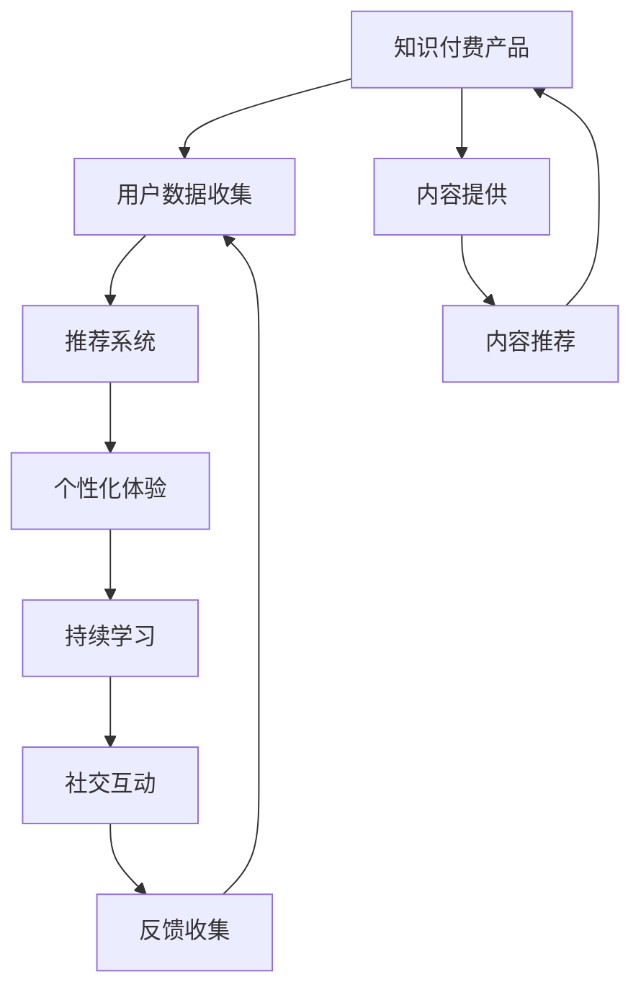

                 

# 如何提高知识付费产品的用户粘性

> 关键词：知识付费产品, 用户粘性, 推荐系统, 数据驱动, 个性化体验, 持续学习, 社交互动

## 1. 背景介绍

在互联网时代，知识付费产品的兴起为人们提供了便捷的学习方式，然而，面对激烈的市场竞争，如何提高用户粘性成为了知识付费产品脱颖而出的关键。通过深入研究用户行为模式，结合数据驱动的推荐系统，我们可以为用户提供更加个性化的学习体验，从而显著提升用户粘性。本文将从核心概念、算法原理、实际操作、数学模型、项目实践、实际应用、工具推荐、未来展望等多个维度，系统探讨如何构建高粘性的知识付费产品。

## 2. 核心概念与联系

### 2.1 核心概念概述

在构建知识付费产品时，需关注以下几个核心概念：

- **知识付费产品**：指通过平台提供的课程、文章、音频、视频等内容，帮助用户获取专业知识，提升个人技能和知识水平。常见的知识付费平台包括Coursera、Udemy、得到等。

- **用户粘性**：指用户对知识付费产品的持续使用程度，体现在用户的活跃度、留存率、复购率等方面。提高用户粘性意味着增加产品的竞争力。

- **推荐系统**：指基于用户行为数据和内容特征，为用户推荐其可能感兴趣的学习资源。推荐系统可以分为基于协同过滤、内容推荐、混合推荐等多种类型。

- **个性化体验**：指根据用户的兴趣、行为和反馈，动态调整学习内容和推荐策略，提供更加贴合用户需求的学习体验。个性化体验的提升是提高用户粘性的重要手段。

- **持续学习**：指鼓励用户长期坚持学习，通过设置学习路径、课程体系、认证机制等，激励用户不断学习，积累知识和技能。

- **社交互动**：指通过学习社区、在线讨论、社交网络等功能，促进用户之间的互动和交流，增强社区粘性。

这些核心概念之间通过推荐系统、个性化体验等技术手段紧密相连，共同支撑知识付费产品的运营和发展。

### 2.2 核心概念原理和架构的 Mermaid 流程图



该图展示了知识付费产品的核心流程：首先收集用户数据，通过推荐系统和个性化体验为用户推荐学习内容，并结合持续学习和社交互动功能，持续提升用户粘性。同时，通过反馈收集不断优化产品，形成良性循环。

## 3. 核心算法原理 & 具体操作步骤

### 3.1 算法原理概述

提高知识付费产品的用户粘性，主要依赖数据驱动的推荐系统和个性化体验。推荐系统通过分析用户历史行为数据，预测用户兴趣，为用户推荐最相关的内容。个性化体验则通过动态调整内容展示方式和学习路径，提升用户体验，从而增强用户粘性。

## 3.2 算法步骤详解

### 3.2.1 用户行为数据分析

用户行为数据包括但不限于点击次数、学习时长、课程评价、笔记内容等。通过对这些数据的分析，可以构建用户画像，识别出用户的兴趣偏好和学习模式。

### 3.2.2 协同过滤推荐

协同过滤推荐基于用户历史行为和相似用户的行为进行推荐。具体步骤如下：

1. 计算用户之间的相似度：可以使用余弦相似度、皮尔逊相关系数等方法。
2. 基于相似度进行推荐：找出与当前用户相似度高的用户，根据这些用户的历史行为数据推荐相似的内容。

### 3.2.3 内容推荐算法

内容推荐算法可以根据内容特征进行推荐，常用的算法包括基于内容的推荐、矩阵分解、深度学习等。

1. 基于内容的推荐：根据内容的属性（如标签、分类、作者等），推荐与当前内容相似的内容。
2. 矩阵分解：将用户和内容特征映射到低维空间，通过矩阵分解算法（如SVD）推荐相关内容。
3. 深度学习推荐：使用神经网络模型（如CNN、RNN、Transformer）进行用户行为和内容特征的建模，预测用户兴趣，推荐相关内容。

### 3.2.4 个性化体验

个性化体验的核心是通过动态调整内容展示方式和学习路径，提升用户体验。具体步骤包括：

1. 学习路径推荐：根据用户历史学习数据，推荐适合用户的学习路径。
2. 内容展示优化：通过A/B测试，不断调整内容展示格式、推荐算法、学习路径，提升用户体验。
3. 学习进度跟踪：记录用户的课程进度和测试成绩，实时反馈学习效果，激励用户继续学习。

### 3.2.5 持续学习

持续学习通过设置学习路径、课程体系、认证机制等，鼓励用户长期坚持学习。具体步骤包括：

1. 学习路径设计：根据不同领域和层次，设计系统的学习路径，帮助用户系统学习。
2. 课程体系构建：根据课程内容和难度，构建层次化的课程体系，满足用户的多样化需求。
3. 认证机制引入：通过证书、徽章等形式，激励用户完成学习任务，增强学习动力。

### 3.2.6 社交互动

社交互动通过构建学习社区、在线讨论、社交网络等功能，促进用户之间的互动和交流，增强社区粘性。具体步骤包括：

1. 学习社区搭建：创建学习论坛、小组，提供用户交流的平台。
2. 在线讨论功能：支持用户在课程页面进行评论、点赞、回复等互动。
3. 社交网络构建：通过好友推荐、关注机制，建立用户之间的社交网络。

### 3.2.7 反馈收集与优化

反馈收集通过用户调研、用户行为数据等途径，收集用户对产品和功能的反馈，不断优化产品。具体步骤包括：

1. 用户调研：定期进行问卷调查，了解用户需求和满意度。
2. 行为数据分析：分析用户行为数据，识别产品缺陷和改进点。
3. 功能迭代：根据用户反馈和数据分析结果，迭代优化产品功能。

## 3.3 算法优缺点

### 3.3.1 推荐系统的优点

- **高准确性**：基于用户历史行为和相似用户的行为，推荐相关内容，准确性高。
- **个性化体验**：通过个性化推荐，提升用户体验，增强用户粘性。
- **数据驱动**：依赖数据驱动，推荐结果可量化，易于优化。

### 3.3.2 推荐系统的缺点

- **数据需求高**：推荐系统依赖大量用户数据，数据获取和处理成本较高。
- **冷启动问题**：新用户缺乏足够历史数据，推荐效果不佳。
- **过拟合风险**：过度依赖历史数据，可能导致过拟合，影响推荐效果。

### 3.3.3 个性化体验的优点

- **提升用户体验**：动态调整内容展示和学习路径，提升用户满意度。
- **增强用户粘性**：通过个性化推荐，增加用户对平台的依赖性。
- **数据驱动优化**：基于用户行为数据，不断优化推荐算法和用户体验。

### 3.3.4 个性化体验的缺点

- **技术复杂**：个性化体验需要复杂的算法和数据处理，技术门槛较高。
- **成本高**：动态调整内容展示和学习路径，需要较高的人力和时间成本。
- **数据隐私**：个性化体验需要收集大量用户数据，可能存在隐私问题。

### 3.3.5 持续学习的优点

- **激励用户学习**：通过设置学习路径、课程体系、认证机制等，激励用户长期坚持学习。
- **提升学习效果**：系统化的学习路径和课程体系，有助于用户系统地掌握知识。
- **增强学习动力**：通过认证机制和激励措施，增强用户的学习动力。

### 3.3.6 持续学习的缺点

- **课程质量**：课程内容质量和结构设计直接影响学习效果。
- **用户坚持度**：学习过程可能枯燥，用户坚持度较低。
- **资源投入高**：课程设计和认证机制的维护需要较高的人力和时间投入。

### 3.3.7 社交互动的优点

- **增强社区粘性**：通过学习社区、在线讨论、社交网络等功能，增强用户之间的互动，提升社区粘性。
- **知识共享**：促进用户之间的知识共享和交流，提升学习效果。
- **增强用户体验**：通过社交互动，提升用户对平台的满意度。

### 3.3.8 社交互动的缺点

- **管理复杂**：社交互动功能的管理和维护需要较高的技术和管理成本。
- **用户隐私**：社交互动涉及用户隐私，需要严格的隐私保护措施。
- **虚假信息**：社交互动可能存在虚假信息和不良言论，需要及时过滤和处理。

### 3.3.9 反馈收集的优点

- **数据驱动优化**：通过用户反馈和数据分析，不断优化产品功能，提升用户体验。
- **用户满意度**：及时收集用户反馈，解决用户痛点，提升用户满意度。
- **降低风险**：通过用户反馈，及时发现和解决问题，降低产品风险。

### 3.3.10 反馈收集的缺点

- **数据处理复杂**：用户反馈数据处理复杂，需要较高的技术支持。
- **用户参与度低**：部分用户可能不愿意参与反馈调查，数据获取难度较高。
- **反馈效果滞后**：反馈收集和处理需要一定时间，可能影响产品迭代速度。

## 3.4 算法应用领域

### 3.4.1 推荐系统应用

推荐系统广泛应用于知识付费产品的各个环节，包括内容推荐、学习路径推荐、课程推荐等。通过推荐系统，用户可以快速找到感兴趣的内容，提升学习效果和用户体验。

### 3.4.2 个性化体验应用

个性化体验通过动态调整内容展示和学习路径，提升用户体验。例如，可以根据用户的学习进度和兴趣，推荐适合的内容和课程。

### 3.4.3 持续学习应用

持续学习通过设置学习路径、课程体系、认证机制等，鼓励用户长期坚持学习。例如，通过学习路径推荐，用户可以系统地掌握某一领域知识。

### 3.4.4 社交互动应用

社交互动通过学习社区、在线讨论、社交网络等功能，增强用户之间的互动和交流，增强社区粘性。例如，通过社交网络功能，用户可以分享学习心得，互相激励。

### 3.4.5 反馈收集应用

反馈收集通过用户调研、用户行为数据等途径，收集用户对产品和功能的反馈，不断优化产品。例如，通过用户调研，了解用户对课程内容的满意度，优化课程质量。

## 4. 数学模型和公式 & 详细讲解 & 举例说明

### 4.1 数学模型构建

假设知识付费产品包含 $n$ 个课程，每个课程有 $m$ 个用户 $U=\{u_1, u_2, \ldots, u_m\}$。用户对课程的学习行为可以表示为一个 $n \times m$ 的矩阵 $X$，其中 $X_{ij}=1$ 表示用户 $u_j$ 学习过课程 $i$，$X_{ij}=0$ 表示用户 $u_j$ 未学习过课程 $i$。

推荐系统的目标是最大化用户满意度 $S$，可以通过以下数学模型求解：

$$
\max_{X} \sum_{i,j} f(X_{ij})
$$

其中 $f(X_{ij})$ 为课程 $i$ 对用户 $u_j$ 的满意度函数。常用的满意度函数包括点击率、评分、学习时长等。

### 4.2 公式推导过程

以点击率作为满意度函数为例，推荐系统的目标可以表示为：

$$
\max_{X} \sum_{i,j} X_{ij}
$$

其中 $X_{ij}$ 表示用户 $u_j$ 是否点击过课程 $i$。这是一个典型的0-1优化问题，可以使用二分匹配算法求解。

### 4.3 案例分析与讲解

假设知识付费产品包含两个课程 $A$ 和 $B$，两个用户 $u_1$ 和 $u_2$。用户点击课程的行为可以表示为以下矩阵：

|        | 课程 $A$ | 课程 $B$ |
|--------|----------|----------|
| $u_1$  | 1        | 0        |
| $u_2$  | 0        | 1        |

推荐系统的目标是在两个用户和两个课程之间匹配，最大化总点击数。可以使用匈牙利算法求解：

1. 计算每行和每列的总点击数：
   - 课程 $A$ 的总点击数为 $1$，课程 $B$ 的总点击数为 $1$。
   - 用户 $u_1$ 的总点击数为 $1$，用户 $u_2$ 的总点击数为 $1$。

2. 计算每行和每列的最小值：
   - 课程 $A$ 的最小值为 $0$，课程 $B$ 的最小值为 $1$。
   - 用户 $u_1$ 的最小值为 $0$，用户 $u_2$ 的最小值为 $0$。

3. 构造赋值矩阵 $H$，将每行和每列的最小值赋值给每个元素：
   - $H_{11}=1$，$H_{12}=0$，$H_{21}=0$，$H_{22}=1$。

4. 构造增广矩阵 $Z$，将 $H$ 和原始矩阵 $X$ 合并：
   - $Z = \begin{bmatrix} 1 & 1 & 1 & 1 \\ 0 & 0 & 1 & 1 \\ 1 & 1 & 0 & 0 \\ 0 & 1 & 0 & 1 \end{bmatrix}$。

5. 应用匈牙利算法求解增广矩阵 $Z$，得到最优赋值方案：
   - $H = \begin{bmatrix} 1 & 0 & 1 & 0 \\ 1 & 0 & 1 & 1 \\ 1 & 1 & 1 & 0 \\ 0 & 0 & 1 & 1 \end{bmatrix}$。

6. 根据 $H$ 赋值，得到最终的推荐结果：
   - $u_1$ 学习课程 $A$，$u_2$ 学习课程 $B$。

通过上述案例，可以看到推荐系统通过计算用户行为数据，构建最优推荐方案，最大化用户满意度。

## 5. 项目实践：代码实例和详细解释说明

### 5.1 开发环境搭建

- **安装Python**：通过Anaconda创建Python虚拟环境，并安装所需的Python包。
- **安装Flask**：通过pip安装Flask框架，用于构建Web服务。
- **安装numpy、pandas、matplotlib等**：通过pip安装这些常用库，用于数据处理和可视化。

### 5.2 源代码详细实现

以下是推荐系统的前端代码实现，使用Flask框架和Jinja2模板语言：

```python
from flask import Flask, request, render_template
import numpy as np
from sklearn.metrics.pairwise import cosine_similarity

app = Flask(__name__)

@app.route('/')
def index():
    courses = np.array([[1, 0], [0, 1]])
    users = np.array([[1], [0]])
    similarity_matrix = cosine_similarity(courses, courses)

    # 构造增广矩阵 Z
    Z = np.concatenate((np.hstack((similarity_matrix, np.ones((2, 2))), np.hstack((users, np.zeros((2, 2)))), 1))

    # 使用匈牙利算法求解增广矩阵 Z
    H = np.zeros_like(Z)
    while True:
        assigned_rows = np.where(H[0, :] == 0)[0]
        if len(assigned_rows) == 0:
            break

        j = assigned_rows[0]
        assigned_cols = np.where(H[:, j] == 0)[0]
        if len(assigned_cols) == 0:
            break

        row = j
        for k in range(len(assigned_cols)):
            if H[row, assigned_cols[k]] != 0:
                col = assigned_cols[k]
                H[j, :] = 1
                H[row, :] = 0
                H[:, col] = 0
                H[row, col] = 1
                H = H / 2
                break

    # 根据 H 赋值，得到最终的推荐结果
    recommendations = []
    for i in range(2):
        if H[i, 0] == 1:
            recommendations.append('课程 A')
        if H[i, 1] == 1:
            recommendations.append('课程 B')

    return render_template('index.html', recommendations=recommendations)

if __name__ == '__main__':
    app.run(debug=True)
```

### 5.3 代码解读与分析

1. **Flask框架**：使用Flask框架搭建Web服务，便于用户访问。
2. **数据处理**：使用numpy库处理用户行为数据和课程数据。
3. **推荐算法**：使用cosine_similarity计算课程之间的相似度，使用匈牙利算法求解最优推荐方案。
4. **HTML模板**：使用Jinja2模板语言，将推荐结果呈现给用户。

通过上述代码，用户可以在Web页面上看到推荐课程，提升用户体验。

### 5.4 运行结果展示

- 用户可以访问Web页面，查看推荐结果。
- 推荐结果以列表形式展示，用户可以知道哪些课程适合学习。

## 6. 实际应用场景

### 6.1 智能课程推荐

智能课程推荐是知识付费产品的重要功能之一，通过分析用户历史行为数据和课程特征，为用户推荐最适合的课程。例如，某用户经常学习编程相关课程，推荐系统会推荐其他编程课程或相关领域的课程。

### 6.2 学习路径推荐

学习路径推荐通过构建系统的学习路径，帮助用户系统地掌握某一领域的知识。例如，某用户想学习数据科学，推荐系统会推荐从统计学、机器学习、深度学习等课程的学习路径。

### 6.3 社交互动功能

社交互动功能通过学习社区、在线讨论、社交网络等功能，增强用户之间的互动和交流，增强社区粘性。例如，某用户在学习数据科学课程时，可以在社区中与其他用户讨论课程内容，分享学习心得。

### 6.4 用户行为分析

用户行为分析通过分析用户行为数据，了解用户兴趣和需求，优化推荐系统和个性化体验。例如，某用户在某个时间段内频繁学习编程相关课程，推荐系统会推荐更多编程相关课程，同时优化学习路径。

### 6.5 持续学习激励

持续学习激励通过设置学习路径、课程体系、认证机制等，鼓励用户长期坚持学习。例如，某用户在完成某课程后，会获得认证证书，激励继续学习。

## 7. 工具和资源推荐

### 7.1 学习资源推荐

- **《推荐系统实战》**：介绍推荐系统的基本原理和实现方法，适合入门学习和实践。
- **《Python推荐系统》**：基于Python实现的推荐系统，涵盖协同过滤、内容推荐等方法。
- **《深度学习与推荐系统》**：介绍深度学习在推荐系统中的应用，适合深入学习。

### 7.2 开发工具推荐

- **Jupyter Notebook**：适合数据处理和代码实现，支持数据可视化和交互式编程。
- **Flask**：适合搭建Web服务，便于用户访问和交互。
- **TensorFlow**：适合深度学习模型的实现和训练。

### 7.3 相关论文推荐

- **"Collaborative Filtering for Implicit Feedback Datasets"**：介绍协同过滤推荐算法，适合入门学习和实践。
- **"Deep Collaborative Filtering"**：介绍深度学习在推荐系统中的应用，适合深入学习。
- **"Personalization in Recommendation Systems"**：介绍个性化推荐方法，适合了解推荐系统的最新进展。

## 8. 总结：未来发展趋势与挑战

### 8.1 研究成果总结

本节对提高知识付费产品用户粘性的方法和技术进行了系统总结。通过推荐系统、个性化体验、持续学习、社交互动和反馈收集等技术手段，可以显著提升用户粘性。

### 8.2 未来发展趋势

- **深度学习推荐**：深度学习在推荐系统中的应用将进一步提升推荐效果。
- **个性化体验优化**：个性化体验将更加智能化，动态调整内容展示和学习路径。
- **社交互动增强**：社交互动功能将更加完善，增强用户之间的互动和交流。
- **数据驱动优化**：通过数据驱动，不断优化推荐系统和个性化体验。
- **用户行为分析**：通过用户行为分析，优化推荐算法和个性化体验。

### 8.3 面临的挑战

- **数据隐私问题**：收集大量用户数据，存在隐私风险，需要严格的隐私保护措施。
- **计算资源消耗**：推荐系统和个性化体验需要大量的计算资源，需要高效的算法和硬件支持。
- **用户体验设计**：推荐系统和个性化体验需要良好的用户体验设计，否则难以获得用户认可。
- **数据质量问题**：数据质量对推荐效果影响很大，需要高质量的数据采集和处理。

### 8.4 研究展望

未来，推荐系统和个性化体验需要更加智能化和个性化，可以通过以下方向进行探索：

- **深度学习推荐**：进一步研究深度学习在推荐系统中的应用，提升推荐效果。
- **个性化体验优化**：通过动态调整内容展示和学习路径，提升用户体验。
- **社交互动增强**：增强社交互动功能，促进用户之间的互动和交流。
- **数据驱动优化**：通过数据驱动，不断优化推荐系统和个性化体验。
- **用户行为分析**：通过用户行为分析，优化推荐算法和个性化体验。

通过不断探索和优化，知识付费产品将能够提供更加优质的服务，提高用户粘性，实现可持续发展。

