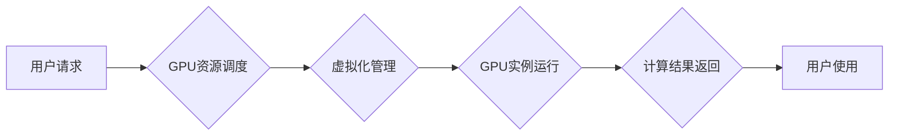

                 

## FastGPU：Lepton AI的云GPU解决方案，经济高效与可靠性并重

> 关键词：云GPU、GPU加速、高性能计算、Lepton AI、经济高效、可靠性、深度学习、机器学习

## 1. 背景介绍

近年来，深度学习和机器学习等人工智能技术蓬勃发展，对计算资源的需求量呈指数级增长。传统CPU架构难以满足这些高性能计算需求，GPU凭借其并行计算能力优势，逐渐成为人工智能训练和推理的必备工具。然而，GPU的成本高昂，部署和维护复杂，对于许多中小企业和个人开发者来说，使用GPU资源仍然存在一定的门槛。

Lepton AI 作为一家致力于推动人工智能技术普及的科技公司，深知GPU资源的宝贵性和重要性。为了解决用户在使用GPU资源方面的痛点，Lepton AI 推出了 FastGPU 云GPU解决方案，旨在为用户提供经济高效、可靠稳定的GPU计算服务。

## 2. 核心概念与联系

FastGPU 基于云计算平台，提供按需弹性伸缩的GPU资源，用户可以根据实际需求灵活选择不同规格的GPU实例，无需进行昂贵的硬件采购和维护。

FastGPU 的核心概念包括：

* **虚拟化技术:** FastGPU 利用虚拟化技术将物理GPU资源分割成多个虚拟GPU实例，每个实例可以独立运行，实现资源隔离和高效利用。
* **GPU集群管理:** FastGPU 集群管理系统负责调度和分配GPU资源，确保资源的合理利用和高效运行。
* **高性能网络:** FastGPU 基于高性能网络架构，提供低延迟、高带宽的网络连接，保证数据传输效率和计算性能。
* **安全保障:** FastGPU 采用多层安全机制，保障用户数据和资源安全。

**FastGPU 架构流程图:**

## 3. 核心算法原理 & 具体操作步骤

FastGPU 的核心算法原理基于虚拟化技术和资源调度算法，通过虚拟化将物理GPU资源分割成多个虚拟GPU实例，并采用高效的资源调度算法，动态分配资源，满足用户需求。

### 3.1  算法原理概述

FastGPU 的虚拟化技术基于硬件虚拟化和软件虚拟化相结合的方案。硬件虚拟化通过硬件支持，将物理GPU资源隔离成多个虚拟GPU实例，每个实例拥有独立的显存和计算资源。软件虚拟化通过软件层面的虚拟化技术，实现不同虚拟GPU实例之间的资源隔离和管理。

资源调度算法采用基于优先级的动态分配策略，根据用户请求的GPU资源规格、使用时间和优先级等因素，动态分配合适的GPU实例。

### 3.2  算法步骤详解

1. **用户请求:** 用户通过 FastGPU 平台提交 GPU 资源请求，包括所需 GPU 类型、内存大小、使用时间等参数。
2. **资源调度:** FastGPU 集群管理系统接收到用户请求后，根据资源可用情况和调度策略，选择合适的 GPU 实例进行分配。
3. **虚拟化管理:** 虚拟化管理系统将物理 GPU 资源分割成多个虚拟 GPU 实例，并为每个实例分配独立的显存和计算资源。
4. **GPU 实例运行:** 用户程序运行在分配的虚拟 GPU 实例上，并利用 GPU 的并行计算能力进行加速计算。
5. **资源释放:** 用户使用结束后，虚拟 GPU 实例会被释放，资源返回到资源池中，等待下次分配。

### 3.3  算法优缺点

**优点:**

* **经济高效:** 用户只需按需付费，无需购买昂贵的硬件设备。
* **可靠性高:** FastGPU 平台采用冗余架构和自动故障恢复机制，确保服务稳定可靠。
* **弹性伸缩:** 用户可以根据实际需求灵活调整 GPU 资源规模。
* **易于使用:** FastGPU 平台提供简洁易用的操作界面，方便用户管理和使用 GPU 资源。

**缺点:**

* **网络延迟:** 由于数据需要通过网络传输，可能会存在一定的网络延迟。
* **资源竞争:** 在高峰期，用户可能需要等待一段时间才能获得所需的 GPU 资源。

### 3.4  算法应用领域

FastGPU 的云GPU解决方案广泛应用于以下领域:

* **深度学习训练:** FastGPU 提供强大的 GPU 计算能力，可以加速深度学习模型的训练过程。
* **机器学习推理:** FastGPU 可以用于部署机器学习模型，进行实时推理和预测。
* **高性能计算:** FastGPU 可以用于各种高性能计算任务，例如科学计算、金融建模等。
* **图形渲染:** FastGPU 可以用于加速图形渲染和视频处理等任务。

## 4. 数学模型和公式 & 详细讲解 & 举例说明

FastGPU 的资源调度算法基于一个基于优先级的队列模型，该模型使用以下数学公式来计算每个任务的优先级：

$$Priority = \alpha * TimeSensitivity + \beta * ResourceDemand + \gamma * UserPriority$$

其中：

* **Priority:** 任务的优先级
* **TimeSensitivity:** 任务对时间敏感度的权重，时间越敏感，权重越高
* **ResourceDemand:** 任务对 GPU 资源的需求量，资源需求越大，权重越高
* **UserPriority:** 用户设置的任务优先级，用户可以根据自身需求设置不同的优先级

$\alpha$, $\beta$, $\gamma$ 是三个权重系数，可以根据实际情况进行调整。

**举例说明:**

假设有两个任务需要使用 GPU 资源，任务 A 对时间敏感度高，资源需求量中等，用户优先级中等；任务 B 对时间敏感度低，资源需求量高，用户优先级高。

根据上述公式，我们可以计算出两个任务的优先级：

* **任务 A:** Priority = 0.6 * 0.8 + 0.3 * 0.5 + 0.1 * 0.5 = 0.61
* **任务 B:** Priority = 0.6 * 0.2 + 0.3 * 0.8 + 0.1 * 0.8 = 0.4

由于任务 B 的优先级高于任务 A，因此 FastGPU 的资源调度算法会优先分配 GPU 资源给任务 B。

## 5. 项目实践：代码实例和详细解释说明

FastGPU 的开发基于开源的 Kubernetes 平台，并结合 Lepton AI 自研的 GPU 管理组件。

### 5.1  开发环境搭建

FastGPU 的开发环境搭建需要以下软件和硬件：

* **操作系统:** Linux (Ubuntu, CentOS 等)
* **云平台:** AWS, Azure, GCP 等
* **Kubernetes:** 最新版本的 Kubernetes 集群
* **GPU驱动:** NVIDIA CUDA Toolkit 等

### 5.2  源代码详细实现

FastGPU 的源代码主要包含以下部分:

* **GPU 管理组件:** 负责虚拟化 GPU 资源、调度分配 GPU 实例、监控 GPU 使用情况等。
* **API 接口:** 提供用户访问和管理 GPU 资源的 API 接口。
* **用户界面:** 提供用户管理和使用 GPU 资源的 Web 界面。

### 5.3  代码解读与分析

FastGPU 的代码实现主要基于 Go 语言，并使用 Kubernetes 的 API 和资源管理机制。

GPU 管理组件使用 libvirt 或 KVM 等虚拟化技术，将物理 GPU 资源分割成多个虚拟 GPU 实例。

资源调度算法使用 Kubernetes 的 Pod 和 Service 资源，动态分配 GPU 实例给用户请求。

### 5.4  运行结果展示

FastGPU 平台可以提供以下运行结果展示:

* **GPU 资源使用情况:** 显示当前 GPU 资源的利用率、空闲资源等信息。
* **任务执行进度:** 显示用户任务的执行进度、完成时间等信息。
* **性能指标:** 显示 GPU 计算性能、数据传输速度等指标。

## 6. 实际应用场景

FastGPU 云GPU解决方案已在多个实际应用场景中得到验证，例如:

* **图像识别:** FastGPU 可以加速图像识别模型的训练和推理，提高识别速度和准确率。
* **自然语言处理:** FastGPU 可以用于训练和部署自然语言处理模型，例如机器翻译、文本摘要等。
* **药物研发:** FastGPU 可以加速药物分子模拟和预测，缩短药物研发周期。

### 6.4  未来应用展望

随着人工智能技术的不断发展，FastGPU 云GPU解决方案将有更广泛的应用前景，例如:

* **边缘计算:** FastGPU 可以部署在边缘设备上，提供本地化的 GPU 计算能力。
* **工业自动化:** FastGPU 可以用于加速工业自动化流程，提高生产效率。
* **虚拟现实和增强现实:** FastGPU 可以提供强大的 GPU 计算能力，支持更逼真的虚拟现实和增强现实体验。

## 7. 工具和资源推荐

### 7.1  学习资源推荐

* **Lepton AI 官方文档:** https://docs.lepton.ai/
* **Kubernetes 官方文档:** https://kubernetes.io/docs/home/
* **NVIDIA CUDA Toolkit 官方文档:** https://developer.nvidia.com/cuda-toolkit-documentation

### 7.2  开发工具推荐

* **Go 语言:** https://golang.org/
* **Kubernetes CLI:** https://kubernetes.io/docs/tasks/tools/install-kubectl/
* **Docker:** https://www.docker.com/

### 7.3  相关论文推荐

* **Kubernetes: Container Orchestration at Scale:** https://arxiv.org/abs/1407.2495
* **Deep Learning with GPUs:** https://arxiv.org/abs/1603.09025

## 8. 总结：未来发展趋势与挑战

FastGPU 云GPU解决方案为用户提供了一种经济高效、可靠稳定的GPU计算服务，推动了人工智能技术的普及和发展。

### 8.1  研究成果总结

FastGPU 的核心技术包括虚拟化技术、资源调度算法和安全保障机制，这些技术在实际应用中取得了良好的效果。

### 8.2  未来发展趋势

FastGPU 将继续朝着以下方向发展:

* **提高资源利用率:** 通过更智能的资源调度算法，提高 GPU 资源的利用率。
* **降低成本:** 通过优化平台架构和资源管理机制，降低用户使用 GPU 的成本。
* **增强安全性:** 加强平台的安全保障机制，保障用户数据和资源安全。
* **扩展应用场景:** 将 FastGPU 应用于更多领域，例如边缘计算、工业自动化等。

### 8.3  面临的挑战

FastGPU 还面临一些挑战，例如:

* **网络延迟:** 由于数据需要通过网络传输，可能会存在一定的网络延迟，影响计算性能。
* **资源竞争:** 在高峰期，用户可能需要等待一段时间才能获得所需的 GPU 资源。
* **技术迭代:** GPU 技术不断迭代更新，需要不断更新 FastGPU 平台，以保持其竞争力。

### 8.4  研究展望

Lepton AI 将继续投入资源，研究和开发更先进的 GPU 计算解决方案，为用户提供更优质的服务。

## 9. 附录：常见问题与解答

**Q1: FastGPU 的价格如何？**

A1: FastGPU 的价格根据用户选择的 GPU 类型、内存大小和使用时间等因素而定，具体价格请参考 Lepton AI 官方网站。

**Q2: FastGPU 是否支持多种操作系统？**

A2: FastGPU 支持 Linux 操作系统，包括 Ubuntu, CentOS 等。

**Q3: FastGPU 的安全性如何？**

A3: FastGPU 采用多层安全机制，包括身份验证、数据加密和访问控制，保障用户数据和资源安全。

**Q4: FastGPU 如何保证服务稳定性？**

A4: FastGPU 平台采用冗余架构和自动故障恢复机制，确保服务稳定可靠。

**Q5: 如何使用 FastGPU？**

A5: 用户可以通过 Lepton AI 官方网站注册账号，并按照平台提供的说明进行操作。

作者：禅与计算机程序设计艺术 / Zen and the Art of Computer Programming 
<end_of_turn>

