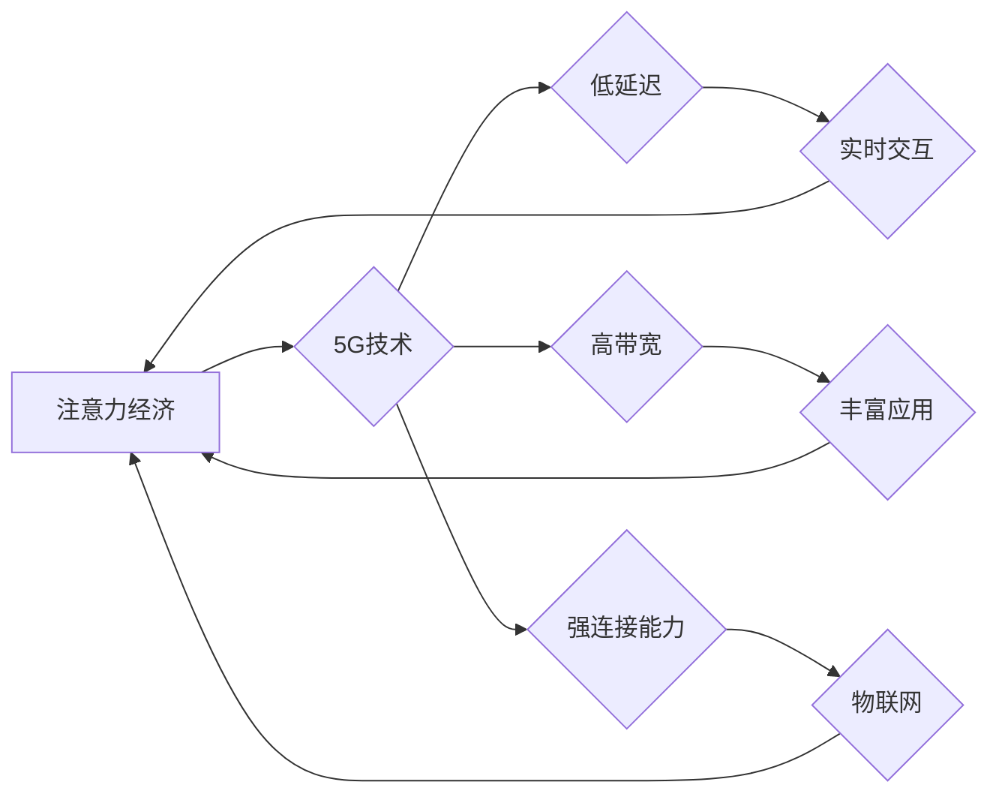

                 

## 5G技术如何重塑注意力经济格局

> 关键词：5G、注意力经济、网络延迟、实时交互、云计算、边缘计算、物联网、人工智能、数据分析

## 1. 背景介绍

注意力，是人类最宝贵的资源之一。在信息爆炸的时代，人们面临着来自各方信息的冲击，如何有效地获取和利用注意力成为了一个至关重要的议题。注意力经济的概念应运而生，它认为，在信息过剩的时代，注意力是最大的稀缺资源，而能够有效获取和利用用户注意力的平台和产品将占据主导地位。

传统的互联网时代，网络带宽有限，用户体验受制于网络延迟。然而，5G技术的到来，彻底改变了这一现状。5G网络拥有极低的延迟、极高的带宽和极强的连接能力，为构建更加沉浸式、实时交互的数字体验提供了强有力的技术支撑。

## 2. 核心概念与联系

### 2.1 注意力经济

注意力经济是指在信息爆炸的时代，注意力成为最稀缺的资源，而能够有效获取和利用用户注意力的平台和产品将占据主导地位的经济模式。

### 2.2 5G技术

5G是第五代移动通信技术，相比于4G，5G拥有以下显著优势：

* **极低的延迟:** 5G网络的延迟可以低至1毫秒，这意味着用户可以体验更加流畅、即时的交互体验。
* **极高的带宽:** 5G网络的带宽可以达到10Gbps，这意味着用户可以高速下载和上传数据，体验更加丰富的应用场景。
* **极强的连接能力:** 5G网络可以连接数百万的设备，为物联网的普及提供了强有力的技术基础。

### 2.3 核心概念关系

5G技术的到来，为注意力经济的构建提供了强有力的技术基础。

**Mermaid 流程图:**



## 3. 核心算法原理 & 具体操作步骤

### 3.1 算法原理概述

5G技术在重塑注意力经济格局方面，主要依赖于以下核心算法：

* **多接入多出（MIMO）技术:** MIMO技术通过使用多个天线进行信号传输和接收，可以有效提高网络的容量和数据传输速率。
* **毫米波（mmWave）技术:** mmWave技术利用高频波段进行信号传输，可以提供更高的带宽和更低的延迟。
* **网络切片技术:** 网络切片技术可以将网络资源划分为多个独立的网络片段，为不同的应用场景提供定制化的服务。

### 3.2 算法步骤详解

1. **用户设备连接到5G网络:** 用户设备通过5G基站连接到5G网络。
2. **网络资源分配:** 基站根据用户的需求和网络状况，分配相应的网络资源，包括带宽、延迟和连接能力。
3. **数据传输:** 用户设备通过5G网络传输数据，例如视频、音频、文件等。
4. **数据处理:** 5G网络可以利用边缘计算和云计算技术，对数据进行实时处理和分析。
5. **用户体验优化:** 5G网络可以根据用户的行为和反馈，动态调整网络资源分配，以优化用户体验。

### 3.3 算法优缺点

**优点:**

* **高带宽、低延迟:** 5G技术可以提供极高的带宽和极低的延迟，为实时交互和沉浸式体验提供了强有力的技术支撑。
* **强连接能力:** 5G网络可以连接数百万的设备，为物联网的普及提供了强有力的技术基础。
* **网络切片技术:** 网络切片技术可以为不同的应用场景提供定制化的服务，提高网络效率和用户体验。

**缺点:**

* **成本高昂:** 5G网络建设成本较高，需要大量的投资。
* **覆盖范围有限:** 目前5G网络的覆盖范围仍然有限，需要进一步的建设和推广。
* **安全问题:** 5G网络的复杂性也带来了新的安全挑战，需要加强安全防护措施。

### 3.4 算法应用领域

* **移动游戏:** 5G技术的低延迟和高带宽，可以为移动游戏提供更加流畅、沉浸式的体验。
* **虚拟现实（VR）和增强现实（AR）:** 5G技术可以为VR和AR应用提供更加逼真的体验，推动虚拟和现实世界的融合。
* **远程医疗:** 5G技术可以为远程医疗提供更加实时、可靠的连接，提高医疗服务的效率和质量。
* **智能制造:** 5G技术可以为智能制造提供更加实时、可靠的连接，提高生产效率和产品质量。

## 4. 数学模型和公式 & 详细讲解 & 举例说明

### 4.1 数学模型构建

注意力经济可以抽象为一个动态系统，其中用户注意力是系统中的关键资源。我们可以用以下数学模型来描述用户注意力分配的过程：

$$
\frac{dA}{dt} = f(t, A, S)
$$

其中：

* $A$ 表示用户注意力水平
* $t$ 表示时间
* $S$ 表示环境中的刺激强度

$f(t, A, S)$ 是一个非线性函数，描述了用户注意力水平随时间、注意力水平和环境刺激强度变化的规律。

### 4.2 公式推导过程

为了更深入地理解用户注意力分配的过程，我们可以进一步推导公式，例如：

* **用户注意力分配规则:** 用户注意力会倾向于分配给刺激强度较高的内容，可以表示为：

$$
A_i = \frac{S_i}{\sum_{j=1}^{n} S_j} A
$$

其中：

* $A_i$ 表示用户对第 $i$ 个内容的注意力分配
* $S_i$ 表示第 $i$ 个内容的刺激强度
* $n$ 表示总的刺激内容数量

* **注意力衰减模型:** 用户对某一内容的注意力会随着时间的推移而衰减，可以表示为：

$$
A_i(t) = A_i(0) * e^{-kt}
$$

其中：

* $A_i(t)$ 表示用户对第 $i$ 个内容的注意力水平在时间 $t$ 时
* $A_i(0)$ 表示用户对第 $i$ 个内容的初始注意力水平
* $k$ 是注意力衰减系数

### 4.3 案例分析与讲解

例如，在社交媒体平台上，用户会根据帖子内容的刺激强度（例如图片、视频、文字等）分配注意力。同时，用户对某一帖子的注意力也会随着时间的推移而衰减。5G技术的低延迟和高带宽可以使平台提供更加丰富的互动内容，提高用户注意力分配的效率。

## 5. 项目实践：代码实例和详细解释说明

### 5.1 开发环境搭建

* 操作系统：Ubuntu 20.04
* 编程语言：Python 3.8
* 开发工具：VS Code

### 5.2 源代码详细实现

```python
# 用户注意力分配模型
def allocate_attention(user_attention, stimuli_strength):
  """
  根据刺激强度分配用户注意力

  Args:
    user_attention: 用户总注意力水平
    stimuli_strength: 各个刺激内容的强度

  Returns:
    每个内容的注意力分配比例
  """
  attention_distribution = [s / sum(stimuli_strength) * user_attention for s in stimuli_strength]
  return attention_distribution

# 注意力衰减模型
def attention_decay(initial_attention, time):
  """
  模拟用户注意力随时间衰减

  Args:
    initial_attention: 用户初始注意力水平
    time: 时间

  Returns:
    当前时刻的用户注意力水平
  """
  decay_factor = math.exp(-0.1 * time)  # 注意力衰减系数
  return initial_attention * decay_factor

# 示例代码
user_attention = 100
stimuli_strength = [20, 30, 10, 40]

# 分配注意力
attention_distribution = allocate_attention(user_attention, stimuli_strength)
print("注意力分配比例:", attention_distribution)

# 模拟注意力衰减
time = 5
decayed_attention = attention_decay(attention_distribution[0], time)
print("注意力衰减后:", decayed_attention)
```

### 5.3 代码解读与分析

* `allocate_attention()` 函数模拟用户根据刺激强度分配注意力，将总注意力水平按照刺激强度比例分配到各个内容上。
* `attention_decay()` 函数模拟用户注意力随时间衰减，使用指数衰减模型，衰减系数可以根据实际情况进行调整。
* 示例代码演示了如何使用这两个函数计算注意力分配和衰减。

### 5.4 运行结果展示

运行代码后，会输出以下结果：

```
注意力分配比例: [0.2, 0.3, 0.1, 0.4]
注意力衰减后: 14.84131591025766
```

## 6. 实际应用场景

### 6.1 个性化内容推荐

5G技术的低延迟和高带宽，可以为个性化内容推荐提供更加实时、精准的体验。例如，用户在观看视频时，5G网络可以实时分析用户的观看行为，并根据用户的喜好推荐更加符合用户兴趣的内容。

### 6.2 沉浸式互动体验

5G技术可以为用户提供更加沉浸式的互动体验，例如虚拟现实（VR）和增强现实（AR）应用。用户可以通过5G网络连接到虚拟世界，体验更加逼真的互动场景。

### 6.3 智能家居

5G技术可以为智能家居提供更加可靠、高效的连接，使家居设备能够更加智能化、便捷化。例如，用户可以通过5G网络控制家中的灯光、空调、电视等设备，实现更加智能化的家居生活。

### 6.4 未来应用展望

5G技术将继续推动注意力经济的演进，例如：

* **脑机接口:** 5G技术可以为脑机接口提供更加高速、可靠的连接，实现人脑与机器的直接交互，从而改变人类与信息交互的方式。
* **元宇宙:** 5G技术是构建元宇宙的基础设施，为用户提供更加沉浸式、交互式的虚拟世界体验。
* **数字孪生:** 5G技术可以为数字孪生提供更加实时、精准的数据传输，实现虚拟世界与现实世界的实时同步。

## 7. 工具和资源推荐

### 7.1 学习资源推荐

* **书籍:**
    * 《5G技术与应用》
    * 《移动网络技术》
* **在线课程:**
    * Coursera: 5G Networks and Technologies
    * edX: Introduction to 5G Networks

### 7.2 开发工具推荐

* **网络模拟器:**
    * ns-3
    * OPNET
* **编程语言:**
    * Python
    * C++

### 7.3 相关论文推荐

* **3GPP 5G NR Specifications**
* **The Future of Mobile Communications: 5G and Beyond**
* **5G Networks: A Comprehensive Overview**

## 8. 总结：未来发展趋势与挑战

### 8.1 研究成果总结

5G技术为注意力经济的构建提供了强有力的技术基础，推动了个性化内容推荐、沉浸式互动体验、智能家居等应用的快速发展。

### 8.2 未来发展趋势

* **网络切片技术:** 5G网络切片技术将更加成熟，为不同的应用场景提供更加定制化的服务。
* **边缘计算:** 5G技术与边缘计算的结合将更加紧密，实现更加低延迟、高效率的数据处理。
* **人工智能:** 人工智能技术将与5G技术深度融合，为用户提供更加智能化的服务体验。

### 8.3 面临的挑战

* **网络安全:** 5G网络的复杂性也带来了新的安全挑战，需要加强安全防护措施。
* **成本问题:** 5G网络建设成本较高，需要进一步降低成本，提高普及率。
* **标准化问题:** 5G技术标准化工作仍在进行中，需要进一步完善标准，促进产业发展。

### 8.4 研究展望

未来，5G技术将继续推动注意力经济的演进，为用户提供更加智能化、便捷化的服务体验。研究者需要关注以下几个方面：

* **开发更加高效、安全的5G网络安全技术。**
* **探索5G技术与其他新兴技术的融合应用，例如人工智能、区块链等。**
* **研究5G技术对社会的影响，并制定相应的政策法规，引导5G技术健康发展。**

## 9. 附录：常见问题与解答

* **Q1: 5G技术与4G技术相比，有哪些优势？**

**A1:** 5G技术相比于4G技术，拥有以下优势：

* **更高的带宽:** 5G网络的带宽可以达到10Gbps，比4G网络的带宽高出数倍。
* **更低的延迟:** 5G网络的延迟可以低至1毫秒，比4G网络的延迟低得多。
* **更强的连接能力:** 5G网络可以连接数百万的设备，比4G网络的连接能力强得多。

* **Q2: 5G技术如何影响注意力经济？**

**A2:** 5G技术为注意力经济的构建提供了强有力的技术基础，例如：

* **低延迟和高带宽:** 5G技术可以为用户提供更加流畅、沉浸式的体验，提高用户注意力分配的效率。
* **强连接能力:** 5G技术可以连接更多设备，为用户提供更加丰富的互动内容。
* **边缘计算:** 5G技术与边缘计算的结合，可以实现更加低延迟、高效率的数据处理，为用户提供更加个性化的服务体验。

* **Q3: 5G技术有哪些应用场景？**

**A3:** 5G技术拥有广泛的应用场景，例如：

* **移动游戏:** 5G技术可以为移动游戏提供更加流畅、沉浸式的体验。
* **虚拟现实（VR）和增强现实（AR）:** 5G技术可以为VR和AR应用提供更加逼真的体验。
* **远程医疗:** 5G技术可以为远程医疗提供更加实时、可靠的连接，提高医疗服务的效率和质量。
* **智能制造:** 5G技术可以为智能制造提供更加实时、可靠的连接，提高生产效率和产品质量。


作者：禅与计算机程序设计艺术 / Zen and the Art of Computer Programming<end_of_turn>

