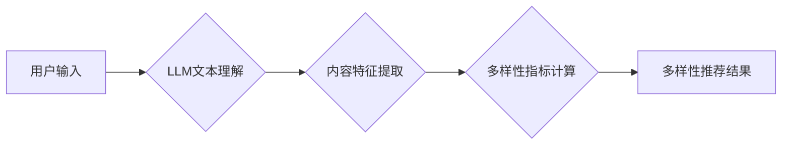

                 

## LLM对推荐系统多样性指标的重新定义

> 关键词：LLM,推荐系统,多样性指标,自然语言处理,个性化推荐,公平性,偏见检测

## 1. 背景介绍

推荐系统作为信息过滤和个性化内容呈现的重要工具，在电商、社交媒体、音乐流媒体等领域发挥着越来越重要的作用。然而，传统的推荐系统往往陷入“同质化推荐”的困境，只推荐用户已喜欢的类型，导致用户体验单一，缺乏探索新内容的乐趣。

多样性推荐旨在解决这一问题，通过推荐不同类型、不同风格的内容，丰富用户体验，帮助用户发现新的兴趣点。近年来，随着深度学习和自然语言处理（NLP）技术的快速发展，推荐系统多样性指标的研究也取得了显著进展。

传统的推荐系统多样性指标主要基于内容特征、用户行为等静态信息，难以捕捉用户动态需求和复杂情感变化。而大型语言模型（LLM）作为一种强大的文本理解和生成模型，能够更好地理解用户意图、情感和偏好，为推荐系统多样性指标的重新定义提供新的思路。

## 2. 核心概念与联系

### 2.1  推荐系统多样性

推荐系统多样性是指推荐结果在内容类型、风格、作者、主题等方面呈现多样性的程度。多样性推荐的目标是提供更丰富的推荐结果，帮助用户发现新的兴趣点，避免陷入“信息茧房”的困境。

### 2.2  LLM的优势

LLM拥有强大的文本理解和生成能力，可以用于多种推荐系统任务，例如：

* **用户意图理解:** LLM可以分析用户的文本输入，理解用户的真实需求和偏好。
* **内容特征提取:** LLM可以提取文本内容的丰富特征，例如主题、情感、风格等，为多样性推荐提供更精准的依据。
* **个性化推荐:** LLM可以根据用户的历史行为和文本偏好，生成个性化的推荐内容。
* **偏见检测:** LLM可以识别推荐结果中的潜在偏见，确保推荐结果公平公正。

### 2.3  LLM与多样性指标的结合

LLM可以帮助我们从更深层次理解用户需求，并根据用户的个性化偏好和动态变化，生成更符合多样性指标要求的推荐结果。

**Mermaid 流程图**



## 3. 核心算法原理 & 具体操作步骤

### 3.1  算法原理概述

LLM的多样性推荐算法通常基于以下核心原理：

* **用户兴趣建模:** 利用LLM对用户的文本输入进行分析，构建用户兴趣的动态模型。
* **内容特征表示:** 利用LLM提取内容的丰富特征，例如主题、情感、风格等，构建内容的语义表示。
* **多样性度量:** 设计多样性度量指标，衡量推荐结果在内容类型、风格、作者等方面的差异性。
* **推荐策略:** 根据用户兴趣模型和多样性度量指标，设计推荐策略，生成多样化的推荐结果。

### 3.2  算法步骤详解

1. **用户兴趣建模:**

    * 收集用户的文本数据，例如评论、搜索历史、浏览记录等。
    * 利用LLM对用户的文本数据进行分析，提取用户的兴趣主题、情感倾向、偏好类型等信息。
    * 将提取的信息构建用户兴趣的动态模型，例如用户兴趣向量、用户兴趣图谱等。

2. **内容特征表示:**

    * 收集待推荐的内容，例如文章、视频、商品等。
    * 利用LLM对内容进行分析，提取内容的主题、情感、风格、作者等特征。
    * 将提取的特征构建内容的语义表示，例如内容向量、内容图谱等。

3. **多样性度量:**

    * 设计多样性度量指标，例如内容类型多样性、风格多样性、作者多样性等。
    * 计算推荐结果在不同维度上的多样性得分。

4. **推荐策略:**

    * 根据用户兴趣模型和多样性度量指标，设计推荐策略，例如基于兴趣的推荐、基于多样性的推荐、基于用户的个性化推荐等。
    * 生成多样化的推荐结果，并根据用户反馈进行优化。

### 3.3  算法优缺点

**优点:**

* 能够更好地理解用户的动态需求和复杂情感变化。
* 可以生成更个性化、更符合用户偏好的推荐结果。
* 可以有效地解决推荐系统同质化推荐的问题。

**缺点:**

* LLM训练成本高，部署成本也较高。
* LLM模型可能存在偏见，需要进行相应的检测和修正。
* 需要大量的文本数据进行训练，数据质量对模型性能有重要影响。

### 3.4  算法应用领域

LLM的多样性推荐算法可以应用于各种领域，例如：

* **电商推荐:** 推荐不同类型的商品，帮助用户发现新的产品。
* **音乐推荐:** 推荐不同风格的音乐，帮助用户探索新的音乐类型。
* **新闻推荐:** 推荐不同观点的新闻，帮助用户获得更全面的信息。
* **社交媒体推荐:** 推荐不同类型的用户和内容，帮助用户拓展社交圈。

## 4. 数学模型和公式 & 详细讲解 & 举例说明

### 4.1  数学模型构建

假设我们有一个推荐系统，包含用户集合U，物品集合I，以及用户对物品的评分矩阵R。我们的目标是构建一个多样性推荐模型，能够生成多样化的推荐结果。

我们可以使用以下数学模型来表示用户对物品的评分：

$$
r_{ui} = f(u, i, \theta)
$$

其中：

* $r_{ui}$ 表示用户u对物品i的评分。
* $u$ 表示用户。
* $i$ 表示物品。
* $f$ 表示评分函数。
* $\theta$ 表示模型参数。

### 4.2  公式推导过程

为了衡量推荐结果的多样性，我们可以使用以下公式：

$$
Diversity(R') = \frac{1}{|R'|} \sum_{i \in R'} \frac{1}{|\{j \in R' | j \neq i, sim(i, j) > \tau\}|}
$$

其中：

* $R'$ 表示推荐结果集。
* $|R'|$ 表示推荐结果集的大小。
* $sim(i, j)$ 表示物品i和物品j之间的相似度。
* $\tau$ 表示相似度阈值。

这个公式计算的是推荐结果集中每个物品与其他物品的相似度倒数的平均值。相似度越高，倒数越小，多样性得分越高。

### 4.3  案例分析与讲解

假设我们有一个推荐系统，需要推荐用户喜欢的电影。

我们可以使用LLM提取电影的主题、风格、演员等特征，构建电影的语义表示。然后，我们可以使用上述公式计算推荐结果的多样性得分。

如果推荐结果集中所有电影都是动作片，那么多样性得分会很低。如果推荐结果集中包含不同类型的电影，例如动作片、爱情片、喜剧片等，那么多样性得分会更高。

## 5. 项目实践：代码实例和详细解释说明

### 5.1  开发环境搭建

* Python 3.7+
* PyTorch 1.7+
* Transformers 4.10+
* 其他依赖库：numpy, pandas, matplotlib等

### 5.2  源代码详细实现

```python
# 导入必要的库
import torch
from transformers import AutoModelForSequenceClassification, AutoTokenizer

# 加载预训练模型和词典
model_name = "bert-base-uncased"
tokenizer = AutoTokenizer.from_pretrained(model_name)
model = AutoModelForSequenceClassification.from_pretrained(model_name)

# 定义用户兴趣建模函数
def user_interest_modeling(user_text):
    # 使用LLM对用户文本进行分析，提取用户兴趣信息
    # ...

# 定义内容特征表示函数
def content_feature_extraction(content_text):
    # 使用LLM对内容文本进行分析，提取内容特征
    # ...

# 定义多样性度量函数
def diversity_metric(recommendations):
    # 计算推荐结果的多样性得分
    # ...

# 定义推荐策略函数
def recommendation_strategy(user_interests, content_features):
    # 根据用户兴趣和内容特征，生成多样化的推荐结果
    # ...

# 示例代码
user_text = "我喜欢看动作片和科幻片。"
content_texts = ["这是一部动作片", "这是一部科幻片", "这是一部爱情片"]

user_interests = user_interest_modeling(user_text)
content_features = [content_feature_extraction(content_text) for content_text in content_texts]

recommendations = recommendation_strategy(user_interests, content_features)

diversity_score = diversity_metric(recommendations)

print(f"推荐结果: {recommendations}")
print(f"多样性得分: {diversity_score}")
```

### 5.3  代码解读与分析

* 代码首先导入必要的库，并加载预训练模型和词典。
* 然后，定义了用户兴趣建模、内容特征提取、多样性度量和推荐策略等函数。
* 示例代码演示了如何使用这些函数生成推荐结果并计算多样性得分。

### 5.4  运行结果展示

运行代码后，会输出推荐结果和多样性得分。

## 6. 实际应用场景

### 6.1  电商推荐

LLM可以帮助电商平台推荐更符合用户个性化需求和多样性的商品，例如推荐不同类型的服装、不同品牌的电子产品等。

### 6.2  音乐推荐

LLM可以帮助音乐平台推荐不同风格的音乐，例如推荐古典音乐、流行音乐、摇滚音乐等，帮助用户发现新的音乐类型。

### 6.3  新闻推荐

LLM可以帮助新闻平台推荐不同观点的新闻，例如推荐左翼新闻、右翼新闻、中立新闻等，帮助用户获得更全面的信息。

### 6.4  未来应用展望

LLM的多样性推荐算法在未来将有更广泛的应用场景，例如：

* **个性化教育推荐:** 推荐不同类型的学习资源，帮助学生个性化学习。
* **医疗健康推荐:** 推荐不同类型的医疗服务和健康资讯，帮助用户获得更精准的医疗建议。
* **旅游推荐:** 推荐不同类型的旅游目的地和旅游活动，帮助用户规划个性化的旅行路线。

## 7. 工具和资源推荐

### 7.1  学习资源推荐

* **论文:**

    * "BERT: Pre-training of Deep Bidirectional Transformers for Language Understanding"
    * "XLNet: Generalized Autoregressive Pretraining for Language Understanding"
    * "T5: Text-to-Text Transfer Transformer"

* **书籍:**

    * "Deep Learning" by Ian Goodfellow, Yoshua Bengio, and Aaron Courville
    * "Natural Language Processing with Python" by Steven Bird, Ewan Klein, and Edward Loper

### 7.2  开发工具推荐

* **PyTorch:** 深度学习框架
* **Transformers:** 预训练语言模型库
* **HuggingFace:** 预训练模型和数据集平台

### 7.3  相关论文推荐

* "Diversity in Recommender Systems: A Survey"
* "Towards Fairness in Recommender Systems"
* "Personalized and Diverse Recommendation with Deep Reinforcement Learning"

## 8. 总结：未来发展趋势与挑战

### 8.1  研究成果总结

LLM的多样性推荐算法取得了显著进展，能够更好地理解用户需求，生成更个性化、更符合多样性指标要求的推荐结果。

### 8.2  未来发展趋势

* **更强大的LLM模型:** 未来将会有更强大的LLM模型出现，能够更好地理解用户需求和内容特征，生成更精准的推荐结果。
* **更有效的多样性度量指标:** 未来将会有更有效的多样性度量指标被提出，能够更准确地衡量推荐结果的多样性。
* **更个性化的推荐策略:** 未来将会有更个性化的推荐策略被设计，能够根据用户的不同需求和偏好，生成更符合用户期望的推荐结果。

### 8.3  面临的挑战

* **数据隐私和安全:** LLM模型需要大量的文本数据进行训练，如何保护用户数据隐私和安全是一个重要的挑战。
* **模型偏见:** LLM模型可能存在偏见，需要进行相应的检测和修正。
* **模型解释性:** LLM模型的决策过程比较复杂，如何提高模型的解释性是一个重要的研究方向。

### 8.4  研究展望

未来，LLM的多样性推荐算法将继续发展，为用户提供更个性化、更丰富、更公平的推荐体验。


## 9. 附录：常见问题与解答

**Q1: LLM的多样性推荐算法与传统的推荐算法相比有什么优势？**

**A1:** LLM的多样性推荐算法能够更好地理解用户的动态需求和复杂情感变化，并根据用户的个性化偏好生成更符合多样性指标要求的推荐结果。

**Q2: 如何评估LLM的多样性推荐算法的性能？**

**A2:** 可以使用多样性度量指标来评估LLM的多样性推荐算法的性能，例如内容类型多样性、风格多样性、作者多样性等。

**Q3: 如何解决LLM模型的偏见问题？**

**A3:** 可以通过以下方法解决LLM模型的偏见问题：

* 使用更公平的训练数据。
* 在训练过程中加入对抗训练，减少模型对敏感属性的依赖。
* 使用偏见检测工具，识别和修正模型中的偏见。

**Q4: LLM的多样性推荐算法有哪些应用场景？**

**A4:** LLM的多样性推荐算法可以应用于各种领域，例如电商推荐、音乐推荐、新闻推荐、个性化教育推荐、医疗健康推荐等。


作者：禅与计算机程序设计艺术 / Zen and the Art of Computer Programming<end_of_turn>

