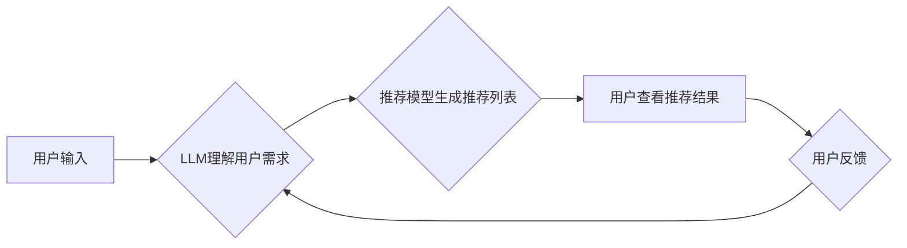

                 

## LLM对推荐系统实时性能的影响

> 关键词：大型语言模型 (LLM)、推荐系统、实时性能、效率优化、推理加速、模型压缩、知识图谱

## 1. 背景介绍

推荐系统是互联网时代的重要组成部分，广泛应用于电商、社交媒体、视频平台等领域，为用户提供个性化内容和服务。传统的推荐系统主要依赖于协同过滤、内容过滤和基于知识的推荐算法，这些算法通常基于用户历史行为和物品特征进行建模。

近年来，大型语言模型 (LLM) 由于其强大的文本理解和生成能力，在推荐系统领域展现出巨大的潜力。LLM 可以理解用户需求的复杂语义，生成更精准的推荐内容，并与用户进行自然语言交互，提升用户体验。然而，LLM 的推理过程通常需要大量的计算资源，这会对推荐系统的实时性能造成挑战。

## 2. 核心概念与联系

### 2.1 推荐系统概述

推荐系统旨在根据用户的历史行为、偏好和上下文信息，预测用户对特定物品的兴趣，并提供个性化的推荐列表。

推荐系统通常包含以下核心组件：

* **数据采集和预处理:** 收集用户行为数据、物品特征数据等，并进行清洗、转换和特征工程。
* **模型训练:** 利用机器学习算法，从数据中学习用户和物品之间的关系，构建推荐模型。
* **推荐算法:** 根据用户需求和模型预测，生成推荐列表。
* **评估指标:** 评估推荐系统的性能，例如准确率、召回率、点击率等。

### 2.2 大型语言模型 (LLM)

LLM 是近年来发展起来的深度学习模型，通过训练海量文本数据，学习语言的语法、语义和上下文关系。LLM 拥有强大的文本理解和生成能力，可以用于多种自然语言处理任务，例如文本分类、机器翻译、问答系统等。

LLM 的核心架构通常基于 Transformer 网络，其特点是：

* **自注意力机制:** 能够捕捉文本序列中单词之间的长距离依赖关系。
* **多层编码解码结构:** 可以学习文本的深层语义表示。
* **参数规模庞大:** 通常包含数十亿甚至千亿个参数，需要大量的计算资源进行训练和推理。

### 2.3 LLM 与推荐系统的融合

将 LLM 与推荐系统相结合，可以提升推荐系统的性能和用户体验。

LLM 可以用于以下推荐系统任务：

* **理解用户需求:** LLM 可以理解用户自然语言查询，提取用户兴趣和偏好信息。
* **生成个性化推荐:** LLM 可以根据用户需求生成个性化的推荐文本，例如商品描述、推荐理由等。
* **进行对话式推荐:** LLM 可以与用户进行自然语言交互，根据用户反馈动态调整推荐内容。

**Mermaid 流程图**



## 3. 核心算法原理 & 具体操作步骤

### 3.1 算法原理概述

LLM 在推荐系统中的应用主要基于以下算法原理：

* **文本嵌入:** 将用户和物品的文本信息转换为向量表示，以便模型进行计算和比较。
* **注意力机制:** 捕捉用户和物品之间的相关性，重点关注重要的信息。
* **序列生成:** 根据用户需求和物品信息，生成个性化的推荐序列。

### 3.2 算法步骤详解

1. **数据预处理:** 收集用户行为数据、物品特征数据等，并进行清洗、转换和文本嵌入。
2. **LLM 训练:** 利用海量文本数据训练 LLM 模型，学习语言的语法、语义和上下文关系。
3. **推荐模型构建:** 基于 LLM 模型，构建推荐模型，例如基于注意力的推荐模型、对话式推荐模型等。
4. **用户需求理解:** 当用户发出推荐请求时，使用 LLM 模型理解用户的需求和偏好。
5. **推荐列表生成:** 根据用户需求和模型预测，生成个性化的推荐列表。
6. **结果展示:** 将推荐列表展示给用户，并根据用户反馈进行模型优化。

### 3.3 算法优缺点

**优点:**

* 能够理解用户需求的复杂语义，生成更精准的推荐内容。
* 可以与用户进行自然语言交互，提升用户体验。
* 能够学习用户隐性偏好，提供更个性化的推荐。

**缺点:**

* 推理过程需要大量的计算资源，会对实时性能造成挑战。
* 需要海量文本数据进行训练，训练成本较高。
* 模型解释性较差，难以理解模型的推荐决策。

### 3.4 算法应用领域

LLM 在推荐系统领域的应用场景广泛，例如：

* **电商推荐:** 为用户推荐商品、优惠券等。
* **社交媒体推荐:** 为用户推荐好友、话题、内容等。
* **视频平台推荐:** 为用户推荐视频、节目等。
* **音乐平台推荐:** 为用户推荐歌曲、专辑等。

## 4. 数学模型和公式 & 详细讲解 & 举例说明

### 4.1 数学模型构建

LLM 在推荐系统中的应用通常基于以下数学模型：

* **文本嵌入模型:** 将用户和物品的文本信息转换为向量表示，例如 Word2Vec、GloVe、BERT 等。
* **注意力机制模型:** 捕捉用户和物品之间的相关性，例如 Transformer、Seq2Seq 等。
* **序列生成模型:** 根据用户需求和物品信息，生成个性化的推荐序列，例如 GPT、T5 等。

### 4.2 公式推导过程

LLM 的训练过程通常基于最大似然估计，目标是最大化模型在训练数据上的似然概率。

假设训练数据为 $(x_1, y_1), (x_2, y_2), ..., (x_n, y_n)$, 其中 $x_i$ 为用户 $i$ 的输入文本，$y_i$ 为用户 $i$ 的目标文本。

LLM 的训练目标函数为：

$$
\mathcal{L} = -\frac{1}{n} \sum_{i=1}^{n} \log p(y_i | x_i, \theta)
$$

其中，$p(y_i | x_i, \theta)$ 为模型在参数 $\theta$ 下预测用户 $i$ 目标文本的概率。

### 4.3 案例分析与讲解

例如，在电商推荐场景中，可以使用 LLM 模型学习用户商品评论的语义信息，并根据用户的评论生成个性化的商品推荐。

假设用户 $i$ 对商品 $j$ 的评论为 $x_i$, 模型需要预测用户 $i$ 可能感兴趣的商品 $k$。

可以使用以下公式计算用户 $i$ 对商品 $k$ 的兴趣分数：

$$
s_{i,k} = \text{Attention}(x_i, \text{item_embedding}(k))
$$

其中，$\text{Attention}(x_i, \text{item_embedding}(k))$ 为注意力机制计算的用户评论 $x_i$ 和商品 $k$ 的嵌入向量之间的相关性。

## 5. 项目实践：代码实例和详细解释说明

### 5.1 开发环境搭建

推荐系统项目可以使用 Python 语言开发，并结合 TensorFlow 或 PyTorch 等深度学习框架。

需要安装以下软件包：

* Python 3.x
* TensorFlow 或 PyTorch
* Numpy
* Pandas
* Scikit-learn

### 5.2 源代码详细实现

以下是一个简单的基于 Transformer 的推荐系统代码示例：

```python
import tensorflow as tf

# 定义 Transformer 模型
class TransformerRecommender(tf.keras.Model):
    def __init__(self, embedding_dim, num_heads, num_layers):
        super(TransformerRecommender, self).__init__()
        self.embedding = tf.keras.layers.Embedding(vocab_size, embedding_dim)
        self.transformer = tf.keras.layers.Transformer(num_heads=num_heads, num_layers=num_layers)
        self.output = tf.keras.layers.Dense(num_items)

    def call(self, inputs):
        # 将用户输入转换为嵌入向量
        embedded_inputs = self.embedding(inputs)
        # 通过 Transformer 进行编码
        encoded_inputs = self.transformer(embedded_inputs)
        # 使用 Dense 层生成推荐分数
        outputs = self.output(encoded_inputs)
        return outputs

# 实例化模型
model = TransformerRecommender(embedding_dim=128, num_heads=8, num_layers=6)

# 训练模型
model.compile(optimizer='adam', loss='mse')
model.fit(x_train, y_train, epochs=10)

# 生成推荐列表
predictions = model.predict(user_input)
top_k_items = tf.argsort(predictions, axis=-1)[:, -k:]
```

### 5.3 代码解读与分析

* 代码首先定义了一个 Transformer 模型，包含嵌入层、Transformer 层和输出层。
* 嵌入层将用户输入转换为向量表示。
* Transformer 层通过注意力机制和多层编码解码结构学习用户和物品之间的关系。
* 输出层使用 Dense 层生成推荐分数。
* 代码然后实例化模型，并使用 Adam 优化器和均方误差损失函数进行训练。
* 最后，使用训练好的模型生成推荐列表。

### 5.4 运行结果展示

运行结果展示可以包括以下内容：

* 推荐列表的准确率、召回率等指标。
* 用户对推荐结果的反馈。
* 模型的训练过程中的损失函数变化曲线。

## 6. 实际应用场景

### 6.1 电商推荐

LLM 可以理解用户商品评论的语义信息，并根据用户的评论生成个性化的商品推荐。例如，用户评论“这款手机拍照效果很好”，LLM 可以理解用户对手机拍照功能的偏好，并推荐其他拍照效果优秀的手机。

### 6.2 社交媒体推荐

LLM 可以理解用户的社交行为和兴趣爱好，并推荐相关的用户、话题和内容。例如，用户经常关注科技新闻，LLM 可以推荐其他关注科技新闻的用户、科技相关的热门话题和新闻文章。

### 6.3 视频平台推荐

LLM 可以理解用户的观看历史和偏好，并推荐相关的视频、节目和用户。例如，用户经常观看科幻电影，LLM 可以推荐其他科幻电影、科幻相关的节目和喜欢科幻电影的用户。

### 6.4 未来应用展望

LLM 在推荐系统领域的应用前景广阔，未来可能应用于以下场景：

* **个性化内容生成:** LLM 可以根据用户的兴趣和偏好，生成个性化的推荐内容，例如推荐文章、视频、音乐等。
* **对话式推荐:** LLM 可以与用户进行自然语言交互，根据用户的反馈动态调整推荐内容。
* **跨平台推荐:** LLM 可以整合不同平台的用户数据，提供更全面的个性化推荐。

## 7. 工具和资源推荐

### 7.1 学习资源推荐

* **书籍:**
    * Deep Learning by Ian Goodfellow, Yoshua Bengio, and Aaron Courville
    * Natural Language Processing with Python by Steven Bird, Ewan Klein, and Edward Loper
* **在线课程:**
    * Stanford CS224N: Natural Language Processing with Deep Learning
    * DeepLearning.AI TensorFlow Specialization

### 7.2 开发工具推荐

* **深度学习框架:** TensorFlow, PyTorch
* **自然语言处理库:** NLTK, spaCy, Hugging Face Transformers
* **数据处理工具:** Pandas, NumPy

### 7.3 相关论文推荐

* Attention Is All You Need (Vaswani et al., 2017)
* BERT: Pre-training of Deep Bidirectional Transformers for Language Understanding (Devlin et al., 2018)
* T5: Text-to-Text Transfer Transformer (Raffel et al., 2019)

## 8. 总结：未来发展趋势与挑战

### 8.1 研究成果总结

LLM 在推荐系统领域的应用取得了显著成果，能够提升推荐系统的准确率、个性化程度和用户体验。

### 8.2 未来发展趋势

未来 LLM 在推荐系统领域的应用将朝着以下方向发展：

* **模型效率优化:** 降低 LLM 推理的计算成本，提高实时性能。
* **知识图谱融合:** 将 LLM 与知识图谱相结合，提升推荐系统的准确性和可解释性。
* **多模态推荐:** 将文本、图像、视频等多模态信息融合到推荐系统中，提供更丰富的推荐体验。

### 8.3 面临的挑战

LLM 在推荐系统领域的应用也面临一些挑战：

* **数据隐私:** LLM 的训练需要海量文本数据，如何保护用户数据隐私是一个重要问题。
* **模型解释性:** LLM 的决策过程较为复杂，难以理解模型的推荐决策，这可能会影响用户信任。
* **公平性与偏见:** LLM 模型可能存在公平性与偏见问题，需要进行相应的调优和监控。

### 8.4 研究展望

未来研究方向包括：

* 开发更轻量级的 LLM 模型，降低推理成本。
* 研究 LLM 模型的解释性方法，提高模型可解释性。
* 探索 LLM 模型的公平性与偏见问题，并提出相应的解决方案。


## 9. 附录：常见问题与解答

**Q1: LLM 在推荐系统中的应用有哪些优势？**

**A1:** LLM 在推荐系统中的应用优势包括：

* 能够理解用户需求的复杂语义，生成更精准的推荐内容。
* 可以与用户进行自然语言交互，提升用户体验。
* 能够学习用户隐性偏好，提供更个性化的推荐。

**Q2: LLM 在推荐系统中的应用有哪些挑战？**

**A2:** LLM 在推荐系统中的应用面临一些挑战：

* 推理过程需要大量的计算资源，会对实时性能造成挑战。
* 需要海量文本数据进行训练，训练成本较高。
* 模型解释性较差，难以理解模型的推荐决策。

**Q3: 如何优化 LLM 在推荐系统中的实时性能？**

**A3:** 优化 LLM 在推荐系统中的实时性能的方法包括：

* 使用更轻量级的 LLM 模型。
* 采用模型压缩技术，减少模型参数量。
* 利用硬件加速，例如 GPU 或 TPU。
* 使用缓存机制，减少重复计算。


作者：禅与计算机程序设计艺术 / Zen and the Art of Computer Programming<end_of_turn>

