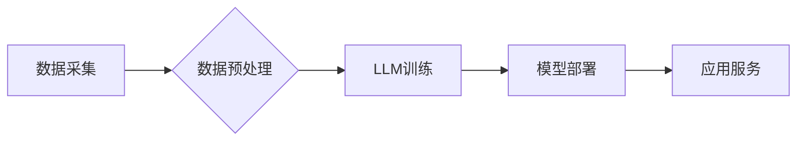

                 

## LLM驱动的智能城市：AI改变城市生活

> 关键词：大型语言模型（LLM）、智能城市、人工智能（AI）、自然语言处理（NLP）、城市规划、智慧交通、城市管理、数据分析、可持续发展

## 1. 背景介绍

城市是人类文明的摇篮，也是社会发展的重要引擎。随着全球人口的快速增长和城市化的进程加速，城市面临着越来越多的挑战，例如交通拥堵、环境污染、资源短缺、公共安全等。为了应对这些挑战，构建智慧城市成为全球共识。智慧城市利用信息通信技术（ICT）和人工智能（AI）等先进技术，提升城市管理水平，提高城市居民生活质量。

大型语言模型（LLM）作为人工智能领域的一项突破性技术，拥有强大的文本理解和生成能力，为智慧城市建设提供了新的机遇。LLM可以理解和处理自然语言，并根据上下文生成相关文本，从而实现与人类更加自然、流畅的交互。

## 2. 核心概念与联系

**2.1 智能城市的概念**

智能城市是指利用信息通信技术、人工智能、物联网等先进技术，对城市基础设施、公共服务、社会管理等进行数字化、智能化改造，提升城市管理水平、提高城市居民生活质量的城市形态。

**2.2 LLM的概念**

大型语言模型（LLM）是一种基于深度学习的强大人工智能模型，通过训练海量文本数据，学习语言的语法、语义和上下文关系，从而能够理解和生成人类语言。

**2.3 LLM与智能城市的关系**

LLM可以为智能城市建设提供以下方面的支持：

* **城市数据分析与决策支持:** LLM可以分析城市的海量文本数据，例如新闻报道、社交媒体评论、政府文件等，提取关键信息，发现城市发展趋势和潜在问题，为城市决策提供数据支持。
* **智能客服与市民服务:** LLM可以构建智能客服系统，为市民提供24小时在线咨询服务，解答常见问题，处理简单的行政事务，提高市民服务效率。
* **智慧交通管理:** LLM可以分析交通流量数据、道路状况、天气预报等信息，预测交通拥堵情况，优化交通信号灯控制，引导车辆行驶，缓解交通压力。
* **城市安全保障:** LLM可以分析监控视频、报警信息、社交媒体数据等，识别潜在的安全威胁，预警犯罪行为，提高城市安全水平。
* **城市文化创意:** LLM可以生成创意内容，例如诗歌、小说、剧本等，丰富城市文化生活，促进城市文化发展。

**2.4 LLM在智能城市中的架构**



## 3. 核心算法原理 & 具体操作步骤

**3.1 算法原理概述**

LLM的核心算法是基于Transformer网络结构的深度学习模型。Transformer网络通过自注意力机制，能够捕捉文本序列中长距离依赖关系，从而实现更准确的文本理解和生成。

**3.2 算法步骤详解**

1. **数据预处理:** 收集并清洗城市相关文本数据，例如新闻报道、社交媒体评论、政府文件等，将其转换为模型可识别的格式。
2. **模型训练:** 使用预处理后的数据训练Transformer网络模型，通过反向传播算法不断调整模型参数，使其能够准确理解和生成文本。
3. **模型评估:** 使用测试数据评估模型的性能，例如准确率、召回率、BLEU分数等，并根据评估结果进行模型调优。
4. **模型部署:** 将训练好的模型部署到云服务器或边缘设备上，使其能够实时处理城市数据并提供应用服务。

**3.3 算法优缺点**

**优点:**

* 强大的文本理解和生成能力
* 能够捕捉长距离依赖关系
* 可处理多种类型文本数据

**缺点:**

* 训练成本高
* 模型参数量大
* 对数据质量要求高

**3.4 算法应用领域**

* 城市数据分析与决策支持
* 智能客服与市民服务
* 智慧交通管理
* 城市安全保障
* 城市文化创意

## 4. 数学模型和公式 & 详细讲解 & 举例说明

**4.1 数学模型构建**

LLM的数学模型主要基于Transformer网络结构，其核心是自注意力机制。自注意力机制可以计算每个词在句子中与其他词之间的相关性，从而捕捉文本序列中的长距离依赖关系。

**4.2 公式推导过程**

自注意力机制的计算公式如下：

$$
Attention(Q, K, V) = softmax(\frac{QK^T}{\sqrt{d_k}})V
$$

其中：

* $Q$：查询矩阵
* $K$：键矩阵
* $V$：值矩阵
* $d_k$：键向量的维度
* $softmax$：softmax函数

**4.3 案例分析与讲解**

假设我们有一个句子：“我爱吃苹果”。

* $Q$：查询矩阵表示每个词的查询向量。
* $K$：键矩阵表示每个词的键向量。
* $V$：值矩阵表示每个词的值向量。

通过计算$QK^T$，我们可以得到每个词与其他词之间的相关性得分。然后，使用softmax函数将这些得分归一化，得到每个词在句子中被关注的概率。最后，将这些概率与值向量相乘，得到每个词的加权和，即最终的注意力输出。

## 5. 项目实践：代码实例和详细解释说明

**5.1 开发环境搭建**

* Python 3.7+
* TensorFlow/PyTorch
* CUDA/cuDNN

**5.2 源代码详细实现**

```python
import tensorflow as tf

# 定义Transformer网络结构
class Transformer(tf.keras.Model):
    def __init__(self, vocab_size, embedding_dim, num_heads, num_layers):
        super(Transformer, self).__init__()
        self.embedding = tf.keras.layers.Embedding(vocab_size, embedding_dim)
        self.transformer_layers = [
            tf.keras.layers.MultiHeadAttention(num_heads=num_heads, key_dim=embedding_dim)
            for _ in range(num_layers)
        ]
        self.dense = tf.keras.layers.Dense(vocab_size)

    def call(self, inputs):
        # Embedding层将词索引转换为词向量
        embeddings = self.embedding(inputs)
        # Transformer层进行多头注意力机制和前馈网络
        for layer in self.transformer_layers:
            embeddings = layer(embeddings)
        # 全连接层将词向量映射到输出词汇表
        outputs = self.dense(embeddings)
        return outputs

# 实例化Transformer模型
model = Transformer(vocab_size=10000, embedding_dim=128, num_heads=8, num_layers=6)

# 训练模型
model.compile(optimizer='adam', loss='sparse_categorical_crossentropy', metrics=['accuracy'])
model.fit(train_data, train_labels, epochs=10)

# 预测文本
predictions = model.predict(test_data)
```

**5.3 代码解读与分析**

* 代码首先定义了Transformer网络结构，包括嵌入层、Transformer层和全连接层。
* 嵌入层将词索引转换为词向量。
* Transformer层使用多头注意力机制和前馈网络进行文本处理。
* 全连接层将词向量映射到输出词汇表。
* 代码然后实例化Transformer模型，并使用Adam优化器和交叉熵损失函数进行训练。
* 最后，代码使用训练好的模型预测文本。

**5.4 运行结果展示**

训练完成后，可以使用测试数据评估模型的性能，例如准确率、BLEU分数等。

## 6. 实际应用场景

**6.1 城市数据分析与决策支持**

LLM可以分析城市的海量文本数据，例如新闻报道、社交媒体评论、政府文件等，提取关键信息，发现城市发展趋势和潜在问题，为城市决策提供数据支持。例如，LLM可以分析市民对城市服务的评价，识别市民需求，帮助政府改进公共服务。

**6.2 智能客服与市民服务**

LLM可以构建智能客服系统，为市民提供24小时在线咨询服务，解答常见问题，处理简单的行政事务，提高市民服务效率。例如，市民可以通过聊天机器人查询公交线路、预约医疗服务、缴纳水电费等。

**6.3 智慧交通管理**

LLM可以分析交通流量数据、道路状况、天气预报等信息，预测交通拥堵情况，优化交通信号灯控制，引导车辆行驶，缓解交通压力。例如，LLM可以根据实时交通状况，调整交通信号灯的绿灯时间，提高交通流量。

**6.4 城市安全保障**

LLM可以分析监控视频、报警信息、社交媒体数据等，识别潜在的安全威胁，预警犯罪行为，提高城市安全水平。例如，LLM可以识别监控视频中的异常行为，例如聚集、追逐等，及时报警。

**6.5 城市文化创意**

LLM可以生成创意内容，例如诗歌、小说、剧本等，丰富城市文化生活，促进城市文化发展。例如，LLM可以根据城市历史文化，生成城市主题的诗歌或小说。

**6.6 未来应用展望**

随着LLM技术的不断发展，其在智能城市中的应用场景将更加广泛。例如，LLM可以用于个性化城市服务、城市规划与设计、城市环境监测等领域。

## 7. 工具和资源推荐

**7.1 学习资源推荐**

* **书籍:**
    * 《深度学习》
    * 《自然语言处理》
* **在线课程:**
    * Coursera: 自然语言处理
    * edX: 深度学习
* **博客:**
    * The Gradient
    * Towards Data Science

**7.2 开发工具推荐**

* **TensorFlow:** 开源深度学习框架
* **PyTorch:** 开源深度学习框架
* **Hugging Face Transformers:** 预训练LLM模型库

**7.3 相关论文推荐**

* Attention Is All You Need
* BERT: Pre-training of Deep Bidirectional Transformers for Language Understanding
* GPT-3: Language Models are Few-Shot Learners

## 8. 总结：未来发展趋势与挑战

**8.1 研究成果总结**

LLM在智能城市建设方面取得了显著成果，例如城市数据分析、智能客服、智慧交通等领域取得了突破性进展。

**8.2 未来发展趋势**

* **模型规模和性能提升:** 未来LLM模型规模将进一步扩大，性能将得到显著提升，能够处理更复杂的任务。
* **多模态LLM:** 未来LLM将融合多模态数据，例如文本、图像、音频等，实现更全面的城市理解和服务。
* **边缘计算部署:** 未来LLM将更多地部署到边缘设备上，实现更实时、更低延迟的城市服务。

**8.3 面临的挑战**

* **数据安全和隐私保护:** LLM训练需要大量数据，如何保证数据安全和隐私保护是一个重要挑战。
* **模型可解释性和信任度:** LLM模型的决策过程往往难以理解，如何提高模型的可解释性和信任度是一个关键问题。
* **伦理和社会影响:** LLM的应用可能带来一些伦理和社会问题，例如算法偏见、就业影响等，需要认真思考和应对。

**8.4 研究展望**

未来研究将重点关注以下几个方面:

* 开发更安全、更可靠、更可解释的LLM模型。
* 探索LLM在更多城市应用场景中的应用潜力。
* 研究LLM的伦理和社会影响，制定相应的规范和政策。


## 9. 附录：常见问题与解答

**9.1 如何选择合适的LLM模型？**

选择合适的LLM模型需要根据具体的应用场景和需求进行选择。例如，对于需要处理大量文本数据的应用场景，可以选择参数量更大的模型；对于需要实时响应的应用场景，可以选择部署在边缘设备上的轻量级模型。

**9.2 如何训练自己的LLM模型？**

训练自己的LLM模型需要准备大量的文本数据，并使用深度学习框架进行训练。训练过程需要大量的计算资源和时间。

**9.3 如何保证LLM模型的安全性？**

保证LLM模型的安全性需要从多个方面入手，例如数据安全、模型训练过程的安全性、模型部署过程的安全性等。

**9.4 如何提高LLM模型的可解释性？**

提高LLM模型的可解释性可以通过以下几种方法：

* 使用可解释的机器学习算法。
* 使用注意力机制来分析模型的决策过程。
* 使用人类专家进行模型解释。


作者：禅与计算机程序设计艺术 / Zen and the Art of Computer Programming 
<end_of_turn>

