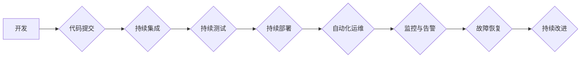

                 

## SRE自动化运维最佳实践

> 关键词：SRE, 自动化运维, DevOps, 持续交付, 监控, 告警, 故障恢复, 容器化, 云计算

## 1. 背景介绍

随着软件系统规模和复杂度的不断增长，传统的运维模式已经难以满足现代企业对快速交付、高可用性和弹性伸缩的需求。Site Reliability Engineering (SRE) 应运而生，它将软件工程的理念和实践应用于运维领域，旨在通过自动化、监控和预警等手段提高系统可靠性和稳定性。

SRE 强调以数据为驱动，通过监控和分析系统指标，及时发现和解决潜在问题，并通过自动化流程实现快速故障恢复。SRE 的核心目标是将运维工作从被动响应转变为主动预防，从而提高系统可用性和降低运维成本。

## 2. 核心概念与联系

SRE 的核心概念包括：

* **可靠性 (Reliability):** 系统能够持续稳定地提供服务的能力。
* **可用性 (Availability):** 系统在指定时间内能够正常访问和使用的能力。
* **可维护性 (Maintainability):** 系统易于维护、升级和修复的能力。
* **可扩展性 (Scalability):** 系统能够根据需求动态调整资源，满足流量变化的能力。
* **自动化 (Automation):** 通过自动化脚本和工具，减少人工干预，提高效率和准确性。

SRE 与 DevOps 紧密相关，两者共同构成了现代软件开发和运维的最佳实践。DevOps 强调开发和运维团队的协作和沟通，而 SRE 提供了技术手段和最佳实践，帮助 DevOps 实现自动化运维和持续交付。

**Mermaid 流程图:**



## 3. 核心算法原理 & 具体操作步骤

### 3.1  算法原理概述

SRE 中常用的算法主要包括：

* **监控算法:** 用于收集和分析系统指标，例如 CPU 使用率、内存使用率、网络流量等。常用的监控算法包括时间序列分析、聚合统计和异常检测。
* **告警算法:** 用于根据监控数据触发告警，提醒运维人员潜在问题。常用的告警算法包括阈值告警、趋势告警和关联告警。
* **故障恢复算法:** 用于自动修复故障，例如重启服务、回滚数据库等。常用的故障恢复算法包括故障检测、故障隔离和故障恢复策略。

### 3.2  算法步骤详解

**监控算法:**

1. **数据采集:** 收集系统指标数据，例如 CPU 使用率、内存使用率、网络流量等。
2. **数据预处理:** 对采集到的数据进行清洗、转换和格式化。
3. **数据分析:** 使用时间序列分析、聚合统计和异常检测等算法分析数据，识别潜在问题。
4. **数据可视化:** 将分析结果以图表、报表等形式展示，方便运维人员理解和决策。

**告警算法:**

1. **设置告警阈值:** 根据系统正常运行情况，设置告警阈值，例如 CPU 使用率超过 80% 触发告警。
2. **监控指标变化:** 持续监控系统指标的变化，判断是否超过告警阈值。
3. **触发告警:** 当指标变化超过告警阈值时，触发告警，通知运维人员。
4. **告警处理:** 运维人员根据告警信息，采取相应的措施解决问题。

**故障恢复算法:**

1. **故障检测:** 使用监控数据和预定义规则检测系统故障。
2. **故障隔离:** 将故障影响范围隔离，防止故障蔓延。
3. **故障恢复:** 根据故障类型和预定义策略，自动执行故障恢复操作，例如重启服务、回滚数据库等。
4. **故障恢复验证:** 验证故障恢复操作是否成功，并记录故障信息。

### 3.3  算法优缺点

**监控算法:**

* **优点:** 可以实时监控系统状态，及时发现潜在问题。
* **缺点:** 需要大量的监控数据，处理和分析数据需要一定的技术难度。

**告警算法:**

* **优点:** 可以及时提醒运维人员潜在问题，提高响应速度。
* **缺点:** 容易产生虚假告警，需要不断优化告警规则。

**故障恢复算法:**

* **优点:** 可以自动修复故障，减少人工干预，提高效率。
* **缺点:** 需要预先定义故障恢复策略，策略设计需要考虑多种因素。

### 3.4  算法应用领域

SRE 中的算法广泛应用于各种领域，例如：

* **云计算:** 自动化云资源管理、监控云服务性能、故障恢复云服务。
* **容器化:** 自动化容器部署、监控容器健康状态、故障恢复容器。
* **微服务:** 监控微服务状态、故障隔离微服务、自动恢复微服务。

## 4. 数学模型和公式 & 详细讲解 & 举例说明

### 4.1  数学模型构建

SRE 中常用的数学模型包括：

* **可用性模型:** 用于计算系统可用性，例如：

$$
Availability = 1 - Downtime / Total Time
$$

其中：

* **Availability:** 系统可用性
* **Downtime:** 系统停机时间
* **Total Time:** 系统运行时间

* **故障率模型:** 用于计算系统故障率，例如：

$$
Failure Rate = Number of Failures / Total Time
$$

其中：

* **Failure Rate:** 系统故障率
* **Number of Failures:** 系统故障次数
* **Total Time:** 系统运行时间

### 4.2  公式推导过程

**可用性模型推导:**

系统可用性是指系统在指定时间内能够正常访问和使用的时间比例。假设系统运行时间为 T，停机时间为 D，则可用性可以表示为：

$$
Availability = \frac{T - D}{T}
$$

**故障率模型推导:**

故障率是指系统在单位时间内发生故障的次数。假设系统运行时间为 T，故障次数为 F，则故障率可以表示为：

$$
Failure Rate = \frac{F}{T}
$$

### 4.3  案例分析与讲解

**案例:**

假设一个网站运行时间为 24 小时，停机时间为 1 小时，则其可用性为：

$$
Availability = \frac{24 - 1}{24} = 0.9583
$$

**解释:**

该网站的可用性为 95.83%，这意味着该网站在 24 小时内能够正常访问和使用 95.83% 的时间。

## 5. 项目实践：代码实例和详细解释说明

### 5.1  开发环境搭建

SRE 项目的开发环境需要包含以下组件：

* **代码版本控制系统:** 例如 Git
* **构建工具:** 例如 Maven、Gradle
* **测试工具:** 例如 JUnit、Mockito
* **监控工具:** 例如 Prometheus、Grafana
* **自动化部署工具:** 例如 Jenkins、Ansible

### 5.2  源代码详细实现

以下是一个简单的 SRE 监控脚本示例，使用 Python 和 Prometheus 监控 CPU 使用率：

```python
import requests
import time

# Prometheus API 地址
prometheus_url = "http://localhost:9090/api/v1/query"

# 监控指标
metric = "node_cpu_seconds_total"

while True:
    # 发送 Prometheus API 请求
    response = requests.get(prometheus_url, params={"query": f"{metric} > 0.5"})

    # 解析响应数据
    data = response.json()

    # 打印 CPU 使用率
    print(f"CPU 使用率: {data['data']['result'][0]['value'][1]}")

    # 等待 5 秒
    time.sleep(5)
```

**代码解读:**

1. 导入必要的库，例如 requests 和 time。
2. 设置 Prometheus API 地址和监控指标。
3. 使用循环不断发送 Prometheus API 请求，获取 CPU 使用率数据。
4. 解析响应数据，打印 CPU 使用率。
5. 等待 5 秒，重复执行循环。

### 5.3  代码解读与分析

该脚本使用 Python 和 Prometheus API 监控 CPU 使用率。

* **Prometheus API:** Prometheus 提供 RESTful API 接口，可以用于查询监控数据。
* **数据解析:** 响应数据格式为 JSON，需要解析出 CPU 使用率值。
* **循环执行:** 使用循环不断获取数据，实现持续监控。

### 5.4  运行结果展示

运行该脚本后，会在控制台输出 CPU 使用率数据，例如：

```
CPU 使用率: 0.25
CPU 使用率: 0.31
CPU 使用率: 0.28
```

## 6. 实际应用场景

SRE 的应用场景非常广泛，例如：

* **云服务平台:** 自动化云资源管理、监控云服务性能、故障恢复云服务。
* **电商平台:** 监控网站访问量、订单处理速度、支付成功率等，确保网站稳定运行。
* **金融系统:** 监控交易数据、账户余额、风险指标等，保障金融系统的安全和稳定。

### 6.4  未来应用展望

随着云计算、容器化和微服务的普及，SRE 将在未来发挥更加重要的作用。

* **人工智能:** 将人工智能技术应用于 SRE，实现更智能的监控、告警和故障恢复。
* **自动化运维:** 进一步提高自动化运维的水平，减少人工干预，提高效率和准确性。
* **安全运维:** 将安全运维纳入 SRE 的范畴，提高系统安全性和可靠性。

## 7. 工具和资源推荐

### 7.1  学习资源推荐

* **书籍:**
    * The Site Reliability Workbook by Niall Richard Murphy
    * Site Reliability Engineering by Betsy Beyer, Chris Jones, Jennifer Petoff
* **博客:**
    * Google SRE Blog: https://sre.googleblog.com/
    * Netflix Tech Blog: https://techblog.netflix.com/

### 7.2  开发工具推荐

* **监控工具:** Prometheus, Grafana, Datadog, New Relic
* **自动化部署工具:** Jenkins, Ansible, Kubernetes
* **代码版本控制系统:** Git, GitHub, GitLab

### 7.3  相关论文推荐

* **Building a Self-Healing System:** https://dl.acm.org/doi/10.1145/2939672.2939708
* **Site Reliability Engineering: A Practical Guide:** https://dl.acm.org/doi/10.1145/3297087.3300008

## 8. 总结：未来发展趋势与挑战

### 8.1  研究成果总结

SRE 已经取得了显著的成果，例如：

* **提高了系统可靠性和可用性:** 通过自动化运维和持续改进，SRE 帮助企业提高了系统可靠性和可用性。
* **降低了运维成本:** 自动化运维减少了人工干预，降低了运维成本。
* **提高了开发效率:** SRE 的最佳实践帮助开发团队更快地交付软件。

### 8.2  未来发展趋势

SRE 的未来发展趋势包括：

* **人工智能:** 将人工智能技术应用于 SRE，实现更智能的监控、告警和故障恢复。
* **自动化运维:** 进一步提高自动化运维的水平，减少人工干预，提高效率和准确性。
* **安全运维:** 将安全运维纳入 SRE 的范畴，提高系统安全性和可靠性。

### 8.3  面临的挑战

SRE 也面临一些挑战，例如：

* **技能缺口:** SRE 需要具备软件工程、运维和系统管理等方面的技能，技能缺口是一个普遍问题。
* **文化转变:** SRE 需要企业文化转变，强调数据驱动、自动化和持续改进。
* **工具和技术演进:** SRE 工具和技术不断演进，需要持续学习和更新。

### 8.4  研究展望

未来 SRE 研究将重点关注以下方面：

* **人工智能驱动的 SRE:** 开发更智能的 SRE 工具和系统，利用人工智能技术提高监控、告警和故障恢复的效率和准确性。
* **SRE 的可扩展性和灵活性:** 研究 SRE 的可扩展性和灵活性，使其能够适应越来越复杂的系统架构。
* **SRE 的安全性和隐私性:** 研究 SRE 的安全性和隐私性，确保系统数据安全和用户隐私保护。

## 9. 附录：常见问题与解答

**常见问题:**

* **什么是 SRE?**

SRE (Site Reliability Engineering) 是将软件工程的理念和实践应用于运维领域，旨在通过自动化、监控和预警等手段提高系统可靠性和稳定性。

* **SRE 和 DevOps 的区别是什么?**

DevOps 强调开发和运维团队的协作和沟通，而 SRE 提供了技术手段和最佳实践，帮助 DevOps 实现自动化运维和持续交付。

* **SRE 的核心概念是什么?**

SRE 的核心概念包括可靠性、可用性、可维护性、可扩展性和自动化。

* **SRE 的应用场景有哪些?**

SRE 的应用场景非常广泛，例如云服务平台、电商平台、金融系统等。

**解答:**

* **SRE 的目标是提高系统可靠性和可用性，降低运维成本，提高开发效率。**
* **SRE 需要具备软件工程、运维和系统管理等方面的技能。**
* **SRE 需要企业文化转变，强调数据驱动、自动化和持续改进。**


作者：禅与计算机程序设计艺术 / Zen and the Art of Computer Programming<end_of_turn>

