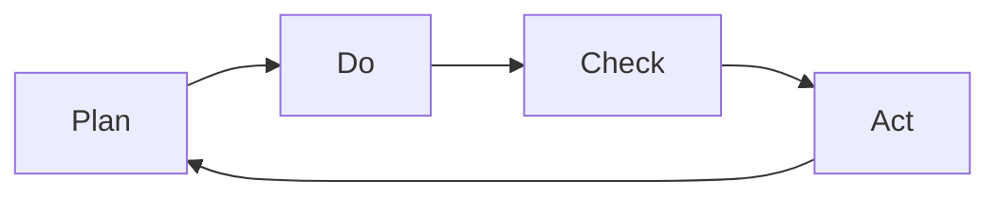

                 

# 如何有效执行PDCA循环

> 关键词：PDCA, 持续改进, 管理, 质量, 项目管理, 生产, 流程优化, 数据驱动, 团队协作

## 1. 背景介绍

### 1.1 问题由来

PDCA循环（Plan-Do-Check-Act）是一种经典的质量管理工具，最早由W. Edwards Deming于1950年代提出，主要用于持续改进过程，已被广泛应用于制造业、服务业、IT开发等多个领域。然而，在实践中，PDCA循环往往被简化成一种形式主义，缺乏系统性和操作性，导致其效果大打折扣。如何有效执行PDCA循环，提升组织的持续改进能力，成为当前亟需探讨的重要课题。

### 1.2 问题核心关键点

本文将聚焦于PDCA循环的核心原理、操作步骤和实际应用，探讨如何结合现代技术手段，构建一个系统化、结构化的PDCA框架，以确保PDCA循环的高效执行和持续改进效果。具体来说，包括以下几个关键点：

- PDCA循环的定义和作用
- PDCA循环的四个步骤及其具体操作方法
- PDCA循环与现代技术（如数据分析、人工智能、团队协作工具等）的结合应用
- PDCA循环在项目管理、流程优化、质量控制等方面的实际案例分析
- PDCA循环执行过程中遇到的问题和挑战，以及应对策略
- PDCA循环的未来发展趋势和应用前景

## 2. 核心概念与联系

### 2.1 核心概念概述

PDCA循环由美国质量管理专家W. Edwards Deming提出，旨在通过持续改进，提升产品和服务的质量。PDCA四个步骤分别为：

- **计划(Plan)**：明确改进目标和具体措施，制定实施计划。
- **执行(Do)**：按照计划执行，开始实际改进工作。
- **检查(Check)**：评估实施效果，分析改进措施的效果和问题。
- **行动(Act)**：总结改进经验，形成标准操作流程，并开始下一轮PDCA循环。

PDCA循环的本质是一种数据驱动的持续改进过程，强调了数据收集、分析和反馈的重要性，以及不断迭代优化、持续改进的循环机制。通过PDCA循环，组织可以系统化、持续化地提升自身能力，适应快速变化的市场环境。

### 2.2 核心概念原理和架构的 Mermaid 流程图



这个流程图展示了PDCA循环的四个步骤及其相互关系，说明了从计划、执行、检查到行动的持续改进过程。

## 3. 核心算法原理 & 具体操作步骤

### 3.1 算法原理概述

PDCA循环的核心原理是“反馈与迭代”，即通过不断收集数据、分析数据，得出改进措施的效果，并根据反馈结果进行调整和优化。PDCA循环是一个闭环系统，每个步骤都是环环相扣的，形成了一个持续改进的循环。

PDCA循环的执行需要系统性的方法和工具支撑，其四个步骤的具体操作方法如下：

- **计划(Plan)**：明确改进目标、制定实施计划、选择改进措施、分配资源和责任。
- **执行(Do)**：按照计划执行改进措施，收集数据和反馈信息。
- **检查(Check)**：分析数据和反馈信息，评估改进措施的效果和问题。
- **行动(Act)**：总结改进经验，形成标准操作流程，并开始下一轮PDCA循环。

### 3.2 算法步骤详解

#### 3.2.1 计划阶段(Plan)

1. **定义改进目标**：明确改进的具体目标，确保目标具体、可衡量、可实现、相关性强、时间限制明确。

2. **分析当前状态**：对现状进行详细的分析和评估，包括业务流程、质量指标、资源情况等，找出存在的问题和改进点。

3. **制定改进措施**：基于问题分析，制定具体的改进措施和实施计划，确保措施具有可操作性。

4. **分配资源和责任**：明确改进所需的资源和责任分配，确保各个环节有专人负责。

#### 3.2.2 执行阶段(Do)

1. **实施改进措施**：按照计划执行改进措施，确保各项措施得到严格执行。

2. **收集数据和反馈信息**：在执行过程中，及时收集相关数据和反馈信息，包括改进效果、资源使用情况、员工反馈等。

#### 3.2.3 检查阶段(Check)

1. **评估改进效果**：基于收集到的数据和反馈信息，评估改进措施的效果，识别出问题点和改进不足。

2. **分析数据和信息**：对收集到的数据进行深入分析，找出改进措施的优势和不足，识别出潜在的风险和改进点。

#### 3.2.4 行动阶段(Act)

1. **总结改进经验**：总结改进过程中的经验和教训，形成可复制的标准操作流程和最佳实践。

2. **持续改进**：将改进经验应用于其他业务环节，确保改进效果的持续性和系统性。

3. **开始下一轮PDCA循环**：在总结经验的基础上，开始下一轮PDCA循环，形成持续改进的良性循环。

### 3.3 算法优缺点

#### 3.3.1 优点

1. **系统化**：PDCA循环提供了一种系统化的方法，通过四个步骤形成一个完整的改进流程，确保改进的全面性和系统性。

2. **数据驱动**：PDCA循环强调数据的重要性，通过不断收集和分析数据，确保改进措施的有效性和可持续性。

3. **持续改进**：PDCA循环的循环机制，保证了改进措施的持续性和系统性，确保了组织能力的不断提升。

#### 3.3.2 缺点

1. **执行难度大**：PDCA循环的四个步骤需要精心设计和严格执行，对组织的管理和执行能力要求较高。

2. **资源消耗高**：执行PDCA循环需要大量的资源投入，包括时间、人力、资金等，对于中小型组织来说可能存在成本压力。

3. **灵活性不足**：PDCA循环的流程较为固定，难以应对突发事件和快速变化的市场环境。

## 4. 数学模型和公式 & 详细讲解 & 举例说明

### 4.1 数学模型构建

PDCA循环的执行需要一系列的数据分析方法，包括统计分析、回归分析、因果分析等。以下是一个简单的统计分析模型，用于评估改进措施的效果：

设改进措施的执行效果为 $Y$，影响因素为 $X_1, X_2, ..., X_n$，则统计回归模型可以表示为：

$$ Y = \beta_0 + \beta_1 X_1 + \beta_2 X_2 + ... + \beta_n X_n + \epsilon $$

其中，$\beta_0$ 为截距，$\beta_i$ 为第 $i$ 个影响因素的系数，$\epsilon$ 为随机误差。通过统计回归分析，可以找出影响改进效果的主要因素，从而优化改进措施。

### 4.2 公式推导过程

以回归模型为例，其推导过程如下：

1. **数据收集**：收集改进措施的执行数据 $(x_i, y_i), i=1,...,n$，其中 $x_i$ 为影响因素，$y_i$ 为执行效果。

2. **模型拟合**：使用最小二乘法拟合模型，求解 $\beta_0, \beta_1, ..., \beta_n$。

3. **模型评估**：计算回归模型的R平方值和标准误差，评估模型的拟合效果和稳定性。

4. **结果分析**：基于回归结果，找出影响改进效果的主要因素，优化改进措施。

### 4.3 案例分析与讲解

以一家制造企业的质量控制为例，企业希望通过PDCA循环提升产品质量。

**计划阶段**：明确了改进目标是提升产品的合格率，分析了当前合格率较低的原因，制定了改进措施，包括加强供应商管理、改进生产工艺等，并分配了相关资源和责任。

**执行阶段**：按照计划执行改进措施，加强了供应商管理，改进了生产工艺，收集了相关数据和反馈信息。

**检查阶段**：通过统计回归模型分析数据，发现供应商管理和生产工艺是影响合格率的主要因素，并提出了优化措施。

**行动阶段**：总结了改进经验，形成标准操作流程，并开始下一轮PDCA循环。

## 5. 项目实践：代码实例和详细解释说明

### 5.1 开发环境搭建

为了实现PDCA循环的自动化执行和数据分析，可以使用Python编程语言，结合Pandas、NumPy、Matplotlib等库，构建数据分析和可视化工具。

**步骤1：** 安装Python和相关库
```bash
pip install pandas numpy matplotlib seaborn scikit-learn
```

**步骤2：** 配置Jupyter Notebook
```bash
jupyter notebook
```

**步骤3：** 创建Python文件，输入数据分析代码
```python
import pandas as pd
import numpy as np
import matplotlib.pyplot as plt
import seaborn as sns

# 读取数据
data = pd.read_csv('data.csv')

# 数据预处理
data = data.dropna()

# 数据分析
sns.histplot(data['X1'], kde=True, label='X1')
sns.histplot(data['X2'], kde=True, label='X2')
plt.legend()
plt.show()

# 回归模型拟合
from sklearn.linear_model import LinearRegression
X = data[['X1', 'X2']]
y = data['Y']
model = LinearRegression()
model.fit(X, y)

# 模型评估
y_pred = model.predict(X)
r2 = model.score(X, y)
plt.scatter(y, y_pred)
plt.xlabel('True Value')
plt.ylabel('Predicted Value')
plt.show()

# 结果输出
print('R Squared:', r2)
```

### 5.2 源代码详细实现

**代码解释**：
- **数据读取**：使用Pandas库读取数据文件，并进行预处理，删除缺失值。
- **数据可视化**：使用Matplotlib和Seaborn库进行数据可视化，生成直方图和散点图。
- **回归模型拟合**：使用Scikit-learn库进行线性回归模型拟合，计算模型的R平方值。
- **结果输出**：输出模型的R平方值，评估模型的拟合效果。

### 5.3 代码解读与分析

**代码解读**：
- **数据处理**：使用Pandas库进行数据读取和预处理，确保数据质量。
- **模型拟合**：使用Scikit-learn库进行线性回归模型拟合，并输出模型的R平方值，评估模型效果。
- **结果展示**：使用Matplotlib和Seaborn库进行数据可视化，生成直方图和散点图，直观展示数据和模型结果。

### 5.4 运行结果展示

**结果展示**：
- **数据可视化**：生成的直方图和散点图展示了影响因素和执行效果的关系，帮助理解数据的分布和关系。
- **模型评估**：输出的R平方值展示了模型的拟合效果，帮助评估改进措施的效果和问题。

## 6. 实际应用场景

### 6.1 项目管理

PDCA循环在项目管理中有着广泛的应用。项目团队通过PDCA循环，系统化地规划项目目标、执行计划、监控进度和效果、持续改进，确保项目的顺利实施和成功交付。

**实际案例**：
- **项目目标**：完成某软件项目的开发任务。
- **计划阶段**：明确项目目标、制定详细计划、分配资源和责任。
- **执行阶段**：按照计划执行项目任务，收集项目进展数据和反馈信息。
- **检查阶段**：评估项目进展和效果，找出问题点和改进措施。
- **行动阶段**：总结项目经验，形成标准操作流程，并开始下一轮PDCA循环。

### 6.2 流程优化

PDCA循环在企业流程优化中也有着重要作用。通过PDCA循环，企业可以系统化地识别流程瓶颈、优化流程设计、提升流程效率，从而实现运营效率的提升。

**实际案例**：
- **流程优化目标**：提升生产线的生产效率。
- **计划阶段**：明确生产流程的瓶颈，制定改进措施和实施计划。
- **执行阶段**：按照计划执行改进措施，收集流程效率数据和反馈信息。
- **检查阶段**：评估改进措施的效果，识别出问题点和改进不足。
- **行动阶段**：总结改进经验，形成标准操作流程，并开始下一轮PDCA循环。

### 6.3 质量控制

PDCA循环在质量控制中也有着重要作用。通过PDCA循环，企业可以系统化地识别质量问题、优化质量控制措施、提升产品质量，从而实现客户满意度的提升。

**实际案例**：
- **质量控制目标**：提升产品的合格率。
- **计划阶段**：明确质量控制的目标和改进措施，制定实施计划。
- **执行阶段**：按照计划执行质量控制措施，收集质量数据和反馈信息。
- **检查阶段**：评估质量控制的效果，找出问题点和改进措施。
- **行动阶段**：总结质量控制的经验，形成标准操作流程，并开始下一轮PDCA循环。

### 6.4 未来应用展望

随着现代信息技术的发展，PDCA循环的应用范围将进一步扩大，结合人工智能、大数据等现代技术手段，PDCA循环将变得更加高效和智能。

- **大数据分析**：通过大数据分析技术，收集和处理海量数据，实现更精确的改进措施和效果评估。
- **人工智能技术**：利用机器学习和深度学习技术，进行更深入的数据分析和预测，优化改进措施。
- **物联网技术**：通过物联网技术，实时采集和分析生产设备的数据，优化生产流程和质量控制。

## 7. 工具和资源推荐

### 7.1 学习资源推荐

- **书籍推荐**：
  - 《PDCA循环：系统化管理的成功之道》：介绍了PDCA循环的基本原理和操作步骤，适合管理层阅读。
  - 《数据驱动的PDCA循环：持续改进的实证研究》：介绍了数据驱动的PDCA循环方法，适合技术骨干阅读。

- **在线课程**：
  - Coursera上的《数据驱动的质量管理》课程，介绍了如何使用数据分析技术进行质量控制。
  - Udemy上的《项目管理PDCA循环实战》课程，介绍了如何使用PDCA循环进行项目管理。

### 7.2 开发工具推荐

- **Python开发工具**：
  - Jupyter Notebook：免费的开源开发环境，支持Python代码的编写和执行。
  - Anaconda：Python的科学计算工具包，提供了丰富的科学计算库和环境配置工具。

- **数据分析工具**：
  - Pandas：Python的数据分析库，支持数据读取、处理和分析。
  - NumPy：Python的数值计算库，支持高效的数据处理和计算。
  - Matplotlib：Python的数据可视化库，支持绘制各类图表。
  - Seaborn：基于Matplotlib的数据可视化库，支持更美观、更复杂的数据可视化。

### 7.3 相关论文推荐

- **经典论文**：
  - "The Improvement of Total Quality Management" by W. Edwards Deming：PDCA循环的奠基之作，介绍了PDCA循环的基本原理和方法。
  - "The Application of Plan-Do-Check-Act Cycle in Project Management" by Liang：介绍了PDCA循环在项目管理中的应用。

## 8. 总结：未来发展趋势与挑战

### 8.1 研究成果总结

本文系统介绍了PDCA循环的基本原理和操作步骤，结合现代技术手段，提出了更高效、更智能的PDCA执行框架。通过实际案例分析，展示了PDCA循环在项目管理、流程优化、质量控制等方面的应用。

### 8.2 未来发展趋势

随着现代信息技术的发展，PDCA循环的应用范围将进一步扩大，结合人工智能、大数据等现代技术手段，PDCA循环将变得更加高效和智能。

- **大数据分析**：通过大数据分析技术，收集和处理海量数据，实现更精确的改进措施和效果评估。
- **人工智能技术**：利用机器学习和深度学习技术，进行更深入的数据分析和预测，优化改进措施。
- **物联网技术**：通过物联网技术，实时采集和分析生产设备的数据，优化生产流程和质量控制。

### 8.3 面临的挑战

尽管PDCA循环在实践中取得了较好的效果，但在执行过程中仍面临诸多挑战：

- **数据质量问题**：数据质量不高，影响分析和决策的准确性。
- **技术应用难度**：数据分析和人工智能技术的应用需要较高的技术门槛，对技术团队的要求较高。
- **资源投入成本**：执行PDCA循环需要大量的时间、人力和资金投入，对中小型组织来说存在成本压力。

### 8.4 研究展望

未来的研究需要在以下几个方面寻求新的突破：

- **数据质量提升**：通过数据清洗、数据标注等手段，提升数据的质量和可用性。
- **技术应用普及**：推广数据分析和人工智能技术的应用，降低技术门槛，提高PDCA循环的普及度和效果。
- **资源优化配置**：优化资源配置，提高PDCA循环的执行效率，降低成本压力。

## 9. 附录：常见问题与解答

**Q1：PDCA循环是否适用于所有领域？**

A: PDCA循环适用于任何需要持续改进和提升的领域，包括制造业、服务业、IT开发等。但在特定领域中，需要结合行业特点进行适当调整和优化。

**Q2：PDCA循环的四个步骤是否可以调整？**

A: PDCA循环的四个步骤是一个完整的改进流程，不能随意调整。但在实际执行中，可以根据具体情况进行调整和优化，确保PDCA循环的有效性和系统性。

**Q3：PDCA循环需要多少次才能见效？**

A: PDCA循环的执行需要时间和资源投入，一次执行不一定能立即见效。但通过持续改进，PDCA循环将逐渐见效，实现组织能力的不断提升。

**Q4：PDCA循环需要所有员工参与吗？**

A: PDCA循环需要所有相关员工参与，才能确保改进措施的有效性和持续性。只有全体员工共同参与，才能实现PDCA循环的良性循环。

**Q5：PDCA循环的执行过程中需要注意哪些问题？**

A: PDCA循环的执行过程中需要注意以下问题：
- 数据质量问题：确保数据的高质量，避免数据噪声对分析和决策的影响。
- 技术应用难度：推广数据分析和人工智能技术的应用，降低技术门槛。
- 资源投入成本：优化资源配置，提高PDCA循环的执行效率，降低成本压力。

---

作者：禅与计算机程序设计艺术 / Zen and the Art of Computer Programming

