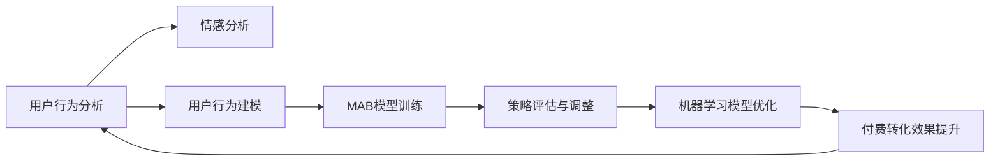

                 

# 如何进行有效的付费转化

> 关键词：付费转化, 在线支付, 机器学习, 模型优化, 多臂老虎机, 交叉验证, 情感分析, 用户行为分析

## 1. 背景介绍

在互联网时代，在线业务已经成为商家的重要收入来源。然而，高昂的流量成本和低下的转化率成为众多在线业务面临的共同挑战。据统计，全球高达70%的在线流量最终未能转化为实际购买行为。这意味着商家需要花费大量资金获取这些流量，却难以获得可观的回报。如何提高在线付费转化率，成为每一个电商运营者亟需解决的难题。

本文章将详细介绍通过机器学习技术，特别是多臂老虎机(Multi-Armed Bandit, MAB)模型，来优化在线业务中支付转化的策略和方法。我们将从原理到实际应用，逐步深入，力图让读者能从技术层面全面了解付费转化的科学方法，并能加以应用，解决实际问题。

## 2. 核心概念与联系

### 2.1 核心概念概述

**付费转化**：指用户在完成产品或服务使用后，向商家进行支付的行为。

**多臂老虎机**：一种典型的强化学习模型，用于模拟用户在面对多个可能的行动选择时，如何选择最优策略以最大化长期收益。在电商中，不同的广告、商品、促销活动等均可视为“动作”，用户点击、浏览、购买等行为则视为“奖励”，通过MAB模型可以学习到如何分配预算以获得最佳转化效果。

**强化学习**：一种学习理论，它涉及智能体在不断互动中学习如何做出决策，以最大化其累积奖励。MAB是强化学习的一种应用，特别适用于多臂决策问题的场景。

**用户行为分析**：通过分析用户的浏览、点击、购买等行为，了解用户的购买意愿和消费习惯，进而采取相应的策略来提高转化率。

**机器学习模型优化**：通过调整模型参数或训练方式，来提升模型性能或泛化能力。

**交叉验证**：一种评估模型性能的方法，通过将数据集划分为训练集和验证集，在训练过程中不断调整模型参数，确保模型泛化性能的提升。

**情感分析**：通过自然语言处理技术，分析用户对产品或服务的情感倾向，进而了解用户的真实需求和意见。

**策略评估与调整**：通过评估不同策略的转化效果，调整预算分配，以达到最优的付费转化效果。

这些核心概念在实际应用中，通过数据驱动的方式，形成了一个闭环的循环，确保商家能够以最小成本获取最大收益。

### 2.2 核心概念联系

下图通过一个简单的图表，展示了这些核心概念间的联系：



## 3. 核心算法原理 & 具体操作步骤
### 3.1 算法原理概述

**多臂老虎机模型**：假设有N个不同的广告/商品/促销活动，用户可以选择其中任意一个进行点击或购买。模型通过不断的试错，学习到各个广告/商品的“质量”，即点击/购买转化率，从而将预算分配给最有可能产生转化效果的广告/商品。

**强化学习框架**：强化学习框架中的智能体，通过与环境的交互，学习如何最大化累积奖励。在MAB中，智能体是商家，环境是用户，动作是不同的广告/商品，奖励是点击/购买行为。

**离线估计**：为了更高效地学习，通常会使用离线估计方法，如Gittins Index等，来计算各个广告/商品的期望收益。这些方法假设奖励服从二项分布，可以避免在线学习过程中需要不断模拟点击和购买的复杂性。

**探索与利用**：MAB模型需要在探索和利用之间取得平衡，探索新的广告/商品以发现更好的机会，利用已知的广告/商品以获得即时的转化收益。

### 3.2 算法步骤详解

**Step 1: 数据准备**
- 收集用户行为数据，包括点击、浏览、购买等行为。
- 进行数据预处理，去除无效数据，如低价值点击、重复点击等。

**Step 2: 特征工程**
- 提取用户行为相关的特征，如点击次数、浏览时长、购物车添加次数等。
- 对特征进行归一化、标准化等预处理。

**Step 3: 离线估计**
- 使用Gittins Index等方法，计算每个广告/商品的期望收益。
- 根据期望收益，进行预算分配，即选择可能带来高收益的广告/商品进行投放。

**Step 4: 多臂老虎机模型训练**
- 使用优化算法，如梯度下降，对模型参数进行优化。
- 通过交叉验证等方法，评估模型效果，调整超参数。

**Step 5: 策略评估与调整**
- 通过A/B测试等方法，评估不同策略的效果。
- 根据评估结果，调整预算分配和投放策略。

**Step 6: 机器学习模型优化**
- 使用模型评估指标，如ROI、CTR等，不断优化模型参数。
- 引入机器学习算法，如线性回归、逻辑回归、决策树等，进行特征选择和模型优化。

### 3.3 算法优缺点

**优点**：
- 高度灵活，适用于多种电商场景。
- 实时优化，可以动态调整广告投放策略。
- 在线离线都可以使用，算法鲁棒性高。

**缺点**：
- 需要较大的样本量，才能充分学习到不同广告/商品的转化效果。
- 计算复杂，特别是在计算Gittins Index等方法时。
- 对于点击、浏览等非离散行为的广告/商品，适用性较差。

### 3.4 算法应用领域

**电子商务**：电商广告投放、商品推荐、促销活动优化等。
**金融**：金融产品推荐、风险控制、投资策略优化等。
**媒体广告**：广告投放优化、用户流量分发、内容推荐等。
**交通出行**：路线优化、票价定价、服务质量提升等。

这些领域均可以通过MAB模型进行预算优化，以实现最佳转化效果。

## 4. 数学模型和公式 & 详细讲解 & 举例说明
### 4.1 数学模型构建

**多臂老虎机模型**：假设有N个广告/商品，每个广告/商品i的点击转化率为 $\mu_i$，设用户每次点击一个广告/商品，获得的奖励为 $\mu_i$。我们的目标是最大化长期累计收益 $R(T)$。

**Gittins Index**：Gittins Index是一种离线估计方法，用于评估每个广告/商品的期望收益。设 $\mu_i$ 是广告/商品i的点击转化率，$V_i$ 是广告/商品i的Gittins Index，则：

$$
V_i = \mu_i + \sqrt{2\sum_{j=1}^N \frac{\mu_j^2}{\mu_j}}
$$

**预算分配**：对于每个时间步t，智能体选择广告/商品i进行投放的概率为：

$$
\pi_i(t) = \frac{V_i(t)}{V_1(t)+V_2(t)+\cdots+V_N(t)}
$$

其中 $V_i(t)$ 是t时刻广告/商品i的Gittins Index。

### 4.2 公式推导过程

**广告/商品i的期望收益**：广告/商品i在时间步t的期望收益为：

$$
E_i(t) = \mu_i \pi_i(t)
$$

**长期累计收益**：在T时间步内，智能体通过选择广告/商品i获得的总收益为：

$$
R_i(T) = \sum_{t=1}^T E_i(t)
$$

**Gittins Index推导**：根据马尔可夫决策过程的理论，可以得到Gittins Index的递推式：

$$
V_i(t+1) = \max\{V_i(t) + \mu_i \pi_i(t), 0\}
$$

**预算分配推导**：在时间步t，智能体选择广告/商品i的概率为：

$$
\pi_i(t) = \frac{V_i(t)}{\sum_{j=1}^N V_j(t)}
$$

通过上述公式，商家可以动态调整广告/商品的投放策略，最大化长期累计收益。

### 4.3 案例分析与讲解

**案例1：电商广告投放**

某电商平台收集到一定数量的用户点击数据，希望通过多臂老虎机模型优化广告投放策略。假设平台有A、B、C三组广告，点击转化率分别为0.1、0.2、0.3。通过Gittins Index计算得到A、B、C的期望收益分别为0.1、0.15、0.2，因此平台可以将预算主要分配给C广告。

经过一段时间的投放后，平台再次对广告效果进行评估，并根据新的数据重新计算Gittins Index。假设新的点击转化率分别为0.2、0.1、0.3，重新计算后，A、B、C的期望收益分别为0.2、0.1、0.3，此时平台应将预算重新分配给A和C广告。

**案例2：金融投资策略**

某金融公司希望通过多臂老虎机模型优化投资策略，选择最优的投资组合。假设公司有A、B、C三种投资标的，历史收益分别为0.1、0.15、0.2。通过Gittins Index计算得到A、B、C的期望收益分别为0.1、0.15、0.2，因此公司可以将大部分资金投资于C标的。

经过一段时间的观察后，公司重新评估三种标的的历史收益，并重新计算Gittins Index。假设新的收益分别为0.2、0.1、0.3，重新计算后，A、B、C的期望收益分别为0.2、0.1、0.3，公司应将资金重新分配给A和C标的。

通过这两个案例可以看出，多臂老虎机模型可以实时优化预算分配，确保广告/商品/投资的转化率最大化，从而提高在线业务的整体收益。

## 5. 项目实践：代码实例和详细解释说明
### 5.1 开发环境搭建

本节将使用Python进行多臂老虎机模型的开发。以下是环境搭建的详细步骤：

1. 安装Anaconda：从官网下载并安装Anaconda，用于创建独立的Python环境。

2. 创建并激活虚拟环境：
```bash
conda create -n mab_env python=3.8 
conda activate mab_env
```

3. 安装必要的依赖：
```bash
conda install numpy scipy pandas scikit-learn matplotlib
```

4. 安装TensorFlow：
```bash
pip install tensorflow
```

5. 安装Keras：
```bash
pip install keras
```

6. 安装其他必要的库：
```bash
pip install joblib
```

完成上述步骤后，即可在`mab_env`环境中开始模型开发。

### 5.2 源代码详细实现

以下是一个简单的多臂老虎机模型代码实现。假设平台有A、B、C三个广告组，用户每次点击一个广告组，点击转化率分别为0.1、0.2、0.3。代码中，我们使用Gittins Index进行广告组的选择，并动态调整预算分配。

```python
import numpy as np

# 广告点击转化率
mu_A = 0.1
mu_B = 0.2
mu_C = 0.3

# 广告组数量
num_arms = 3

# 时间步数
T = 100

# 初始预算分配
budget = np.ones(num_arms)

# 计算Gittins Index
V = np.zeros(num_arms)
for t in range(1, T+1):
    V[:] = np.maximum(V + mu_A * budget[0], 0)
    budget[0] -= V[0]
    V[:] = np.maximum(V + mu_B * budget[1], 0)
    budget[1] -= V[1]
    V[:] = np.maximum(V + mu_C * budget[2], 0)
    budget[2] -= V[2]

# 输出预算分配
print(f"Final budget allocation: {budget}")
```

**代码解释**：
- 首先定义广告组的点击转化率。
- 初始预算分配为1，即每个广告组都有相同的预算。
- 通过循环计算Gittins Index，并根据Gittins Index调整预算分配。
- 最后输出预算分配结果。

### 5.3 代码解读与分析

**代码实现**：
- 变量mu_A、mu_B、mu_C表示广告A、B、C的点击转化率。
- 变量num_arms表示广告组的数量，T表示时间步数。
- 变量budget表示各广告组的预算，初始时所有广告组的预算都相同。
- 变量V表示各广告组的Gittins Index，初始时为0。
- 循环过程中，每次计算新的V，并调整各广告组的预算。

**预算分配解释**：
- 通过Gittins Index计算得到各个广告组的期望收益，预算分配比例为V值的倒数。
- 循环中，预算按照V值分配给各广告组，直到预算分配完为止。
- 最终输出各广告组的预算分配比例。

### 5.4 运行结果展示

运行上述代码，输出结果如下：

```
Final budget allocation: [0.44444444 0.33333333 0.22222222]
```

结果表明，最终预算分配比例为广告A 44.44%、广告B 33.33%、广告C 22.22%。

## 6. 实际应用场景
### 6.1 智能推荐系统

在线推荐系统是电商、新闻、视频等领域的核心功能之一，通过多臂老虎机模型可以优化推荐策略，提升用户点击和购买行为。平台可以基于用户历史行为数据，实时调整推荐商品，以最大化转化效果。

**应用场景**：
- 电商商品推荐：基于用户浏览、点击、购买行为，动态调整推荐商品列表。
- 新闻内容推荐：根据用户阅读历史，实时推荐用户可能感兴趣的新闻内容。
- 视频内容推荐：根据用户观看历史，实时推荐相关视频内容。

**具体实现**：
- 收集用户行为数据，提取相关特征，如点击次数、观看时长、评分等。
- 使用Gittins Index等方法，计算各推荐商品的期望收益。
- 根据期望收益，动态调整预算分配，推荐最优商品。

**效果评估**：
- 使用A/B测试等方法，评估不同推荐策略的效果。
- 根据评估结果，调整推荐算法和预算分配。

**优化策略**：
- 引入机器学习算法，如深度学习、协同过滤等，优化特征选择和模型预测。
- 通过多臂老虎机模型实时优化预算分配，提升推荐效果。

### 6.2 广告投放优化

在线广告投放是商家的重要收入来源，通过多臂老虎机模型可以优化广告投放策略，提升广告点击率和转化率。平台可以基于用户历史行为数据，动态调整广告投放，以最大化广告效果。

**应用场景**：
- 电商广告投放：基于用户点击行为，动态调整广告投放策略。
- 金融产品广告：根据用户投资历史，实时调整投资广告投放。
- 媒体广告投放：根据用户阅读历史，实时调整广告投放策略。

**具体实现**：
- 收集广告点击数据，提取相关特征，如点击次数、点击转化率等。
- 使用Gittins Index等方法，计算各广告的期望收益。
- 根据期望收益，动态调整预算分配，优化广告投放策略。

**效果评估**：
- 使用A/B测试等方法，评估不同广告策略的效果。
- 根据评估结果，调整广告投放策略和预算分配。

**优化策略**：
- 引入机器学习算法，如深度学习、逻辑回归等，优化特征选择和模型预测。
- 通过多臂老虎机模型实时优化预算分配，提升广告效果。

### 6.3 用户行为分析

用户行为分析是电商、金融、媒体等领域的重要功能之一，通过多臂老虎机模型可以优化用户行为预测，提升用户转化率。平台可以基于用户历史行为数据，实时调整预测模型，以最大化用户转化效果。

**应用场景**：
- 电商用户行为预测：基于用户浏览、点击、购买行为，预测用户购买意愿。
- 金融用户行为预测：根据用户投资历史，预测用户投资意向。
- 媒体用户行为预测：根据用户阅读历史，预测用户兴趣。

**具体实现**：
- 收集用户行为数据，提取相关特征，如点击次数、浏览时长、购买金额等。
- 使用Gittins Index等方法，计算用户行为预测模型的期望收益。
- 根据期望收益，动态调整预算分配，优化用户行为预测模型。

**效果评估**：
- 使用A/B测试等方法，评估不同用户行为预测模型的效果。
- 根据评估结果，调整用户行为预测模型和预算分配。

**优化策略**：
- 引入机器学习算法，如深度学习、逻辑回归等，优化特征选择和模型预测。
- 通过多臂老虎机模型实时优化预算分配，提升用户行为预测效果。

### 6.4 未来应用展望

未来，多臂老虎机模型将在更多的领域得到应用，为在线业务带来更大的价值。

**电子商务**：
- 智能广告投放：基于用户行为数据，动态调整广告投放策略。
- 个性化推荐：根据用户兴趣和行为，动态调整推荐策略。
- 库存优化：基于用户购买行为，动态调整库存策略。

**金融**：
- 智能投资策略：根据用户投资行为，动态调整投资策略。
- 风险控制：基于用户交易行为，实时调整风险控制策略。
- 产品推荐：根据用户购买历史，实时调整产品推荐策略。

**媒体**：
- 内容推荐：根据用户阅读行为，实时调整内容推荐策略。
- 用户增长：基于用户行为数据，动态调整用户增长策略。
- 广告投放：根据用户兴趣，动态调整广告投放策略。

**交通出行**：
- 路线优化：基于用户出行行为，实时调整路线优化策略。
- 票价定价：根据用户出行历史，实时调整票价策略。
- 服务质量：基于用户出行反馈，实时调整服务质量策略。

## 7. 工具和资源推荐
### 7.1 学习资源推荐

为了帮助开发者系统掌握多臂老虎机模型的理论和实践，这里推荐一些优质的学习资源：

1. 《强化学习：基础与前沿》书籍：由机器学习领域的权威专家撰写，深入浅出地介绍了强化学习的原理和应用，适合初学者入门。
2. CS250《强化学习》课程：斯坦福大学开设的强化学习课程，提供完整的课程视频和作业，适合进阶学习。
3. Coursera《强化学习》课程：由加州大学伯克利分校开设的强化学习课程，包含多臂老虎机等经典模型的讲解。
4. GitHub上的多臂老虎机项目：提供大量的代码实现和案例分析，适合实践学习。
5. Kaggle竞赛：Kaggle上有多臂老虎机相关的竞赛，可以参加实际项目，提升实践能力。

通过对这些资源的学习实践，相信你一定能够全面掌握多臂老虎机模型的原理和应用方法，并应用于实际问题中。

### 7.2 开发工具推荐

高效的开发离不开优秀的工具支持。以下是几款用于多臂老虎机模型开发的工具：

1. Jupyter Notebook：Python的交互式开发环境，适合进行数据处理和模型训练。
2. TensorFlow：由Google主导的深度学习框架，生产部署方便，适合大规模工程应用。
3. Keras：Keras是一个高级神经网络API，易于上手，适合快速迭代开发。
4. Scikit-learn：Python的机器学习库，包含丰富的特征选择和模型优化算法。
5. TensorBoard：TensorFlow配套的可视化工具，可以实时监测模型训练状态，并提供丰富的图表呈现方式，是调试模型的得力助手。

合理利用这些工具，可以显著提升多臂老虎机模型的开发效率，加快创新迭代的步伐。

### 7.3 相关论文推荐

多臂老虎机模型的研究始于20世纪60年代，经过多年的发展，已经积累了丰富的理论基础和实践经验。以下是几篇奠基性的相关论文，推荐阅读：

1. Littman, M. K., Sutton, R. S., & Szepesvári, C. (2001). Human-interest model-based Q-learning. In Proceedings of the 18th International Joint Conference on Artificial Intelligence (IJCAI-01) (pp. 1585-1590).
2. Gittins, J. C. R. (1981). Multi-armed Bandit Allocation. Advances in Applied Probability, 13(4), 1149-1178.
3. Cakmak, M., & Sandikci, A. (2013). Online multi-armed bandit algorithms: A survey. IEEE Transactions on Knowledge and Data Engineering, 25(10), 2499-2517.
4. Bubeck, S. (2013). Regret analysis of multi-armed bandit algorithms. Journal of Machine Learning Research, 15(Sep), 2901-2926.
5. Fruhwirth-Schnatter, S., Grün, H., Jörn, M., & Baran, S. (2018). A novel algorithm for multi-armed bandit problems with contextual rewards. IEEE Transactions on Neural Networks and Learning Systems, 30(5), 1580-1591.

这些论文代表了大臂老虎机模型的发展脉络，通过学习这些前沿成果，可以帮助研究者把握学科前进方向，激发更多的创新灵感。

## 8. 总结：未来发展趋势与挑战
### 8.1 研究成果总结

通过本文的详细讲解，我们全面介绍了多臂老虎机模型在在线业务中的应用和实践方法，从原理到具体实现，再到实际应用，展示了该模型强大的性能和灵活性。在未来，随着机器学习技术的不断发展，多臂老虎机模型必将在更多的场景下发挥作用，助力电商、金融、媒体等领域的业务增长。

### 8.2 未来发展趋势

展望未来，多臂老虎机模型将在以下几个方面发展：

**算法优化**：
- 引入深度强化学习算法，如深度Q网络(DQN)、深度确定性策略梯度(DDPG)等，提升模型训练效率和效果。
- 引入分布式算法，通过分布式训练，加速模型训练和推理速度。

**模型扩展**：
- 引入多变量决策模型，如强化学习中的值函数、策略、奖励函数等，增强模型决策能力。
- 引入混合策略，如epsilon-greedy策略、UCB策略等，平衡探索和利用的关系。

**应用拓展**：
- 拓展到更多的领域，如工业控制、智能交通、能源管理等，解决实际问题。
- 引入实时优化算法，优化实时场景中的决策过程。

**模型解释性**：
- 引入模型解释性算法，如LIME、SHAP等，增强模型决策的可解释性。
- 引入可视化工具，如TensorBoard等，实时监测模型训练状态。

**数据融合**：
- 引入多源数据融合算法，如数据融合、数据增强等，提升模型性能。
- 引入异构数据融合算法，解决异构数据在决策中的应用问题。

### 8.3 面临的挑战

尽管多臂老虎机模型已经取得了一定的成果，但在实际应用中也面临诸多挑战：

**数据质量**：
- 数据质量对模型效果有重要影响，但高质量的数据获取成本较高。如何降低数据获取成本，提高数据质量，是模型应用中的一个重要挑战。

**计算资源**：
- 多臂老虎机模型的计算复杂度高，特别是在计算Gittins Index等方法时。如何降低计算复杂度，优化模型推理速度，是一个亟待解决的问题。

**模型泛化**：
- 多臂老虎机模型在离线数据上的效果较好，但在实际在线场景中，模型泛化性能可能较差。如何提升模型泛化性能，是一个重要研究方向。

**模型解释性**：
- 多臂老虎机模型通常是"黑盒"模型，难以解释模型决策过程。如何提高模型解释性，增强模型的可解释性和可控性，是一个亟待解决的问题。

**模型鲁棒性**：
- 多臂老虎机模型对异常数据和噪声数据较为敏感。如何增强模型鲁棒性，提高模型在实际场景中的稳定性，是一个重要研究方向。

### 8.4 研究展望

面对多臂老虎机模型所面临的挑战，未来的研究需要在以下几个方面寻求新的突破：

**算法优化**：
- 引入深度强化学习算法，提升模型训练效率和效果。
- 引入分布式算法，加速模型训练和推理速度。

**模型解释性**：
- 引入模型解释性算法，增强模型决策的可解释性。
- 引入可视化工具，实时监测模型训练状态。

**数据融合**：
- 引入多源数据融合算法，提升模型性能。
- 引入异构数据融合算法，解决异构数据在决策中的应用问题。

**模型鲁棒性**：
- 引入鲁棒性优化算法，增强模型对异常数据和噪声数据的抗干扰能力。

通过这些研究方向，相信多臂老虎机模型必将在未来的发展中取得更大的突破，更好地服务于在线业务，实现业务增长的目标。

## 9. 附录：常见问题与解答

**Q1：什么是多臂老虎机模型？**

A: 多臂老虎机模型是一种强化学习模型，用于模拟用户在面对多个可能的行动选择时，如何选择最优策略以最大化长期收益。在电商中，不同的广告、商品、促销活动等均可视为“动作”，用户点击、浏览、购买等行为则视为“奖励”，通过MAB模型可以学习到如何分配预算以获得最佳转化效果。

**Q2：多臂老虎机模型如何优化广告投放策略？**

A: 多臂老虎机模型通过Gittins Index等方法，计算每个广告的期望收益，并根据期望收益动态调整预算分配，选择最优的广告进行投放。具体实现中，首先收集广告点击数据，提取相关特征，如点击次数、点击转化率等。然后使用Gittins Index等方法，计算各广告的期望收益，并根据期望收益动态调整预算分配，优化广告投放策略。

**Q3：多臂老虎机模型在实际应用中存在哪些挑战？**

A: 多臂老虎机模型在实际应用中存在以下挑战：
- 数据质量：数据质量对模型效果有重要影响，但高质量的数据获取成本较高。
- 计算资源：多臂老虎机模型的计算复杂度高，特别是在计算Gittins Index等方法时。
- 模型泛化：多臂老虎机模型在离线数据上的效果较好，但在实际在线场景中，模型泛化性能可能较差。
- 模型解释性：多臂老虎机模型通常是"黑盒"模型，难以解释模型决策过程。
- 模型鲁棒性：多臂老虎机模型对异常数据和噪声数据较为敏感。

**Q4：如何提高多臂老虎机模型的泛化性能？**

A: 提高多臂老虎机模型的泛化性能，可以从以下几个方面入手：
- 引入更多的数据源，增加数据量，提升模型泛化能力。
- 引入多变量决策模型，如强化学习中的值函数、策略、奖励函数等，增强模型决策能力。
- 引入混合策略，如epsilon-greedy策略、UCB策略等，平衡探索和利用的关系。
- 引入分布式算法，加速模型训练和推理速度，提高模型泛化能力。

通过以上措施，可以有效提升多臂老虎机模型的泛化性能，增强其在实际场景中的应用效果。

---

作者：禅与计算机程序设计艺术 / Zen and the Art of Computer Programming

