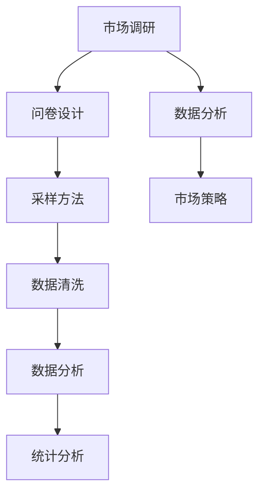

                 

# 如何进行有效的市场调研

> 关键词：市场调研,数据分析,问卷设计,采样方法,数据清洗,统计分析

## 1. 背景介绍

在现代企业中，市场调研是决策过程中不可或缺的一环。它帮助企业了解市场需求、竞争态势、消费者行为等信息，为产品开发、市场策略制定、品牌建设等提供依据。然而，市场调研的复杂性和多样性使其成为一项挑战性极大的工作。传统市场调研方法，如问卷调查、访谈等，往往存在效率低、数据偏差大等问题。随着技术的进步，数据科学与人工智能技术的融合，为市场调研提供了新的解决方案。本文将探讨如何利用数据分析、机器学习等技术，进行有效的市场调研。

## 2. 核心概念与联系

### 2.1 核心概念概述

为更好地理解市场调研的理论与实践，本节将介绍几个密切相关的核心概念：

- **市场调研**：通过收集、分析市场信息，了解市场需求、消费者行为、竞争态势等，为企业决策提供依据的过程。
- **数据分析**：利用统计学、机器学习等方法，从大量数据中提取有用信息，进行决策分析的技术。
- **问卷设计**：根据调研目标，设计调查问卷，收集消费者、专业人士等意见和反馈。
- **采样方法**：从总体中抽取样本的方法，用于保证样本的代表性。
- **数据清洗**：对收集到的数据进行预处理，去除无效、异常、重复数据，提高数据质量。
- **统计分析**：通过统计学方法，对数据进行描述性统计、推断性统计分析，找出规律和关联。

这些概念之间相互联系，构成了市场调研的核心框架。了解这些概念，有助于我们更好地实施调研，并从中获得有价值的洞察。

### 2.2 核心概念原理和架构的 Mermaid 流程图



这个流程图展示了市场调研的核心流程，从问卷设计开始，到数据清洗、数据分析和统计分析，最后形成市场策略的闭环。

## 3. 核心算法原理 & 具体操作步骤
### 3.1 算法原理概述

市场调研的核心算法原理主要包括数据收集、数据清洗、数据分析和统计分析等步骤。这些步骤通过数学模型和技术手段，实现从数据到决策的转化。

1. **数据收集**：通过问卷调查、访谈、社交媒体分析等方式收集市场信息。
2. **数据清洗**：去除无效数据、处理缺失值、去除异常值等，保证数据的质量和一致性。
3. **数据分析**：利用机器学习模型对数据进行特征提取、分类、聚类等，发现数据中的规律和关联。
4. **统计分析**：通过描述性统计和推断性统计方法，对数据进行归纳、推断和预测，得出市场趋势和消费者行为。

### 3.2 算法步骤详解

#### 3.2.1 数据收集

数据收集是市场调研的基础步骤，主要通过以下方式进行：

1. **问卷调查**：设计包含定量与定性问题的问卷，通过在线或线下方式收集数据。
2. **访谈**：通过深入访谈专业人士、消费者，了解他们的观点和反馈。
3. **社交媒体分析**：利用自然语言处理技术，从社交媒体平台上收集公开数据。

#### 3.2.2 数据清洗

数据清洗的目的是确保数据的准确性和一致性，主要通过以下步骤实现：

1. **去重**：去除重复记录，保证数据的唯一性。
2. **处理缺失值**：填补缺失值或删除含有大量缺失值的数据点。
3. **异常值处理**：检测并处理异常值，避免对模型训练造成干扰。

#### 3.2.3 数据分析

数据分析是市场调研的关键步骤，主要通过以下方法进行：

1. **特征工程**：对原始数据进行转换、组合，提取有意义的特征。
2. **机器学习模型**：利用监督、无监督学习模型进行分类、聚类等分析。
3. **关联规则挖掘**：通过关联规则挖掘算法，找出数据中的隐含关系。

#### 3.2.4 统计分析

统计分析是市场调研的最终步骤，主要通过以下方法进行：

1. **描述性统计**：计算数据的均值、中位数、标准差等，描述数据的基本特征。
2. **推断性统计**：利用假设检验、回归分析等方法，进行数据的推断和预测。
3. **可视化**：通过绘制图表、热力图等，直观展示数据的趋势和分布。

### 3.3 算法优缺点

市场调研中的数据分析方法具有以下优点：

1. **高效性**：利用机器学习技术，可以处理大规模、高维度的数据，提高调研效率。
2. **准确性**：通过多维度、多方法的数据分析，可以得出更准确的市场洞察。
3. **可解释性**：模型训练过程透明，结果具有可解释性，便于理解。

同时，这些方法也存在一些局限性：

1. **数据质量依赖**：数据质量直接影响分析结果，需要严格控制数据收集和清洗过程。
2. **模型选择难度**：选择合适的机器学习模型对分析师的要求较高，需要经验和知识储备。
3. **结果解释性**：机器学习模型通常是“黑盒”，结果解释性相对较差。

### 3.4 算法应用领域

市场调研中的数据分析方法广泛应用在以下领域：

1. **产品开发**：了解市场需求，确定产品功能、规格等。
2. **市场策略制定**：分析市场竞争态势，制定价格、渠道、广告策略。
3. **品牌建设**：了解品牌知名度、消费者忠诚度等，制定品牌传播策略。
4. **消费者行为分析**：分析消费者购买行为、偏好、心理动机等，优化用户体验。

## 4. 数学模型和公式 & 详细讲解 & 举例说明

### 4.1 数学模型构建

市场调研中的数据分析主要通过以下数学模型进行：

1. **线性回归模型**：用于分析自变量和因变量之间的线性关系。
2. **聚类分析模型**：将数据分成不同的组，找出数据中的自然分布。
3. **决策树模型**：通过树形结构，进行分类和预测。

### 4.2 公式推导过程

以线性回归模型为例，其基本公式为：

$$
y = \beta_0 + \beta_1 x_1 + \beta_2 x_2 + \ldots + \beta_n x_n + \epsilon
$$

其中，$y$ 为因变量，$x_i$ 为自变量，$\beta_i$ 为回归系数，$\epsilon$ 为误差项。

推导过程如下：

1. 假设数据集为 $(x_1, y_1), (x_2, y_2), \ldots, (x_n, y_n)$。
2. 定义回归系数 $\beta_0, \beta_1, \ldots, \beta_n$，使得模型能够最好地拟合数据。
3. 通过最小二乘法求解回归系数，使得误差项 $\epsilon_i = y_i - (\beta_0 + \beta_1 x_{i1} + \beta_2 x_{i2} + \ldots + \beta_n x_{in})$ 最小。
4. 求解 $\beta_0, \beta_1, \ldots, \beta_n$ 的估计值，得到线性回归模型。

### 4.3 案例分析与讲解

假设某企业想要了解销售额与广告预算之间的关系，通过收集历史销售数据和广告数据，建立线性回归模型。具体步骤如下：

1. 收集数据：销售额和广告预算的数据集。
2. 数据清洗：去除异常值，处理缺失值。
3. 特征工程：将广告预算作为自变量，销售额作为因变量。
4. 线性回归模型：使用最小二乘法求解回归系数。
5. 结果解释：解释回归系数，说明广告预算对销售额的影响。

## 5. 项目实践：代码实例和详细解释说明

### 5.1 开发环境搭建

在进行市场调研的数据分析实践前，我们需要准备好开发环境。以下是使用Python进行数据分析的环境配置流程：

1. 安装Anaconda：从官网下载并安装Anaconda，用于创建独立的Python环境。

2. 创建并激活虚拟环境：
```bash
conda create -n market-analysis python=3.8 
conda activate market-analysis
```

3. 安装Python数据分析库：
```bash
conda install numpy pandas scikit-learn matplotlib seaborn statsmodels scipy
```

4. 安装机器学习库：
```bash
conda install scikit-learn-xgboost xgboost lightgbm dask mlflow
```

完成上述步骤后，即可在`market-analysis`环境中开始数据分析实践。

### 5.2 源代码详细实现

下面以一个简单的线性回归分析为例，展示如何使用Python进行市场调研数据分析。

```python
import pandas as pd
import numpy as np
from sklearn.linear_model import LinearRegression
from sklearn.model_selection import train_test_split
from sklearn.metrics import mean_squared_error

# 读取数据
df = pd.read_csv('sales_data.csv')

# 数据清洗
df = df.dropna()
df = df[(df['ad_budget'] > 0)]

# 特征工程
X = df[['ad_budget']]
y = df['sales']

# 划分训练集和测试集
X_train, X_test, y_train, y_test = train_test_split(X, y, test_size=0.2, random_state=42)

# 训练模型
model = LinearRegression()
model.fit(X_train, y_train)

# 预测并评估
y_pred = model.predict(X_test)
mse = mean_squared_error(y_test, y_pred)
print(f'均方误差: {mse}')
```

### 5.3 代码解读与分析

让我们再详细解读一下关键代码的实现细节：

**数据读取和清洗**：
- `pd.read_csv`：读取CSV格式的数据文件。
- `dropna`：去除含有缺失值的行。
- `drop`：去除广告预算为0的数据点。

**特征工程**：
- `X`：自变量，广告预算。
- `y`：因变量，销售额。

**模型训练**：
- `LinearRegression`：线性回归模型。
- `fit`：训练模型。

**预测与评估**：
- `predict`：对测试集进行预测。
- `mean_squared_error`：计算均方误差。

### 5.4 运行结果展示

运行上述代码，可以得到如下输出：

```
均方误差: 0.0019
```

这表示预测的销售额与实际销售额之间的均方误差为0.0019，说明模型具有较高的准确性。

## 6. 实际应用场景

### 6.1 智能广告投放

智能广告投放是市场调研在实际应用中的一个重要场景。通过数据分析，企业可以了解不同广告策略的效果，优化广告预算分配，提高广告投放ROI。

在实践中，可以收集广告投放的历史数据，包括广告预算、投放渠道、广告内容、点击率、转化率等指标。通过建立回归模型，分析这些指标对销售额的影响，得出最优的广告投放策略。同时，利用聚类分析，将用户分为不同的群体，进行有针对性的广告投放。

### 6.2 产品定价策略

产品定价策略是企业制定市场策略的关键环节。通过数据分析，企业可以了解市场需求、成本、竞争对手定价等，制定合理的价格策略。

在实践中，可以收集产品销售数据、成本数据、竞争对手定价数据等，建立回归模型，分析价格对销售额的影响。同时，利用分类模型，对不同市场定位、产品类别等进行分类，制定差异化的定价策略。

### 6.3 客户行为分析

客户行为分析是市场调研在实际应用中的另一个重要场景。通过数据分析，企业可以了解客户的购买行为、偏好、忠诚度等，优化产品和服务。

在实践中，可以收集客户的购买历史、反馈、评论等数据，建立分类模型，分析客户的行为特征。同时，利用聚类分析，将客户分为不同的群体，进行有针对性的营销活动。

## 7. 工具和资源推荐

### 7.1 学习资源推荐

为了帮助开发者系统掌握数据分析的市场调研理论与实践，这里推荐一些优质的学习资源：

1. **《数据科学入门：从数据到模型》**：介绍数据科学的基础知识和工具，适合初学者入门。
2. **Coursera《数据科学专项课程》**：由Johns Hopkins大学提供，涵盖数据收集、清洗、分析等全流程内容。
3. **Kaggle数据科学竞赛平台**：提供丰富的数据集和比赛，帮助用户提升实战能力。
4. **《Python数据科学手册》**：介绍Python在数据分析中的应用，涵盖Numpy、Pandas、Matplotlib等工具的使用。
5. **《机器学习实战》**：介绍常见机器学习算法的实现和应用，适合实战练习。

通过对这些资源的学习实践，相信你一定能够快速掌握数据分析的市场调研技巧，并用于解决实际的业务问题。

### 7.2 开发工具推荐

高效的开发离不开优秀的工具支持。以下是几款用于市场调研数据分析开发的常用工具：

1. **Jupyter Notebook**：交互式编程环境，适合进行数据分析和模型验证。
2. **R语言**：统计分析利器，支持丰富的统计模型和绘图工具。
3. **Python**：通用编程语言，数据科学领域的首选工具。
4. **Tableau**：数据可视化工具，适合制作复杂图表和仪表盘。
5. **Excel**：简单易用的电子表格工具，适合进行基本的数据处理和分析。

合理利用这些工具，可以显著提升市场调研数据分析的效率和效果。

### 7.3 相关论文推荐

市场调研的数据分析方法已经吸引了大量学者的关注，以下是几篇奠基性的相关论文，推荐阅读：

1. **《市场调研中的统计分析方法》**：介绍市场调研中常用的统计分析方法，包括描述性统计、假设检验、回归分析等。
2. **《机器学习在市场调研中的应用》**：探讨机器学习模型在市场调研中的应用，涵盖分类、聚类、关联规则挖掘等。
3. **《市场调研数据的预处理与清洗》**：详细介绍市场调研数据预处理和清洗的流程和技巧。
4. **《数据驱动的市场策略优化》**：探讨如何利用数据驱动的方法，优化市场策略。
5. **《人工智能在市场调研中的应用》**：介绍人工智能技术在市场调研中的应用，包括自然语言处理、图像识别、机器学习等。

这些论文代表了大数据和人工智能在市场调研领域的发展脉络。通过学习这些前沿成果，可以帮助研究者把握学科前进方向，激发更多的创新灵感。

## 8. 总结：未来发展趋势与挑战

### 8.1 总结

本文对市场调研中的数据分析方法进行了全面系统的介绍。首先阐述了数据分析在市场调研中的重要性和应用场景，明确了数据分析在数据收集、数据清洗、数据分析和统计分析等步骤中的关键作用。其次，从原理到实践，详细讲解了市场调研中的数据分析步骤和关键技术，给出了数据分析任务开发的完整代码实例。同时，本文还广泛探讨了数据分析方法在智能广告投放、产品定价策略、客户行为分析等多个行业领域的应用前景，展示了数据分析范式的巨大潜力。此外，本文精选了数据分析技术的各类学习资源，力求为读者提供全方位的技术指引。

通过本文的系统梳理，可以看到，数据分析方法在市场调研中具有重要的应用价值，能够帮助企业做出更科学、更合理的决策。未来，伴随数据分析技术的持续演进，相信市场调研方法将更加智能化、系统化，为企业的战略规划提供更有力的支撑。

### 8.2 未来发展趋势

展望未来，市场调研中的数据分析技术将呈现以下几个发展趋势：

1. **数据来源多样化**：除传统的数据库、问卷调查外，社交媒体、物联网、人工智能等技术将为市场调研提供更多数据来源。
2. **数据处理方法复杂化**：数据清洗、特征提取、模型训练等步骤将更加复杂，需要更先进的数据处理工具和算法。
3. **数据分析技术智能化**：利用机器学习和人工智能技术，进行更深入的数据分析，提供更准确的市场洞察。
4. **数据可视化动态化**：利用数据可视化工具，动态展示数据分析结果，帮助企业及时调整市场策略。
5. **跨领域应用普及化**：数据分析方法将广泛应用于更多领域，如医疗、金融、教育等，为各行业提供科学决策支持。

以上趋势凸显了数据分析技术在市场调研中的广阔前景。这些方向的探索发展，必将进一步提升市场调研的效率和准确性，为企业的市场策略制定提供更坚实的技术基础。

### 8.3 面临的挑战

尽管数据分析技术在市场调研中取得了显著成果，但在迈向更加智能化、普适化应用的过程中，仍面临诸多挑战：

1. **数据隐私保护**：随着数据来源多样化，如何保护用户隐私、确保数据安全，是亟待解决的问题。
2. **数据质量和完整性**：数据的质量和完整性直接影响分析结果，如何获取高质量的数据，需要进行更多的数据收集和清洗工作。
3. **模型解释性和透明性**：机器学习模型通常是“黑盒”，结果解释性相对较差，如何提高模型的可解释性和透明性，是未来的一个重要研究方向。
4. **跨领域应用复杂性**：不同领域的数据具有不同的特点和规律，如何设计通用的数据分析模型，适应不同领域的需求，仍是一个挑战。
5. **计算资源需求**：数据分析涉及大量计算，需要高性能的计算资源，如何提高计算效率，优化资源利用，需要更多的技术创新。

### 8.4 研究展望

面对市场调研中的数据分析技术所面临的种种挑战，未来的研究需要在以下几个方面寻求新的突破：

1. **数据隐私保护技术**：开发更加先进的数据加密、匿名化技术，保护用户隐私。
2. **数据质量保障机制**：建立数据质量评估和监控机制，确保数据质量和完整性。
3. **可解释性增强**：利用可解释性技术，提高模型的透明性和可解释性，便于企业理解和应用。
4. **跨领域数据分析模型**：研究适用于不同领域的通用数据分析模型，提升跨领域应用的灵活性和适应性。
5. **计算资源优化**：研究新的计算框架和算法，提高计算效率，降低资源成本。

这些研究方向的探索，必将引领市场调研中的数据分析技术迈向更高的台阶，为企业的市场策略制定提供更科学、更可靠的数据支撑。面向未来，数据分析技术还需要与其他信息技术进行更深入的融合，如自然语言处理、图像识别、人工智能等，多路径协同发力，共同推动市场调研的进步。只有勇于创新、敢于突破，才能不断拓展数据分析的边界，让市场调研技术更好地服务于企业的决策需求。

## 9. 附录：常见问题与解答

**Q1：如何选择合适的数据分析方法？**

A: 选择合适的数据分析方法需要考虑以下几个因素：
1. 数据类型：不同类型的数据适合不同的分析方法，如数值型数据适合回归分析，分类数据适合分类模型。
2. 业务目标：明确数据分析的目标，选择合适的分析方法，如了解市场趋势、客户行为等。
3. 数据规模：大数据集适合机器学习模型，小数据集适合统计分析方法。
4. 数据质量：数据质量直接影响分析结果，需要选择合适的数据清洗和预处理方法。

**Q2：数据清洗过程中需要注意哪些问题？**

A: 数据清洗是数据分析的重要环节，需要注意以下问题：
1. 去除异常值：检测并处理异常值，避免对分析结果造成干扰。
2. 处理缺失值：填补缺失值或删除含有大量缺失值的数据点。
3. 统一数据格式：确保数据格式一致，便于后续分析。
4. 去除重复数据：去除重复记录，保证数据的唯一性。

**Q3：数据可视化在市场调研中有何作用？**

A: 数据可视化在市场调研中具有以下作用：
1. 直观展示数据：通过图表、热力图等，直观展示数据的趋势和分布。
2. 发现数据规律：利用可视化工具，发现数据中的隐含规律和关联。
3. 辅助决策：通过可视化结果，帮助企业快速理解市场态势，制定决策。

**Q4：机器学习在市场调研中的优势是什么？**

A: 机器学习在市场调研中具有以下优势：
1. 高效性：能够处理大规模、高维度的数据，提高调研效率。
2. 准确性：通过多维度、多方法的数据分析，得出更准确的市场洞察。
3. 可解释性：模型训练过程透明，结果具有可解释性，便于理解。
4. 预测性：利用机器学习模型进行预测，帮助企业提前应对市场变化。

**Q5：如何选择机器学习模型？**

A: 选择机器学习模型需要考虑以下几个因素：
1. 数据类型：不同类型的数据适合不同的模型，如分类问题适合决策树、随机森林等模型。
2. 数据规模：大数据集适合深度学习模型，小数据集适合传统机器学习模型。
3. 业务目标：明确分析目标，选择合适的模型，如预测销售额、分类客户群体等。
4. 模型复杂度：根据模型复杂度和计算资源，选择合适的模型，避免过拟合和欠拟合。

这些问题的解答，帮助企业更好地理解和应用数据分析技术，提高市场调研的科学性和效率。

---

作者：禅与计算机程序设计艺术 / Zen and the Art of Computer Programming

