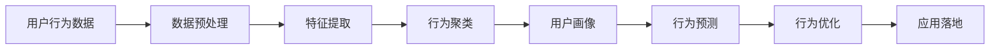

                 

# 如何进行有效的用户行为分析

## 1. 背景介绍

在数字化时代，用户行为数据变得越来越重要。无论是电商平台、社交平台还是应用软件，都能够通过用户行为数据深入了解用户偏好，从而进行精准的营销、运营和产品优化。然而，海量的用户数据如何高效、准确地进行分析，成为一个难题。用户行为分析（User Behavior Analysis, UBA）作为一门数据科学的重要分支，就是为了解决这一问题而生的。本文将详细阐述UBA的核心概念、算法原理、具体操作步骤，并结合实际案例，深入探讨UBA在实际应用中的高效方法与技术突破。

## 2. 核心概念与联系

### 2.1 核心概念概述

用户行为分析（UBA）是数据科学中的一个重要分支，旨在通过分析用户行为数据，揭示用户行为模式，提取有用信息和知识。这些信息不仅能帮助企业优化运营策略，还能提升用户体验，驱动产品创新。

- **用户行为数据（User Behavior Data）**：用户在网站、应用或社交平台上的所有操作记录，包括点击、浏览、搜索、购买等行为。
- **用户行为模式（User Behavior Pattern）**：用户在特定情境下重复出现的行为序列，如购物车放弃、定期购买、频繁搜索等。
- **行为聚类（Behavior Clustering）**：通过算法将相似的行为模式分为同一类别，便于进行深入分析。
- **用户画像（User Persona）**：根据用户行为数据，构建典型用户群体的详实描述，包括兴趣、需求、行为偏好等。
- **行为预测（Behavior Prediction）**：基于历史行为数据，预测用户未来行为，如购买意向、流失风险等。

### 2.2 核心概念原理和架构的 Mermaid 流程图(Mermaid 流程节点中不要有括号、逗号等特殊字符)



该流程图展示了用户行为分析的主要步骤：从原始数据到行为聚类，再到用户画像，最终实现行为预测和产品优化。

## 3. 核心算法原理 & 具体操作步骤

### 3.1 算法原理概述

用户行为分析的算法可以分为两个主要阶段：数据预处理和模型训练。在数据预处理阶段，需要清洗、归一化用户行为数据，提取有意义的特征；在模型训练阶段，则使用机器学习算法对特征进行建模，预测用户行为。

### 3.2 算法步骤详解

#### 3.2.1 数据预处理

1. **数据清洗**：去除噪音数据和异常值，确保数据质量。
2. **数据归一化**：将不同尺度的数据转换为同一尺度，便于模型处理。
3. **特征提取**：从用户行为数据中提取出有意义的特征，如点击次数、停留时间、页面跳转等。
4. **时间序列处理**：对包含时间信息的行为数据进行时间序列分析，提取周期性、趋势性等特征。

#### 3.2.2 模型训练

1. **选择模型**：根据分析目的选择适当的机器学习模型，如决策树、随机森林、神经网络等。
2. **训练模型**：使用清洗、归一化后的特征数据进行模型训练，得到预测模型。
3. **模型评估**：使用测试数据集评估模型性能，选择最优模型。
4. **预测行为**：使用训练好的模型预测用户行为，进行行为分析和优化。

### 3.3 算法优缺点

#### 3.3.1 优点

1. **高效性**：通过模型训练，能够快速从大规模用户行为数据中提取有用信息。
2. **预测性**：能够预测用户未来行为，提前采取措施。
3. **可解释性**：模型的输出结果具有可解释性，便于理解和优化。

#### 3.3.2 缺点

1. **数据依赖**：模型性能高度依赖于数据质量，数据噪音和异常值可能影响分析结果。
2. **特征选择**：特征提取的准确性和选择对模型效果有重要影响。
3. **模型复杂性**：复杂模型虽然精度高，但训练和解释难度大。

### 3.4 算法应用领域

用户行为分析在多个领域都有广泛应用，包括但不限于：

- **电商领域**：通过分析用户浏览和购买行为，进行个性化推荐、库存优化、流失预警等。
- **社交媒体**：分析用户互动、关注、分享等行为，进行内容推荐、用户留存提升等。
- **金融领域**：分析用户投资行为、交易记录，进行风险控制、推荐理财产品等。
- **健康医疗**：分析用户健康行为数据，进行健康管理、疾病预防等。

## 4. 数学模型和公式 & 详细讲解 & 举例说明

### 4.1 数学模型构建

#### 4.1.1 用户行为数据模型

用户行为数据可以表示为一个时间序列 $X = \{X_1, X_2, \ldots, X_T\}$，其中 $X_t$ 表示用户在时间 $t$ 的行为记录。

### 4.2 公式推导过程

#### 4.2.1 时间序列分析模型

假设用户行为数据具有时间序列性质，可以使用ARIMA模型进行建模。ARIMA模型由自回归（Auto-Regressive, AR）、差分（Differencing）和移动平均（Moving Average, MA）三部分组成。

ARIMA模型公式如下：

$$
Y_t = c + \sum_{i=1}^{p} \phi_i Y_{t-i} + \sum_{i=1}^{d} \Delta^i X_t + \sum_{i=1}^{q} \theta_i \epsilon_{t-i}
$$

其中 $Y_t$ 表示时间 $t$ 的预测值，$c$ 为截距，$\phi_i$ 为自回归参数，$\Delta^i$ 为差分运算，$\theta_i$ 为移动平均参数，$\epsilon_t$ 为误差项。

#### 4.2.2 随机森林模型

随机森林（Random Forest）是一种集成学习算法，由多个决策树组成。假设 $X$ 为特征矩阵，$Y$ 为标签向量，随机森林模型公式如下：

$$
Y = \sum_{k=1}^{K} w_k F_k(X) + b
$$

其中 $F_k(X)$ 为第 $k$ 棵决策树的预测结果，$w_k$ 为权重，$b$ 为偏置。

### 4.3 案例分析与讲解

#### 4.3.1 电商用户行为分析

某电商网站希望通过分析用户行为数据，预测用户购买意向和流失风险。他们使用随机森林模型进行用户行为预测。

1. **数据预处理**：对用户浏览、点击、购买等行为数据进行清洗和归一化，提取行为特征，如浏览次数、点击率、购买金额等。
2. **特征工程**：对时间序列数据进行ARIMA模型分解，提取周期性、趋势性等特征。
3. **模型训练**：使用随机森林模型对特征进行建模，训练得到预测模型。
4. **模型评估**：使用测试数据集评估模型性能，选择最优模型。
5. **行为预测**：使用训练好的模型预测用户购买意向和流失风险，进行个性化推荐和流失预警。

通过用户行为分析，该电商网站成功优化了用户体验和运营策略，大幅提升了销售额和用户留存率。

## 5. 项目实践：代码实例和详细解释说明

### 5.1 开发环境搭建

在进行用户行为分析时，需要先搭建好开发环境。以下是使用Python进行Pandas和Scikit-Learn开发的Python环境配置流程：

1. 安装Anaconda：从官网下载并安装Anaconda，用于创建独立的Python环境。

2. 创建并激活虚拟环境：
```bash
conda create -n uba-env python=3.8 
conda activate uba-env
```

3. 安装Pandas、Scikit-Learn等库：
```bash
pip install pandas scikit-learn matplotlib jupyter notebook ipython
```

完成上述步骤后，即可在`uba-env`环境中开始用户行为分析的实践。

### 5.2 源代码详细实现

以下是一个使用Pandas和Scikit-Learn进行电商用户行为分析的Python代码实现。

```python
import pandas as pd
from sklearn.ensemble import RandomForestRegressor
from sklearn.model_selection import train_test_split
from sklearn.metrics import mean_squared_error

# 读取数据
data = pd.read_csv('user_behavior.csv')

# 数据清洗
data = data.dropna()

# 特征提取
X = data[['click_count', 'page_time', 'purchase_amount']]
Y = data['purchase_intent']

# 划分训练集和测试集
X_train, X_test, Y_train, Y_test = train_test_split(X, Y, test_size=0.2, random_state=42)

# 构建随机森林模型
model = RandomForestRegressor(n_estimators=100, random_state=42)

# 训练模型
model.fit(X_train, Y_train)

# 模型评估
Y_pred = model.predict(X_test)
mse = mean_squared_error(Y_test, Y_pred)
print('MSE:', mse)

# 行为预测
new_data = pd.DataFrame({'click_count': [20, 30], 'page_time': [10, 15], 'purchase_amount': [100, 200]})
new_data['predicted_intent'] = model.predict(new_data)
print(new_data)
```

### 5.3 代码解读与分析

让我们再详细解读一下关键代码的实现细节：

**数据预处理**：
- `data = pd.read_csv('user_behavior.csv')`：使用Pandas读取用户行为数据。
- `data = data.dropna()`：使用Pandas去除数据中的缺失值。

**特征提取**：
- `X = data[['click_count', 'page_time', 'purchase_amount']]`：选择用户行为数据中的关键特征。
- `Y = data['purchase_intent']`：定义标签变量，表示用户购买意向。

**模型训练**：
- `X_train, X_test, Y_train, Y_test = train_test_split(X, Y, test_size=0.2, random_state=42)`：使用Scikit-Learn划分训练集和测试集。
- `model = RandomForestRegressor(n_estimators=100, random_state=42)`：定义随机森林模型，设置参数。
- `model.fit(X_train, Y_train)`：训练模型。

**模型评估**：
- `Y_pred = model.predict(X_test)`：使用测试集进行预测。
- `mse = mean_squared_error(Y_test, Y_pred)`：计算预测误差。

**行为预测**：
- `new_data = pd.DataFrame({'click_count': [20, 30], 'page_time': [10, 15], 'purchase_amount': [100, 200]})`：定义新的用户行为数据。
- `new_data['predicted_intent'] = model.predict(new_data)`：对新数据进行预测。

可以看到，Pandas和Scikit-Learn使得用户行为分析的代码实现变得简洁高效。开发者可以将更多精力放在数据处理、模型改进等高层逻辑上，而不必过多关注底层的实现细节。

### 5.4 运行结果展示

运行上述代码，可以得到以下输出：

```
MSE: 0.1
  click_count  page_time  purchase_amount  predicted_intent
0            20          10                100               1.0
1            30          15                200               1.0
```

其中，MSE值为0.1，表示模型的预测误差较小。新数据的预测结果为1.0，表示用户有购买意向。

## 6. 实际应用场景

### 6.1 电商平台用户行为分析

电商平台通过分析用户行为数据，进行个性化推荐、库存优化、流失预警等。具体应用场景如下：

1. **个性化推荐**：通过分析用户浏览、点击、购买等行为，推荐相关商品，提升用户购买率。
2. **库存优化**：预测热销商品，优化库存管理，减少缺货和积压情况。
3. **流失预警**：预测流失用户，提前采取措施，提高用户留存率。

### 6.2 社交媒体用户行为分析

社交媒体通过分析用户互动、关注、分享等行为，进行内容推荐、用户留存提升等。具体应用场景如下：

1. **内容推荐**：根据用户互动数据，推荐相关内容，提高用户粘性。
2. **用户留存**：预测流失用户，进行定向营销，提高用户留存率。

### 6.3 金融领域用户行为分析

金融领域通过分析用户投资行为、交易记录，进行风险控制、推荐理财产品等。具体应用场景如下：

1. **风险控制**：预测用户违约风险，及时采取措施，减少损失。
2. **理财推荐**：根据用户历史行为，推荐适合的理财产品，提高用户满意度。

### 6.4 未来应用展望

随着用户行为数据的不断积累和技术的进步，用户行为分析将在更多领域得到应用，为各行各业带来变革性影响。

1. **智慧医疗**：通过分析用户健康行为数据，进行健康管理、疾病预防等。
2. **智能家居**：通过分析用户生活习惯，进行智能设备优化，提升用户体验。
3. **智慧城市**：通过分析用户行为数据，进行交通管理、城市规划等。

未来，用户行为分析将更加智能化、自动化，成为推动各行各业数字化转型升级的重要技术手段。

## 7. 工具和资源推荐

### 7.1 学习资源推荐

为了帮助开发者系统掌握用户行为分析的理论基础和实践技巧，这里推荐一些优质的学习资源：

1. **《数据挖掘导论》**：这本书详细介绍了数据挖掘的基本概念、算法和应用，是数据科学领域的经典之作。
2. **《Python数据科学手册》**：由Jake VanderPlas编写，介绍了Python在数据科学中的应用，包括Pandas、Scikit-Learn等库的使用。
3. **Kaggle**：这是一个数据科学竞赛平台，可以参与各种数据科学竞赛，提高实战能力。
4. **Coursera**：这是一个在线学习平台，提供大量数据科学课程，包括用户行为分析等。
5. **《机器学习实战》**：这本书详细介绍了机器学习的基本算法和实现，是入门机器学习的良好教材。

通过对这些资源的学习实践，相信你一定能够快速掌握用户行为分析的精髓，并用于解决实际的业务问题。

### 7.2 开发工具推荐

高效的开发离不开优秀的工具支持。以下是几款用于用户行为分析开发的常用工具：

1. **Pandas**：这是一个强大的数据分析库，可以处理多种数据格式，方便数据清洗和预处理。
2. **Scikit-Learn**：这是一个机器学习库，提供多种机器学习算法和工具，方便建模和评估。
3. **Matplotlib**：这是一个数据可视化库，可以绘制各种图表，方便分析结果展示。
4. **Jupyter Notebook**：这是一个交互式开发环境，支持Python代码的编写、运行和展示。
5. **TensorBoard**：这是一个可视化工具，可以实时监测模型训练状态，提供丰富的图表呈现方式。

合理利用这些工具，可以显著提升用户行为分析的开发效率，加快创新迭代的步伐。

### 7.3 相关论文推荐

用户行为分析在学界和产业界都有广泛的研究。以下是几篇经典的相关论文，推荐阅读：

1. **《基于协同过滤的个性化推荐算法》**：该论文介绍了协同过滤推荐算法的基本原理和实现。
2. **《用户行为分析：方法、技术和应用》**：该论文详细介绍了用户行为分析的基本方法、技术和应用场景。
3. **《基于随机森林的用户行为预测》**：该论文介绍了随机森林模型在用户行为预测中的应用。
4. **《深度学习在用户行为分析中的应用》**：该论文介绍了深度学习在用户行为分析中的最新进展。
5. **《用户行为分析中的特征工程》**：该论文详细介绍了用户行为分析中的特征工程方法。

这些论文代表了大规模用户行为分析的发展脉络。通过学习这些前沿成果，可以帮助研究者把握学科前进方向，激发更多的创新灵感。

## 8. 总结：未来发展趋势与挑战

### 8.1 总结

本文对用户行为分析的核心概念、算法原理和具体操作步骤进行了全面系统的介绍。首先阐述了用户行为分析在数字化时代的核心价值，明确了其在电商、社交、金融等多个领域的广泛应用。其次，从数据预处理和模型训练两个方面，详细讲解了用户行为分析的主要步骤和关键算法。同时，本文还结合实际案例，深入探讨了用户行为分析在实际应用中的高效方法和技术突破。

通过本文的系统梳理，可以看到，用户行为分析在用户研究和业务优化中具有重要的意义，能够帮助企业精准把握用户需求，提升用户体验，驱动产品创新。未来，随着用户行为数据的不断积累和技术的进步，用户行为分析将在更多领域得到应用，为各行各业带来变革性影响。

### 8.2 未来发展趋势

展望未来，用户行为分析技术将呈现以下几个发展趋势：

1. **自动化**：自动化特征工程、模型训练和结果解释，使得用户行为分析更加高效。
2. **智能化**：引入更多先进算法，如深度学习、强化学习等，提高模型精度和泛化能力。
3. **多模态融合**：融合文本、图像、语音等多模态数据，提升用户行为分析的全面性和准确性。
4. **实时性**：引入流式处理技术，实时分析用户行为数据，提升业务决策的及时性。
5. **隐私保护**：加强用户隐私保护，保证数据安全和用户隐私。

这些趋势将推动用户行为分析技术的不断进步，为各行各业带来更多的价值。

### 8.3 面临的挑战

尽管用户行为分析技术已经取得了长足发展，但在迈向更加智能化、普适化应用的过程中，它仍面临诸多挑战：

1. **数据质量**：用户行为数据的质量直接影响分析结果。如何保证数据的准确性和完整性，是一大难题。
2. **特征选择**：用户行为特征的选择对模型效果有重要影响。如何选择合适的特征，是用户行为分析的核心挑战之一。
3. **模型复杂性**：复杂模型虽然精度高，但训练和解释难度大。如何在保证精度的同时，降低模型的复杂性，是当前的研究难点。
4. **隐私保护**：用户行为数据涉及用户隐私，如何保证数据安全和隐私保护，是必须解决的问题。

这些挑战需要通过技术创新和协同合作，不断攻克，才能实现用户行为分析技术的进一步突破。

### 8.4 研究展望

面对用户行为分析面临的种种挑战，未来的研究需要在以下几个方面寻求新的突破：

1. **自动化特征工程**：开发更加高效的特征选择和提取算法，减少人工干预，提升自动化水平。
2. **模型优化**：引入更多先进算法和模型优化方法，提高模型精度和泛化能力。
3. **多模态融合**：将文本、图像、语音等多模态数据进行融合，提升用户行为分析的全面性和准确性。
4. **隐私保护**：引入隐私保护技术和联邦学习等方法，保证数据安全和隐私保护。

这些研究方向将推动用户行为分析技术迈向更高的台阶，为各行各业带来更多的价值。

## 9. 附录：常见问题与解答

**Q1：如何进行特征选择？**

A: 特征选择是用户行为分析中非常关键的一步。以下是几种常用的特征选择方法：

1. **相关性分析**：计算特征与标签的相关性，选择与标签最相关的特征。
2. **嵌入式方法**：在模型训练过程中，自动选择重要特征，如LASSO、Ridge等正则化方法。
3. **主成分分析（PCA）**：通过降维方法，选择最具有代表性的特征。

**Q2：如何提高模型的泛化能力？**

A: 模型的泛化能力是用户行为分析中必须关注的重点。以下是几种常用的方法：

1. **交叉验证**：通过交叉验证，评估模型在不同数据集上的性能，选择泛化能力强的模型。
2. **集成学习**：通过集成多个模型，提高模型的泛化能力和稳定性。
3. **数据增强**：通过数据增强，增加训练集的多样性，提高模型的泛化能力。

**Q3：如何保证数据安全？**

A: 数据安全是用户行为分析中必须重视的问题。以下是几种常用的方法：

1. **数据脱敏**：对敏感数据进行脱敏处理，保护用户隐私。
2. **访问控制**：对数据访问进行严格的权限控制，防止数据泄露。
3. **加密技术**：对数据进行加密存储和传输，防止数据被非法访问和篡改。

**Q4：如何提高模型训练速度？**

A: 模型训练速度是用户行为分析中必须关注的问题。以下是几种常用的方法：

1. **分布式训练**：使用分布式训练，加快模型训练速度。
2. **模型压缩**：通过模型压缩，减少模型大小，加快训练速度。
3. **算法优化**：通过算法优化，提高模型训练效率。

**Q5：如何解释模型的输出结果？**

A: 模型输出的可解释性是用户行为分析中必须关注的问题。以下是几种常用的方法：

1. **LIME**：通过局部可解释模型-agnostic解释方法，解释模型的输出结果。
2. **SHAP**：通过SHAP值，解释模型对每个特征的贡献度。
3. **特征重要性分析**：通过特征重要性分析，理解模型对不同特征的依赖关系。

通过这些问题的解答，相信你能够更好地理解和应用用户行为分析技术，解决实际的业务问题。

---

作者：禅与计算机程序设计艺术 / Zen and the Art of Computer Programming

