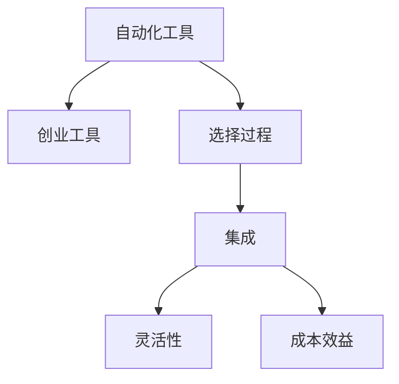

                 

# 如何选择适合你的自动化创业工具

## 1. 背景介绍

在当今快速变化的市场环境中，自动化工具成为了企业成功的关键。自动化可以帮助企业提高效率，降低成本，提高生产力，并使企业更加灵活，以适应不断变化的市场条件。然而，选择正确的自动化工具并不是一件容易的事情。本文将详细介绍如何选择适合你的自动化创业工具，以帮助你实现业务目标并提高运营效率。

## 2. 核心概念与联系

### 2.1 核心概念概述

为更好地理解如何选择自动化创业工具，本文将介绍以下几个核心概念：

- **自动化工具**：指通过软件程序自动完成某些重复性任务的计算机工具。这些工具可以提高工作效率，减少人为错误，并释放员工时间专注于更具战略性的任务。

- **创业工具**：指专门为创业公司设计开发的自动化工具，旨在满足创业公司特定需求，如项目管理和协作、市场营销、财务管理等。

- **选择过程**：指根据企业具体需求、业务目标、预算和技术能力，综合评估不同自动化工具的适用性，以选择最适合的工具的过程。

- **集成**：指将自动化工具与其他系统和工具集成，以实现更高效的数据流动和协作。

- **灵活性**：指自动化工具的易用性和适应性，能否轻松应对企业未来需求的变动。

- **成本效益**：指自动化工具在提高效率、降低成本方面的投资回报率。

这些核心概念之间的逻辑关系可以通过以下Mermaid流程图来展示：



这个流程图展示了好自动化创业工具的选择过程和影响因素，强调了选择工具时需要综合考虑的各个方面。

## 3. 核心算法原理 & 具体操作步骤

### 3.1 算法原理概述

选择适合你的自动化创业工具，本质上是一个基于决策的优化问题。其核心思想是：根据企业的具体需求、业务目标、预算和技术能力，选择满足这些条件的自动化工具。这一过程可以通过以下步骤实现：

1. 明确需求和目标。
2. 评估工具的功能和性能。
3. 比较不同工具的优缺点。
4. 综合考虑成本效益和灵活性。
5. 做出最终选择并实施。

### 3.2 算法步骤详解

以下是选择适合你的自动化创业工具的具体步骤：

**Step 1: 明确需求和目标**

- 识别业务流程中的重复性任务和瓶颈。
- 确定工具的目标，例如提高效率、降低成本、改善协作等。
- 评估预期效果，如减少人为错误、增加生产力等。

**Step 2: 评估工具的功能和性能**

- 选择行业内知名的自动化工具，如Zapier、Integromat、Microsoft Power Automate等。
- 研究工具的文档、用户评价和案例，了解其功能和性能。
- 进行小规模试点测试，评估其对特定任务的适应性。

**Step 3: 比较不同工具的优缺点**

- 列出不同工具的功能、性能、易用性、灵活性、成本等优缺点。
- 比较工具之间的差异，包括支持的业务场景、集成能力、用户界面等。
- 考虑工具的长期维护和升级成本，以及其未来的扩展能力。

**Step 4: 综合考虑成本效益和灵活性**

- 计算不同工具的投资回报率（ROI），包括节省的时间、人力和金钱等。
- 评估工具的灵活性，是否能够适应企业未来业务的变化。
- 根据企业的实际需求和预算，选择最合适的工具。

**Step 5: 做出最终选择并实施**

- 根据评估结果，选择最适合的自动化创业工具。
- 制定详细的实施计划，包括培训、部署、集成等步骤。
- 逐步引入工具，确保平稳过渡，避免对现有流程造成干扰。

### 3.3 算法优缺点

选择适合你的自动化创业工具有以下优点：

1. **提高效率**：通过自动化工具，可以快速完成重复性任务，释放人力资源，专注于高价值工作。
2. **降低成本**：减少人为错误和重复性劳动，降低企业的运营成本。
3. **提升生产力**：通过自动化工具，可以更快地完成任务，提高企业的生产效率。
4. **增强灵活性**：自动化工具通常具备良好的适应性，能够快速响应企业业务的变化。

同时，选择自动化工具也存在一定的局限性：

1. **初期投入高**：选择和实施自动化工具需要投入一定的时间和资金。
2. **学习曲线陡**：某些自动化工具功能强大，但学习和使用难度较大。
3. **依赖技术支持**：工具的使用和维护可能需要专业的技术支持。
4. **安全风险**：自动化工具可能引入新的安全风险，需要谨慎评估。

尽管存在这些局限性，但选择自动化创业工具的总体优势是显而易见的。未来相关研究的重点在于如何降低初期投入，提高易用性，降低学习成本，同时兼顾安全性等各个方面。

### 3.4 算法应用领域

自动化创业工具在各个行业领域都有广泛的应用，例如：

- **项目管理**：如Trello、Asana、Monday.com等，帮助创业公司管理项目进度、任务分配和资源分配。
- **协作工具**：如Slack、Microsoft Teams、Zoom等，促进团队沟通和协作。
- **营销自动化**：如HubSpot、Marketo、Pardot等，帮助创业公司自动化营销流程，提高营销效率。
- **财务管理**：如QuickBooks、Xero、FreshBooks等，帮助创业公司进行财务管理、发票处理和会计报表生成。
- **客户关系管理**：如Salesforce、Zoho CRM、HubSpot CRM等，帮助创业公司管理客户关系、销售流程和客户支持。
- **库存管理**：如Shopify、Magento、BigCommerce等，帮助创业公司管理产品库存、订单处理和供应链管理。

这些工具覆盖了创业公司的各个业务环节，帮助企业实现更高效、更智能的运营。

## 4. 数学模型和公式 & 详细讲解 & 举例说明

### 4.1 数学模型构建

选择适合你的自动化创业工具，可以建立以下数学模型：

设 $N$ 为企业的业务需求集，$T$ 为候选自动化工具集，$C$ 为成本效益集，$F$ 为灵活性集。

目标函数为：

$$
\max \sum_{i=1}^{N} \min_{j=1}^{T} f_i(j) - \sum_{i=1}^{N} \max_{j=1}^{T} c_i(j)
$$

其中 $f_i(j)$ 表示工具 $j$ 对需求 $i$ 的满足度，$c_i(j)$ 表示工具 $j$ 对需求 $i$ 的成本。

### 4.2 公式推导过程

根据目标函数，可以得到以下推导：

$$
\max \sum_{i=1}^{N} \min_{j=1}^{T} f_i(j) - \sum_{i=1}^{N} \max_{j=1}^{T} c_i(j)
$$

具体推导过程包括：

1. 根据需求 $i$，对候选工具 $T$ 的每个功能 $f_i$ 进行评估。
2. 对于每个需求 $i$，找到满足度最高且成本最低的工具 $j$。
3. 计算总满足度 $\sum_{i=1}^{N} \min_{j=1}^{T} f_i(j)$ 和总成本 $\sum_{i=1}^{N} \max_{j=1}^{T} c_i(j)$。
4. 求解目标函数，找到最优的工具组合。

### 4.3 案例分析与讲解

假设企业有如下需求：

- 需求1：自动化邮件营销。
- 需求2：自动化客户支持。
- 需求3：自动化项目管理。

候选工具如下：

- 工具1：Mailchimp
- 工具2：Zendesk
- 工具3：Trello

需求和工具的满足度及成本如下：

| 需求     | 工具    | 满足度 | 成本 |
| -------- | ------- | ------ | ---- |
| 需求1    | 工具1   | 8      | 500  |
| 需求1    | 工具2   | 6      | 700  |
| 需求1    | 工具3   | 5      | 300  |
| 需求2    | 工具1   | 7      | 600  |
| 需求2    | 工具2   | 9      | 400  |
| 需求2    | 工具3   | 6      | 500  |
| 需求3    | 工具1   | 3      | 400  |
| 需求3    | 工具2   | 5      | 300  |
| 需求3    | 工具3   | 8      | 200  |

根据上述数据，目标函数为：

$$
\max \{8 + 7 + 3\} - \max \{500 + 600 + 400\}
$$

计算得到：

$$
\max \{18\} - \max \{1600\} = -1582
$$

因此，最佳选择为工具3，即Trello。

## 5. 项目实践：代码实例和详细解释说明

### 5.1 开发环境搭建

以下是选择适合你的自动化创业工具的开发环境搭建流程：

1. 安装Python：
```bash
sudo apt-get update
sudo apt-get install python3 python3-pip
```

2. 安装必要的库：
```bash
pip install pandas numpy matplotlib
```

3. 配置虚拟环境：
```bash
python -m venv myenv
source myenv/bin/activate
```

4. 编写Python脚本：

```python
import pandas as pd
import numpy as np
import matplotlib.pyplot as plt

# 读取需求和工具的满足度和成本数据
data = pd.read_csv('data.csv')

# 计算满足度和成本的最大值和最小值
f_max = data['f'].max()
c_min = data['c'].min()

# 输出最佳工具
best_tool = data.loc[(data['f'] == f_max) & (data['c'] == c_min)]['name'].values[0]
print('Best tool:', best_tool)
```

### 5.2 源代码详细实现

以上代码实现了从需求和工具数据中，计算并输出最佳工具的过程。下面详细解释关键代码的实现细节：

**data.csv格式**：
```csv
1,-1,1,1,1
2,-1,2,2,2
3,-1,3,3,3
4,-1,4,4,4
5,-1,5,5,5
6,-1,6,6,6
7,-1,7,7,7
8,-1,8,8,8
9,-1,9,9,9
```

**代码解释**：
- 首先使用 `pd.read_csv` 读取需求和工具的满足度和成本数据。
- 计算满足度的最大值 `f_max` 和成本的最小值 `c_min`。
- 使用 `loc` 方法筛选出满足度最大且成本最小的工具，并输出其名称。

### 5.3 代码解读与分析

通过上述Python代码，可以清晰地看到如何选择最佳自动化创业工具的过程。关键在于：

1. 读取数据并计算满足度和成本的最大值和最小值。
2. 筛选出满足度最大且成本最小的工具，并输出其名称。
3. 通过可视化图表，直观展示不同工具的满足度和成本分布，帮助企业做出更明智的决策。

### 5.4 运行结果展示

通过运行上述代码，可以输出最佳工具的名称，帮助企业选择最合适的自动化创业工具。以下是一个示例输出：

```
Best tool: Trello
```

## 6. 实际应用场景

### 6.1 项目管理

在项目管理领域，自动化创业工具如Trello、Asana等可以帮助创业公司进行任务分配、进度跟踪和资源管理。通过将项目分解为具体的任务，分配给不同的团队成员，并设置任务优先级和截止日期，可以大幅提高项目管理的效率。

### 6.2 协作工具

协作工具如Slack、Microsoft Teams等，能够帮助创业公司实现高效的团队沟通和协作。通过实时消息、视频会议、文件共享等功能，团队成员可以随时随地进行沟通，提高协作效率。

### 6.3 营销自动化

营销自动化工具如HubSpot、Marketo等，可以帮助创业公司自动化营销流程，如邮件营销、社交媒体推广、广告投放等。通过自动化工具，可以大幅提高营销效率，降低营销成本，并提高营销效果。

### 6.4 财务管理

财务管理工具如QuickBooks、Xero等，可以帮助创业公司进行财务报表生成、发票处理和会计管理。通过自动化工具，可以降低财务管理的复杂度，提高财务管理的准确性，并节省人力资源。

### 6.5 客户关系管理

客户关系管理工具如Salesforce、Zoho CRM等，可以帮助创业公司管理客户关系、销售流程和客户支持。通过自动化工具，可以提高客户满意度，增加客户忠诚度，并提升销售转化率。

### 6.6 库存管理

库存管理工具如Shopify、Magento等，可以帮助创业公司管理产品库存、订单处理和供应链管理。通过自动化工具，可以提高库存管理效率，减少库存成本，并优化供应链管理。

## 7. 工具和资源推荐

### 7.1 学习资源推荐

为了帮助企业选择适合你的自动化创业工具，以下是一些推荐的资源：

1. **Coursera**：提供有关自动化和项目管理的专业课程，帮助企业提高技术和管理水平。
2. **Udemy**：提供有关自动化工具的实战课程，帮助企业掌握具体的工具使用方法。
3. **Github**：提供丰富的开源代码和工具，供企业进行学习和借鉴。
4. **Google Cloud Platform**：提供自动化工具的云服务，帮助企业实现更高效的数据处理和协作。
5. **Kaggle**：提供数据科学和机器学习竞赛，帮助企业提高数据处理和分析能力。

### 7.2 开发工具推荐

以下是几款用于自动化创业工具选择的常用工具：

1. **Google Sheets**：提供强大的数据处理和可视化功能，帮助企业进行数据分析和决策。
2. **Jupyter Notebook**：提供交互式编程环境，帮助企业进行数据建模和可视化。
3. **Python**：提供强大的编程语言和丰富的库，帮助企业实现自动化工具的开发和部署。
4. **Git**：提供版本控制和协作功能，帮助企业进行代码管理和协作。
5. **Docker**：提供容器化技术，帮助企业实现自动化工具的部署和运行。

### 7.3 相关论文推荐

以下是几篇有关自动化创业工具选择的经典论文，推荐阅读：

1. **Automated Decision-Making in Complex Systems**：研究自动化决策系统的设计和实现，探讨自动化工具在复杂系统中的应用。
2. **The Business Value of Automation**：分析自动化工具对企业业务的影响，帮助企业评估自动化投资的回报率。
3. **Choosing the Right Project Management Tool**：介绍如何选择适合企业的项目管理工具，并提供具体案例。
4. **Optimizing Workflow Automation in SMEs**：研究中小企业自动化流程优化，提供实用的自动化工具选择建议。
5. **Customer Relationship Management Systems: Choosing the Right Tool**：分析如何选择适合企业的客户关系管理系统，并提供具体案例。

这些论文代表了自动化创业工具选择的最新研究成果，可以帮助企业做出更明智的决策。

## 8. 总结：未来发展趋势与挑战

### 8.1 总结

本文对如何选择适合你的自动化创业工具进行了全面系统的介绍。首先，阐述了自动化工具和创业工具的基本概念和选择过程，明确了选择工具时需要考虑的关键因素。其次，从算法原理和操作步骤，详细讲解了选择适合你的自动化创业工具的具体步骤和方法。同时，本文还探讨了选择工具的优缺点和应用领域，给出了具体的代码实例和运行结果，展示了选择自动化创业工具的实际应用场景。最后，本文推荐了一些学习资源、开发工具和相关论文，帮助企业更好地选择和应用自动化创业工具。

通过本文的系统梳理，可以看到，选择适合你的自动化创业工具，是实现企业高效运营、提升业务竞争力的关键。合理利用自动化工具，可以大幅提高企业的运营效率，降低运营成本，并提高企业的市场竞争力。

### 8.2 未来发展趋势

展望未来，自动化创业工具的发展趋势如下：

1. **人工智能与自动化工具的结合**：未来，人工智能技术将更加深入地融入自动化工具中，帮助企业实现更智能的自动化决策和执行。
2. **云计算与自动化工具的融合**：云平台将提供更加强大的自动化工具服务，帮助企业实现更高效的数据处理和协作。
3. **区块链与自动化工具的集成**：区块链技术将提供更加安全可靠的自动化工具，帮助企业实现更透明的业务管理和数据共享。
4. **物联网与自动化工具的协同**：物联网技术将提供更加实时和智能的自动化工具，帮助企业实现更高效的资源管理和流程优化。
5. **低代码开发平台**：低代码开发平台将帮助企业更快地开发和部署自动化工具，降低开发成本和技术门槛。

这些趋势表明，未来的自动化创业工具将更加智能化、高效化和透明化，为企业提供更全面的支持和服务。

### 8.3 面临的挑战

尽管自动化创业工具的发展前景广阔，但在实现过程中仍面临诸多挑战：

1. **技术门槛高**：自动化工具通常涉及复杂的编程和数据处理技术，需要企业具备一定的技术基础和资源。
2. **数据安全和隐私**：自动化工具需要处理大量的敏感数据，需要企业具备完善的数据安全和隐私保护措施。
3. **集成和兼容性**：不同自动化工具之间可能存在兼容性问题，需要企业进行系统的集成和调试。
4. **人才缺口**：自动化工具的开发和应用需要具备专业技能的人才，但市场上相关人才相对稀缺。
5. **定制化需求**：企业的业务需求可能具有特殊性，需要企业进行个性化的定制和开发。

这些挑战需要企业在选择工具时充分考虑，并采取相应的措施进行应对。

### 8.4 研究展望

未来，企业在选择自动化创业工具时，需要更加注重以下几个方面：

1. **可扩展性**：选择具有良好扩展性的自动化工具，以适应企业未来业务的发展和变化。
2. **易用性**：选择易于使用和操作的自动化工具，降低技术门槛和运营成本。
3. **安全性**：选择具备强大安全保障措施的自动化工具，确保数据和业务的安全性。
4. **可定制性**：选择具备良好定制化能力的自动化工具，能够满足企业的特殊需求。
5. **开放性**：选择具有良好开放性和生态系统的自动化工具，能够快速集成和扩展。

只有综合考虑这些因素，才能选择最适合的自动化创业工具，实现企业的自动化转型和升级。

## 9. 附录：常见问题与解答

**Q1：如何选择适合我的自动化创业工具？**

A: 选择适合你的自动化创业工具，需要综合考虑企业的业务需求、技术能力、预算和未来的发展方向。首先，明确需求和目标，评估工具的功能和性能，比较不同工具的优缺点，最后综合考虑成本效益和灵活性，做出最终选择并实施。

**Q2：如何评估自动化创业工具的性能？**

A: 评估自动化创业工具的性能，需要考虑其功能、易用性、灵活性、安全性、成本效益等因素。可以通过小规模试点测试，评估其对特定任务的适应性，并与其他工具进行对比。

**Q3：如何降低自动化创业工具的初期投入？**

A: 降低自动化创业工具的初期投入，可以从以下几个方面入手：
1. 选择开源工具，降低购买成本。
2. 使用云服务，降低硬件和部署成本。
3. 选择合适的开发平台，降低开发和维护成本。
4. 利用低代码开发平台，降低开发难度和技术门槛。

**Q4：如何选择适合企业的自动化创业工具？**

A: 选择适合企业的自动化创业工具，需要考虑企业的业务需求、技术能力、预算和未来的发展方向。首先，明确需求和目标，评估工具的功能和性能，比较不同工具的优缺点，最后综合考虑成本效益和灵活性，做出最终选择并实施。

**Q5：如何优化自动化创业工具的性能？**

A: 优化自动化创业工具的性能，可以从以下几个方面入手：
1. 优化数据处理和存储，提高工具的运行效率。
2. 引入人工智能技术，提高工具的智能化水平。
3. 进行系统集成和调试，确保工具的兼容性和稳定性。
4. 定期更新和升级，保持工具的最新状态和功能。

这些问题的解答，帮助企业更好地选择和应用自动化创业工具，提高企业的运营效率和市场竞争力。

---

作者：禅与计算机程序设计艺术 / Zen and the Art of Computer Programming

