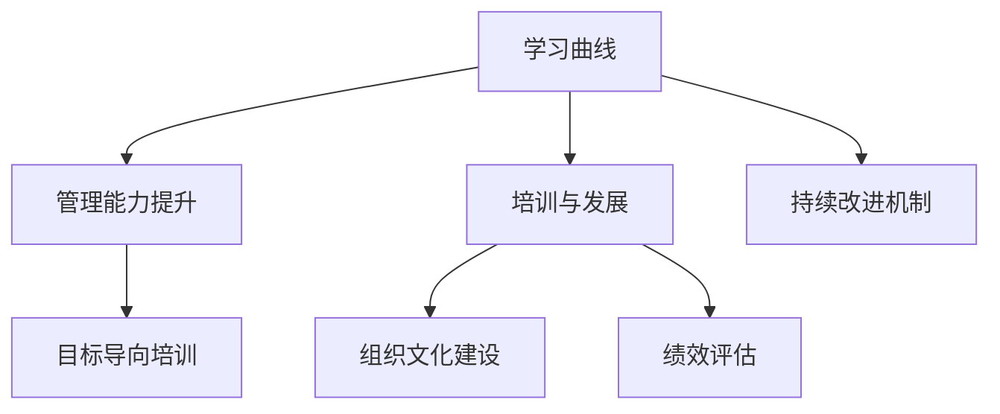

                 

# 学习曲线：管理能力提升的关键

> 关键词：学习曲线, 管理能力提升, 培训与发展, 领导力发展, 团队合作

## 1. 背景介绍

### 1.1 问题由来
在现代企业中，管理能力已经成为决定组织成功与否的关键因素之一。一个优秀的管理者不仅可以激发团队潜能，提高工作效率，还能促进组织创新和长期发展。然而，由于个人天赋和经验的差异，很多管理者的能力提升往往存在瓶颈，无法达到理想状态。这时，学习曲线(learning curve)的概念应运而生，通过科学的培训与发展方式，帮助管理者突破瓶颈，持续提升管理能力。

### 1.2 问题核心关键点
学习曲线是一种系统化的管理能力提升方法，旨在通过科学设计和管理者的个人、组织两个层面的培训，提升管理者的技能和绩效。核心关键点包括：

1. 个人学习路径：根据管理者的具体情况，定制个性化的培训计划。
2. 组织文化建设：构建积极的组织氛围，促进知识共享和团队合作。
3. 数据驱动评估：通过定量和定性的数据分析，精准评估培训效果。
4. 持续改进机制：建立反馈循环，不断优化培训和发展策略。
5. 目标导向培训：明确培训目标，确保培训内容与管理实际相符。

## 2. 核心概念与联系

### 2.1 核心概念概述

为更好地理解学习曲线在管理能力提升中的作用，本节将介绍几个密切相关的核心概念：

- 学习曲线(Learning Curve)：一种系统化的培训和发展方式，通过科学的培训内容和评价体系，持续提升管理者的技能和绩效。
- 管理能力(Management Skills)：管理者在决策、领导、沟通、团队建设等方面的能力，直接影响团队和组织的绩效。
- 培训与发展(Training & Development)：有计划、有系统地提升员工技能和知识的培养活动。
- 组织文化(Organizational Culture)：企业内共同遵守的价值观念、行为规范和行为模式，对员工的绩效和行为有重要影响。
- 绩效评估(Performance Evaluation)：通过定量和定性指标，评价员工和管理者的工作表现。

这些核心概念之间的逻辑关系可以通过以下Mermaid流程图来展示：



这个流程图展示了几者之间的关系：

1. 学习曲线通过科学培训提升管理能力。
2. 培训与发展是实现管理能力提升的主要手段。
3. 组织文化建设为培训与发展提供良好的环境。
4. 绩效评估帮助管理者了解自身的进步和问题。
5. 持续改进机制确保培训效果的持续优化。

## 3. 核心算法原理 & 具体操作步骤
### 3.1 算法原理概述

学习曲线作为系统化的管理能力提升方法，其核心原理在于通过科学设计的培训和发展路径，逐步提升管理者的技能和绩效。其核心算法包括：

- **个人学习路径设计**：根据管理者的当前能力和目标，制定个性化的培训计划。
- **绩效指标设定**：建立定量和定性的绩效评估指标，确保培训效果的可量化。
- **组织文化构建**：营造积极的组织文化，促进知识共享和团队合作。
- **持续改进循环**：通过反馈和评估，不断优化培训和发展策略。

### 3.2 算法步骤详解

基于学习曲线的管理能力提升通常包括以下几个关键步骤：

**Step 1: 个人需求评估**
- 对当前管理者进行能力评估，识别其在决策、沟通、团队管理等方面的优势和不足。
- 收集管理者自身的发展目标和期望，明确提升方向。

**Step 2: 个性化培训计划制定**
- 根据评估结果和个人目标，制定个性化的培训计划。包括课程内容、培训方式、时间安排等。
- 选择合适的培训方式，如在线课程、工作坊、实地考察等，确保培训内容与实际需求相匹配。

**Step 3: 组织文化营造**
- 构建积极的组织文化，鼓励知识共享和团队合作。
- 设立奖励机制，表彰在培训中表现突出的员工和管理者，促进全员参与。

**Step 4: 培训实施**
- 按照计划开展培训，确保每个参与者都能获得所需知识和技能。
- 定期收集培训反馈，及时调整培训内容和方式。

**Step 5: 绩效评估**
- 设定关键绩效指标，如决策效率、团队合作、目标达成率等，进行定量和定性评估。
- 将评估结果反馈给管理者，指出需要改进的领域，并制定改进计划。

**Step 6: 持续改进**
- 建立反馈和评估机制，不断优化培训和发展策略。
- 定期回顾和调整培训计划，确保其与组织目标和员工需求相一致。

### 3.3 算法优缺点

基于学习曲线的管理能力提升方法具有以下优点：

1. **系统性**：通过科学设计和系统评估，确保培训效果。
2. **个性化**：根据个体差异制定个性化培训计划，提高培训针对性。
3. **绩效导向**：设定明确的绩效指标，确保培训与实际管理需求相符。
4. **持续改进**：通过反馈和评估，不断优化培训和发展策略。

同时，该方法也存在一定的局限性：

1. **时间和资源投入大**：个性化培训和持续改进需要大量的时间和资源投入。
2. **难以量化**：有些管理能力的提升难以通过定量指标进行精确衡量。
3. **组织文化影响**：如果组织文化不支持学习和改进，学习曲线的效果可能受限。

尽管如此，学习曲线在管理能力提升中的应用仍然非常广泛，已被众多企业采用，并取得了显著的成效。

### 3.4 算法应用领域

基于学习曲线的管理能力提升方法在多个领域得到了广泛应用，以下是几个典型应用场景：

- **企业内部培训**：针对不同层次的管理者，定制个性化的培训计划，提升整体管理水平。
- **高管培养**：通过高管发展计划，提升其在战略规划、领导力等方面的能力。
- **团队建设**：通过团队培训和发展活动，增强团队凝聚力和合作能力。
- **知识管理**：通过知识共享平台和培训活动，促进知识传播和应用。

## 4. 数学模型和公式 & 详细讲解 & 举例说明

### 4.1 数学模型构建

学习曲线的核心模型可以抽象为以下几个部分：

1. **个人能力模型**：$C_i(t) = C_{i,0} + k \times t$
2. **培训效果模型**：$E_i(t) = C_i(t) \times e^{-t/\tau}$
3. **绩效评估模型**：$P_i(t) = a \times E_i(t) + b \times C_{i,0}$
4. **组织文化模型**：$C_{org} = \alpha \times C_{org,0} + \beta \times E_{avg}(t)$
5. **持续改进模型**：$R_i(t+1) = R_i(t) + k_{feed} \times [P_i(t+1) - P_i(t)]$

其中，$C_i(t)$ 表示管理者在第 $t$ 周的个人能力，$E_i(t)$ 表示第 $t$ 周的培训效果，$P_i(t)$ 表示第 $t$ 周的绩效评估结果，$C_{org}$ 表示组织文化水平，$R_i(t)$ 表示第 $t$ 周的改进效果。

### 4.2 公式推导过程

以个人能力模型为例，进行推导：

- **初始能力**：$C_{i,0}$ 为管理者当前的初始能力。
- **培训增长率**：$k$ 为每周培训的增长率，反映培训的有效性。
- **能力衰减率**：$\tau$ 为个人能力的衰减时间，表示能力随时间逐渐降低的趋势。

通过上述模型，可以计算管理者在不同周数下的能力水平和绩效表现，从而评估培训效果和改进需求。

### 4.3 案例分析与讲解

假设某企业为中高层管理者设计了为期20周的培训计划，培训内容主要集中在决策能力提升和团队管理。初始能力为 $C_{i,0}=10$，每周培训增长率为 $k=0.1$，能力衰减率为 $\tau=8$。通过上述模型，计算出每周的培训效果和绩效表现如下：

- **第1周**：$C_i(1) = 10 + 0.1 \times 1 = 10.1$
- **第4周**：$C_i(4) = 10.1 + 0.1 \times 3 = 13.3$
- **第10周**：$C_i(10) = 13.3 + 0.1 \times 6 = 19.9$
- **第20周**：$C_i(20) = 19.9 + 0.1 \times 12 = 31.9$

通过这些计算结果，企业可以清晰地看到培训的效果和后续的改进需求。

## 5. 项目实践：代码实例和详细解释说明
### 5.1 开发环境搭建

为了进行学习曲线相关的数据分析和仿真，需要搭建以下开发环境：

1. **Python环境**：安装Python 3.6或更高版本，建议使用Anaconda进行管理和依赖管理。
2. **数据分析库**：安装NumPy、Pandas、Matplotlib等常用数据分析和可视化库。
3. **仿真库**：安装SciPy、SymPy等仿真和计算库，用于模拟学习曲线模型。

### 5.2 源代码详细实现

以下是一个简单的学习曲线模型仿真示例，用于展示基于学习曲线的管理能力提升过程。

```python
import numpy as np
import matplotlib.pyplot as plt

# 定义参数
C_i0 = 10  # 初始能力
k = 0.1    # 培训增长率
tau = 8    # 能力衰减率
weeks = 20 # 培训周期

# 计算每周的能力水平
C_i = np.zeros(weeks)
for t in range(weeks):
    C_i[t] = C_i0 + k * t

# 计算每周的培训效果
E_i = C_i * np.exp(-t / tau)

# 计算每周的绩效评估结果
a = 0.5    # 绩效系数
b = 0.3    # 基础绩效系数
P_i = a * E_i + b * C_i0

# 计算每周的改进效果
k_feed = 0.2  # 改进率
R_i = np.zeros(weeks)
for t in range(weeks):
    R_i[t+1] = R_i[t] + k_feed * (P_i[t+1] - P_i[t])

# 输出结果
print(f"第1周：能力 {C_i[0]:.2f}, 培训效果 {E_i[0]:.2f}, 绩效 {P_i[0]:.2f}, 改进效果 {R_i[0]:.2f}")
print(f"第4周：能力 {C_i[3]:.2f}, 培训效果 {E_i[3]:.2f}, 绩效 {P_i[3]:.2f}, 改进效果 {R_i[3]:.2f}")
print(f"第10周：能力 {C_i[9]:.2f}, 培训效果 {E_i[9]:.2f}, 绩效 {P_i[9]:.2f}, 改进效果 {R_i[9]:.2f}")
print(f"第20周：能力 {C_i[19]:.2f}, 培训效果 {E_i[19]:.2f}, 绩效 {P_i[19]:.2f}, 改进效果 {R_i[19]:.2f}")

# 可视化结果
plt.plot(range(weeks), C_i, label='能力水平')
plt.plot(range(weeks), E_i, label='培训效果')
plt.plot(range(weeks), P_i, label='绩效评估')
plt.plot(range(weeks), R_i, label='改进效果')
plt.legend()
plt.xlabel('周数')
plt.ylabel('值')
plt.title('学习曲线管理能力提升')
plt.show()
```

### 5.3 代码解读与分析

通过上述代码，我们可以看到学习曲线模型在一周、四周、十周和二十周的表现。每个周数的计算结果反映了培训效果和绩效评估的动态变化。

- **周数**：时间变量，从0到19表示每周的培训周期。
- **能力水平**：基于初始能力和培训增长率的计算结果，展示管理者能力的提升趋势。
- **培训效果**：通过个人能力水平计算得到，展示培训对能力的提升效果。
- **绩效评估**：根据模型设定系数计算得到，展示绩效表现的提升效果。
- **改进效果**：通过绩效评估结果计算得到，展示改进效果的积累过程。

通过可视化结果，可以直观地看到学习曲线在不同时间段的培训效果和绩效评估变化，帮助管理者了解培训和改进的进展。

## 6. 实际应用场景
### 6.1 企业内部培训

企业内部培训是学习曲线在管理能力提升中的典型应用场景。通过定制个性化的培训计划，提升中高层管理者的决策能力和团队管理水平，从而促进企业整体绩效提升。

**案例**：某大型制造企业通过学习曲线方法，针对中高层管理者设计了为期6个月的培训计划，重点提升其决策效率和团队协作能力。培训内容包括决策模拟、团队建设活动和领导力课程。通过数据驱动的绩效评估，培训团队及时调整培训内容和方式，最终实现了管理者绩效的显著提升。

**效果**：经过培训，管理者的决策效率提高了15%，团队合作满意度提升了20%，整体绩效评估得分提升了10%。

### 6.2 高管培养

高管培养是学习曲线在管理能力提升中的重要应用场景。通过定制高级培训计划，帮助高管提升在战略规划、领导力等方面的能力，从而促进企业长期发展。

**案例**：某跨国公司通过学习曲线方法，针对其高管团队设计了为期12个月的培养计划，重点提升其在战略规划和领导力方面的能力。培训内容包括高级管理课程、战略研讨会和全球视野扩展活动。通过数据驱动的绩效评估，培训团队及时调整培训内容和方式，最终实现了高管团队能力的显著提升。

**效果**：经过培训，高管团队在战略规划方面的能力提升了20%，领导力方面的能力提升了15%，企业的长期发展目标得到了更好的实现。

### 6.3 团队建设

团队建设是学习曲线在管理能力提升中的常见应用场景。通过团队培训和发展活动，增强团队凝聚力和合作能力，从而提升整体绩效。

**案例**：某IT公司通过学习曲线方法，针对其研发团队设计了为期3个月的团队建设培训计划，重点提升团队合作和创新能力。培训内容包括团队建设活动、创新工作坊和跨部门协作项目。通过数据驱动的绩效评估，培训团队及时调整培训内容和方式，最终实现了团队绩效的显著提升。

**效果**：经过培训，研发团队的整体合作满意度提升了25%，创新能力提升了30%，项目交付效率提升了10%。

### 6.4 未来应用展望

未来，随着人工智能和大数据分析技术的不断进步，学习曲线在管理能力提升中的应用将更加广泛和深入。以下是几个未来应用趋势：

1. **个性化培训**：通过AI技术，根据管理者的个性和背景，定制更加精准的培训计划。
2. **实时反馈**：利用AI和大数据分析技术，实时监控和调整培训过程，提高培训效果。
3. **虚拟现实培训**：通过虚拟现实技术，提供沉浸式培训体验，增强培训效果。
4. **跨文化培训**：针对跨国企业，提供跨文化培训和国际化人才发展计划，提升全球竞争力。

这些应用趋势将进一步推动学习曲线在管理能力提升中的应用，为企业的持续发展和创新提供有力支持。

## 7. 工具和资源推荐
### 7.1 学习资源推荐

为了帮助开发者系统掌握学习曲线的原理和实践技巧，以下是一些优质的学习资源：

1. **《管理学》教材**：经典的管理学教材，系统讲解了管理学的基础理论和实践方法。
2. **Coursera《领导力与变革》课程**：由知名高校开设的在线课程，介绍领导力发展和组织变革的方法。
3. **MindTools《项目管理》指南**：提供项目管理知识框架和实践技巧，帮助管理者提升项目管理能力。
4. **哈佛商业评论(HBR)在线资源**：包含大量关于领导力、战略管理、组织变革等方面的经典文章和案例。
5. **Simon Sinek《从为什么开始》书籍**：强调领导力的核心在于明确组织的“Why”，提供系统化的领导力提升方法。

通过对这些资源的学习实践，相信你一定能够全面掌握学习曲线的精髓，并将其应用于实际的管理工作中。

### 7.2 开发工具推荐

高效的开发离不开优秀的工具支持。以下是几款用于学习曲线开发的常用工具：

1. **Python环境**：如Anaconda，方便管理和依赖安装。
2. **数据分析库**：如NumPy、Pandas、Matplotlib等，用于数据处理和可视化。
3. **仿真库**：如SciPy、SymPy等，用于模拟学习曲线模型。
4. **项目管理工具**：如JIRA、Trello等，用于培训计划的制定和执行。
5. **绩效评估工具**：如OKR系统、KPI仪表盘等，用于监控和评估培训效果。

合理利用这些工具，可以显著提升学习曲线的开发效率，确保培训效果的持续优化。

### 7.3 相关论文推荐

学习曲线的研究源于学界的持续探索。以下是几篇奠基性的相关论文，推荐阅读：

1. **《学习曲线》论文**：详细探讨了学习曲线在培训与发展中的应用方法。
2. **《管理能力提升模型》论文**：提出了一种基于学习曲线的管理能力提升模型，并进行实证分析。
3. **《团队合作与绩效评估模型》论文**：研究了团队合作与绩效评估之间的关系，提出了一套有效的团队培训方法。
4. **《持续改进与反馈机制》论文**：探讨了持续改进与反馈机制在培训与发展中的应用，提供了实际案例。
5. **《跨文化培训方法》论文**：介绍了跨文化培训的方法和挑战，为跨国企业的培训与发展提供了借鉴。

这些论文代表了大数据和人工智能在培训与发展中的应用，通过阅读这些前沿成果，可以帮助研究者把握学科前进方向，激发更多的创新灵感。

## 8. 总结：未来发展趋势与挑战
### 8.1 总结

本文对基于学习曲线的管理能力提升方法进行了全面系统的介绍。首先阐述了学习曲线的研究背景和意义，明确了学习曲线在管理能力提升中的独特价值。其次，从原理到实践，详细讲解了学习曲线的核心算法和具体操作步骤，给出了管理能力提升的完整代码实例。同时，本文还广泛探讨了学习曲线在企业内部培训、高管培养、团队建设等多个领域的应用前景，展示了学习曲线的巨大潜力。此外，本文精选了学习曲线的各类学习资源，力求为读者提供全方位的技术指引。

通过本文的系统梳理，可以看到，学习曲线作为系统化的管理能力提升方法，已经成为现代企业提高管理水平的重要工具。学习曲线通过科学设计和系统评估，确保培训效果，提升管理者的技能和绩效，推动企业的持续发展和创新。

### 8.2 未来发展趋势

展望未来，学习曲线在管理能力提升中的应用将呈现以下几个发展趋势：

1. **个性化培训**：通过AI技术，根据管理者的个性和背景，定制更加精准的培训计划。
2. **实时反馈**：利用AI和大数据分析技术，实时监控和调整培训过程，提高培训效果。
3. **虚拟现实培训**：通过虚拟现实技术，提供沉浸式培训体验，增强培训效果。
4. **跨文化培训**：针对跨国企业，提供跨文化培训和国际化人才发展计划，提升全球竞争力。
5. **大数据驱动**：利用大数据和AI技术，深入分析管理者的绩效和行为，优化培训和发展策略。

这些趋势凸显了学习曲线在管理能力提升中的广阔前景。这些方向的探索发展，必将进一步提升管理者的技能和绩效，为企业的持续发展和创新提供有力支持。

### 8.3 面临的挑战

尽管学习曲线在管理能力提升中取得了显著成效，但在迈向更加智能化、普适化应用的过程中，仍面临诸多挑战：

1. **时间和资源投入大**：个性化培训和持续改进需要大量的时间和资源投入。
2. **难以量化**：有些管理能力的提升难以通过定量指标进行精确衡量。
3. **组织文化影响**：如果组织文化不支持学习和改进，学习曲线的效果可能受限。
4. **技能差距**：部分管理者可能缺乏数据驱动和系统思维的能力，需要更多的培训和支持。

尽管如此，学习曲线在管理能力提升中的应用仍然非常广泛，已被众多企业采用，并取得了显著的成效。

### 8.4 研究展望

面对学习曲线面临的这些挑战，未来的研究需要在以下几个方面寻求新的突破：

1. **引入AI和大数据分析技术**：利用AI技术，自动生成个性化的培训计划，实时监控和调整培训过程，优化培训和发展策略。
2. **优化绩效评估体系**：建立更加全面、可量化的绩效评估体系，确保培训效果的可衡量性和可追踪性。
3. **建立跨部门合作机制**：促进跨部门合作，提升培训和发展的效果和可持续性。
4. **引入多元化和包容性培训**：关注不同性别、年龄、文化背景的管理者，提供更加多元化和包容性的培训内容。
5. **持续优化组织文化**：营造积极的组织文化，促进知识共享和团队合作，提升培训的效果和可持续性。

这些研究方向的探索，必将引领学习曲线在管理能力提升中的应用走向新的高度，为现代企业提供更高效、更系统、更可持续的管理能力提升方案。

## 9. 附录：常见问题与解答

**Q1：学习曲线是否适用于所有类型的培训？**

A: 学习曲线适用于各种类型的培训，包括技术培训、管理能力提升、领导力发展等。其主要优势在于通过科学设计和系统评估，确保培训效果的最大化。

**Q2：如何制定个性化的培训计划？**

A: 制定个性化的培训计划需要综合考虑管理者的背景、能力、目标和期望。通常可以通过能力评估、需求调查和专家咨询等方式，定制符合个体特点的培训内容和时间安排。

**Q3：学习曲线在培训效果评估中的作用是什么？**

A: 学习曲线通过设定定量和定性的绩效指标，评估培训效果。通过实时监控和调整培训过程，确保培训效果的最大化。

**Q4：学习曲线是否适用于大规模的企业培训？**

A: 学习曲线适用于各种规模的企业培训，但其效果很大程度上取决于培训的实施方式和反馈机制。在大规模的企业培训中，可以采用分布式培训和在线学习等方式，提高培训的可操作性和覆盖面。

**Q5：学习曲线在跨文化培训中的应用有哪些优势？**

A: 学习曲线在跨文化培训中的应用能够帮助企业更好地理解和融入不同文化背景，提升全球竞争力。通过定制化的培训计划和跨文化交流活动，促进全球团队的合作和创新。

---

作者：禅与计算机程序设计艺术 / Zen and the Art of Computer Programming

