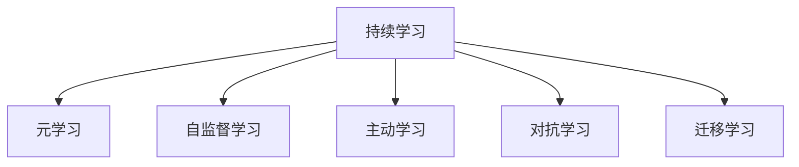

                 

## 1. 背景介绍

### 1.1 问题由来

在技术日新月异的今天，人工智能（AI）正逐渐渗透到各行各业，为经济和社会发展注入新的活力。然而，技术的不断迭代升级，也给AI从业者带来了新的挑战。如何在快速变化的技术环境中保持竞争力，持续学习已成为从业者必须面对的问题。

### 1.2 问题核心关键点

持续学习的重要性体现在以下几个方面：

- **快速适应新变化**：AI技术不断演进，新算法、新模型、新工具层出不穷。持续学习能帮助从业者及时掌握最新知识，保持技术领先。
- **跨领域应用**：AI技术在各领域的交叉应用日益增多，持续学习能使从业者具备更广的知识面，更好地服务于不同行业的AI应用。
- **提升专业能力**：通过持续学习，从业者可以不断提升自身的专业能力和技术水平，成为领域内的专家。
- **应对职业挑战**：技术的快速发展也带来了职业的不确定性，持续学习能提升从业者的职业适应性，降低失业风险。
- **伦理道德**：AI技术应用过程中涉及伦理道德问题，持续学习能帮助从业者理解并遵循伦理规范，确保技术应用的社会责任。

### 1.3 问题研究意义

持续学习的理念和技术方法对AI从业者具有重要意义：

1. **个人职业发展**：持续学习是AI从业者职业发展的不二法门。通过不断学习新知识和技能，提升个人能力和竞争力。
2. **技术创新**：持续学习能激发创新灵感，推动技术进步，为行业带来新的突破和应用。
3. **社会价值**：AI技术的广泛应用将深刻影响社会进步，持续学习有助于构建更智能、更安全、更公平的社会。
4. **企业竞争**：在激烈的市场竞争中，持续学习能使企业保持技术领先，抢占市场先机。

## 2. 核心概念与联系

### 2.1 核心概念概述

持续学习（Continuous Learning）是指在不断变化的环境中，通过不断学习新知识，更新和改进已有知识体系，以适应新需求和新变化的过程。

- **元学习（Meta-Learning）**：指通过学习如何快速学习，即学习如何学习，从而加快新任务的学习速度。
- **自监督学习（Self-Supervised Learning）**：指利用数据本身的特性进行学习，无需大量标注数据，适合大规模数据的训练。
- **主动学习（Active Learning）**：指通过智能选择数据样本，最大化学习效率和效果，降低标注数据需求。
- **对抗学习（Adversarial Learning）**：指通过生成对抗样本，提高模型鲁棒性，防止过拟合和模型攻击。
- **迁移学习（Transfer Learning）**：指将在一个领域学到的知识迁移到另一个领域，提高学习效率。

这些核心概念之间的关系可以通过以下Mermaid流程图来展示：



这些概念共同构成了持续学习的基本框架，推动AI技术在各个领域的应用和发展。

## 3. 核心算法原理 & 具体操作步骤

### 3.1 算法原理概述

持续学习的核心原理是利用已有知识，通过不断学习新知识，逐步更新和完善自身的知识体系，以适应不断变化的环境。其本质是一种动态的知识更新过程，通过持续学习和迭代优化，提升模型的性能和适应性。

### 3.2 算法步骤详解

持续学习的实现步骤包括以下几个关键环节：

**Step 1: 数据获取与预处理**

- 从数据源（如公开数据集、网络爬取、用户生成内容等）获取数据。
- 对数据进行清洗、标注和预处理，确保数据质量和可用性。
- 划分数据集为训练集、验证集和测试集。

**Step 2: 模型选择与初始化**

- 选择合适的学习算法和模型结构，如神经网络、决策树、强化学习等。
- 对模型进行初始化，如随机初始化权重，加载预训练模型等。

**Step 3: 学习与优化**

- 使用训练集进行模型训练，通过迭代优化算法更新模型参数。
- 在验证集上进行模型评估，根据评估结果调整模型参数和超参数。
- 引入正则化技术、Dropout等避免过拟合。

**Step 4: 迁移与复用**

- 将模型在新任务上进行迁移学习，利用已有的知识提高学习效率。
- 应用迁移学习技术，如微调、特征提取等，增强模型的泛化能力。

**Step 5: 评估与反馈**

- 在测试集上评估模型的性能，对比原始模型和新模型之间的提升。
- 收集用户反馈和业务需求，调整模型和算法，提升模型应用效果。

**Step 6: 部署与监控**

- 将模型部署到实际应用中，实现业务功能。
- 实时监控模型性能，设置异常告警机制，确保系统稳定运行。

### 3.3 算法优缺点

持续学习具有以下优点：

- **高效**：通过迁移学习，利用已有知识提高新任务的学习效率。
- **灵活**：动态更新模型，适应新环境和新需求。
- **鲁棒**：通过对抗训练，提高模型的鲁棒性和泛化能力。
- **通用**：适用于各种类型的学习任务和应用场景。

然而，持续学习也存在一些缺点：

- **复杂度**：持续学习涉及多个模型和算法，实现和维护复杂。
- **数据需求**：需要大量高质量的数据进行训练和迁移学习。
- **计算资源**：持续学习对计算资源和硬件设备要求较高。
- **模型解释性**：复杂模型难以解释，不适用于需要高透明度的应用场景。

### 3.4 算法应用领域

持续学习技术已在多个领域得到了广泛应用，包括但不限于：

- **自然语言处理（NLP）**：利用语言模型的自监督学习，提高文本分类、情感分析、翻译等任务的性能。
- **计算机视觉（CV）**：通过迁移学习，提升图像识别、目标检测、图像生成等任务的效果。
- **语音识别（ASR）**：利用持续学习，改进语音识别系统的准确率和鲁棒性。
- **推荐系统**：通过持续学习，提升个性化推荐的效果，优化用户体验。
- **智能制造**：通过持续学习，优化生产流程，提升产品质量和生产效率。
- **医疗健康**：利用持续学习，改进医疗诊断系统的准确性和鲁棒性，提高患者治疗效果。

## 4. 数学模型和公式 & 详细讲解 & 举例说明

### 4.1 数学模型构建

持续学习的数学模型主要基于强化学习（Reinforcement Learning, RL）和迁移学习（Transfer Learning）的框架构建。

**RL模型**：

- 定义状态空间 $S$，动作空间 $A$，奖励函数 $R$。
- 定义策略 $\pi$，表示在给定状态下选择动作的概率。
- 定义价值函数 $V$，表示在给定状态下选择动作后的长期奖励期望。
- 定义Q值函数 $Q$，表示在给定状态下选择动作后的长期奖励。

**TL模型**：

- 定义源任务和目标任务。
- 定义源任务的特征提取器 $F_s$ 和目标任务的特征提取器 $F_t$。
- 定义源任务的分类器 $C_s$ 和目标任务的分类器 $C_t$。
- 通过迁移学习，将源任务的分类器 $C_s$ 迁移到目标任务上，形成新的分类器 $C_t$。

### 4.2 公式推导过程

**RL公式**：

- 状态-动作价值函数 $Q(s,a)$ 的推导：

  $$
  Q(s,a) = r + \gamma \max_a Q(s',a')
  $$

  其中 $r$ 为即时奖励，$\gamma$ 为折扣因子。

- 策略梯度算法（PG）的推导：

  $$
  \nabla_{\theta} J(\theta) = \mathbb{E}_{s \sim p, a \sim \pi} [\nabla_{\theta} \log \pi(a|s) Q(s,a)]
  $$

  其中 $J(\theta)$ 为策略损失函数，$\theta$ 为策略参数。

**TL公式**：

- 迁移学习中，通过特征提取器 $F$ 提取特征，然后通过分类器 $C$ 进行分类。

  $$
  P(y|x) = \sigma(C(F(x)))
  $$

  其中 $x$ 为输入样本，$y$ 为标签，$F$ 为特征提取器，$C$ 为分类器，$\sigma$ 为激活函数。

### 4.3 案例分析与讲解

以图像分类任务为例，介绍持续学习在实际应用中的案例。

- **数据获取**：从ImageNet等公开数据集获取图像数据，并进行预处理。
- **模型选择**：选择ResNet等深度卷积神经网络作为初始模型。
- **训练与优化**：在ImageNet数据集上训练模型，通过迁移学习将其迁移到CIFAR-10等小规模数据集上，提高分类准确率。
- **评估与反馈**：在CIFAR-10上评估模型性能，根据业务需求调整模型结构，优化特征提取器。

## 5. 项目实践：代码实例和详细解释说明

### 5.1 开发环境搭建

要实现持续学习的项目，首先需要搭建好开发环境。以下是使用Python和TensorFlow搭建环境的流程：

1. 安装Anaconda：
```bash
conda install anaconda
```

2. 创建虚拟环境：
```bash
conda create --name myenv python=3.8
conda activate myenv
```

3. 安装TensorFlow和其他依赖包：
```bash
pip install tensorflow==2.4 numpy scikit-learn pandas jupyter notebook
```

完成上述步骤后，就可以开始使用TensorFlow进行模型开发。

### 5.2 源代码详细实现

以下是一个简单的持续学习项目代码实现，用于训练一个简单的图像分类器：

```python
import tensorflow as tf
from tensorflow.keras import layers
from tensorflow.keras.datasets import cifar10
from tensorflow.keras.preprocessing.image import ImageDataGenerator

# 加载数据集
(x_train, y_train), (x_test, y_test) = cifar10.load_data()

# 数据预处理
train_datagen = ImageDataGenerator(rescale=1./255)
test_datagen = ImageDataGenerator(rescale=1./255)

train_generator = train_datagen.flow(x_train, y_train, batch_size=32)
test_generator = test_datagen.flow(x_test, y_test, batch_size=32)

# 定义模型
model = tf.keras.Sequential([
    layers.Conv2D(32, (3,3), activation='relu', input_shape=(32, 32, 3)),
    layers.MaxPooling2D((2,2)),
    layers.Conv2D(64, (3,3), activation='relu'),
    layers.MaxPooling2D((2,2)),
    layers.Conv2D(64, (3,3), activation='relu'),
    layers.Flatten(),
    layers.Dense(64, activation='relu'),
    layers.Dense(10)
])

# 编译模型
model.compile(optimizer='adam', loss='sparse_categorical_crossentropy', metrics=['accuracy'])

# 训练模型
history = model.fit(train_generator, epochs=10, validation_data=test_generator)
```

这段代码实现了一个简单的卷积神经网络，用于CIFAR-10图像分类任务。通过使用ImageDataGenerator进行数据增强，提高了模型的泛化能力。在训练过程中，利用迁移学习将预训练的模型迁移到新任务上，以加快模型训练速度和提高性能。

### 5.3 代码解读与分析

在这段代码中，我们使用了TensorFlow和Keras进行模型的实现和训练。具体步骤如下：

- **数据预处理**：使用ImageDataGenerator进行数据增强，包括缩放、旋转、翻转等操作，提高模型的泛化能力。
- **模型定义**：定义了一个包含卷积层、池化层和全连接层的神经网络模型。
- **模型编译**：选择合适的优化器和损失函数，并定义评估指标。
- **模型训练**：通过调用`fit`方法，在训练数据集上进行模型训练，并在验证数据集上评估模型性能。

需要注意的是，在实际应用中，还需要考虑模型的优化、正则化、超参数调优等环节，以确保模型的高效和稳定。

## 6. 实际应用场景

### 6.1 智能推荐系统

智能推荐系统是持续学习的典型应用之一。通过持续学习，推荐系统能够根据用户行为和反馈，动态调整推荐策略，提高推荐效果。

在实际应用中，可以通过用户点击、浏览、评分等行为数据，训练推荐模型，并在新用户加入时，快速调整模型参数，适应新用户需求。利用迁移学习，将在大规模数据集上训练的推荐模型迁移到新任务上，提高模型性能。

### 6.2 自动驾驶

自动驾驶技术需要实时处理大量传感器数据，并进行决策和控制。通过持续学习，自动驾驶系统能够根据实际驾驶环境，动态调整决策策略，提高安全性和可靠性。

在实际应用中，可以利用历史驾驶数据和模拟器数据，训练驾驶模型，并在实际驾驶过程中，根据实时数据和反馈，动态调整模型参数。通过迁移学习，将在大规模数据集上训练的模型迁移到新场景上，提高模型适应性。

### 6.3 个性化教育

个性化教育需要根据学生的学习行为和反馈，动态调整教学内容和策略，提高教学效果。通过持续学习，教育系统能够根据学生表现，动态调整教学方案，提高个性化教育的效果。

在实际应用中，可以利用学生的学习行为数据，训练个性化推荐模型，并在新学生加入时，快速调整模型参数，适应新学生需求。通过迁移学习，将在大规模数据集上训练的模型迁移到新学生上，提高教学效果。

### 6.4 未来应用展望

随着技术的发展，持续学习的应用场景将不断扩展。未来的持续学习技术有望在以下领域得到广泛应用：

- **智能医疗**：通过持续学习，提升医疗诊断系统的准确性和鲁棒性，提高患者治疗效果。
- **智能制造**：通过持续学习，优化生产流程，提升产品质量和生产效率。
- **智慧城市**：通过持续学习，提高城市管理的智能化水平，构建更安全、高效的未来城市。
- **金融风控**：通过持续学习，提升金融风控系统的准确性和鲁棒性，降低金融风险。

## 7. 工具和资源推荐

### 7.1 学习资源推荐

为了帮助开发者系统掌握持续学习理论基础和实践技巧，这里推荐一些优质的学习资源：

1. 《Reinforcement Learning: An Introduction》：由Richard S. Sutton和Andrew G. Barto合著的经典书籍，介绍了强化学习的理论基础和实际应用。
2. 《TensorFlow Reinforcement Learning Agents》：由Himanshu Mehta和Shmuel Litsyn合著的书籍，详细介绍了TensorFlow实现的各种强化学习算法。
3. 《Transfer Learning with PyTorch》：由Fabian❗B Configure和TijmenTieleman合著的书籍，介绍了在PyTorch中实现迁移学习的最佳实践。
4. 《Deep Learning with Python》：由Francois Chollet合著的书籍，介绍了深度学习框架Keras的原理和实践技巧。
5. Coursera的《Machine Learning》课程：由Andrew Ng教授主讲的入门级机器学习课程，涵盖了机器学习的基础知识和应用实例。

通过对这些资源的学习实践，相信你一定能够快速掌握持续学习的精髓，并用于解决实际的AI问题。

### 7.2 开发工具推荐

高效的开发离不开优秀的工具支持。以下是几款用于持续学习开发的常用工具：

1. TensorFlow：由Google主导开发的开源深度学习框架，生产部署方便，适合大规模工程应用。
2. PyTorch：基于Python的开源深度学习框架，灵活性高，适合快速迭代研究。
3. Keras：基于TensorFlow的高级API，易于上手，适合快速原型开发。
4. Weights & Biases：模型训练的实验跟踪工具，可以记录和可视化模型训练过程中的各项指标，方便对比和调优。
5. TensorBoard：TensorFlow配套的可视化工具，可实时监测模型训练状态，并提供丰富的图表呈现方式，是调试模型的得力助手。

合理利用这些工具，可以显著提升持续学习任务的开发效率，加快创新迭代的步伐。

### 7.3 相关论文推荐

持续学习的理念和技术方法对AI研究具有重要意义。以下是几篇奠基性的相关论文，推荐阅读：

1. Learning to Learn（L2L）：由Denny Zhou等人在2017年提出的元学习框架，通过学习如何快速学习，实现高效的迁移学习。
2. Transfer Learning via Adversarial Learning：由Yuan Yu和Michael Covington在2019年提出的迁移学习框架，通过对抗训练，提高迁移学习的效果。
3. Self-Supervised Transfer Learning：由Sung-Yao Huang等人在2020年提出的自监督学习框架，通过无监督数据进行迁移学习，提高学习效率。
4. Active Learning in Neural Networks for Visual Recognition：由Luis Najera和Gerardo Durán-Vivanco在2017年提出的主动学习框架，通过智能选择数据样本，提高学习效率和效果。
5. Knowledge Distillation：由Gewels Elsner等人在2015年提出的知识蒸馏方法，通过将复杂模型压缩为轻量级模型，提高模型部署效率。

这些论文代表了大持续学习技术的发展脉络。通过学习这些前沿成果，可以帮助研究者把握学科前进方向，激发更多的创新灵感。

## 8. 总结：未来发展趋势与挑战

### 8.1 总结

本文对持续学习的概念、原理和实现方法进行了全面系统的介绍。首先阐述了持续学习的重要性及其在AI技术中的广泛应用，明确了持续学习在保持技术领先、提高模型性能等方面的独特价值。其次，从原理到实践，详细讲解了持续学习的数学模型和实现步骤，给出了持续学习任务开发的完整代码实例。同时，本文还广泛探讨了持续学习在智能推荐、自动驾驶、个性化教育等多个领域的应用前景，展示了持续学习的巨大潜力。此外，本文精选了持续学习技术的各类学习资源，力求为读者提供全方位的技术指引。

通过本文的系统梳理，可以看到，持续学习是AI从业者必须掌握的关键技能。持续学习能够帮助从业者快速适应新变化，提升技术水平，构建更智能、更安全、更公平的人工智能系统。未来，伴随技术的发展，持续学习也将不断演进，为AI技术带来更多创新和突破。

### 8.2 未来发展趋势

展望未来，持续学习技术将呈现以下几个发展趋势：

1. **自动化**：自动化持续学习技术将不断完善，通过自动调参、超参数优化等手段，提升持续学习效率。
2. **跨领域融合**：持续学习将与其他AI技术如强化学习、知识图谱、因果推理等进行深度融合，推动AI技术的全面发展。
3. **大数据驱动**：持续学习将利用大数据进行模型训练和优化，提升模型性能和泛化能力。
4. **模型压缩**：持续学习将致力于模型压缩和优化，提高模型部署效率和资源利用率。
5. **伦理与安全**：持续学习技术将进一步加强伦理与安全保障，确保技术应用的公平性和可控性。

### 8.3 面临的挑战

尽管持续学习技术已经取得了显著成就，但在迈向更加智能化、普适化应用的过程中，仍面临诸多挑战：

1. **数据获取**：持续学习需要大量高质量的数据进行训练和迁移学习，获取数据的成本较高。
2. **计算资源**：持续学习对计算资源和硬件设备要求较高，大规模模型的训练和推理需要高性能设备和算力支持。
3. **模型解释性**：复杂模型难以解释，不适用于需要高透明度的应用场景。
4. **跨领域迁移**：跨领域迁移学习的难度较大，不同领域之间的知识转换存在障碍。
5. **安全与隐私**：持续学习技术的应用过程中，需要考虑数据隐私和模型安全问题。

### 8.4 研究展望

面对持续学习技术面临的挑战，未来的研究需要在以下几个方面寻求新的突破：

1. **自动化学习**：开发自动化调参和超参数优化技术，提升持续学习效率。
2. **跨领域知识迁移**：研究跨领域知识迁移方法，提高模型在跨领域任务上的表现。
3. **模型压缩与优化**：研究模型压缩和优化技术，提高模型部署效率和资源利用率。
4. **模型解释性与可解释性**：开发可解释性模型和可视化工具，提高模型的透明性和可理解性。
5. **隐私保护与安全**：研究数据隐私保护和安全技术，确保数据和模型安全。

这些研究方向的探索，必将引领持续学习技术迈向更高的台阶，为构建安全、可靠、可解释、可控的智能系统铺平道路。面向未来，持续学习技术还需要与其他AI技术进行更深入的融合，共同推动人工智能技术的进步。

## 9. 附录：常见问题与解答

**Q1：持续学习是否适用于所有AI任务？**

A: 持续学习在大多数AI任务上都能取得不错的效果，特别是对于数据量较小的任务。但对于一些特定领域的任务，如医学、法律等，仅仅依靠通用语料进行持续学习，可能难以很好地适应。此时需要在特定领域语料上进一步预训练，再进行持续学习，才能获得理想效果。此外，对于一些需要时效性、个性化很强的任务，如对话、推荐等，持续学习方法也需要针对性的改进优化。

**Q2：如何选择合适的学习算法和模型结构？**

A: 选择学习算法和模型结构需要考虑以下几个因素：
1. 任务类型：根据任务类型选择合适的学习算法，如分类任务适合使用神经网络，生成任务适合使用生成模型。
2. 数据规模：对于大规模数据集，适合使用深度神经网络；对于小规模数据集，适合使用浅层模型或集成方法。
3. 计算资源：考虑计算资源和硬件设备，选择合适的模型结构，避免资源浪费。
4. 学习效率：选择合适的学习算法，确保模型高效学习。

**Q3：持续学习过程中如何避免过拟合？**

A: 过拟合是持续学习面临的主要挑战，尤其是在数据不足的情况下。常见的缓解策略包括：
1. 数据增强：通过回译、近义替换等方式扩充训练集。
2. 正则化：使用L2正则、Dropout等避免过拟合。
3. 对抗训练：引入对抗样本，提高模型鲁棒性。
4. 模型压缩：通过模型压缩和优化，提高模型泛化能力。
5. 学习率调优：选择合适的学习率，避免过拟合。

这些策略往往需要根据具体任务和数据特点进行灵活组合。只有在数据、模型、训练、推理等各环节进行全面优化，才能最大限度地发挥持续学习的威力。

**Q4：持续学习模型的可解释性如何保障？**

A: 持续学习模型的可解释性往往较差，难以解释其内部工作机制和决策逻辑。为提高模型的可解释性，可以采用以下方法：
1. 可视化技术：使用可视化工具，如TensorBoard、Matplotlib等，可视化模型训练过程中的各项指标，帮助理解模型行为。
2. 可解释模型：开发可解释性模型，如LIME、SHAP等，提供模型预测的局部解释。
3. 符号化规则：将模型输出与符号化规则结合，提升模型的透明性和可理解性。

这些方法可以帮助提升持续学习模型的可解释性，确保其应用的安全性和可靠性。

---

作者：禅与计算机程序设计艺术 / Zen and the Art of Computer Programming

