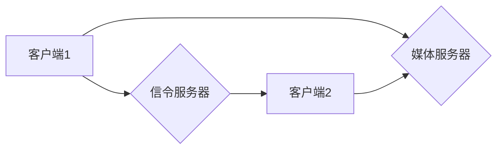

                 

## WebRTC信令服务器优化

> 关键词：WebRTC, 信令服务器, 优化, 性能, 扩展性, 延迟, 负载均衡, 

## 1. 背景介绍

WebRTC（Web Real-Time Communication）是一种开源的浏览器API，它允许网页直接进行实时通信，无需插件或下载额外的软件。WebRTC技术涵盖了语音、视频、数据传输等多种功能，为实时应用提供了强大的支持。

WebRTC通信的核心是信令服务器，它负责建立和管理媒体流的连接。信令服务器扮演着重要的角色，它负责：

* **连接管理:** 协调客户端之间的连接，建立和维护媒体流的路径。
* **媒体流控制:** 控制媒体流的类型、编码格式、带宽等参数。
* **用户身份验证:** 验证用户的身份，确保通信的安全性和可靠性。
* **房间管理:** 管理多用户实时通信的房间，分配资源和控制用户权限。

随着WebRTC应用的普及，信令服务器面临着日益增长的压力。传统的信令服务器架构难以满足高并发、低延迟、高可靠性的需求。因此，优化WebRTC信令服务器成为一个重要的研究方向。

## 2. 核心概念与联系

### 2.1 WebRTC架构

WebRTC通信架构主要由以下几个部分组成：

* **客户端:** 用户使用的浏览器或应用程序，负责发起和接收媒体流。
* **媒体流:** 音频、视频或数据等实时信息流。
* **信令服务器:** 负责管理媒体流的连接和控制。
* **媒体服务器:** 负责处理媒体流的转发和处理。

### 2.2 信令服务器角色

信令服务器是WebRTC通信的关键组件，它负责协调客户端之间的连接，管理媒体流的建立和维护。信令服务器的主要功能包括：

* **SDP协商:** 客户端通过信令服务器交换SDP（Session Description Protocol）信息，协商媒体流的类型、编码格式、带宽等参数。
* **ICE协商:** 客户端通过信令服务器进行ICE（Interactive Connectivity Establishment）协商，寻找最佳的网络路径进行媒体流传输。
* **媒体流控制:** 信令服务器可以控制媒体流的类型、编码格式、带宽等参数，以适应不同的网络环境和应用场景。
* **用户身份验证:** 信令服务器可以验证用户的身份，确保通信的安全性和可靠性。

### 2.3 信令服务器架构

常见的信令服务器架构包括：

* **单机架构:** 所有信令逻辑运行在单个服务器上，简单易部署，但缺乏扩展性。
* **分布式架构:** 将信令逻辑分布在多个服务器上，提高了系统的扩展性和可靠性。
* **云原生架构:** 基于云计算平台部署的信令服务器，具有弹性伸缩、高可用性等优势。

**Mermaid 流程图**



## 3. 核心算法原理 & 具体操作步骤

### 3.1 算法原理概述

WebRTC信令服务器的优化主要涉及以下几个方面的算法：

* **连接管理算法:** 负责高效地建立和维护媒体流的连接，降低延迟和丢包率。
* **负载均衡算法:** 将信令请求分配到不同的服务器上，提高系统的吞吐量和可用性。
* **消息处理算法:** 负责高效地处理信令消息，降低服务器的响应时间。

### 3.2 算法步骤详解

**连接管理算法:**

1. 客户端发起连接请求，包含SDP信息和ICE候选地址。
2. 信令服务器接收请求，解析SDP信息，并根据ICE候选地址选择最佳的连接路径。
3. 信令服务器向客户端返回连接信息，包括媒体服务器地址和端口号。
4. 客户端连接到媒体服务器，开始传输媒体流。

**负载均衡算法:**

1. 信令服务器接收客户端请求，根据请求的类型、来源等信息，选择合适的服务器进行处理。
2. 服务器之间通过心跳机制保持连接，并定期交换负载信息。
3. 信令服务器根据负载信息，动态调整请求分配策略，确保每个服务器的负载均衡。

**消息处理算法:**

1. 信令服务器接收信令消息，根据消息类型进行处理。
2. 对于需要处理的信令消息，信令服务器会进行相应的逻辑操作，例如验证用户身份、更新媒体流状态等。
3. 处理完成后，信令服务器会向客户端返回响应消息。

### 3.3 算法优缺点

**连接管理算法:**

* **优点:** 能够快速建立连接，降低延迟。
* **缺点:** 对于复杂的网络环境，可能无法选择最佳的连接路径。

**负载均衡算法:**

* **优点:** 提高系统的吞吐量和可用性。
* **缺点:** 需要复杂的算法和机制，增加系统的复杂度。

**消息处理算法:**

* **优点:** 能够高效地处理信令消息，降低服务器的响应时间。
* **缺点:** 需要对信令协议有深入的了解，才能设计高效的处理算法。

### 3.4 算法应用领域

WebRTC信令服务器的优化算法广泛应用于各种实时通信场景，例如：

* **视频会议:** 优化连接管理和负载均衡算法，确保视频会议的流畅性和稳定性。
* **在线游戏:** 优化连接管理和消息处理算法，降低游戏延迟和丢包率。
* **实时聊天:** 优化消息处理算法，提高聊天室的响应速度和用户体验。

## 4. 数学模型和公式 & 详细讲解 & 举例说明

### 4.1 数学模型构建

信令服务器的优化可以利用数学模型进行分析和设计。例如，可以构建一个网络延迟模型，来分析不同连接路径的延迟情况。

**网络延迟模型:**

$$
delay = RTT + jitter + bufferbloat
$$

其中：

* **RTT:** Round-Trip Time，即数据从客户端发送到服务器并返回的往返时间。
* **jitter:** 延迟抖动，指网络延迟在不同时间段的波动。
* **bufferbloat:** 缓冲膨胀，指网络缓冲区过大导致的延迟。

### 4.2 公式推导过程

网络延迟模型的推导过程可以参考网络协议和传输机制的相关文献。例如，RTT可以根据网络带宽和数据包大小进行计算，jitter可以通过分析网络流量的波动情况进行估计，bufferbloat可以通过分析网络缓冲区的大小和填充情况进行计算。

### 4.3 案例分析与讲解

假设有两个连接路径，路径A的RTT为100ms，jitter为10ms，bufferbloat为5ms；路径B的RTT为200ms，jitter为5ms，bufferbloat为10ms。根据网络延迟模型，我们可以计算出两个路径的总延迟：

* 路径A的总延迟：100ms + 10ms + 5ms = 115ms
* 路径B的总延迟：200ms + 5ms + 10ms = 215ms

从计算结果可以看出，路径A的总延迟低于路径B，因此在选择连接路径时，应该优先选择路径A。

## 5. 项目实践：代码实例和详细解释说明

### 5.1 开发环境搭建

WebRTC信令服务器的开发环境搭建需要以下软件和工具：

* **操作系统:** Linux、macOS或Windows
* **编程语言:** JavaScript、Python、Go等
* **Web服务器:** Nginx、Apache等
* **数据库:** MySQL、MongoDB等
* **WebRTC库:** Janus、Kurento等

### 5.2 源代码详细实现

以下是一个简单的WebRTC信令服务器的源代码示例，使用Node.js和Express框架实现：

```javascript
const express = require('express');
const app = express();
const port = 3000;

app.get('/offer', (req, res) => {
  // 处理SDP offer消息
});

app.post('/answer', (req, res) => {
  // 处理SDP answer消息
});

app.listen(port, () => {
  console.log(`信令服务器启动成功，监听端口 ${port}`);
});
```

### 5.3 代码解读与分析

* **依赖:** 代码首先引入Express框架，用于构建Web服务器。
* **路由:** 代码定义了两个路由，`/offer`用于处理SDP offer消息，`/answer`用于处理SDP answer消息。
* **处理逻辑:** 每个路由对应一个处理函数，负责解析信令消息并进行相应的处理操作。
* **启动服务器:** 代码最后启动Web服务器，监听指定端口。

### 5.4 运行结果展示

运行上述代码后，可以访问`http://localhost:3000`查看信令服务器的运行状态。

## 6. 实际应用场景

### 6.1 视频会议

WebRTC信令服务器在视频会议场景中扮演着重要的角色，它负责协调参与者的连接，管理媒体流的传输，确保视频会议的流畅性和稳定性。

### 6.2 在线游戏

WebRTC信令服务器在在线游戏中用于管理玩家之间的连接，同步游戏状态，降低延迟和丢包率，提高游戏体验。

### 6.3 实时聊天

WebRTC信令服务器在实时聊天场景中用于管理聊天室的连接，处理用户的消息发送和接收，确保聊天室的实时性和可靠性。

### 6.4 未来应用展望

随着WebRTC技术的不断发展，信令服务器将在更多领域得到应用，例如：

* **远程医疗:** 远程医疗平台可以使用WebRTC信令服务器进行视频咨询、远程诊断等。
* **远程教育:** 远程教育平台可以使用WebRTC信令服务器进行在线课堂、远程辅导等。
* **工业自动化:** 工业自动化系统可以使用WebRTC信令服务器进行设备监控、远程控制等。

## 7. 工具和资源推荐

### 7.1 学习资源推荐

* **WebRTC官方文档:** https://webrtc.org/
* **WebRTC入门教程:** https://developer.mozilla.org/en-US/docs/Web/API/WebRTC_API
* **WebRTC书籍:** 《WebRTC: The Definitive Guide》

### 7.2 开发工具推荐

* **Janus:** https://janus.conftel.com/
* **Kurento:** https://kurento.org/
* **Signaling Server:** https://github.com/webrtc/samples/tree/main/src/signaling-server

### 7.3 相关论文推荐

* **WebRTC: A New Communication Paradigm**
* **Scalable WebRTC Signaling with Redis**
* **Optimizing WebRTC for Low-Latency Applications**

## 8. 总结：未来发展趋势与挑战

### 8.1 研究成果总结

WebRTC信令服务器的优化研究取得了显著成果，例如：

* **连接管理算法:** 提高了连接建立速度和稳定性。
* **负载均衡算法:** 提高了系统的吞吐量和可用性。
* **消息处理算法:** 降低了服务器的响应时间和资源消耗。

### 8.2 未来发展趋势

WebRTC信令服务器的未来发展趋势包括：

* **更智能的连接管理:** 基于机器学习和人工智能技术，实现更智能的连接管理，自动选择最佳的连接路径。
* **更强大的负载均衡:** 基于云计算和容器技术，实现更强大的负载均衡，提高系统的弹性和可扩展性。
* **更安全的信令协议:** 开发更安全的信令协议，保障用户隐私和数据安全。

### 8.3 面临的挑战

WebRTC信令服务器的优化仍然面临着一些挑战，例如：

* **网络环境复杂:** 不同网络环境下，信令服务器的性能表现可能会有很大差异。
* **安全性和隐私:** WebRTC信令服务器需要保障用户隐私和数据安全。
* **成本控制:** 随着系统的规模扩大，信令服务器的成本也会随之增加。

### 8.4 研究展望

未来，WebRTC信令服务器的优化研究将继续深入，探索更智能、更安全、更可扩展的解决方案，为实时通信应用提供更强大的支持。

## 9. 附录：常见问题与解答

### 9.1  常见问题

* **WebRTC信令服务器的部署方式有哪些？**
* **如何选择合适的WebRTC信令服务器架构？**
* **如何优化WebRTC信令服务器的性能？**
* **如何保障WebRTC信令服务器的安全性和隐私？**

### 9.2  解答

* **WebRTC信令服务器的部署方式:** 单机架构、分布式架构、云原生架构等。
* **选择合适的WebRTC信令服务器架构:** 需要根据应用场景、规模、性能需求等因素进行选择。
* **优化WebRTC信令服务器的性能:** 可以通过优化连接管理算法、负载均衡算法、消息处理算法等方式进行优化。
* **保障WebRTC信令服务器的安全性和隐私:** 可以通过使用安全的信令协议、加密通信、身份验证等机制进行保障。


作者：禅与计算机程序设计艺术 / Zen and the Art of Computer Programming 
<end_of_turn>

