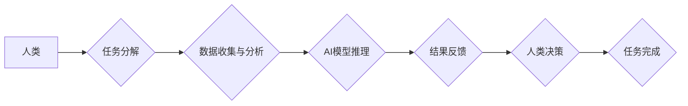

                 

## 人机协同：共谱智能时代新篇章

> 关键词： 人机协同、人工智能、协作学习、智能增强、未来工作

### 1. 背景介绍

人工智能（AI）技术的飞速发展，正在深刻地改变着人类社会各个领域。从自动驾驶到医疗诊断，从个性化教育到金融风控，AI的应用场景日益广泛，其带来的效率提升和价值创造不容忽视。然而，AI技术也面临着一些挑战，例如数据依赖、算法黑盒化、伦理道德等。

在这样的背景下，人机协同成为一个备受关注的议题。人机协同是指人类和人工智能系统在共同的目标下进行合作，发挥各自优势，实现协同增效的模式。它强调的是人与机器的互补和融合，而不是简单的替代关系。

### 2. 核心概念与联系

人机协同的核心概念包括：

* **智能增强 (AI Augmentation):** 人工智能技术增强人类能力，帮助人类更高效地完成工作，提高决策质量。
* **协作学习 (Collaborative Learning):** 人类和人工智能系统共同学习，互相补充，不断提升自身的智能水平。
* **共享认知 (Shared Cognition):** 人类和人工智能系统建立共同的知识表示和理解，实现信息共享和协同决策。

**Mermaid 流程图**



### 3. 核心算法原理 & 具体操作步骤

#### 3.1  算法原理概述

人机协同的核心算法原理主要包括：

* **强化学习 (Reinforcement Learning):** 人工智能系统通过与环境交互，学习最佳的策略，实现目标的优化。
* **迁移学习 (Transfer Learning):** 利用已有的知识和经验，迁移到新的任务或领域，提高学习效率。
* **知识图谱 (Knowledge Graph):** 建立知识的结构化表示，方便人类和人工智能系统进行知识共享和推理。

#### 3.2  算法步骤详解

以强化学习为例，其具体操作步骤如下：

1. **环境建模:** 建立模拟真实世界的环境模型，定义状态、动作、奖励等要素。
2. **策略学习:** 利用强化学习算法，例如Q-learning或Deep Q-Network，训练人工智能系统学习最佳的策略，以最大化奖励。
3. **策略评估:** 通过仿真或实际测试，评估人工智能系统的策略效果，并进行调整优化。
4. **人机交互:** 人类可以与人工智能系统进行交互，提供反馈信息，帮助其学习和改进。

#### 3.3  算法优缺点

**优点:**

* 能够学习复杂的任务，并不断优化策略。
* 适应性强，能够应对变化的环境。
* 能够实现智能增强，提高人类效率。

**缺点:**

* 需要大量的训练数据和计算资源。
* 算法训练过程复杂，需要专业知识。
* 存在安全性和伦理风险。

#### 3.4  算法应用领域

强化学习在以下领域有广泛的应用：

* **机器人控制:** 训练机器人完成复杂的任务，例如导航、抓取、组装等。
* **游戏 AI:** 开发智能游戏对手，提高游戏体验。
* **推荐系统:** 建立个性化的推荐系统，提高用户满意度。
* **金融交易:** 开发智能交易策略，优化投资回报。

### 4. 数学模型和公式 & 详细讲解 & 举例说明

#### 4.1  数学模型构建

强化学习的核心数学模型是**状态-动作-奖励 (SARSA)**模型。

* **状态 (State):** 环境的当前状态，例如机器人的位置、游戏中的棋盘状态等。
* **动作 (Action):** 智能体在当前状态下可以采取的行动，例如机器人移动、游戏玩家下棋等。
* **奖励 (Reward):** 智能体采取某个动作后获得的反馈，可以是正向奖励或负向惩罚。

#### 4.2  公式推导过程

SARSA算法的目标是学习一个策略π，使得在执行策略π时，智能体获得最大的累积奖励。

**Bellman方程:**

$$
V^{\pi}(s) = \max_{a \in A} \left[ R(s, a) + \gamma \sum_{s' \in S} P(s' | s, a) V^{\pi}(s') \right]
$$

其中：

* $V^{\pi}(s)$ 是状态 $s$ 下执行策略 $\pi$ 的价值函数。
* $R(s, a)$ 是在状态 $s$ 执行动作 $a$ 后获得的奖励。
* $\gamma$ 是折扣因子，控制未来奖励的权重。
* $P(s' | s, a)$ 是从状态 $s$ 执行动作 $a$ 到状态 $s'$ 的转移概率。

#### 4.3  案例分析与讲解

例如，训练一个机器人学会在迷宫中导航。

* 状态：机器人的位置在迷宫中的某个格子。
* 动作：机器人可以向左、右、上、下移动。
* 奖励：到达终点获得最大奖励，撞墙或走回头路获得惩罚。

通过SARSA算法，机器人可以学习到最佳的导航策略，从而高效地到达终点。

### 5. 项目实践：代码实例和详细解释说明

#### 5.1  开发环境搭建

* Python 3.x
* TensorFlow 或 PyTorch 深度学习框架
* OpenAI Gym 或其他强化学习环境

#### 5.2  源代码详细实现

```python
import gym
import tensorflow as tf

# 定义环境
env = gym.make('CartPole-v1')

# 定义神经网络模型
model = tf.keras.models.Sequential([
    tf.keras.layers.Dense(128, activation='relu', input_shape=(4,)),
    tf.keras.layers.Dense(64, activation='relu'),
    tf.keras.layers.Dense(2, activation='softmax')
])

# 定义损失函数和优化器
loss_fn = tf.keras.losses.CategoricalCrossentropy()
optimizer = tf.keras.optimizers.Adam()

# 训练循环
for episode in range(1000):
    state = env.reset()
    done = False
    total_reward = 0

    while not done:
        # 选择动作
        action = tf.argmax(model(tf.expand_dims(state, 0))).numpy()[0]

        # 执行动作
        next_state, reward, done, _ = env.step(action)

        # 更新状态
        state = next_state

        # 计算损失
        with tf.GradientTape() as tape:
            prediction = model(tf.expand_dims(state, 0))
            loss = loss_fn(tf.one_hot(action, depth=2), prediction)

        # 反向传播
        gradients = tape.gradient(loss, model.trainable_variables)
        optimizer.apply_gradients(zip(gradients, model.trainable_variables))

        # 更新总奖励
        total_reward += reward

    print(f'Episode {episode+1}, Total Reward: {total_reward}')

# 保存模型
model.save('cartpole_model.h5')
```

#### 5.3  代码解读与分析

* 代码首先定义了强化学习环境和神经网络模型。
* 然后，训练循环中，智能体根据当前状态选择动作，执行动作后获得奖励和下一个状态。
* 利用损失函数和优化器，更新神经网络模型的参数，使其能够学习到最佳的策略。
* 最后，保存训练好的模型。

#### 5.4  运行结果展示

训练完成后，模型能够在CartPole环境中保持平衡杆的稳定时间更长。

### 6. 实际应用场景

#### 6.1  医疗诊断辅助

人机协同可以帮助医生更快、更准确地诊断疾病。例如，AI系统可以分析患者的影像数据，提供初步诊断建议，医生可以根据AI的建议进行进一步的检查和判断。

#### 6.2  个性化教育

AI系统可以根据学生的学习进度和特点，提供个性化的学习内容和辅导，帮助学生提高学习效率。

#### 6.3  金融风险管理

AI系统可以分析海量金融数据，识别潜在的风险，帮助金融机构进行风险控制和管理。

#### 6.4  未来应用展望

人机协同技术在未来将有更广泛的应用，例如：

* **自动驾驶:** 人工智能系统可以辅助驾驶员完成驾驶任务，提高驾驶安全性和效率。
* **远程医疗:** 人机协同可以帮助远程医疗平台提供更优质的医疗服务。
* **智能制造:** 人工智能系统可以帮助工厂实现自动化生产，提高生产效率和产品质量。

### 7. 工具和资源推荐

#### 7.1  学习资源推荐

* **书籍:**
    * 人机协同：未来工作的新范式
    * 人工智能：一种现代方法
* **在线课程:**
    * Coursera: 人工智能
    * edX: 深度学习
* **开源项目:**
    * TensorFlow
    * PyTorch

#### 7.2  开发工具推荐

* **编程语言:** Python
* **深度学习框架:** TensorFlow, PyTorch
* **强化学习库:** OpenAI Gym, Stable Baselines3

#### 7.3  相关论文推荐

* 人机协同学习: 现状与展望
* 人工智能与协作学习: 未来趋势
* 人机协同: 智能时代的机遇与挑战

### 8. 总结：未来发展趋势与挑战

#### 8.1  研究成果总结

人机协同技术取得了显著的进展，在多个领域展现出巨大的应用潜力。

#### 8.2  未来发展趋势

* **更智能的AI系统:** 人工智能系统的智能水平将不断提升，能够更好地理解人类意图和需求。
* **更紧密的协作:** 人类和人工智能系统之间的协作将更加紧密，形成更加高效的合作模式。
* **更广泛的应用场景:** 人机协同技术将应用于更多领域，例如医疗、教育、金融、交通等。

#### 8.3  面临的挑战

* **算法安全性和可靠性:** 人工智能系统的算法需要更加安全可靠，避免出现意外情况。
* **数据隐私和安全:** 人机协同需要处理大量数据，需要保障数据隐私和安全。
* **伦理道德问题:** 人机协同需要考虑伦理道德问题，例如责任归属、公平性等。

#### 8.4  研究展望

未来，人机协同技术将继续发展，并与其他新兴技术融合，例如虚拟现实、增强现实、区块链等，为人类社会带来更多福祉。

### 9. 附录：常见问题与解答

* **什么是人机协同?** 人机协同是指人类和人工智能系统在共同的目标下进行合作，发挥各自优势，实现协同增效的模式。
* **人机协同有哪些应用场景?** 人机协同的应用场景非常广泛，例如医疗诊断辅助、个性化教育、金融风险管理等。
* **人机协同技术面临哪些挑战?** 人机协同技术面临着算法安全性和可靠性、数据隐私和安全、伦理道德问题等挑战。


作者：禅与计算机程序设计艺术 / Zen and the Art of Computer Programming 
<end_of_turn>

