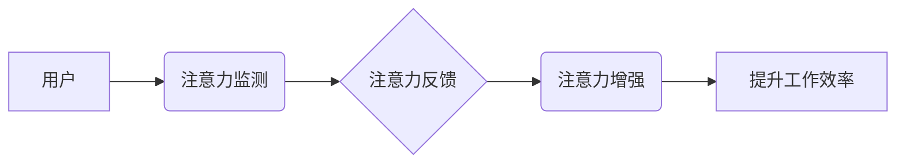

                 

## 人类注意力增强：提升专注力和注意力在商业中的未来发展机遇分析机遇挑战机遇趋势

> 关键词：注意力增强、专注力、深度学习、脑机接口、商业应用、未来趋势、挑战

## 1. 背景介绍

在当今信息爆炸的时代，人类面临着前所未有的注意力挑战。社交媒体、电子邮件、新闻推送等信息源不断地涌入，分散着我们的注意力，降低了我们的专注力。这不仅影响着我们的日常生活，也对商业发展产生了深远的影响。

注意力是人类认知的核心能力之一，它决定着我们学习、工作、创造的效率和质量。专注力是指能够将注意力集中在一个特定任务或目标上，排除干扰，持续一段时间的能力。良好的注意力和专注力对于个人和组织的成功至关重要。

然而，现代社会的信息环境和生活节奏却不断侵蚀着我们的注意力和专注力。研究表明，人类的平均注意力持续时间已经从 12 分钟缩短到 8 秒，这与金鱼的注意力持续时间相近。

注意力力的下降对商业产生了多重负面影响：

* **降低工作效率:** 分散的注意力会导致工作效率下降，任务完成时间延长，错误率增加。
* **影响决策质量:**  注意力不足会导致决策失误，无法全面考虑问题，做出最佳选择。
* **阻碍创新:**  专注力是创新思维的基础，注意力不足会限制创意的产生和发展。
* **降低客户体验:**  注意力不集中会导致服务质量下降，无法满足客户需求，影响客户满意度。

## 2. 核心概念与联系

**2.1 注意力增强**

注意力增强是指通过技术手段提升人类注意力和专注力的能力。它涵盖了多种技术和方法，包括：

* **脑机接口 (Brain-Computer Interface, BCI):** 通过传感器记录脑电信号，识别用户的注意力状态，并提供反馈或干预，帮助用户集中注意力。
* **神经反馈 (Neurofeedback):** 通过实时反馈用户的脑电活动，帮助用户学习控制自己的脑波，增强注意力。
* **认知训练 (Cognitive Training):** 通过专门设计的训练程序，锻炼用户的注意力、记忆力和执行功能等认知能力。
* **环境优化:** 通过调整工作环境，减少干扰，营造专注的氛围，帮助用户提高注意力。

**2.2 商业应用场景**

注意力增强技术在商业领域有着广泛的应用前景，例如：

* **提高员工工作效率:**  帮助员工集中注意力，提高工作效率，减少错误率。
* **提升客户体验:**  帮助客服人员集中注意力，更好地理解客户需求，提供更优质的服务。
* **增强营销效果:**  通过注意力增强技术，提高广告的吸引力和转化率。
* **促进创新:**  帮助研发人员集中注意力，提高创意的产生和发展。

**2.3 架构图**



## 3. 核心算法原理 & 具体操作步骤

### 3.1 算法原理概述

注意力增强算法通常基于深度学习技术，利用神经网络模型识别用户的注意力状态，并提供相应的反馈或干预。常见的算法包括：

* **卷积神经网络 (Convolutional Neural Network, CNN):**  用于提取脑电信号中的特征，识别注意力状态。
* **循环神经网络 (Recurrent Neural Network, RNN):**  用于分析时间序列数据，例如脑电信号，识别注意力变化的趋势。
* **强化学习 (Reinforcement Learning, RL):**  用于训练注意力增强系统，使其能够根据用户的注意力状态提供最有效的干预措施。

### 3.2 算法步骤详解

1. **数据采集:** 使用脑电传感器记录用户的脑电信号。
2. **数据预处理:** 对脑电信号进行滤波、去噪等预处理，去除无关信息。
3. **特征提取:** 使用CNN或RNN等算法提取脑电信号中的特征，例如脑波频率、脑波幅度等。
4. **注意力状态识别:** 使用分类算法，例如支持向量机 (SVM) 或随机森林 (RF)，识别用户的注意力状态，例如集中、分散、疲劳等。
5. **反馈或干预:** 根据用户的注意力状态，提供相应的反馈或干预措施，例如：
    * **视觉反馈:**  通过改变屏幕颜色、亮度等，提醒用户注意力的状态。
    * **音频反馈:**  播放提示音或音乐，帮助用户集中注意力。
    * **环境干预:**  调整工作环境，例如降低噪音、增加光线等，减少干扰。

### 3.3 算法优缺点

**优点:**

* **高精度:** 深度学习算法能够识别用户的注意力状态，并提供精准的反馈或干预。
* **可定制化:**  注意力增强系统可以根据用户的需求和环境进行定制化配置。
* **持续改进:**  通过收集用户数据，注意力增强系统可以不断学习和改进，提高其效果。

**缺点:**

* **成本高昂:**  开发和部署注意力增强系统需要大量的资金和技术资源。
* **隐私问题:**  注意力增强系统需要收集用户的脑电信号，存在隐私泄露的风险。
* **伦理问题:**  注意力增强技术可能会被滥用，例如控制用户的行为或思想。

### 3.4 算法应用领域

注意力增强算法在以下领域具有广泛的应用前景:

* **教育:**  帮助学生集中注意力，提高学习效率。
* **医疗:**  帮助患者治疗注意力缺陷多动障碍 (ADHD) 等注意力问题。
* **游戏:**  增强游戏玩家的沉浸感和体验。
* **安全:**  帮助驾驶员保持注意力，预防交通事故。

## 4. 数学模型和公式 & 详细讲解 & 举例说明

### 4.1 数学模型构建

注意力增强算法通常基于深度学习模型，例如 CNN 或 RNN。这些模型可以看作是复杂的数学函数，其输入是脑电信号，输出是注意力状态的预测值。

**4.1.1 CNN 模型**

CNN 模型利用卷积核提取脑电信号中的特征。卷积核可以看作是滤波器，它会扫描脑电信号，提取特定类型的特征。

**4.1.2 RNN 模型**

RNN 模型能够处理时间序列数据，例如脑电信号。RNN 模型的内部状态会随着时间的推移而变化，从而能够捕捉脑电信号中的动态变化。

### 4.2 公式推导过程

深度学习模型的训练过程涉及大量的数学公式，例如梯度下降算法、激活函数等。这些公式的推导过程比较复杂，需要一定的数学基础。

**4.2.1 梯度下降算法**

梯度下降算法是一种常用的优化算法，用于训练深度学习模型。其目标是找到模型参数的最佳值，使得模型的预测结果与实际值之间的误差最小化。

**公式:**

$$
\theta = \theta - \alpha \nabla L(\theta)
$$

其中：

* $\theta$ 是模型参数
* $\alpha$ 是学习率
* $\nabla L(\theta)$ 是损失函数 $L(\theta)$ 对参数 $\theta$ 的梯度

**4.2.2 激活函数**

激活函数是深度学习模型中的一种非线性函数，它能够引入非线性因素，使得模型能够学习更复杂的模式。常见的激活函数包括 sigmoid 函数、ReLU 函数等。

**公式:**

$$
f(x) = \begin{cases}
\frac{1}{1 + e^{-x}} & \text{sigmoid} \\
\max(0, x) & \text{ReLU}
\end{cases}
$$

### 4.3 案例分析与讲解

**4.3.1 脑电信号分类**

可以使用 CNN 模型对脑电信号进行分类，识别用户的注意力状态。例如，可以训练一个 CNN 模型，识别集中注意力、分散注意力和疲劳三种注意力状态。

**4.3.2 注意力反馈系统**

可以使用 RNN 模型构建一个注意力反馈系统，根据用户的脑电信号提供实时反馈。例如，当用户的注意力开始分散时，系统可以播放提示音或改变屏幕颜色，提醒用户集中注意力。

## 5. 项目实践：代码实例和详细解释说明

### 5.1 开发环境搭建

* **操作系统:**  Windows、macOS 或 Linux
* **编程语言:**  Python
* **深度学习框架:**  TensorFlow 或 PyTorch
* **脑电信号采集设备:**  EEG 头戴式传感器

### 5.2 源代码详细实现

以下是一个使用 TensorFlow 构建简单注意力增强系统的代码示例：

```python
import tensorflow as tf

# 定义 CNN 模型
model = tf.keras.models.Sequential([
    tf.keras.layers.Conv1D(filters=32, kernel_size=3, activation='relu', input_shape=(100, 1)),
    tf.keras.layers.MaxPooling1D(pool_size=2),
    tf.keras.layers.Flatten(),
    tf.keras.layers.Dense(10, activation='softmax')
])

# 编译模型
model.compile(optimizer='adam',
              loss='sparse_categorical_crossentropy',
              metrics=['accuracy'])

# 训练模型
model.fit(x_train, y_train, epochs=10)

# 预测注意力状态
predictions = model.predict(x_test)
```

### 5.3 代码解读与分析

* **模型定义:**  代码定义了一个简单的 CNN 模型，用于识别用户的注意力状态。
* **模型编译:**  代码编译了模型，指定了优化器、损失函数和评估指标。
* **模型训练:**  代码训练了模型，使用训练数据进行迭代训练。
* **模型预测:**  代码使用训练好的模型对测试数据进行预测，得到注意力状态的预测结果。

### 5.4 运行结果展示

训练完成后，可以评估模型的性能，例如准确率、召回率等。

## 6. 实际应用场景

### 6.1 教育领域

注意力增强技术可以帮助学生集中注意力，提高学习效率。例如，可以开发一款注意力增强应用程序，通过视觉反馈或音频提示，帮助学生保持专注，减少分心。

### 6.2 医疗领域

注意力增强技术可以帮助患者治疗注意力缺陷多动障碍 (ADHD) 等注意力问题。例如，可以使用脑机接口技术，训练患者控制自己的脑波，增强注意力。

### 6.3 游戏领域

注意力增强技术可以增强游戏玩家的沉浸感和体验。例如，可以开发一款游戏，根据玩家的注意力状态调整游戏难度，提供更具挑战性和趣味性的游戏体验。

### 6.4 未来应用展望

注意力增强技术在未来将有更广泛的应用前景，例如：

* **远程办公:**  帮助远程办公人员集中注意力，提高工作效率。
* **自动驾驶:**  帮助自动驾驶系统识别周围环境，提高安全性。
* **虚拟现实:**  增强虚拟现实体验，提高用户沉浸感。

## 7. 工具和资源推荐

### 7.1 学习资源推荐

* **书籍:**

    * 《深度学习》 (Deep Learning) - Ian Goodfellow, Yoshua Bengio, Aaron Courville
    * 《神经网络与深度学习》 (Neural Networks and Deep Learning) - Michael Nielsen

* **在线课程:**

    * Coursera: 深度学习 Specialization
    * Udacity: 
    * fast.ai: Practical Deep Learning for Coders

### 7.2 开发工具推荐

* **深度学习框架:** TensorFlow, PyTorch
* **脑电信号处理软件:** EEGLAB, Brainstorm

### 7.3 相关论文推荐

* **Attention is All You Need** - Vaswani et al. (2017)
* **Deep Learning for Brain-Computer Interfaces** - Blankertz et al. (2010)

## 8. 总结：未来发展趋势与挑战

### 8.1 研究成果总结

注意力增强技术近年来取得了显著进展，特别是深度学习技术的应用，使得注意力识别和反馈更加精准高效。

### 8.2 未来发展趋势

* **更精准的注意力识别:**  利用更先进的算法和传感器，识别更细粒度的注意力状态。
* **更个性化的干预措施:**  根据用户的不同需求和环境，提供更个性化的注意力增强干预。
* **更广泛的应用场景:**  注意力增强技术将应用于更多领域，例如教育、医疗、游戏、自动驾驶等。

### 8.3 面临的挑战

* **隐私问题:**  注意力增强系统需要收集用户的脑电信号，存在隐私泄露的风险。
* **伦理问题:**  注意力增强技术可能会被滥用，例如控制用户的行为或思想。
* **成本问题:**  开发和部署注意力增强系统需要大量的资金和技术资源。

### 8.4 研究展望

未来，注意力增强技术的研究将更加注重以下方面:

* **隐私保护:**  开发更加安全的注意力增强系统，保护用户的隐私。
* **伦理规范:**  制定更加完善的伦理规范，规范注意力增强技术的应用。
* **成本降低:**  降低注意力增强系统的开发和部署成本，使其更加普及。


## 9. 附录：常见问题与解答

**9.1 注意力增强技术是否安全？**

注意力增强技术目前尚处于发展阶段，其安全性需要进一步研究和评估。

**9.2 注意力增强技术是否会让人上瘾？**

注意力增强技术可能会让人产生依赖，但目前还没有确凿的证据表明它会让人上瘾。

**9.3 注意力增强技术是否适用于所有人？**

注意力增强技术可能对不同的人有不同的效果，并非所有人都适合使用。

**9.4 注意力增强技术会取代人类吗？**

注意力增强技术不会取代人类，而是可以帮助人类提高效率和能力。

**9.5 注意力增强技术的发展前景如何？**

注意力增强技术的发展前景非常广阔，它将深刻地改变我们的生活和工作方式。

作者：禅与计算机程序设计艺术 / Zen and the Art of Computer Programming


<end_of_turn>

