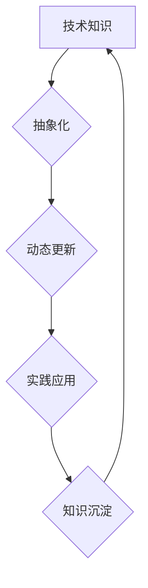

                 

## 人类知识的传承：一代代人的接力长跑

> 关键词：人工智能、知识传承、软件架构、算法、编程语言、技术发展、历史传承

### 1. 背景介绍

人类文明的进步离不开知识的传承。从古至今，一代代人通过口述、文字、图画等方式将宝贵的经验和智慧传递给后人，推动着社会的发展。在信息时代，计算机技术作为人类智慧的载体，扮演着越来越重要的角色。软件架构、算法、编程语言等技术成果，如同人类文明的“基因”，被一代代程序员传承和发扬，最终构建起我们今天所依赖的数字化世界。

然而，技术发展日新月异，知识更新速度也越来越快。如何有效地传承和传播技术知识，成为摆在我们面前的一项重要挑战。

### 2. 核心概念与联系

**2.1  知识传承的本质**

知识传承的核心在于将已有的知识以一种易于理解和应用的方式传递给下一代。这不仅仅是简单的复制和粘贴，更需要对知识进行提炼、总结、重构，使其更加清晰、简洁、易于传播。

**2.2  技术知识的特殊性**

技术知识的特点是：

* **高度抽象化:** 技术知识往往需要抽象出其背后的原理和规律，才能被理解和应用。
* **动态性强:** 技术发展日新月异，旧的技术会被淘汰，新的技术不断涌现，因此技术知识需要不断更新和迭代。
* **实践性强:** 技术知识的应用需要结合实际场景，进行实践和验证。

**2.3  技术知识传承的模式**

技术知识的传承可以采用多种模式，包括：

* **导师制:** 经验丰富的技术专家指导年轻的程序员，传授知识和技能。
* **开源社区:** 程序员通过开源项目协作，共同开发和维护软件，分享知识和经验。
* **在线学习平台:** 提供各种技术课程和教程，让程序员可以随时随地学习新的知识。
* **技术文档和书籍:** 记录和总结技术知识，方便程序员查阅和学习。

**2.4  技术知识传承的挑战**

* **知识爆炸:** 技术知识更新速度快，难以掌握所有知识。
* **知识碎片化:** 技术知识分散在不同的平台和文档中，难以整合和系统化。
* **知识沉淀不足:** 许多技术经验和知识没有被有效地沉淀和传承。

**2.5  Mermaid 流程图**



### 3. 核心算法原理 & 具体操作步骤

**3.1  算法原理概述**

算法是解决特定问题的指令序列，是计算机程序的核心。算法的效率和正确性直接影响到程序的性能和可靠性。

**3.2  算法步骤详解**

算法的步骤通常包括：

1. **输入:** 获取算法所需的输入数据。
2. **处理:** 对输入数据进行一系列操作，例如计算、比较、排序等。
3. **输出:** 生成算法的输出结果。

**3.3  算法优缺点**

不同的算法具有不同的优缺点，需要根据具体问题选择合适的算法。

* **时间复杂度:** 指算法执行所需的时间与输入数据大小的关系。
* **空间复杂度:** 指算法执行所需内存空间与输入数据大小的关系。

**3.4  算法应用领域**

算法广泛应用于各个领域，例如：

* **人工智能:** 机器学习、深度学习等算法。
* **数据科学:** 数据挖掘、数据分析等算法。
* **网络安全:** 加密算法、病毒检测算法等。

### 4. 数学模型和公式 & 详细讲解 & 举例说明

**4.1  数学模型构建**

数学模型可以用来描述和分析算法的性能。例如，可以使用时间复杂度和空间复杂度来衡量算法的效率。

**4.2  公式推导过程**

时间复杂度通常用大O符号表示，例如O(n)表示算法的时间复杂度与输入数据大小n成正比。

**4.3  案例分析与讲解**

例如，查找一个元素在排序数组中的算法，可以使用二分查找算法，其时间复杂度为O(log n)。

**4.4  数学公式**

$$
T(n) = O(log n)
$$

其中，T(n)表示算法的时间复杂度，n表示输入数据大小。

### 5. 项目实践：代码实例和详细解释说明

**5.1  开发环境搭建**

使用Python语言开发一个简单的二分查找算法。

**5.2  源代码详细实现**

```python
def binary_search(arr, target):
    left = 0
    right = len(arr) - 1
    while left <= right:
        mid = (left + right) // 2
        if arr[mid] == target:
            return mid
        elif arr[mid] < target:
            left = mid + 1
        else:
            right = mid - 1
    return -1
```

**5.3  代码解读与分析**

该代码实现了一个二分查找算法，其核心思想是不断缩小搜索范围，直到找到目标元素或确定目标元素不存在。

**5.4  运行结果展示**

```
>>> arr = [2, 5, 7, 8, 11, 12]
>>> target = 11
>>> binary_search(arr, target)
4
```

### 6. 实际应用场景

**6.1  搜索引擎**

搜索引擎使用二分查找算法来快速查找网页索引，提高搜索效率。

**6.2  数据库**

数据库使用二分查找算法来查找数据记录，提高数据访问速度。

**6.3  排序算法**

二分查找算法可以作为其他排序算法的辅助算法，例如快速排序。

**6.4  未来应用展望**

随着人工智能和机器学习的发展，二分查找算法将在更多领域得到应用，例如：

* **推荐系统:** 推荐用户感兴趣的内容。
* **图像识别:** 快速查找图像特征。
* **自然语言处理:** 快速查找文本关键词。

### 7. 工具和资源推荐

**7.1  学习资源推荐**

* **Coursera:** 提供各种计算机科学课程，包括算法和数据结构课程。
* **edX:** 提供来自世界顶尖大学的在线课程，包括算法和编程课程。
* **MIT OpenCourseWare:** 提供MIT大学公开课程的学习资源，包括算法和数据结构课程。

**7.2  开发工具推荐**

* **Python:** 一种流行的编程语言，适合学习和实践算法。
* **Java:** 一种企业级编程语言，广泛应用于软件开发。
* **C++:** 一种高性能编程语言，适合开发大型软件系统。

**7.3  相关论文推荐**

* **Introduction to Algorithms:** 一本经典的算法教材，由Cormen等学者撰写。
* **The Art of Computer Programming:** 一部由Donald Knuth撰写的计算机科学巨著，涵盖了算法、数据结构等多个方面。

### 8. 总结：未来发展趋势与挑战

**8.1  研究成果总结**

人类对算法的研究已经取得了巨大的成果，算法已经成为推动科技进步的强大工具。

**8.2  未来发展趋势**

* **人工智能算法:** 人工智能算法将继续发展，例如深度学习、强化学习等。
* **量子算法:** 量子计算技术将为算法研究带来新的突破。
* **分布式算法:** 随着大数据和云计算的发展，分布式算法将变得越来越重要。

**8.3  面临的挑战**

* **算法可解释性:** 许多人工智能算法难以解释其决策过程，这限制了其在一些领域中的应用。
* **算法公平性:** 算法可能存在偏见，导致不公平的结果。
* **算法安全:** 算法可能被恶意攻击，导致数据泄露或系统崩溃。

**8.4  研究展望**

未来，算法研究将更加注重算法的可解释性、公平性和安全性。同时，算法研究也将与其他学科交叉融合，例如生物学、心理学等，探索算法在更广泛领域中的应用。

### 9. 附录：常见问题与解答

**9.1  什么是时间复杂度？**

时间复杂度是指算法执行所需的时间与输入数据大小的关系。

**9.2  什么是空间复杂度？**

空间复杂度是指算法执行所需内存空间与输入数据大小的关系。

**9.3  如何选择合适的算法？**

选择合适的算法需要根据具体问题考虑算法的时间复杂度、空间复杂度、易用性等因素。


作者：禅与计算机程序设计艺术 / Zen and the Art of Computer Programming 
<end_of_turn>

