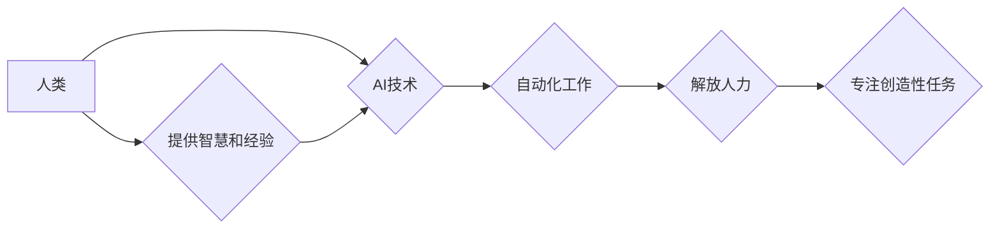

                 

## 人类计算：AI时代的未来就业市场与技能培训发展趋势分析机遇挑战机遇预测

> 关键词：人工智能、人类计算、未来就业、技能培训、自动化、数据分析、机器学习、深度学习、跨学科融合

## 1. 背景介绍

人工智能（AI）技术的飞速发展正在深刻地改变着世界，并对未来就业市场和技能培训产生着深远的影响。随着机器学习、深度学习等技术的不断进步，自动化程度不断提高，一些传统工作岗位面临被替代的风险。然而，AI的兴起也创造了大量新的工作机会，对跨学科融合、数据分析、算法设计等领域的需求不断增长。

当前，全球范围内对AI人才的需求量远超供给，这使得AI技能成为未来就业市场的关键竞争力。为了应对AI时代带来的挑战和机遇，我们需要深入分析未来就业市场趋势，并制定相应的技能培训策略，以帮助人们适应新的工作环境，掌握未来发展的关键技能。

## 2. 核心概念与联系

**2.1 人类计算**

人类计算是指利用人类的认知能力、创造力、判断力和解决问题的能力，与计算机技术相结合，共同完成复杂的任务。它强调人机协作，将人类的智慧与机器的计算能力相融合，发挥各自优势，实现更高效、更智能的计算模式。

**2.2 AI与人类计算的关系**

AI技术的发展推动了人类计算的进步。AI可以帮助人类自动化重复性工作，解放人力，专注于更具创造性和战略性的任务。同时，人类的智慧和经验可以帮助AI算法改进，使其更加智能、更加适应复杂环境。

**2.3 人类计算的未来发展趋势**

未来，人类计算将更加注重人机协作、跨学科融合和个性化定制。

* **人机协作:** 人类和AI将更加紧密地合作，共同完成复杂任务。
* **跨学科融合:** 人类计算将融合更多学科知识，例如心理学、社会学、经济学等，以更好地理解和服务人类需求。
* **个性化定制:** 人类计算将更加注重个性化定制，根据用户的不同需求和特点提供个性化的服务和体验。

**Mermaid 流程图**



## 3. 核心算法原理 & 具体操作步骤

**3.1 算法原理概述**

人类计算的核心算法原理是基于机器学习和深度学习技术，通过训练模型，使模型能够学习人类的认知模式和行为模式，从而完成复杂的计算任务。

**3.2 算法步骤详解**

1. **数据收集和预处理:** 收集大量相关数据，并进行清洗、转换、格式化等预处理工作。
2. **模型选择:** 根据任务需求选择合适的机器学习或深度学习模型，例如神经网络、支持向量机等。
3. **模型训练:** 使用训练数据训练模型，调整模型参数，使模型能够准确地预测或分类数据。
4. **模型评估:** 使用测试数据评估模型的性能，例如准确率、召回率、F1-score等。
5. **模型部署:** 将训练好的模型部署到实际应用场景中，用于完成预测、分类、识别等任务。

**3.3 算法优缺点**

**优点:**

* **自动化能力强:** 可以自动化完成大量重复性工作，提高效率。
* **学习能力强:** 可以从数据中学习，不断改进和优化。
* **适应性强:** 可以适应不同的环境和任务需求。

**缺点:**

* **数据依赖性强:** 需要大量高质量数据进行训练。
* **解释性弱:** 模型的决策过程难以解释，缺乏透明度。
* **伦理风险:** 可能存在偏见、歧视等伦理风险。

**3.4 算法应用领域**

* **自然语言处理:** 语音识别、机器翻译、文本摘要等。
* **计算机视觉:** 图像识别、物体检测、人脸识别等。
* **推荐系统:** 产品推荐、内容推荐、个性化服务等。
* **医疗诊断:** 病情预测、疾病诊断、药物研发等。
* **金融分析:** 风险评估、欺诈检测、投资决策等。

## 4. 数学模型和公式 & 详细讲解 & 举例说明

**4.1 数学模型构建**

在人类计算中，常用的数学模型包括神经网络、支持向量机、决策树等。这些模型通过数学公式来描述数据之间的关系，并进行预测或分类。

**4.2 公式推导过程**

例如，神经网络中的激活函数 sigmoid 函数的公式如下：

$$
f(x) = \frac{1}{1 + e^{-x}}
$$

该函数将输入值映射到0到1之间，用于模拟神经元的激活状态。

**4.3 案例分析与讲解**

在图像识别任务中，可以使用卷积神经网络（CNN）模型进行图像分类。CNN模型通过多个卷积层和池化层来提取图像特征，并最终通过全连接层进行分类。

## 5. 项目实践：代码实例和详细解释说明

**5.1 开发环境搭建**

可以使用Python语言和相关的机器学习库，例如TensorFlow、PyTorch等，进行人类计算项目开发。

**5.2 源代码详细实现**

```python
import tensorflow as tf

# 定义神经网络模型
model = tf.keras.models.Sequential([
    tf.keras.layers.Conv2D(32, (3, 3), activation='relu', input_shape=(28, 28, 1)),
    tf.keras.layers.MaxPooling2D((2, 2)),
    tf.keras.layers.Conv2D(64, (3, 3), activation='relu'),
    tf.keras.layers.MaxPooling2D((2, 2)),
    tf.keras.layers.Flatten(),
    tf.keras.layers.Dense(10, activation='softmax')
])

# 编译模型
model.compile(optimizer='adam',
              loss='sparse_categorical_crossentropy',
              metrics=['accuracy'])

# 训练模型
model.fit(x_train, y_train, epochs=5)

# 评估模型
loss, accuracy = model.evaluate(x_test, y_test)
print('Test loss:', loss)
print('Test accuracy:', accuracy)
```

**5.3 代码解读与分析**

这段代码定义了一个简单的卷积神经网络模型，用于手写数字识别任务。模型包含两个卷积层、两个池化层、一个全连接层和一个softmax输出层。

**5.4 运行结果展示**

训练完成后，模型可以用于预测新的手写数字图像。

## 6. 实际应用场景

**6.1 教育领域**

* 个性化学习: 根据学生的学习进度和能力，提供个性化的学习内容和教学方式。
* 智能辅导: 利用AI技术，为学生提供智能化的辅导和答疑服务。
* 自动批改作业: 自动批改学生的作业，节省教师的时间和精力。

**6.2 医疗保健领域**

* 疾病诊断: 利用AI技术，辅助医生进行疾病诊断，提高诊断准确率。
* 药物研发: 利用AI技术，加速药物研发过程，降低研发成本。
* 远程医疗: 利用AI技术，提供远程医疗服务，方便患者就医。

**6.3 金融领域**

* 风险评估: 利用AI技术，评估投资风险，帮助投资者做出更明智的决策。
* 欺诈检测: 利用AI技术，识别金融欺诈行为，保护用户资产安全。
* 个性化金融服务: 利用AI技术，提供个性化的金融服务，满足用户的不同需求。

**6.4 未来应用展望**

未来，人类计算将应用于更多领域，例如智能制造、自动驾驶、城市管理等，为人类社会带来更多便利和福祉。

## 7. 工具和资源推荐

**7.1 学习资源推荐**

* **在线课程:** Coursera、edX、Udacity等平台提供丰富的AI课程。
* **书籍:** 《深度学习》、《机器学习实战》等书籍是学习AI的基础教材。
* **开源项目:** TensorFlow、PyTorch等开源项目可以帮助你实践AI技术。

**7.2 开发工具推荐**

* **Python:** Python是AI开发最常用的编程语言。
* **TensorFlow:** TensorFlow是一个开源的机器学习框架。
* **PyTorch:** PyTorch是一个开源的深度学习框架。

**7.3 相关论文推荐**

* **《ImageNet Classification with Deep Convolutional Neural Networks》**
* **《Attention Is All You Need》**
* **《BERT: Pre-training of Deep Bidirectional Transformers for Language Understanding》**

## 8. 总结：未来发展趋势与挑战

**8.1 研究成果总结**

近年来，AI技术取得了长足进步，在图像识别、自然语言处理、语音识别等领域取得了突破性进展。人类计算作为AI发展的重要方向，正在逐渐成为未来科技发展的主流趋势。

**8.2 未来发展趋势**

* **模型更加智能:** AI模型将更加智能，能够更好地理解和处理复杂信息。
* **应用更加广泛:** AI将应用于更多领域，例如医疗、教育、金融等。
* **人机协作更加紧密:** 人类和AI将更加紧密地合作，共同完成复杂任务。

**8.3 面临的挑战**

* **数据安全和隐私保护:** AI模型训练需要大量数据，如何保证数据安全和隐私保护是一个重要挑战。
* **算法解释性和透明度:** AI模型的决策过程难以解释，缺乏透明度，如何提高算法的解释性和透明度是一个重要问题。
* **伦理风险:** AI技术可能存在偏见、歧视等伦理风险，需要制定相应的伦理规范和监管机制。

**8.4 研究展望**

未来，人类计算研究将继续深入，探索更智能、更安全、更可解释的AI模型，并将其应用于更多领域，为人类社会带来更多福祉。

## 9. 附录：常见问题与解答

**9.1 如何学习人类计算相关知识？**

可以学习相关的在线课程、书籍和开源项目，例如Coursera、edX、Udacity等平台的AI课程、深度学习和机器学习实战等书籍、TensorFlow、PyTorch等开源项目。

**9.2 人类计算会取代人类工作吗？**

AI技术会改变一些工作模式，但不会完全取代人类工作。AI更擅长于自动化重复性工作，而人类则擅长于创造性、战略性、情感性工作。

**9.3 人类计算有哪些伦理风险？**

AI技术可能存在偏见、歧视、隐私泄露等伦理风险，需要制定相应的伦理规范和监管机制，确保AI技术安全、公平、可持续发展。


作者：禅与计算机程序设计艺术 / Zen and the Art of Computer Programming 
<end_of_turn>

