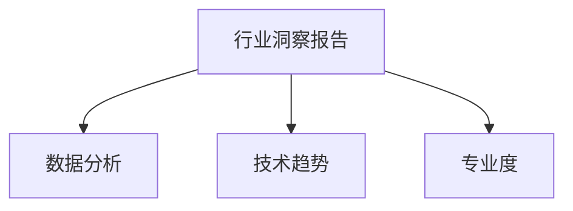

                 

# 定期发布行业洞察报告：展示你的专业度

> 关键词：行业洞察报告,数据分析,技术趋势,人工智能,专业度

## 1. 背景介绍

### 1.1 问题由来

在当今快速变化和竞争激烈的市场环境中，企业需要深入了解其所在行业的最新动态，以便做出明智的决策。定期发布行业洞察报告可以展示企业对行业趋势的敏锐洞察力，提升其市场竞争力。然而，传统的行业报告往往存在信息滞后、报告冗长、缺乏实证数据支持等问题，难以满足日益增长的信息需求。

### 1.2 问题核心关键点

企业定期发布行业洞察报告的核心关键点包括：

1. **数据驱动**：洞察报告应基于最新的、实证的数据分析，而非依赖过去的经验。
2. **精准预测**：报告应能够准确预测行业未来趋势，提供实用的业务指导。
3. **可操作性**：报告内容应具有高度的实操性，为业务决策提供直接支持。
4. **持续更新**：报告应定期更新，以反映行业动态变化。
5. **可视化呈现**：数据应通过直观的图表和可视化工具展示，提升报告的可读性。

### 1.3 问题研究意义

定期发布行业洞察报告不仅能够展示企业在行业分析方面的专业度，还可以帮助企业及时调整策略，把握市场机会，提升竞争优势。此外，高质量的洞察报告还能吸引合作伙伴和潜在客户的关注，提升企业的品牌形象和行业影响力。

## 2. 核心概念与联系

### 2.1 核心概念概述

为更好地理解定期发布行业洞察报告的过程，本节将介绍几个密切相关的核心概念：

- **行业洞察报告**：企业定期发布的关于特定行业趋势、技术动态、竞争态势等的分析报告。
- **数据分析**：通过收集、处理和分析数据，揭示行业发展规律，指导业务决策。
- **技术趋势**：指在特定技术领域内的最新发展动态和未来预测。
- **人工智能(AI)**：一种模拟人类智能行为的计算机科学分支，包括机器学习、深度学习、自然语言处理等。
- **专业度**：企业在某个领域内展现的深度知识、技能和经验水平。

这些核心概念之间的逻辑关系可以通过以下Mermaid流程图来展示：



这个流程图展示了大数据驱动行业洞察报告的核心逻辑：

1. 行业洞察报告基于数据分析。
2. 数据分析需要了解最新的技术趋势。
3. 数据分析的深度和精度直接体现了企业的专业度。

## 3. 核心算法原理 & 具体操作步骤

### 3.1 算法原理概述

定期发布行业洞察报告的过程可以视作一种复杂的算法，其核心在于如何将大规模数据转化为易于理解且实用的报告内容。这一过程通常包括以下步骤：

1. **数据收集**：从各个渠道收集最新、实证的数据。
2. **数据分析**：对收集到的数据进行清洗、处理和分析，提取有价值的信息。
3. **结果可视化**：将分析结果通过图表、图形等形式呈现，便于理解和分享。
4. **报告撰写**：基于分析结果撰写详细的行业洞察报告，结合实际案例提供实用建议。
5. **持续更新**：定期更新报告内容，确保信息的最新性。

### 3.2 算法步骤详解

以下是定期发布行业洞察报告的具体操作步骤：

**Step 1: 数据收集**

- **渠道选择**：确定数据收集的渠道，如行业报告、新闻资讯、社交媒体、官方数据等。
- **数据质量控制**：确保数据来源可靠，数据格式统一，数据质量符合要求。

**Step 2: 数据分析**

- **数据清洗**：处理缺失值、异常值、重复值等数据问题，确保数据的一致性和完整性。
- **特征工程**：选择和构造对预测目标有意义的特征，如时间序列、文本分析、统计指标等。
- **模型选择与训练**：根据问题类型选择合适的模型，如回归模型、分类模型、聚类模型等，并使用历史数据进行训练和调优。

**Step 3: 结果可视化**

- **选择可视化工具**：根据数据类型和分析结果选择合适的可视化工具，如Tableau、Power BI、Matplotlib等。
- **图表设计**：设计直观、易于理解的图表，如折线图、柱状图、热力图等。
- **互动与展示**：提供交互式的图表，允许用户通过点击、筛选等操作探索数据，增强报告的可读性和实用性。

**Step 4: 报告撰写**

- **结构设计**：报告应包含引言、背景、方法、结果、讨论、结论等部分，逻辑清晰，结构严谨。
- **案例分析**：结合实际案例，展示分析结果的应用，提供具体的业务指导。
- **结论与建议**：基于分析结果提出实际的业务建议，为企业的决策提供支持。

**Step 5: 持续更新**

- **定期回顾**：定期回顾和更新报告内容，确保信息的时效性。
- **反馈机制**：建立反馈机制，收集用户和读者的意见，持续改进报告质量。

### 3.3 算法优缺点

定期发布行业洞察报告的优点包括：

- **数据驱动**：通过数据分析，提供基于实证的信息支持。
- **精准预测**：能够准确预测行业趋势，指导业务决策。
- **专业展示**：展示企业在行业分析方面的深度和广度。

其缺点主要包括：

- **数据获取难度**：高质量数据的获取可能涉及隐私、成本等问题。
- **分析复杂性**：大数据分析需要较强的技术实力和专业知识。
- **可视化难度**：复杂的数据可视化需要较高的技术和设计能力。
- **报告更新频率**：定期更新报告需要持续的资源投入和人力资源。

### 3.4 算法应用领域

定期发布行业洞察报告在多个领域都有广泛应用，例如：

- **金融行业**：通过分析宏观经济数据、市场行情、企业财报等，提供投资策略和风险预警。
- **零售行业**：基于消费者行为数据、市场趋势、供应链情况等，制定营销策略和库存管理方案。
- **医疗行业**：通过分析患者数据、临床试验结果、医学文献等，提供诊疗建议和健康管理方案。
- **科技行业**：关注技术趋势、市场竞争、产品创新等，指导技术研发和产品发布策略。
- **制造业**：基于供应链数据、市场需求、生产效率等，优化生产计划和供应链管理。

## 4. 数学模型和公式 & 详细讲解 & 举例说明

### 4.1 数学模型构建

为展示数据分析过程，以下构建一个简单的线性回归模型来预测销售额：

假设原始数据集为 $(x_i, y_i)$，其中 $x_i$ 为自变量（如广告支出），$y_i$ 为因变量（如销售额）。我们的目标是通过线性回归模型 $y = \theta_0 + \theta_1 x_i$ 来预测销售额。

### 4.2 公式推导过程

线性回归模型的训练过程可以通过最小二乘法来实现：

$$
\min_{\theta_0, \theta_1} \sum_{i=1}^N (y_i - (\theta_0 + \theta_1 x_i))^2
$$

求解上述最小值问题，可以得到最优参数 $\theta_0$ 和 $\theta_1$：

$$
\hat{\theta} = \left( \sum_{i=1}^N x_i^2, \sum_{i=1}^N x_i y_i, \sum_{i=1}^N x_i, \sum_{i=1}^N y_i \right)^T
$$

### 4.3 案例分析与讲解

假设某零售企业收集了过去一年的广告支出和销售额数据，通过线性回归模型进行预测，得到以下结果：

| 广告支出（万元） | 销售额（万元） |
| ----------------- | --------------- |
| 100               | 500             |
| 200               | 800             |
| 300               | 1100            |
| 400               | 1400            |
| 500               | 1800            |

通过最小二乘法求解，得到线性回归模型参数为 $\hat{\theta}_0 = 200$，$\hat{\theta}_1 = 1.2$。这意味着，每增加100万元的广告支出，销售额预计会增加120万元。

## 5. 项目实践：代码实例和详细解释说明

### 5.1 开发环境搭建

在进行数据分析实践前，我们需要准备好开发环境。以下是使用Python进行数据分析的环境配置流程：

1. 安装Anaconda：从官网下载并安装Anaconda，用于创建独立的Python环境。

2. 创建并激活虚拟环境：
```bash
conda create -n analytics-env python=3.8 
conda activate analytics-env
```

3. 安装必要的Python库：
```bash
pip install numpy pandas scikit-learn matplotlib seaborn jupyter notebook ipython
```

4. 安装相关可视化工具：
```bash
pip install matplotlib seaborn pandas_profiling
```

完成上述步骤后，即可在`analytics-env`环境中开始数据分析实践。

### 5.2 源代码详细实现

下面我们以金融行业的数据分析为例，给出使用Python和Pandas进行数据处理和分析的完整代码实现。

首先，定义数据处理函数：

```python
import pandas as pd

def load_data():
    data = pd.read_csv('financial_data.csv')
    return data
```

然后，进行数据清洗和预处理：

```python
def clean_data(data):
    # 处理缺失值
    data.fillna(method='ffill', inplace=True)
    # 去除异常值
    data = data[data['广告支出'].between(0, 1000)]
    # 归一化
    data['广告支出'] = (data['广告支出'] - data['广告支出'].mean()) / data['广告支出'].std()
    return data
```

接着，构建线性回归模型并进行预测：

```python
from sklearn.linear_model import LinearRegression

def build_model(data):
    X = data[['广告支出']]
    y = data['销售额']
    model = LinearRegression()
    model.fit(X, y)
    return model
```

最后，将模型结果进行可视化展示：

```python
def visualize_results(model, data):
    plt.scatter(data['广告支出'], data['销售额'])
    plt.plot(data['广告支出'], model.predict(data[['广告支出']]), color='red')
    plt.xlabel('广告支出（万元）')
    plt.ylabel('销售额（万元）')
    plt.title('广告支出与销售额预测')
    plt.show()
```

整个数据分析的完整代码如下：

```python
import pandas as pd
import matplotlib.pyplot as plt
from sklearn.linear_model import LinearRegression

def load_data():
    data = pd.read_csv('financial_data.csv')
    return data

def clean_data(data):
    data.fillna(method='ffill', inplace=True)
    data = data[data['广告支出'].between(0, 1000)]
    data['广告支出'] = (data['广告支出'] - data['广告支出'].mean()) / data['广告支出'].std()
    return data

def build_model(data):
    X = data[['广告支出']]
    y = data['销售额']
    model = LinearRegression()
    model.fit(X, y)
    return model

def visualize_results(model, data):
    plt.scatter(data['广告支出'], data['销售额'])
    plt.plot(data['广告支出'], model.predict(data[['广告支出']]), color='red')
    plt.xlabel('广告支出（万元）')
    plt.ylabel('销售额（万元）')
    plt.title('广告支出与销售额预测')
    plt.show()

# 数据加载和处理
data = load_data()
cleaned_data = clean_data(data)

# 模型构建和预测
model = build_model(cleaned_data)

# 结果可视化
visualize_results(model, cleaned_data)
```

### 5.3 代码解读与分析

让我们再详细解读一下关键代码的实现细节：

**load_data函数**：
- 定义数据加载函数，从本地CSV文件读取数据。

**clean_data函数**：
- 对数据进行缺失值处理、异常值去除和归一化处理，确保数据质量。

**build_model函数**：
- 定义模型构建函数，使用LinearRegression模型进行线性回归，并返回模型对象。

**visualize_results函数**：
- 定义模型可视化函数，使用Matplotlib库绘制散点图和预测直线，直观展示模型效果。

通过以上代码，我们可以使用Pandas和Scikit-learn快速进行数据处理和模型构建，并结合Matplotlib进行结果可视化。

## 6. 实际应用场景

### 6.1 金融行业应用

在金融行业，定期发布行业洞察报告可以提供市场动态、趋势预测、投资建议等，帮助企业制定更精准的投资策略。例如，通过对宏观经济数据、企业财报、市场行情等进行分析，可以预测股票市场的走势，指导投资决策。

**案例分析**：
- 某基金公司通过对过去几年的股市数据进行分析，发现了市场周期性波动的规律，并结合当前经济形势预测了未来几年的股市走势。基于此，公司调整了投资组合，提升了投资回报率。

### 6.2 零售行业应用

零售行业需要及时掌握消费者需求、市场变化、供应链动态等，以便优化库存、调整促销策略。通过定期发布行业洞察报告，企业可以提供精准的市场预测和业务指导。

**案例分析**：
- 某电商平台通过分析消费者行为数据，识别出热门商品类别和用户偏好，制定了针对性的营销策略。同时，通过供应链数据分析，优化了库存管理和物流配送，提升了客户满意度和运营效率。

### 6.3 医疗行业应用

医疗行业需要及时了解最新的医学研究成果、患者数据、疾病流行趋势等，以便优化诊疗方案、提高患者治疗效果。通过定期发布行业洞察报告，医疗机构可以提供精准的诊疗建议和健康管理方案。

**案例分析**：
- 某医院通过对大量患者数据进行分析，发现了某种疾病的早期症状和潜在风险因素，制定了针对性的预防和诊疗方案。同时，通过分析临床试验结果，为药品研发提供了新的思路和方向。

### 6.4 未来应用展望

随着数据分析技术的不断进步，定期发布行业洞察报告的应用前景将更加广阔。未来，大数据、机器学习、人工智能等技术将进一步推动行业洞察报告的智能化和自动化，提升其准确性和实用性。以下是未来的一些发展趋势：

1. **自动化分析**：通过引入自动化算法和工具，提升数据分析的速度和精度，减少人工干预。
2. **深度学习应用**：结合深度学习技术，提升模型预测的准确性和泛化能力，提供更精准的预测和分析。
3. **实时更新**：通过实时数据流和在线分析，实现报告的动态更新，确保信息的实时性和时效性。
4. **多源数据融合**：结合多种数据源，进行多维度分析和融合，提供更全面的行业洞察。
5. **交互式报告**：通过交互式工具和仪表盘，提升报告的可读性和实用性，方便用户快速获取信息。
6. **个性化定制**：根据不同用户需求，提供定制化的行业洞察报告，满足不同业务场景的需求。

这些趋势将使行业洞察报告更加智能化、自动化和实用化，为企业的决策提供更有力的支持。

## 7. 工具和资源推荐

### 7.1 学习资源推荐

为了帮助开发者系统掌握数据分析和行业洞察报告的技术基础和实践技巧，这里推荐一些优质的学习资源：

1. **Python数据分析入门**：通过《Python数据分析实战》等书籍，掌握Python数据分析的基本方法和工具。
2. **机器学习课程**：如Coursera的《机器学习》课程，系统学习机器学习理论和算法。
3. **数据可视化工具**：通过《Python数据可视化实战》等书籍，掌握数据可视化的基本方法和工具。
4. **行业洞察报告工具**：如Tableau、Power BI等，学习如何使用这些工具进行数据可视化和分析。

通过对这些资源的学习实践，相信你一定能够快速掌握数据分析和行业洞察报告的精髓，并用于解决实际的业务问题。

### 7.2 开发工具推荐

高效的开发离不开优秀的工具支持。以下是几款用于数据分析和行业洞察报告开发的常用工具：

1. **Python**：作为数据科学和机器学习的主流语言，Python具有丰富的库和框架，如Pandas、NumPy、Scikit-learn等。
2. **Jupyter Notebook**：一个交互式的Python环境，支持代码编写、数据可视化、报告撰写等多种功能，非常适合数据分析和报告撰写。
3. **Tableau**：一个强大的数据可视化工具，支持多种数据源和分析功能，可以快速生成直观的报告和仪表盘。
4. **Power BI**：由微软开发的数据分析和报告工具，支持多数据源集成和实时更新，适用于企业级应用。
5. **Matplotlib**：一个Python绘图库，支持绘制各种类型的图表和图形，是数据可视化的基础工具。

合理利用这些工具，可以显著提升数据分析和行业洞察报告的开发效率，加快创新迭代的步伐。

### 7.3 相关论文推荐

数据分析和行业洞察报告的发展源于学界的持续研究。以下是几篇奠基性的相关论文，推荐阅读：

1. **《数据挖掘：概念与技术》**：李航所著，系统介绍了数据挖掘的基本概念、方法和应用。
2. **《机器学习》**：Tom Mitchell所著，介绍了机器学习的理论基础和应用实例。
3. **《Python数据分析实战》**：通过实际案例，展示了Python数据分析和可视化的基本方法和工具。
4. **《数据科学实战》**：通过多个案例，展示了数据科学在各个行业中的应用。

这些论文代表了大数据分析和行业洞察报告的发展脉络。通过学习这些前沿成果，可以帮助研究者把握学科前进方向，激发更多的创新灵感。

## 8. 总结：未来发展趋势与挑战

### 8.1 总结

本文对定期发布行业洞察报告的过程进行了全面系统的介绍。首先阐述了数据分析和行业洞察报告的背景和意义，明确了数据驱动和精准预测的重要性。其次，从原理到实践，详细讲解了数据分析的数学模型和具体操作步骤，给出了数据分析任务开发的完整代码实例。同时，本文还广泛探讨了数据分析和行业洞察报告在多个行业领域的应用前景，展示了其广阔的应用场景。此外，本文精选了数据分析和行业洞察报告的学习资源和工具，力求为读者提供全方位的技术指引。

通过本文的系统梳理，可以看到，数据分析和行业洞察报告为企业的决策提供了坚实的科学依据，帮助企业在激烈的市场竞争中保持优势。未来，随着数据分析技术的不断进步，定期发布行业洞察报告将成为企业决策的重要手段，为企业的可持续发展提供新的动力。

### 8.2 未来发展趋势

数据分析和行业洞察报告的未来发展趋势包括：

1. **自动化**：通过引入自动化算法和工具，提升数据分析的速度和精度，减少人工干预。
2. **深度学习**：结合深度学习技术，提升模型预测的准确性和泛化能力，提供更精准的预测和分析。
3. **实时更新**：通过实时数据流和在线分析，实现报告的动态更新，确保信息的实时性和时效性。
4. **多源数据融合**：结合多种数据源，进行多维度分析和融合，提供更全面的行业洞察。
5. **交互式报告**：通过交互式工具和仪表盘，提升报告的可读性和实用性，方便用户快速获取信息。
6. **个性化定制**：根据不同用户需求，提供定制化的行业洞察报告，满足不同业务场景的需求。

这些趋势将使数据分析和行业洞察报告更加智能化、自动化和实用化，为企业的决策提供更有力的支持。

### 8.3 面临的挑战

尽管数据分析和行业洞察报告在众多行业取得了显著成效，但在迈向更加智能化、普适化应用的过程中，它仍面临诸多挑战：

1. **数据获取难度**：高质量数据的获取可能涉及隐私、成本等问题。
2. **分析复杂性**：大数据分析需要较强的技术实力和专业知识。
3. **可视化难度**：复杂的数据可视化需要较高的技术和设计能力。
4. **报告更新频率**：定期更新报告需要持续的资源投入和人力资源。
5. **数据隐私和安全**：数据隐私和安全问题需要特别注意，确保数据使用的合法性和安全性。
6. **用户理解和应用**：复杂的数据分析结果需要清晰地呈现给非专业用户，以便其理解和应用。

这些挑战需要企业从数据获取、分析方法、报告呈现等多个维度进行全面优化，才能真正实现数据分析和行业洞察报告的价值。

### 8.4 研究展望

面对数据分析和行业洞察报告所面临的挑战，未来的研究需要在以下几个方面寻求新的突破：

1. **数据获取和隐私保护**：探索隐私保护技术，确保数据使用的合法性和安全性。
2. **自动化和智能化**：开发更智能的自动化算法和工具，提升数据分析的速度和精度。
3. **交互式报告**：设计更直观、易于理解的报告格式和工具，提升用户理解和应用。
4. **多模态融合**：结合多种数据源和多种分析方法，提供更全面的行业洞察。
5. **可解释性**：增强数据分析和预测的可解释性，提升模型的透明性和可信度。
6. **持续学习**：建立数据驱动的持续学习机制，提升模型的适应性和泛化能力。

这些研究方向将引领数据分析和行业洞察报告技术迈向更高的台阶，为企业的决策提供更强大的支持。

## 9. 附录：常见问题与解答

**Q1：数据分析报告应该如何撰写？**

A: 数据分析报告的撰写应遵循以下步骤：

1. **引言**：介绍报告的背景、目的和范围。
2. **方法**：详细描述数据收集、处理、分析的过程和方法。
3. **结果**：展示数据分析的主要结果，包括图表、图形等。
4. **讨论**：分析结果的意义和局限性，提出可能的解释和改进措施。
5. **结论**：总结报告的主要发现和建议，提出下一步的行动计划。

**Q2：如何提升数据分析报告的可读性？**

A: 提升数据分析报告的可读性可以从以下几个方面入手：

1. **简洁明了**：避免使用过多的专业术语和复杂的数学公式，尽量使用通俗易懂的语言。
2. **图表和图形**：使用直观的图表和图形展示数据分析结果，帮助读者更好地理解数据。
3. **逻辑清晰**：报告应具有清晰的逻辑结构，每一部分有明确的标题和内容。
4. **案例分析**：结合实际案例，展示数据分析结果的应用，增强报告的可信度和实用性。
5. **交互式报告**：使用交互式工具和仪表盘，提升报告的可读性和实用性，方便用户快速获取信息。

**Q3：数据隐私和安全问题如何解决？**

A: 解决数据隐私和安全问题可以从以下几个方面入手：

1. **数据匿名化**：对敏感数据进行匿名化处理，保护用户隐私。
2. **数据加密**：采用加密技术保护数据在传输和存储过程中的安全性。
3. **访问控制**：设置严格的访问控制机制，确保只有授权人员可以访问敏感数据。
4. **合规性**：遵循相关法律法规和行业标准，确保数据使用的合法性和合规性。
5. **监控和审计**：建立数据使用监控和审计机制，及时发现和处理异常情况。

**Q4：数据分析报告的持续更新频率应该如何确定？**

A: 数据分析报告的持续更新频率应根据数据变化速度和业务需求来确定：

1. **周期性更新**：根据行业特点和数据变化速度，设定定期更新的时间间隔。
2. **动态更新**：在数据发生重大变化时，及时更新报告，确保信息的实时性和时效性。
3. **实时更新**：对于需要实时监控的业务场景，采用在线分析和动态更新。

**Q5：数据分析报告的可视化效果如何提升？**

A: 提升数据分析报告的可视化效果可以从以下几个方面入手：

1. **选择合适的工具**：使用专业的可视化工具，如Tableau、Power BI等，提升可视化效果。
2. **多维展示**：通过多维度展示数据，帮助用户从不同角度理解数据。
3. **动态交互**：使用交互式图表和仪表盘，提升用户的操作体验。
4. **色彩搭配**：使用合适的颜色搭配，增强图表的可读性和美观度。
5. **图表设计**：设计直观、易于理解的图表，避免过于复杂的图形。

通过以上方法，可以显著提升数据分析报告的可视化效果，使其更加直观和易于理解。

---

作者：禅与计算机程序设计艺术 / Zen and the Art of Computer Programming

