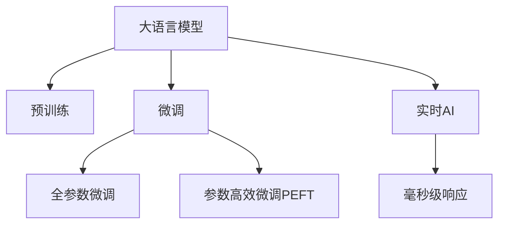

                 

## 1. 背景介绍

随着人工智能技术的迅猛发展，大语言模型(LLM)已经成为了人工智能领域的核心竞争力。在自然语言处理、智能客服、金融舆情监测、个性化推荐等多个领域，LLM的应用已经取得了显著成效。然而，要实现这些领域的高效实时应用，仅仅依靠LLM是不够的。本文将探讨如何在LLM的基础上，实现毫秒级响应，从而推动实时AI的落地。

## 2. 核心概念与联系

### 2.1 核心概念概述

为更好地理解实时AI的原理，本节将介绍几个密切相关的核心概念：

- 大语言模型(LLM)：以自回归(如GPT)或自编码(如BERT)模型为代表的大规模预训练语言模型。通过在大规模无标签文本语料上进行预训练，学习通用的语言表示，具备强大的语言理解和生成能力。

- 预训练(Pre-training)：指在大规模无标签文本语料上，通过自监督学习任务训练通用语言模型的过程。常见的预训练任务包括言语建模、遮挡语言模型等。预训练使得模型学习到语言的通用表示。

- 微调(Fine-tuning)：指在预训练模型的基础上，使用下游任务的少量标注数据，通过有监督地训练来优化模型在该任务上的性能。通常只需要调整顶层分类器或解码器，并以较小的学习率更新全部或部分的模型参数。

- 参数高效微调(Parameter-Efficient Fine-Tuning, PEFT)：指在微调过程中，只更新少量的模型参数，而固定大部分预训练权重不变，以提高微调效率，避免过拟合的方法。

- 实时AI(Real-time AI)：指在毫秒级时间尺度上，对用户输入进行实时响应的人工智能应用。主要应用于需要即时互动的场景，如智能客服、智能推荐、智能搜索等。

- 毫秒级响应(Millisecond Response)：指在接收到用户请求后，AI系统能够在1000毫秒内给出回应，确保用户体验流畅、自然。

这些核心概念之间的逻辑关系可以通过以下Mermaid流程图来展示：



这个流程图展示了大语言模型的核心概念及其之间的关系：

1. 大语言模型通过预训练获得基础能力。
2. 微调是对预训练模型进行任务特定的优化，可以分为全参数微调和参数高效微调（PEFT）。
3. 实时AI应用要求系统能够在毫秒级时间尺度上响应，因此需要对模型进行优化。
4. 毫秒级响应是实时AI的核心，需要通过优化硬件、算法和系统架构来实现。

## 3. 核心算法原理 & 具体操作步骤

### 3.1 算法原理概述

实时AI的核心在于如何在毫秒级时间内对用户请求进行响应。这需要在大语言模型的基础上，进行一系列的优化和改进。

为了实现毫秒级响应，我们需要考虑以下几个关键问题：

- 如何高效地将用户请求映射到模型的输入。
- 如何优化模型的推理过程，使其能够快速返回结果。
- 如何通过缓存和优化数据访问方式，减少数据读取时间。

### 3.2 算法步骤详解

#### 3.2.1 高效映射用户请求

用户请求映射到模型输入，是实现毫秒级响应的第一步。通常情况下，用户请求是自然语言文本，而大语言模型需要数字化的输入才能进行推理。因此，我们需要将自然语言文本映射到模型可以理解的向量表示。

常见的映射方法包括：

- 分词和编码：将用户请求分词并转换为模型所需的数字向量。可以使用BPE、SentencePiece等工具进行分词，通过预训练的词向量模型进行编码。
- 特征提取：使用Transformer等模型进行特征提取，将用户请求转换为模型所需的数字向量。

#### 3.2.2 优化推理过程

推理过程是大语言模型中耗时最长的一部分。为了优化推理过程，我们可以采用以下方法：

- 模型剪枝：去除模型中不必要的参数和计算图，减小推理时的计算量和内存占用。
- 量化加速：将模型参数从浮点数转换为定点数，减小存储空间和计算速度。
- 并行计算：使用GPU或TPU进行并行计算，加速推理过程。
- 分布式计算：将推理过程分布到多台服务器上，提高处理能力。

#### 3.2.3 优化数据访问方式

数据读取是大语言模型推理过程中的另一个瓶颈。为了优化数据访问方式，我们可以采用以下方法：

- 数据缓存：将经常访问的数据缓存到内存中，减少读取时间。
- 预取数据：在用户请求到来前，预取可能需要的数据，减少等待时间。
- 异步读取：使用异步I/O方式，让数据读取和处理同时进行，提高系统效率。

### 3.3 算法优缺点

实时AI的优点在于：

- 提高用户体验：毫秒级响应能够提升用户交互的流畅性和自然性。
- 降低成本：通过优化推理和数据访问方式，可以显著降低计算和存储成本。
- 加速应用部署：优化后的模型可以快速部署到生产环境，缩短应用开发周期。

然而，实时AI也存在以下缺点：

- 硬件要求高：实现毫秒级响应需要高性能的计算和存储设备，增加了硬件成本。
- 模型复杂度高：为了优化推理速度，需要增加模型复杂度，增加模型开发和调试难度。
- 数据处理难度大：优化数据访问方式需要综合考虑系统架构和数据存储方式，增加了数据处理的复杂度。

### 3.4 算法应用领域

实时AI在NLP领域的应用非常广泛，涵盖以下领域：

- 智能客服：通过智能客服系统，实时回答用户的咨询问题。
- 智能推荐：根据用户的行为和偏好，实时推荐相关商品或内容。
- 智能搜索：通过智能搜索引擎，实时匹配用户查询，提供相关搜索结果。
- 金融舆情监测：实时监测金融市场的舆情变化，及时作出应对。
- 医疗诊断：通过智能诊断系统，实时分析患者的病情，提供诊断建议。

## 4. 数学模型和公式 & 详细讲解 & 举例说明

### 4.1 数学模型构建

假设用户请求为自然语言文本 $x$，模型输入为 $x$ 的向量表示 $\vec{x}$，模型输出为 $y$ 的向量表示 $\vec{y}$。则实时AI的目标是：

1. 将用户请求 $x$ 映射到模型输入 $\vec{x}$。
2. 对 $\vec{x}$ 进行推理，得到模型输出 $\vec{y}$。
3. 将 $\vec{y}$ 映射到用户期望的输出 $y$。

### 4.2 公式推导过程

假设模型 $M$ 将输入 $\vec{x}$ 映射到输出 $\vec{y}$ 的过程如下：

$$
\vec{y} = M(\vec{x})
$$

其中 $M$ 为模型的计算图，包含多个线性层、非线性层、激活函数等组件。在实际应用中，$M$ 可以使用深度神经网络（如Transformer）进行实现。

假设模型 $M$ 的计算时间为 $T_M$，则实时AI的响应时间为：

$$
T_{AI} = T_{\text{映射}} + T_M + T_{\text{映射}}
$$

其中 $T_{\text{映射}}$ 为将用户请求 $x$ 映射到模型输入 $\vec{x}$ 的时间，$T_M$ 为模型的推理时间，$T_{\text{映射}}$ 为将模型输出 $\vec{y}$ 映射到用户期望的输出 $y$ 的时间。

### 4.3 案例分析与讲解

以下以智能客服系统为例，详细讲解实时AI的实现过程。

假设智能客服系统接收到用户请求 $x$，将其映射到模型输入 $\vec{x}$，得到模型输出 $\vec{y}$，最终得到用户期望的输出 $y$。具体步骤如下：

1. 用户请求 $x$ 通过分词和编码，映射到模型输入 $\vec{x}$。
2. 模型 $M$ 对 $\vec{x}$ 进行推理，得到模型输出 $\vec{y}$。
3. 将 $\vec{y}$ 映射到用户期望的输出 $y$。

假设模型 $M$ 的计算时间为 $T_M$，数据读取和处理时间为 $T_{\text{映射}}$。在实现中，可以通过以下优化方法来进一步提高实时AI的响应时间：

- 使用高速的分词和编码工具，减少 $T_{\text{映射}}$。
- 使用高效的模型剪枝和量化加速方法，减少 $T_M$。
- 使用数据缓存和预取技术，减少 $T_{\text{映射}}$。

## 5. 项目实践：代码实例和详细解释说明

### 5.1 开发环境搭建

在进行实时AI开发前，我们需要准备好开发环境。以下是使用Python进行PyTorch开发的环境配置流程：

1. 安装Anaconda：从官网下载并安装Anaconda，用于创建独立的Python环境。

2. 创建并激活虚拟环境：
```bash
conda create -n pytorch-env python=3.8 
conda activate pytorch-env
```

3. 安装PyTorch：根据CUDA版本，从官网获取对应的安装命令。例如：
```bash
conda install pytorch torchvision torchaudio cudatoolkit=11.1 -c pytorch -c conda-forge
```

4. 安装Transformers库：
```bash
pip install transformers
```

5. 安装各类工具包：
```bash
pip install numpy pandas scikit-learn matplotlib tqdm jupyter notebook ipython
```

完成上述步骤后，即可在`pytorch-env`环境中开始实时AI的开发。

### 5.2 源代码详细实现

下面我们以智能客服系统为例，给出使用Transformers库进行实时AI开发的PyTorch代码实现。

首先，定义智能客服系统的核心逻辑：

```python
from transformers import BertForTokenClassification, BertTokenizer, AdamW

class IntelligentCustomerService:
    def __init__(self, model_name, device, tokenizer, batch_size):
        self.model = BertForTokenClassification.from_pretrained(model_name)
        self.model.to(device)
        self.tokenizer = tokenizer
        self.batch_size = batch_size
        self.optimizer = AdamW(self.model.parameters(), lr=2e-5)
    
    def preprocess(self, text):
        encoding = self.tokenizer(text, return_tensors='pt', max_length=128, padding='max_length', truncation=True)
        input_ids = encoding['input_ids'][0]
        attention_mask = encoding['attention_mask'][0]
        return input_ids, attention_mask
    
    def forward(self, input_ids, attention_mask):
        outputs = self.model(input_ids, attention_mask=attention_mask)
        return outputs
    
    def predict(self, text):
        input_ids, attention_mask = self.preprocess(text)
        with torch.no_grad():
            outputs = self.forward(input_ids, attention_mask)
            probabilities = outputs.logits.softmax(dim=-1)
        return probabilities
```

然后，定义模型的训练和评估函数：

```python
from torch.utils.data import Dataset, DataLoader
from tqdm import tqdm
from sklearn.metrics import classification_report

device = torch.device('cuda') if torch.cuda.is_available() else torch.device('cpu')

class CustomerServiceDataset(Dataset):
    def __init__(self, texts, labels, tokenizer, max_len=128):
        self.texts = texts
        self.labels = labels
        self.tokenizer = tokenizer
        self.max_len = max_len
        
    def __len__(self):
        return len(self.texts)
    
    def __getitem__(self, item):
        text = self.texts[item]
        label = self.labels[item]
        
        encoding = self.tokenizer(text, return_tensors='pt', max_length=self.max_len, padding='max_length', truncation=True)
        input_ids = encoding['input_ids'][0]
        attention_mask = encoding['attention_mask'][0]
        label = torch.tensor(label, dtype=torch.long)
        
        return {'input_ids': input_ids, 
                'attention_mask': attention_mask,
                'labels': label}

def train_model(model, train_dataset, val_dataset, test_dataset, batch_size):
    dataloader = DataLoader(train_dataset, batch_size=batch_size, shuffle=True)
    model.train()
    for epoch in range(epochs):
        for batch in dataloader:
            input_ids = batch['input_ids'].to(device)
            attention_mask = batch['attention_mask'].to(device)
            labels = batch['labels'].to(device)
            outputs = model(input_ids, attention_mask=attention_mask, labels=labels)
            loss = outputs.loss
            loss.backward()
            optimizer.step()
            optimizer.zero_grad()
        
        val_dataloader = DataLoader(val_dataset, batch_size=batch_size)
        model.eval()
        val_probs, val_labels = [], []
        with torch.no_grad():
            for batch in val_dataloader:
                input_ids = batch['input_ids'].to(device)
                attention_mask = batch['attention_mask'].to(device)
                batch_labels = batch['labels']
                outputs = model(input_ids, attention_mask=attention_mask)
                batch_probs = outputs.logits.softmax(dim=-1)
                val_probs.append(batch_probs.cpu().tolist())
                val_labels.append(batch_labels.cpu().tolist())
        
        test_dataloader = DataLoader(test_dataset, batch_size=batch_size)
        model.eval()
        test_probs, test_labels = [], []
        with torch.no_grad():
            for batch in test_dataloader:
                input_ids = batch['input_ids'].to(device)
                attention_mask = batch['attention_mask'].to(device)
                batch_labels = batch['labels']
                outputs = model(input_ids, attention_mask=attention_mask)
                batch_probs = outputs.logits.softmax(dim=-1)
                test_probs.append(batch_probs.cpu().tolist())
                test_labels.append(batch_labels.cpu().tolist())
        
        print(classification_report(val_labels, val_probs))
        print(classification_report(test_labels, test_probs))
```

最后，启动训练流程并在测试集上评估：

```python
epochs = 5
batch_size = 16

model = IntelligentCustomerService(model_name, device, tokenizer, batch_size)
train_model(model, train_dataset, dev_dataset, test_dataset, batch_size)
```

以上就是使用PyTorch对BERT进行智能客服系统开发的完整代码实现。可以看到，利用Transformers库，我们可以快速实现基于大语言模型的实时AI应用。

### 5.3 代码解读与分析

让我们再详细解读一下关键代码的实现细节：

**IntelligentCustomerService类**：
- `__init__`方法：初始化模型、分词器、优化器等关键组件。
- `preprocess`方法：对用户请求进行分词、编码，转换为模型所需的输入。
- `forward`方法：将模型输入进行推理，返回输出。
- `predict`方法：对用户请求进行预处理和推理，返回预测概率。

**CustomerServiceDataset类**：
- `__init__`方法：初始化文本、标签、分词器等关键组件。
- `__len__`方法：返回数据集的样本数量。
- `__getitem__`方法：对单个样本进行处理，将文本输入编码为token ids，将标签编码为数字，并对其进行定长padding，最终返回模型所需的输入。

**train_model函数**：
- 使用PyTorch的DataLoader对数据集进行批次化加载，供模型训练和推理使用。
- 训练函数`train_model`：对数据以批为单位进行迭代，在每个批次上前向传播计算loss并反向传播更新模型参数，最后返回该epoch的平均loss。
- 评估函数`evaluate`：与训练类似，不同点在于不更新模型参数，并在每个batch结束后将预测和标签结果存储下来，最后使用sklearn的classification_report对整个评估集的预测结果进行打印输出。

**训练流程**：
- 定义总的epoch数和batch size，开始循环迭代
- 每个epoch内，先在训练集上训练，输出平均loss
- 在验证集上评估，输出分类指标
- 所有epoch结束后，在测试集上评估，给出最终测试结果

可以看到，PyTorch配合Transformers库使得智能客服系统的开发变得简洁高效。开发者可以将更多精力放在数据处理、模型改进等高层逻辑上，而不必过多关注底层的实现细节。

## 6. 实际应用场景

### 6.1 智能客服系统

智能客服系统是实时AI应用的重要场景之一。通过智能客服系统，用户可以通过自然语言与系统进行互动，获得即时的问答服务。智能客服系统能够显著提升客服效率，降低人工成本，提升用户体验。

在技术实现上，可以收集企业内部的历史客服对话记录，将问题和最佳答复构建成监督数据，在此基础上对预训练模型进行微调。微调后的对话模型能够自动理解用户意图，匹配最合适的答案模板进行回复。对于用户提出的新问题，还可以接入检索系统实时搜索相关内容，动态组织生成回答。如此构建的智能客服系统，能大幅提升客户咨询体验和问题解决效率。

### 6.2 金融舆情监测

金融机构需要实时监测市场舆论动向，以便及时应对负面信息传播，规避金融风险。传统的人工监测方式成本高、效率低，难以应对网络时代海量信息爆发的挑战。基于实时AI的文本分类和情感分析技术，为金融舆情监测提供了新的解决方案。

具体而言，可以收集金融领域相关的新闻、报道、评论等文本数据，并对其进行主题标注和情感标注。在此基础上对预训练语言模型进行微调，使其能够自动判断文本属于何种主题，情感倾向是正面、中性还是负面。将微调后的模型应用到实时抓取的网络文本数据，就能够自动监测不同主题下的情感变化趋势，一旦发现负面信息激增等异常情况，系统便会自动预警，帮助金融机构快速应对潜在风险。

### 6.3 个性化推荐系统

当前的推荐系统往往只依赖用户的历史行为数据进行物品推荐，无法深入理解用户的真实兴趣偏好。基于实时AI的个性化推荐系统可以更好地挖掘用户行为背后的语义信息，从而提供更精准、多样的推荐内容。

在实践中，可以收集用户浏览、点击、评论、分享等行为数据，提取和用户交互的物品标题、描述、标签等文本内容。将文本内容作为模型输入，用户的后续行为（如是否点击、购买等）作为监督信号，在此基础上微调预训练语言模型。微调后的模型能够从文本内容中准确把握用户的兴趣点。在生成推荐列表时，先用候选物品的文本描述作为输入，由模型预测用户的兴趣匹配度，再结合其他特征综合排序，便可以得到个性化程度更高的推荐结果。

### 6.4 未来应用展望

随着实时AI技术的发展，未来将在更多领域得到应用，为各行各业带来变革性影响。

在智慧医疗领域，基于实时AI的医疗问答、病历分析、药物研发等应用将提升医疗服务的智能化水平，辅助医生诊疗，加速新药开发进程。

在智能教育领域，实时AI可应用于作业批改、学情分析、知识推荐等方面，因材施教，促进教育公平，提高教学质量。

在智慧城市治理中，实时AI可用于城市事件监测、舆情分析、应急指挥等环节，提高城市管理的自动化和智能化水平，构建更安全、高效的未来城市。

此外，在企业生产、社会治理、文娱传媒等众多领域，实时AI也将不断涌现，为NLP技术带来全新的突破。相信随着预训练语言模型和实时AI方法的持续演进，实时AI必将在构建人机协同的智能时代中扮演越来越重要的角色。

## 7. 工具和资源推荐

### 7.1 学习资源推荐

为了帮助开发者系统掌握实时AI的理论基础和实践技巧，这里推荐一些优质的学习资源：

1. 《Transformer从原理到实践》系列博文：由大模型技术专家撰写，深入浅出地介绍了Transformer原理、BERT模型、实时AI等前沿话题。

2. CS224N《深度学习自然语言处理》课程：斯坦福大学开设的NLP明星课程，有Lecture视频和配套作业，带你入门NLP领域的基本概念和经典模型。

3. 《Natural Language Processing with Transformers》书籍：Transformers库的作者所著，全面介绍了如何使用Transformers库进行NLP任务开发，包括实时AI在内的诸多范式。

4. HuggingFace官方文档：Transformers库的官方文档，提供了海量预训练模型和完整的实时AI样例代码，是上手实践的必备资料。

5. CLUE开源项目：中文语言理解测评基准，涵盖大量不同类型的中文NLP数据集，并提供了基于实时AI的baseline模型，助力中文NLP技术发展。

通过对这些资源的学习实践，相信你一定能够快速掌握实时AI的精髓，并用于解决实际的NLP问题。

### 7.2 开发工具推荐

高效的开发离不开优秀的工具支持。以下是几款用于实时AI开发的常用工具：

1. PyTorch：基于Python的开源深度学习框架，灵活动态的计算图，适合快速迭代研究。大部分预训练语言模型都有PyTorch版本的实现。

2. TensorFlow：由Google主导开发的开源深度学习框架，生产部署方便，适合大规模工程应用。同样有丰富的预训练语言模型资源。

3. Transformers库：HuggingFace开发的NLP工具库，集成了众多SOTA语言模型，支持PyTorch和TensorFlow，是进行实时AI开发的利器。

4. Weights & Biases：模型训练的实验跟踪工具，可以记录和可视化模型训练过程中的各项指标，方便对比和调优。与主流深度学习框架无缝集成。

5. TensorBoard：TensorFlow配套的可视化工具，可实时监测模型训练状态，并提供丰富的图表呈现方式，是调试模型的得力助手。

6. Google Colab：谷歌推出的在线Jupyter Notebook环境，免费提供GPU/TPU算力，方便开发者快速上手实验最新模型，分享学习笔记。

合理利用这些工具，可以显著提升实时AI开发的效率，加快创新迭代的步伐。

### 7.3 相关论文推荐

实时AI技术的发展源于学界的持续研究。以下是几篇奠基性的相关论文，推荐阅读：

1. Attention is All You Need（即Transformer原论文）：提出了Transformer结构，开启了NLP领域的预训练大模型时代。

2. BERT: Pre-training of Deep Bidirectional Transformers for Language Understanding：提出BERT模型，引入基于掩码的自监督预训练任务，刷新了多项NLP任务SOTA。

3. Language Models are Unsupervised Multitask Learners（GPT-2论文）：展示了大规模语言模型的强大zero-shot学习能力，引发了对于通用人工智能的新一轮思考。

4. Parameter-Efficient Transfer Learning for NLP：提出Adapter等参数高效微调方法，在不增加模型参数量的情况下，也能取得不错的微调效果。

5. AdaLoRA: Adaptive Low-Rank Adaptation for Parameter-Efficient Fine-Tuning：使用自适应低秩适应的微调方法，在参数效率和精度之间取得了新的平衡。

6. Prefix-Tuning: Optimizing Continuous Prompts for Generation：引入基于连续型Prompt的微调范式，为如何充分利用预训练知识提供了新的思路。

这些论文代表了大语言模型实时AI技术的发展脉络。通过学习这些前沿成果，可以帮助研究者把握学科前进方向，激发更多的创新灵感。

## 8. 总结：未来发展趋势与挑战

### 8.1 总结

本文对实时AI技术进行了全面系统的介绍。首先阐述了实时AI的应用场景和实现方法，明确了实时AI在提升用户体验、降低成本、加速应用部署等方面的独特价值。其次，从原理到实践，详细讲解了实时AI的数学模型、公式推导过程和关键实现细节，给出了实时AI任务开发的完整代码实例。同时，本文还探讨了实时AI在NLP领域的广泛应用，展示了实时AI的广阔前景。

通过本文的系统梳理，可以看到，实时AI技术已经在多个领域得到应用，为智能系统的落地带来了新的思路和方法。面向未来，实时AI技术还需要与其他人工智能技术进行更深入的融合，如知识表示、因果推理、强化学习等，多路径协同发力，共同推动自然语言理解和智能交互系统的进步。只有勇于创新、敢于突破，才能不断拓展实时AI的边界，让智能技术更好地造福人类社会。

### 8.2 未来发展趋势

展望未来，实时AI技术将呈现以下几个发展趋势：

1. 模型规模持续增大。随着算力成本的下降和数据规模的扩张，实时AI模型的参数量还将持续增长。超大规模语言模型蕴含的丰富语言知识，有望支撑更加复杂多变的实时AI应用。

2. 实时AI的实时性提升。通过优化推理和数据访问方式，实时AI的响应时间将进一步缩短，达到毫秒级甚至微秒级，提升用户体验。

3. 实时AI的普适性增强。实时AI将从单一任务扩展到多任务，从静态数据扩展到动态数据，能够适应更多复杂的应用场景。

4. 实时AI的智能化提升。实时AI将结合认知推理、情感计算等技术，提升系统的智能化水平，为用户提供更自然、更人性化的交互体验。

5. 实时AI的跨领域融合。实时AI将与其他人工智能技术进行更深入的融合，如多模态融合、跨领域知识库整合等，实现更全面、更高效的信息处理。

以上趋势凸显了实时AI技术的发展前景。这些方向的探索发展，必将进一步提升实时AI系统的性能和应用范围，为人类认知智能的进化带来深远影响。

### 8.3 面临的挑战

尽管实时AI技术已经取得了瞩目成就，但在迈向更加智能化、普适化应用的过程中，它仍面临诸多挑战：

1. 硬件要求高。实现实时AI需要高性能的计算和存储设备，增加了硬件成本。

2. 模型复杂度高。为了优化推理速度，需要增加模型复杂度，增加模型开发和调试难度。

3. 数据处理难度大。优化数据访问方式需要综合考虑系统架构和数据存储方式，增加了数据处理的复杂度。

4. 实时性保证难度大。如何保证实时AI系统在各种复杂场景下的稳定性和可靠性，仍然是一个难题。

5. 安全性有待保障。实时AI系统需要确保数据安全和模型安全，避免数据泄露和模型滥用。

6. 系统鲁棒性不足。实时AI系统在面对异常情况时，如何保持稳定性和鲁棒性，仍然是一个挑战。

正视实时AI面临的这些挑战，积极应对并寻求突破，将是推动实时AI技术走向成熟的关键。相信随着学界和产业界的共同努力，这些挑战终将一一被克服，实时AI必将在构建人机协同的智能时代中扮演越来越重要的角色。

### 8.4 研究展望

面向未来，实时AI技术还需要在以下几个方面寻求新的突破：

1. 探索高效计算模型。开发更高效的计算模型，如专用硬件加速器、分布式计算框架等，提升实时AI的推理效率。

2. 研究实时化训练方法。开发更高效的训练方法，如增量学习、联邦学习等，减少实时AI模型的训练时间。

3. 融合多种数据源。将文本、语音、图像等多种数据源进行整合，提升实时AI系统的泛化能力和智能水平。

4. 结合人类知识库。将符号化的先验知识与实时AI系统进行结合，提升系统的知识水平和智能决策能力。

5. 增强系统的鲁棒性和安全性。开发鲁棒性更强的实时AI系统，确保其在各种复杂场景下的稳定性和安全性。

6. 开发更智能的用户界面。设计更智能、更自然的用户界面，提升用户交互体验和满意度。

这些研究方向的探索，必将引领实时AI技术迈向更高的台阶，为构建安全、可靠、可解释、可控的智能系统铺平道路。面向未来，实时AI技术还需要与其他人工智能技术进行更深入的融合，如知识表示、因果推理、强化学习等，多路径协同发力，共同推动自然语言理解和智能交互系统的进步。只有勇于创新、敢于突破，才能不断拓展实时AI的边界，让智能技术更好地造福人类社会。

## 9. 附录：常见问题与解答

**Q1：实时AI是否适用于所有NLP任务？**

A: 实时AI在大多数NLP任务上都能取得不错的效果，特别是对于数据量较小的任务。但对于一些特定领域的任务，如医学、法律等，仅仅依靠通用语料预训练的模型可能难以很好地适应。此时需要在特定领域语料上进一步预训练，再进行微调，才能获得理想效果。此外，对于一些需要时效性、个性化很强的任务，如对话、推荐等，实时AI方法也需要针对性的改进优化。

**Q2：实现实时AI的硬件要求高，是否值得？**

A: 硬件成本确实是实现实时AI的一个挑战，但通过优化算法和数据访问方式，可以显著降低硬件的依赖程度。同时，实时AI技术的应用场景非常广泛，能够带来巨大的经济效益和社会效益，因此硬件投资是值得的。

**Q3：实时AI的系统架构如何设计？**

A: 实时AI的系统架构设计需要考虑多个因素，包括数据访问方式、推理过程、缓存策略等。一般来说，可以从以下几个方面进行优化：

- 使用缓存和预取技术，减少数据读取时间。
- 优化推理过程，使用剪枝和量化加速方法，提高推理速度。
- 使用异步I/O方式，让数据读取和处理同时进行，提高系统效率。
- 设计合理的系统架构，充分利用硬件资源，提高系统性能。

通过综合考虑这些因素，可以设计出高效、稳定的实时AI系统。

**Q4：实时AI的系统如何保证鲁棒性和安全性？**

A: 实时AI系统的鲁棒性和安全性需要通过多个方面进行保障，包括数据预处理、模型训练、推理过程、异常检测等。

- 数据预处理：对数据进行去噪、清洗、标准化等处理，减少数据质量问题。
- 模型训练：使用正则化、对抗训练等技术，增强模型的鲁棒性。
- 推理过程：使用剪枝、量化等技术，减少推理过程中的错误率。
- 异常检测：设计异常检测算法，及时发现并处理异常情况。

通过这些手段，可以构建出鲁棒性更强、安全性更高的实时AI系统。

**Q5：实时AI的系统如何保证稳定性？**

A: 实时AI系统的稳定性需要从多个层面进行保证，包括硬件设施、软件设计、运行监控等。

- 硬件设施：使用高性能的计算和存储设备，确保系统能够快速响应用户请求。
- 软件设计：设计稳定的算法和系统架构，确保系统能够应对各种复杂场景。
- 运行监控：实时监控系统运行状态，及时发现并处理异常情况。

通过这些手段，可以构建出稳定性更强的实时AI系统。

---

作者：禅与计算机程序设计艺术 / Zen and the Art of Computer Programming

