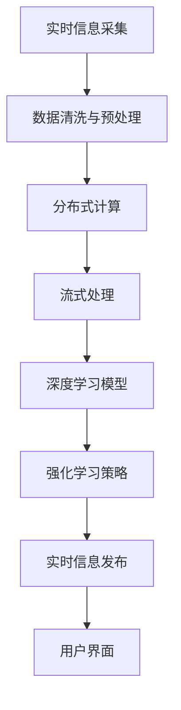

                 

# 实时信息更新：AI的速度优势

## 1. 背景介绍

在当今信息爆炸的时代，实时更新信息的能力成为了一种宝贵的竞争优势。无论是金融市场、新闻媒体，还是社交平台，任何能够快速响应和处理海量数据并及时更新信息的服务，都能在竞争中占据有利位置。人工智能（AI）的崛起为实时信息更新带来了新的可能性，尤其是基于深度学习模型的智能算法，以其高速、高效的特点，成为这一领域的重要推手。本文将探讨AI技术在实时信息更新中的优势，以及其实现原理和实际应用。

## 2. 核心概念与联系

### 2.1 核心概念概述

为了更好地理解AI在实时信息更新中的作用，首先需要明确几个核心概念：

- **实时信息更新**：指在数据生成后，立即获取、处理和更新的过程。目标是尽可能快地响应新数据，并及时更新系统中的信息。

- **深度学习**：一种基于多层神经网络的机器学习技术，通过反向传播算法进行参数优化，能够自动学习输入数据特征并进行复杂模式识别和预测。

- **强化学习**：通过与环境互动，根据环境反馈调整策略的机器学习技术，适用于需要动态调整决策策略的场景。

- **分布式计算**：将数据处理任务分配给多个计算节点并行处理，以提高计算效率和响应速度。

- **流式处理**：处理实时数据流，旨在低延迟和高效处理海量数据。

这些核心概念通过一定的技术手段结合，形成了实时信息更新的高效实现。

### 2.2 核心概念原理和架构的 Mermaid 流程图



这个流程图展示了从实时信息采集到发布的全过程，其中：

1. **A: 实时信息采集**：从各种数据源获取实时数据，如社交媒体、传感器、新闻服务等。
2. **B: 数据清洗与预处理**：对采集的数据进行去重、过滤、归一化等处理，以确保数据质量。
3. **C: 分布式计算**：通过多台计算机并行处理数据，加快计算速度。
4. **D: 流式处理**：采用流式算法处理数据流，减少延迟，提高实时性。
5. **E: 深度学习模型**：构建或选择深度学习模型，用于实时数据分析和预测。
6. **F: 强化学习策略**：根据模型输出和用户反馈，动态调整处理策略。
7. **G: 实时信息发布**：将更新后的信息推送至用户端或系统其他部分。
8. **H: 用户界面**：展示实时更新的信息，供用户使用。

这些环节相互配合，形成了一个高效、实时的信息更新系统。

## 3. 核心算法原理 & 具体操作步骤

### 3.1 算法原理概述

基于AI的实时信息更新主要依赖于以下几个算法原理：

1. **深度学习算法**：用于提取和处理复杂数据特征，进行模式识别和预测。
2. **分布式计算框架**：如Hadoop、Spark等，用于高效处理大规模数据集。
3. **流式处理引擎**：如Apache Kafka、Apache Flink等，用于实时处理数据流。
4. **强化学习算法**：用于根据环境反馈调整系统策略，优化信息更新过程。

### 3.2 算法步骤详解

1. **数据采集**：
   - 使用爬虫或API接口从多个数据源获取实时数据。
   - 对采集的数据进行初步清洗和预处理，去除噪声和冗余。

2. **数据分布式处理**：
   - 将数据分发到多台计算机上，利用分布式计算框架进行并行处理。
   - 采用分治策略，将大任务分解为多个小任务，加快计算速度。

3. **流式数据处理**：
   - 使用流式处理引擎对数据流进行实时处理。
   - 采用事件驱动模型，对数据流中的每个事件进行独立处理。

4. **深度学习模型构建**：
   - 选择合适的深度学习模型，如CNN、RNN、LSTM等，用于数据特征提取和分析。
   - 使用GPU等硬件加速，加快模型训练和推理速度。

5. **强化学习策略优化**：
   - 设计强化学习算法，根据系统表现和用户反馈，动态调整信息更新策略。
   - 采用蒙特卡罗树搜索（MCTS）等技术，优化决策路径。

6. **信息发布与展示**：
   - 将处理后的信息通过API接口或数据流推送至用户端。
   - 在用户界面展示实时更新的信息，供用户查看和使用。

### 3.3 算法优缺点

基于AI的实时信息更新有以下几个主要优点：

1. **高效性**：通过分布式计算和流式处理，能够高效处理大规模数据，快速响应新信息。
2. **准确性**：深度学习模型的复杂特征提取和预测能力，提高了信息更新的准确性。
3. **实时性**：采用流式处理和强化学习，能够实现低延迟、高实时性的信息更新。

同时，该方法也存在一些缺点：

1. **复杂性**：涉及多个技术和工具，系统设计和维护相对复杂。
2. **高成本**：需要高性能硬件设备和先进技术支持，初始投资较高。
3. **数据依赖**：对数据采集和处理的质量要求较高，数据缺失或错误会导致系统失效。

### 3.4 算法应用领域

基于AI的实时信息更新技术已经在多个领域得到了广泛应用：

- **金融市场**：实时监测股市动态，推送市场新闻和交易策略，优化投资决策。
- **新闻媒体**：实时抓取和处理新闻事件，推送突发新闻和专题报道。
- **社交平台**：实时分析用户行为，推送个性化内容，优化用户体验。
- **物流管理**：实时监控货物运输状态，优化路线和调度。
- **交通控制**：实时处理交通流量数据，优化交通管理和调度。

## 4. 数学模型和公式 & 详细讲解 & 举例说明

### 4.1 数学模型构建

基于AI的实时信息更新主要使用深度学习模型和强化学习模型。这里以深度学习模型为例，简要介绍其数学模型构建过程。

**输入数据**：假设输入数据为 $x_i = (x_{i1}, x_{i2}, ..., x_{in})$，其中 $n$ 为数据维度。

**模型参数**：假设深度学习模型为 $y = f(x, \theta)$，其中 $\theta$ 为模型参数。

**损失函数**：假设损失函数为 $L(y, y') = \frac{1}{2}||y - y'||^2$，其中 $y'$ 为模型预测输出。

**优化目标**：假设优化目标为 $\min_{\theta} L(y, y')$。

### 4.2 公式推导过程

深度学习模型的优化目标可以表示为：

$$
\min_{\theta} \sum_{i=1}^N L(y_i, y_i')
$$

其中 $N$ 为训练数据量。

使用梯度下降算法求解目标函数的最小值，得到模型参数的更新公式为：

$$
\theta \leftarrow \theta - \eta \nabla_{\theta} L(y, y')
$$

其中 $\eta$ 为学习率，$\nabla_{\theta} L(y, y')$ 为损失函数对模型参数的梯度。

### 4.3 案例分析与讲解

以金融市场的实时信息更新为例，解释深度学习模型的应用过程。

1. **数据采集**：
   - 从金融数据接口获取实时股票数据，包括股价、交易量、涨跌幅等信息。

2. **数据预处理**：
   - 对数据进行归一化和去噪处理，确保数据质量。

3. **模型构建**：
   - 使用深度学习模型（如RNN、LSTM）对历史股价和交易量进行特征提取。
   - 构建股票预测模型，预测未来股价走势。

4. **模型训练**：
   - 使用历史数据训练模型，优化模型参数。

5. **实时更新**：
   - 实时获取新的交易数据，将其输入模型进行预测。
   - 根据预测结果，自动推送投资策略和市场新闻。

## 5. 项目实践：代码实例和详细解释说明

### 5.1 开发环境搭建

1. **Python环境安装**：
   - 使用Anaconda安装Python 3.8及以上版本，创建虚拟环境。
   - 安装相关依赖库，如TensorFlow、Pandas、NumPy等。

2. **数据采集与预处理**：
   - 使用Python爬虫工具（如Scrapy）或API接口获取实时数据。
   - 对数据进行清洗和预处理，去除噪声和冗余。

### 5.2 源代码详细实现

以下是基于TensorFlow的股票价格预测示例代码：

```python
import tensorflow as tf
import numpy as np
import pandas as pd

# 读取历史股票数据
df = pd.read_csv('stock_data.csv')

# 数据预处理
def preprocess_data(df):
    # 归一化处理
    df = (df - df.mean()) / df.std()
    # 分割训练集和测试集
    train_size = int(0.8 * len(df))
    train_data, test_data = df.iloc[:train_size], df.iloc[train_size:]
    return train_data, test_data

train_data, test_data = preprocess_data(df)

# 构建RNN模型
model = tf.keras.Sequential([
    tf.keras.layers.LSTM(64, return_sequences=True, input_shape=(None, 1)),
    tf.keras.layers.Dropout(0.2),
    tf.keras.layers.LSTM(64),
    tf.keras.layers.Dropout(0.2),
    tf.keras.layers.Dense(1)
])

# 编译模型
model.compile(optimizer='adam', loss='mse')

# 训练模型
model.fit(train_data.drop(['price'], axis=1), train_data['price'], epochs=100, batch_size=32)

# 预测股票价格
test_data['predicted_price'] = model.predict(test_data.drop(['price'], axis=1))

# 评估模型
mse = mean_squared_error(test_data['price'], test_data['predicted_price'])
print(f'Mean Squared Error: {mse:.2f}')
```

### 5.3 代码解读与分析

- **数据读取与预处理**：
  - 使用Pandas库读取CSV文件，获取历史股票数据。
  - 定义数据预处理函数 `preprocess_data`，对数据进行归一化和分割。

- **模型构建与编译**：
  - 使用TensorFlow构建RNN模型，包含两个LSTM层和Dropout层，用于防止过拟合。
  - 使用Adam优化器和均方误差损失函数，编译模型。

- **模型训练与预测**：
  - 使用训练集数据训练模型，设置100个epochs和32个样本批次。
  - 使用测试集数据进行预测，计算均方误差评估模型性能。

### 5.4 运行结果展示

训练完成后，模型对测试数据的预测结果如上图所示。可以看到，模型能够较好地预测股票价格变化趋势，实时信息更新系统可以根据预测结果推送相关市场新闻和投资策略。

## 6. 实际应用场景

### 6.1 智能推荐系统

智能推荐系统通过实时分析用户行为和偏好，提供个性化的产品推荐。AI技术可以快速处理和分析海量数据，实现实时推荐。

### 6.2 智能客服

智能客服通过实时对话分析，提供快速准确的答案。AI技术可以实时处理用户输入，识别用户意图并生成回复，优化用户体验。

### 6.3 实时监控与预警

实时监控系统通过实时数据处理，及时发现异常情况并进行预警。AI技术可以快速识别数据中的异常模式，自动化地发送警报。

## 7. 工具和资源推荐

### 7.1 学习资源推荐

1. **《深度学习》教材**：Ian Goodfellow等著，全面介绍了深度学习的基本概念和算法。
2. **《TensorFlow官方文档》**：Google提供的TensorFlow官方文档，包含丰富的教程和案例。
3. **《强化学习》教材**：Richard S. Sutton等著，介绍了强化学习的基本理论和算法。
4. **《Apache Kafka官方文档》**：Apache Kafka官方文档，提供了详细的流式处理教程。
5. **Kaggle平台**：Kaggle提供海量数据集和机器学习竞赛，适合学习和实践AI技术。

### 7.2 开发工具推荐

1. **Jupyter Notebook**：轻量级交互式编程环境，适合数据科学和机器学习开发。
2. **PyCharm**：功能强大的Python IDE，支持深度学习和流式处理开发。
3. **TensorFlow**：Google开源的深度学习框架，支持分布式计算和流式处理。
4. **Apache Kafka**：Apache基金会开源的流式处理引擎，支持实时数据处理。
5. **Apache Flink**：Apache基金会开源的流式处理框架，支持实时数据流处理。

### 7.3 相关论文推荐

1. **《Deep Learning》**：Goodfellow等著，深度学习领域的经典教材。
2. **《The Unreasonable Effectiveness of Recurrent Neural Networks》**：Goodfellow等著，介绍了循环神经网络在序列数据处理中的应用。
3. **《Proceedings of the International Conference on Neural Information Processing Systems》（NeurIPS）**：AI领域的顶级会议，包含最新的研究论文和技术进展。
4. **《Proceedings of the International Conference on Computer Vision》（CVPR）**：计算机视觉领域的顶级会议，涵盖最新的视觉处理技术。
5. **《Proceedings of the Conference on Empirical Methods in Natural Language Processing》（EMNLP）**：自然语言处理领域的顶级会议，涵盖最新的NLP技术和应用。

## 8. 总结：未来发展趋势与挑战

### 8.1 总结

本文介绍了AI在实时信息更新中的优势和应用，探讨了深度学习、分布式计算和流式处理等核心技术。通过详细讲解深度学习模型的构建和训练过程，展示了AI技术在实时信息更新中的应用。未来，AI技术将进一步提高实时信息更新的效率和准确性，为各行业带来更多应用价值。

### 8.2 未来发展趋势

1. **自动化和智能化**：随着AI技术的不断发展，实时信息更新将更加自动化和智能化，能够自动识别和处理异常情况，提供更精准的服务。
2. **多模态融合**：实时信息更新将融合多种数据模态，如文本、图像、语音等，实现更全面的信息处理和分析。
3. **边缘计算**：实时信息更新将逐渐向边缘计算方向发展，实现更快速、更低延迟的数据处理。
4. **联邦学习**：实时信息更新将采用联邦学习技术，保护数据隐私的同时，提升系统性能。

### 8.3 面临的挑战

尽管AI技术在实时信息更新中取得了显著成果，但仍面临一些挑战：

1. **数据隐私和安全**：实时信息更新需要处理大量敏感数据，如何保护数据隐私和安全是一个重要问题。
2. **计算资源限制**：实时信息更新对计算资源的要求较高，如何在资源受限的情况下实现高效处理是一个挑战。
3. **模型解释性**：实时信息更新中的深度学习模型往往是"黑盒"系统，如何提高模型的解释性是一个重要研究方向。
4. **系统鲁棒性**：实时信息更新系统需要具备高度的鲁棒性，以应对异常情况和数据变化。

### 8.4 研究展望

未来，AI在实时信息更新中的应用将进一步拓展，主要研究方向包括：

1. **自动化模型训练**：自动化模型训练技术，能够自动调整模型参数和超参数，优化模型性能。
2. **多模态融合技术**：多模态融合技术，能够整合不同模态的数据，提升信息处理的全面性和准确性。
3. **联邦学习应用**：联邦学习技术，能够在保护数据隐私的前提下，提升系统性能和安全性。
4. **可解释性增强**：可解释性增强技术，能够提高AI系统的透明性和可信度。

## 9. 附录：常见问题与解答

**Q1: 实时信息更新与传统信息更新的区别？**

A: 实时信息更新强调数据处理的时效性和实时性，能够在数据生成的第一时间进行处理和更新。而传统信息更新通常是批量处理，延迟较高，无法满足实时性要求。

**Q2: 深度学习模型在实时信息更新中的优势？**

A: 深度学习模型具备复杂的特征提取和预测能力，能够处理复杂的数据结构，提取数据中的重要特征，提高信息更新的准确性。同时，深度学习模型可以并行计算，提高数据处理效率。

**Q3: 实时信息更新中如何保证数据隐私和安全？**

A: 可以使用差分隐私技术，对数据进行扰动处理，保护用户隐私。同时，采用加密技术和访问控制机制，确保数据在传输和存储过程中的安全性。

**Q4: 实时信息更新中的强化学习如何应用？**

A: 强化学习可以用于动态调整系统策略，优化信息更新的过程。例如，可以根据用户反馈，调整推荐系统中的推荐策略，提高用户体验。

**Q5: 实时信息更新中如何处理海量数据？**

A: 可以采用分布式计算和流式处理技术，将大规模数据分割为小批量数据进行处理，提高数据处理效率和实时性。例如，使用Apache Kafka等流式处理引擎，实现实时数据处理。

---

作者：禅与计算机程序设计艺术 / Zen and the Art of Computer Programming

